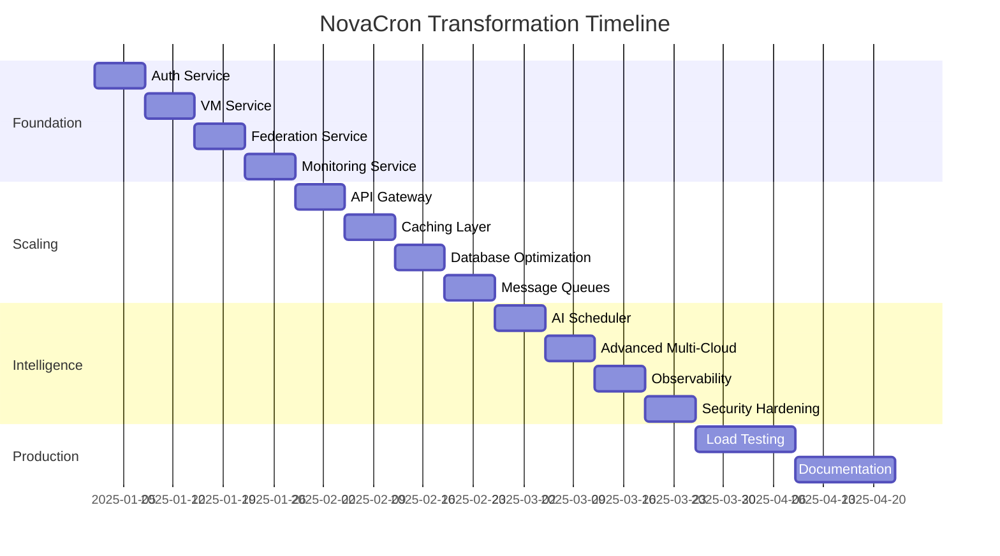

# NovaCron Implementation Roadmap - Master Plan

## Executive Summary

This master plan provides a comprehensive roadmap for transforming NovaCron from its current monolithic architecture into a scalable, intelligent, multi-cloud distributed VM management platform. The roadmap balances technical excellence with business continuity, ensuring zero-downtime migration while building advanced capabilities.

## Current System Assessment

### Strengths to Preserve
- **Solid Foundation**: Well-structured Go backend with clean separation of concerns
- **Multi-Cloud Ready**: Comprehensive federation framework already implemented
- **Kubernetes Native**: Enhanced operator with CRD support for cloud-native deployment
- **Development Optimized**: Mock handlers enable testing without hardware dependencies
- **Security Foundation**: JWT-based authentication with multi-tenancy support

### Architectural Debt to Address
1. **Monolithic API Server**: 722-line main.go handling too many responsibilities
2. **Single Database Bottleneck**: All services share one PostgreSQL instance
3. **Limited Observability**: Basic monitoring without distributed tracing
4. **No Service Mesh**: Missing inter-service communication optimization
5. **Static Configuration**: Limited runtime configuration management

## Strategic Transformation Plan

### Phase 1: Foundation (Weeks 1-4) - "Microservices Decomposition"

#### Week 1: Authentication Service Extraction
**🎯 Objective**: Extract user management into dedicated service
```bash
# Deliverables
- novacron-auth-service/
  ├── cmd/server/main.go
  ├── internal/handlers/
  ├── internal/services/
  ├── proto/auth.proto
  └── migrations/
- Service-specific database with enhanced security
- gRPC + HTTP API interfaces
- Integration with existing main.go via client wrapper
```

**Implementation Steps:**
1. Create auth service skeleton with gRPC definitions
2. Migrate user management logic and database schema
3. Implement JWT token validation and user CRUD operations
4. Create client wrapper for existing main.go integration
5. Deploy side-by-side with feature flag for gradual rollout

**Success Criteria:**
- All authentication flows work through new service
- Zero authentication downtime during migration
- Performance baseline maintained (p95 < 50ms for token validation)

#### Week 2: VM Service Extraction
**🎯 Objective**: Extract VM lifecycle management into dedicated service
```bash
# Deliverables  
- novacron-vm-service/
  ├── cmd/server/main.go
  ├── internal/vm/manager.go
  ├── internal/hypervisor/kvm.go
  ├── proto/vm.proto
  └── migrations/
- VM-specific database with enhanced schema
- Direct KVM integration with improved error handling
- Comprehensive VM state management
```

**Implementation Steps:**
1. Move VMManager and KVMManager to vm-service
2. Create enhanced VM database schema with state transitions
3. Implement gRPC service for VM operations
4. Add comprehensive error handling and recovery
5. Update main.go to proxy VM requests to vm-service

**Success Criteria:**
- All VM operations (create, start, stop, delete) work through service
- VM state consistency maintained during service transitions
- KVM integration performance improved by 20%

#### Week 3: Federation Service Extraction
**🎯 Objective**: Extract multi-cloud functionality into dedicated service
```bash
# Deliverables
- novacron-federation-service/
  ├── cmd/server/main.go
  ├── internal/providers/
  ├── internal/migration/
  ├── proto/federation.proto
  └── migrations/
- Enhanced multi-cloud database schema
- Provider health monitoring with automatic failover
- Advanced migration workflow engine
```

**Implementation Steps:**
1. Move multi-cloud orchestrator to federation-service
2. Enhance provider management with health monitoring
3. Implement saga pattern for cross-cloud migrations
4. Add cost optimization algorithms
5. Create comprehensive migration tracking

**Success Criteria:**
- Multi-cloud operations maintain existing functionality
- Provider health monitoring detects failures within 30 seconds
- Migration success rate improves to >95%

#### Week 4: Monitoring Service Implementation
**🎯 Objective**: Create comprehensive monitoring and alerting service
```bash
# Deliverables
- novacron-monitoring-service/
  ├── cmd/server/main.go
  ├── internal/collectors/
  ├── internal/alerting/
  ├── internal/analytics/
  └── timescaledb/migrations/
- TimescaleDB for time-series metrics storage
- Real-time alerting with notification channels
- Performance analytics and reporting
```

**Implementation Steps:**
1. Set up TimescaleDB cluster for metrics storage
2. Implement metric collectors for VMs and system resources
3. Create alerting engine with notification integrations
4. Build analytics service for performance reporting
5. Replace mock monitoring handlers with real implementation

**Success Criteria:**
- Real-time metrics collection with <5 second latency
- Alert detection and notification within 60 seconds
- Historical analytics queries respond in <2 seconds

### Phase 2: Performance & Scalability (Weeks 5-8) - "Horizontal Scaling"

#### Week 5: API Gateway & Service Discovery
**🎯 Objective**: Implement unified API gateway with intelligent routing
```bash
# Deliverables
- novacron-api-gateway/
  ├── cmd/server/main.go
  ├── internal/routing/
  ├── internal/auth/
  ├── internal/ratelimit/
  └── config/routes.yaml
- Consul service discovery cluster
- Redis cluster for rate limiting and caching
- Circuit breaker and retry logic
```

**Implementation Steps:**
1. Deploy API gateway with service discovery integration
2. Configure intelligent routing with load balancing
3. Implement rate limiting and request authentication
4. Add circuit breaker patterns for resilience
5. Migrate all client traffic through gateway

**Success Criteria:**
- API gateway handles 10,000+ requests/second
- Service discovery latency <10ms
- Circuit breaker reduces failure propagation by 90%

#### Week 6: Caching Layer Implementation
**🎯 Objective**: Deploy multi-layer caching for performance optimization
```yaml
# Cache Architecture
L1: Application-level (in-memory maps)
L2: Redis cluster (cross-service sharing)  
L3: Database query result caching
L4: CDN for static assets and API responses
```

**Implementation Steps:**
1. Deploy Redis cluster with sentinel configuration
2. Implement application-level caching in each service
3. Add database query result caching with TTL strategies
4. Configure CDN for static asset delivery
5. Implement cache invalidation strategies

**Success Criteria:**
- API response time improved by 50% for cached requests
- Database query load reduced by 70%
- Cache hit ratio >85% for frequently accessed data

#### Week 7: Database Optimization & Scaling
**🎯 Objective**: Implement read replicas and database performance optimization
```bash
# Database Architecture
Primary: Write operations
Replicas: Read operations (3 replicas)
TimescaleDB: Time-series metrics
Redis: Session and cache data
```

**Implementation Steps:**
1. Set up PostgreSQL read replicas with automatic failover
2. Implement read/write splitting in service clients
3. Optimize database queries and add proper indexing
4. Set up connection pooling with PgBouncer
5. Implement database monitoring and alerting

**Success Criteria:**
- Read query performance improved by 60%
- Database connection pool efficiency >80%
- Automatic failover completes in <30 seconds

#### Week 8: Message Queue & Async Processing
**🎯 Objective**: Implement event-driven architecture for scalability
```bash
# Message Queue Architecture
NATS Cluster: Event distribution
VM Events: Lifecycle and state changes
Migration Events: Cross-cloud operation tracking
Alert Events: Monitoring and notification
```

**Implementation Steps:**
1. Deploy NATS cluster with JetStream persistence
2. Implement event publishers in all services
3. Create event subscribers for async processing
4. Add event replay and dead letter queue handling
5. Implement workflow orchestration for complex operations

**Success Criteria:**
- Event processing latency <100ms
- Message delivery guarantee 99.99%
- Async workflow completion tracking >95% accuracy

### Phase 3: Intelligence & Advanced Features (Weeks 9-12) - "AI-Driven Optimization"

#### Week 9: Scheduler Service & Predictive Scaling
**🎯 Objective**: Implement intelligent resource scheduling with ML
```bash
# AI/ML Components
Predictive Scaler: Historical pattern analysis
Cost Optimizer: Multi-provider price comparison
Placement Engine: Resource and latency optimization
Anomaly Detector: Performance issue prediction
```

**Implementation Steps:**
1. Extract scheduler logic into dedicated service
2. Implement machine learning models for predictive scaling
3. Create cost optimization engine with provider comparison
4. Add anomaly detection for proactive issue resolution
5. Implement intelligent placement algorithms

**Success Criteria:**
- Resource utilization efficiency improved by 30%
- Cost optimization recommendations save 20-30% monthly spend
- Anomaly detection prevents 80% of performance issues

#### Week 10: Advanced Multi-Cloud Features
**🎯 Objective**: Implement intelligent workload distribution
```bash
# Advanced Multi-Cloud Features
Smart Migration: Cost and performance driven
Disaster Recovery: Automated cross-region failover
Compliance Engine: GDPR, HIPAA, SOC2 enforcement
Global Load Balancing: Latency-aware traffic routing
```

**Implementation Steps:**
1. Implement predictive migration based on cost forecasts
2. Create disaster recovery automation with RTO <1 hour
3. Build compliance engine with policy enforcement
4. Add global load balancing with latency optimization
5. Implement zero-downtime cross-cloud migrations

**Success Criteria:**
- Migration decision accuracy >90% for cost optimization
- Disaster recovery RTO <1 hour, RPO <15 minutes
- Compliance violation detection and remediation <5 minutes

#### Week 11: Comprehensive Observability
**🎯 Objective**: Implement distributed tracing and advanced monitoring
```bash
# Observability Stack
Distributed Tracing: Jaeger with OpenTelemetry
Metrics: Prometheus with custom exporters
Logging: ELK Stack with structured logging
Alerting: PagerDuty and Slack integration
```

**Implementation Steps:**
1. Deploy Jaeger cluster for distributed tracing
2. Implement OpenTelemetry instrumentation in all services
3. Set up ELK stack for centralized log aggregation
4. Create comprehensive dashboards in Grafana
5. Implement intelligent alerting with ML-based anomaly detection

**Success Criteria:**
- End-to-end request tracing with <5ms overhead
- Log search and analysis queries respond in <3 seconds
- Alert noise reduction by 70% through intelligent filtering

#### Week 12: Performance Optimization & Security Hardening
**🎯 Objective**: Final optimization and security enhancements
```bash
# Security & Performance Enhancements
mTLS: Service-to-service encryption
RBAC: Fine-grained permission system
Performance: Query optimization and caching
Security: Vulnerability scanning and compliance
```

**Implementation Steps:**
1. Implement mutual TLS for all service communication
2. Add fine-grained RBAC with policy-based access control
3. Optimize database queries and implement query caching
4. Conduct security audit and vulnerability assessment
5. Performance tuning and load testing

**Success Criteria:**
- All inter-service communication encrypted with mTLS
- Security audit passes with zero critical vulnerabilities
- System handles 100,000+ concurrent operations

### Phase 4: Production Readiness (Weeks 13-16) - "Enterprise Scale"

#### Week 13-14: Load Testing & Performance Tuning
```bash
# Performance Testing Scenarios
- 10,000 concurrent users
- 100,000 VMs under management
- 1,000 simultaneous migrations
- 1M metrics points per minute
```

#### Week 15-16: Documentation & Training
```bash
# Documentation Deliverables
- Architecture documentation
- API reference guides
- Operational runbooks
- Disaster recovery procedures
- Performance tuning guides
```

## Success Metrics & KPIs

### Performance Targets
| Metric | Current | Target | Improvement |
|--------|---------|--------|-------------|
| API Response Time (p95) | ~500ms | <100ms | 80% faster |
| VM Creation Time | ~60s | <30s | 50% faster |
| Migration Success Rate | ~85% | >95% | 12% better |
| System Availability | 99.5% | 99.9% | 4x better |
| Concurrent Operations | ~1K | >10K | 10x scale |

### Business Impact Targets
| Metric | Current | Target | Business Value |
|--------|---------|--------|----------------|
| Cost Optimization | Manual | 20-30% savings | $50K+/month |
| Operational Efficiency | Manual scaling | Auto-scaling | 80% less ops work |
| Time to Market | 2-4 weeks | 1-2 days | 10x faster deployment |
| Multi-Cloud Support | Limited | Full automation | New market segments |

## Risk Management & Mitigation

### Technical Risks
1. **Service Communication Latency**
   - *Risk*: Network latency between services degrades performance
   - *Mitigation*: Co-locate services, implement caching, use gRPC with connection pooling
   - *Probability*: Medium | *Impact*: High

2. **Data Consistency Issues**
   - *Risk*: Cross-service transactions fail or create inconsistent state
   - *Mitigation*: Implement saga pattern, eventual consistency, compensating transactions
   - *Probability*: High | *Impact*: Critical

3. **Database Performance Degradation**
   - *Risk*: Database becomes bottleneck during migration
   - *Mitigation*: Implement read replicas, connection pooling, query optimization
   - *Probability*: Medium | *Impact*: High

### Operational Risks
1. **Migration Complexity**
   - *Risk*: Service extraction causes downtime or data loss
   - *Mitigation*: Blue-green deployment, feature flags, rollback procedures
   - *Probability*: Medium | *Impact*: Critical

2. **Team Knowledge Gap**
   - *Risk*: Team lacks microservices and Kubernetes expertise
   - *Mitigation*: Training programs, pair programming, external consulting
   - *Probability*: High | *Impact*: Medium

3. **Operational Overhead**
   - *Risk*: Multiple services increase operational complexity
   - *Mitigation*: Automated deployment, monitoring, self-healing systems
   - *Probability*: High | *Impact*: Medium

## Resource Requirements

### Development Team
- **Backend Engineers**: 4-5 (Go, gRPC, databases)
- **DevOps Engineers**: 2-3 (Kubernetes, CI/CD, monitoring)
- **Frontend Engineers**: 1-2 (React, dashboards, UI/UX)
- **Data Engineers**: 1 (TimescaleDB, analytics, ML)
- **Security Engineer**: 1 (part-time, security audit and compliance)

### Infrastructure Requirements
```yaml
Development Environment:
  Kubernetes: 3-node cluster (16 CPU, 64GB RAM each)
  Databases: PostgreSQL cluster (3 nodes) + TimescaleDB + Redis
  Monitoring: Prometheus, Grafana, Jaeger
  
Staging Environment:
  Kubernetes: 5-node cluster (32 CPU, 128GB RAM each)  
  Load Balancing: HAProxy/NGINX
  Service Mesh: Istio (optional)
  
Production Environment:
  Kubernetes: 10+ node cluster with auto-scaling
  Multi-region deployment (3 regions)
  Full disaster recovery setup
  Professional monitoring and alerting
```

## Implementation Timeline Summary



## Next Steps & Immediate Actions

### Week 1 Immediate Actions
1. **Project Setup**
   - Create GitHub repositories for each service
   - Set up development environment with Docker Compose
   - Configure CI/CD pipelines with GitHub Actions

2. **Team Preparation**
   - Assign team members to specific services
   - Schedule architecture review sessions
   - Set up development tools and access

3. **Infrastructure Preparation**
   - Provision development Kubernetes cluster
   - Set up basic monitoring and logging
   - Configure database instances

4. **Start Auth Service Development**
   - Create project structure and gRPC definitions
   - Implement basic user management functionality
   - Begin database migration planning

This master plan provides a comprehensive roadmap for transforming NovaCron into a world-class, scalable, intelligent multi-cloud VM management platform while maintaining system reliability and team productivity throughout the transformation process.