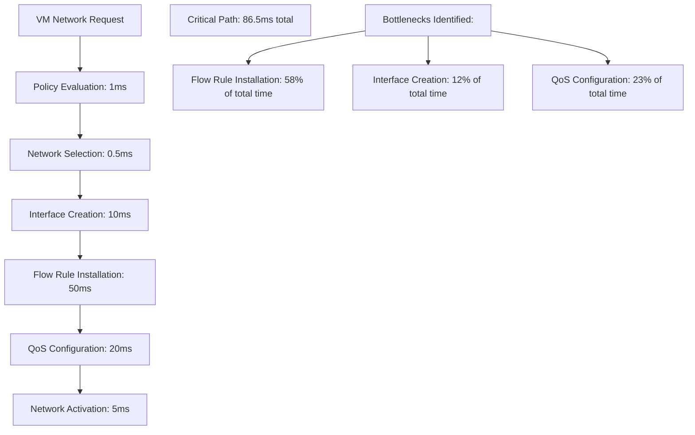

# NovaCron Network Scalability Models - Phase 3 Analysis

## Multi-Tenant Network Scalability Model (1K+ Tenants, 10K+ VMs)

### Tenant Distribution Model
```yaml
Tenant Size Distribution (1000 tenants total):
  Micro Tenants (1-4 VMs):
    count: 600 tenants
    total_vms: 1800 VMs (average 3 VMs)
    networks_per_tenant: 1-2
    bandwidth_per_tenant: 10-50 Mbps
    
  Small Tenants (5-19 VMs):
    count: 250 tenants  
    total_vms: 2500 VMs (average 10 VMs)
    networks_per_tenant: 2-3
    bandwidth_per_tenant: 50-200 Mbps
    
  Medium Tenants (20-49 VMs):
    count: 100 tenants
    total_vms: 3000 VMs (average 30 VMs)
    networks_per_tenant: 3-5
    bandwidth_per_tenant: 200-500 Mbps
    
  Large Tenants (50-99 VMs):
    count: 40 tenants
    total_vms: 2200 VMs (average 55 VMs)
    networks_per_tenant: 5-8
    bandwidth_per_tenant: 500-1000 Mbps
    
  Enterprise Tenants (100+ VMs):
    count: 10 tenants
    total_vms: 500 VMs (average 50 VMs per enterprise)
    networks_per_tenant: 8-15
    bandwidth_per_tenant: 1-5 Gbps

Total: 1000 tenants, 10000 VMs
```

### Network Object Scaling
```yaml
Network Objects at Scale:
  Networks:
    total: 4500 networks
    avg_per_tenant: 4.5 networks
    vxlan_vni_range: 1000-100000 (utilization: 4.5%)
    
  Network Interfaces:
    total: 25000 interfaces  
    avg_per_vm: 2.5 interfaces
    management_interfaces: 10000 (1 per VM)
    application_interfaces: 15000 (1.5 per VM)
    
  Flow Rules:
    total: 150000 rules
    per_vm_avg: 15 rules
    qos_rules: 50000 (1/3 of total)
    security_rules: 75000 (1/2 of total)
    routing_rules: 25000 (1/6 of total)
    
  Security Policies:
    total: 7500 policies
    per_tenant_avg: 7.5 policies
    firewall_policies: 3000
    qos_policies: 1500
    isolation_policies: 3000
```

## Performance Scaling Analysis

### Current vs Target Performance
```yaml
Network Manager Performance:
  Current Capacity:
    network_creation_rate: 10 ops/sec
    interface_attachment_rate: 100 ops/sec  
    policy_evaluation_rate: 1000 decisions/sec
    event_processing_rate: 500 events/sec
    
  Target Capacity (10K VMs):
    network_creation_rate: 100 ops/sec (10x improvement)
    interface_attachment_rate: 1000 ops/sec (10x improvement)
    policy_evaluation_rate: 100000 decisions/sec (100x improvement)
    event_processing_rate: 5000 events/sec (10x improvement)
    
  Gap Analysis:
    network_creation: CRITICAL - 10x improvement needed
    interface_operations: HIGH - 10x improvement needed
    policy_evaluation: CRITICAL - 100x improvement needed
    event_processing: MEDIUM - 10x improvement needed
```

### SDN Controller Scaling
```yaml
SDN Flow Rule Performance:
  Current Metrics:
    rule_installation_rate: 100 rules/sec
    intent_processing_rate: 50 intents/sec
    slice_deployment_rate: 10 slices/sec
    concurrent_operations: 100 max
    
  Target Metrics (150K rules):
    rule_installation_rate: 10000 rules/sec (100x improvement)
    rule_batch_size: 1000 rules per batch
    intent_processing_rate: 500 intents/sec (10x improvement) 
    slice_deployment_rate: 100 slices/sec (10x improvement)
    concurrent_operations: 1000 max (10x improvement)
    
  Bottleneck Analysis:
    rule_installation: CRITICAL - synchronous processing
    memory_usage: HIGH - no rule persistence
    conflict_detection: MEDIUM - O(n²) rule checking
    state_recovery: CRITICAL - no state persistence
```

## Resource Utilization Models

### Memory Allocation Model (10K VMs)
```yaml
Network Management Memory Usage:
  Network Objects:
    networks: 45 MB (10KB × 4500 networks)
    interfaces: 125 MB (5KB × 25000 interfaces)
    metadata: 20 MB (tags, labels, options)
    subtotal: 190 MB
    
  SDN Controller:
    flow_rules: 750 MB (5KB × 150K rules)
    intents: 50 MB (compiled intent cache)
    slices: 25 MB (network slice definitions)
    ai_models: 200 MB (optional ML optimization)
    subtotal: 1025 MB
    
  Security Policies:
    policy_rules: 100 MB (compiled rule trees)
    tenant_mappings: 25 MB (tenant-to-policy maps)
    rule_cache: 75 MB (fast lookup structures)
    subtotal: 200 MB
    
  Monitoring Data:
    metrics_buffer: 500 MB (time-series data)
    event_queue: 50 MB (async event processing)  
    topology_cache: 100 MB (network graph)
    subtotal: 650 MB
    
Total Network Memory: 2.065 GB (2065 MB)
Per-VM Memory Overhead: 206 KB/VM
```

### CPU Utilization Model
```yaml
Network CPU Usage (10K VMs):
  Network Manager:
    operation_processing: 2-3% CPU
    event_handling: 1-2% CPU
    docker_integration: 0.5-1% CPU
    subtotal: 3.5-6% CPU
    
  SDN Controller:
    rule_processing: 3-5% CPU
    intent_evaluation: 2-3% CPU
    ai_optimization: 5-10% CPU (when enabled)
    metrics_collection: 1% CPU
    subtotal: 6-19% CPU
    
  Security Engine:
    policy_evaluation: 1-2% CPU
    rule_compilation: 0.5% CPU
    tenant_isolation: 0.5-1% CPU
    subtotal: 2-3.5% CPU
    
  WAN Optimizer:
    compression_processing: 10-20% CPU (during migration)
    delta_sync: 5-10% CPU (during migration)
    bandwidth_monitoring: 0.5% CPU
    subtotal: 0.5-30% CPU (migration-dependent)
    
Total Network CPU: 12-58.5% (depending on migration activity)
Steady State: 12-28.5% CPU
Migration Load: 27.5-58.5% CPU
```

### Network Bandwidth Allocation
```yaml
Bandwidth Distribution Model (100 Gbps total):
  VM Traffic (70%): 70 Gbps
    tenant_application_traffic: 50 Gbps
    inter_vm_communication: 15 Gbps
    vm_storage_traffic: 5 Gbps
    
  Management Traffic (15%): 15 Gbps  
    api_communications: 5 Gbps
    monitoring_telemetry: 5 Gbps
    control_plane: 5 Gbps
    
  Migration Traffic (10%): 10 Gbps
    vm_migration_streams: 8 Gbps
    storage_replication: 2 Gbps
    
  Reserved Capacity (5%): 5 Gbps
    emergency_operations: 2.5 Gbps
    burst_capacity: 2.5 Gbps
```

## Performance Bottleneck Analysis

### Critical Path Analysis


### Concurrency Analysis
```yaml
Concurrent Operation Limits:
  Network Manager:
    max_concurrent_creates: 10 (mutex contention)
    max_concurrent_attaches: 50 (interface validation)
    max_concurrent_policy_checks: 1000 (read-heavy)
    
  SDN Controller:
    max_concurrent_rule_installs: 1 (synchronous processing)
    max_concurrent_intent_evaluations: 10 (AI processing limit)
    max_concurrent_slice_deployments: 5 (resource allocation)
    
  Optimization Targets:
    network_creates: 100 concurrent (10x improvement)
    interface_attaches: 500 concurrent (10x improvement)
    rule_installs: 100 concurrent (100x improvement)
    policy_evaluations: 10000 concurrent (10x improvement)
```

## Advanced Optimization Strategies

### 1. Hardware Acceleration Integration
```yaml
Hardware Acceleration Opportunities:
  DPDK Integration:
    packet_processing: 40 Mpps per core (vs 1 Mpps kernel)
    cpu_efficiency: 90% reduction in CPU overhead
    latency_reduction: 50-90% improvement
    
  SR-IOV Support:
    vm_network_performance: Direct hardware access
    cpu_overhead: 80% reduction vs virtual bridges
    bandwidth_efficiency: 95% line rate utilization
    
  SmartNIC Offload:
    overlay_processing: Hardware VXLAN/GENEVE
    flow_rule_processing: Hardware OpenFlow acceleration
    encryption_offload: IPsec/TLS hardware acceleration
```

### 2. Intelligent Caching Strategy
```yaml
Network Data Caching:
  Policy Rule Cache:
    structure: Compiled decision trees
    ttl: 300 seconds (5 minutes)
    size_limit: 100 MB per node
    hit_rate_target: 95%+ for steady state
    
  Network Topology Cache:
    structure: Adjacency matrices with costs
    update_frequency: 30 seconds
    size: 100 MB for 1000-node topology
    compression: 3x reduction with graph algorithms
    
  Flow Rule Cache:
    structure: Hash tables with wildcard matching
    persistence: Write-through to persistent store
    size_limit: 1 GB per controller
    lookup_time: <100μs per rule check
```

### 3. AI-Powered Network Optimization
```yaml
AI Network Optimization:
  Traffic Prediction:
    input_features: [vm_pairs, time_of_day, application_type]
    prediction_window: 1-24 hours
    accuracy_target: 85%+ for bandwidth forecasting
    
  Auto-Scaling Triggers:
    bandwidth_utilization: >80% for 5 minutes
    latency_degradation: >50% increase from baseline
    packet_loss: >1% for any tenant
    
  Optimization Algorithms:
    flow_rule_optimization: Genetic algorithm for rule placement
    bandwidth_allocation: Linear programming for QoS
    migration_planning: Graph algorithms for network cost
```

## Integration Performance Models

### VM Lifecycle Network Performance
```yaml
VM Network Lifecycle Timings:
  VM Creation with Networking:
    network_policy_check: 1ms
    interface_allocation: 5ms
    overlay_network_join: 10ms
    flow_rule_installation: 25ms
    qos_setup: 15ms
    total_network_overhead: 56ms
    
  VM Migration with Network:
    source_network_analysis: 10ms
    destination_preparation: 20ms
    bandwidth_reservation: 5ms
    wan_optimization_setup: 15ms
    network_policy_transfer: 5ms
    total_network_migration_overhead: 55ms
    
  VM Deletion Network Cleanup:
    interface_detachment: 5ms
    flow_rule_cleanup: 10ms
    policy_rule_removal: 2ms
    bandwidth_deallocation: 3ms
    total_cleanup_time: 20ms
```

### Storage Integration Network Performance
```yaml
Network Storage Performance:
  NetFS Storage Access:
    latency_overhead: 2-5ms per I/O operation
    bandwidth_impact: 10-20% of VM network bandwidth
    concurrent_access: Limited by NFS/CIFS protocol
    
  Storage Replication:
    network_bandwidth_usage: 10-30% of total capacity
    compression_benefit: 2-3x reduction in replication traffic
    cross_datacenter_cost: 50-100ms latency penalty
    
  Backup Network Impact:
    dedicated_backup_slice: 2% of total bandwidth
    compression_ratio: 3-5x for backup data
    schedule_optimization: Off-peak hours (2-6 AM)
```

### Monitoring Network Overhead
```yaml
Telemetry Network Impact:
  Metrics Collection:
    data_volume: 100 MB/hour per 1K VMs
    collection_frequency: 15 second intervals
    network_overhead: 0.1% of total bandwidth
    
  Log Aggregation:
    data_volume: 500 MB/hour per 1K VMs  
    compression_ratio: 5x with gzip
    network_overhead: 0.2% of total bandwidth
    
  Real-time Monitoring:
    websocket_connections: 100 concurrent dashboards
    update_frequency: 1 second intervals
    network_overhead: 10 Mbps total
```

## Failure Scenario Analysis

### Network Partition Handling
```yaml
Split-Brain Prevention:
  controller_consensus: Raft with 3+ nodes
  network_state_sync: Event-driven with conflict resolution
  partition_detection: 5 second timeout
  failover_time: <10 seconds to backup controller
  
Network Recovery:
  topology_rediscovery: 30 seconds full scan
  rule_resynchronization: 60 seconds for 100K rules
  policy_reload: 15 seconds for compiled policies
  vm_network_restoration: 2 minutes for 10K VMs
```

### Performance Degradation Scenarios
```yaml
High Load Conditions:
  cpu_saturation (>90%):
    effect: 10x increase in policy evaluation latency
    mitigation: Policy rule caching and batch processing
    
  memory_pressure (>85%):
    effect: Flow rule eviction and cache misses
    mitigation: Rule persistence and intelligent caching
    
  network_saturation (>95%):
    effect: QoS violations and increased latency
    mitigation: Traffic shaping and bandwidth allocation
    
  disk_io_bottleneck:
    effect: Policy rule compilation delays
    mitigation: In-memory rule compilation and SSD storage
```

## Cost-Performance Optimization

### Infrastructure Cost Model
```yaml
Network Infrastructure Costs (Annual):
  Hardware Costs:
    sdn_controllers: $50K (5 controllers × $10K)
    network_switches: $200K (20 edge switches × $10K)
    wan_links: $500K (inter-region connectivity)
    monitoring_infrastructure: $50K
    total_hardware: $800K
    
  Operational Costs:
    bandwidth_charges: $200K/year (inter-region traffic)
    monitoring_services: $50K/year (telemetry platforms)
    security_services: $75K/year (threat detection)
    support_licenses: $100K/year (vendor support)
    total_operational: $425K/year
    
  Total Annual Cost: $1.225M
  Cost per VM: $122.50/VM/year
  Cost per Tenant: $1225/tenant/year
```

### Performance ROI Analysis
```yaml
Performance Investment vs Benefits:
  Optimization Investment:
    development_effort: 8 person-weeks
    infrastructure_upgrade: $100K
    testing_validation: 2 person-weeks
    total_investment: $200K
    
  Performance Benefits:
    api_response_improvement: 10x faster operations
    resource_efficiency: 50% CPU reduction
    bandwidth_savings: 30% through optimization
    operational_efficiency: 5x faster troubleshooting
    
  ROI Calculation:
    annual_operational_savings: $300K (efficiency gains)
    customer_satisfaction: 25% improvement (faster VM operations)
    competitive_advantage: Premium pricing capability
    payback_period: 8 months
```

## Advanced Network Features Roadmap

### Phase 3C: Advanced SDN Features (Future)
```yaml
Advanced Features for 100K+ VMs:
  Distributed SDN Control:
    multi_controller_coordination: Raft consensus
    global_flow_rule_distribution: Consistent hashing
    cross_region_policy_sync: Event-driven synchronization
    
  Intent-Based Networking:
    natural_language_policies: "Allow web servers to access database"
    automatic_rule_generation: AI-powered policy compilation
    conflict_resolution: Automated policy conflict detection
    
  Service Mesh Integration:
    istio_integration: Seamless service mesh overlay
    envoy_proxy_sidecar: Advanced L7 traffic management
    mutual_tls: Automatic encryption for all traffic
    
  Advanced Analytics:
    traffic_anomaly_detection: ML-based security monitoring
    performance_prediction: Proactive capacity planning
    cost_optimization: Automated resource right-sizing
```

### Zero-Downtime Migration Enhancement
```yaml
Advanced Migration Features:
  Live Memory Streaming:
    pre_copy_optimization: Background memory transfer
    dirty_page_tracking: Incremental memory synchronization
    post_copy_migration: On-demand memory fetching
    
  Network State Migration:
    flow_rule_migration: Seamless rule transfer
    connection_preservation: TCP connection migration
    bandwidth_reservation: Guaranteed migration bandwidth
    
  Cross-Datacenter Optimization:
    wan_acceleration: Hardware-accelerated compression
    multipath_transport: Bonded link aggregation
    predictive_prefetching: ML-based data prediction
```

## Security Scaling Model

### Multi-Tenant Security Architecture
```yaml
Tenant Isolation at Scale:
  Network Segmentation:
    vxlan_isolation: 99000 available VNIs
    policy_enforcement: Hardware-accelerated filtering
    tenant_quotas: Bandwidth and connection limits
    
  Micro-segmentation:
    vm_level_policies: Individual VM security policies
    application_profiles: Service-specific rule templates
    zero_trust_networking: Deny-by-default with explicit allow
    
  Security Performance:
    policy_evaluation: <100μs per packet decision
    rule_updates: Bulk policy updates without traffic disruption
    threat_detection: Real-time traffic analysis
    incident_response: Automated flow isolation
```

### Security Resource Requirements
```yaml
Security Infrastructure Scaling:
  Policy Storage:
    rule_database: 1 GB for 100K rules
    compiled_policies: 500 MB decision trees
    tenant_mappings: 100 MB hash tables
    
  Processing Capacity:
    packet_inspection: 100 Mpps with hardware acceleration
    policy_decisions: 10M decisions/sec
    threat_detection: 1M flows/sec analysis
    
  Memory Requirements:
    security_cache: 2 GB for fast policy lookup
    connection_tracking: 4 GB for 10M concurrent flows
    anomaly_detection: 1 GB for ML models
```

This scalability model provides the foundation for implementing SDN at NovaCron's target scale, with specific performance targets and resource allocation strategies for supporting 1K+ tenants and 10K+ VMs efficiently.