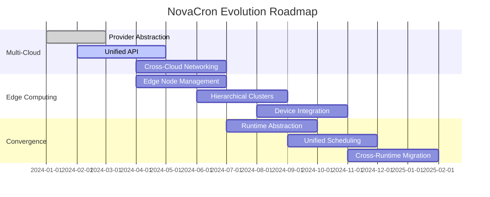

# NovaCron Evolutionary Paths Research Report
*Comprehensive Analysis of Multi-Cloud Federation, Edge Computing Integration, and Container-VM Convergence*

## Executive Summary

This research report analyzes three critical evolutionary paths for NovaCron's distributed VM management system: multi-cloud federation, edge computing integration, and container-VM convergence. The findings provide actionable insights for transforming NovaCron into a unified orchestration platform capable of managing workloads across diverse computing environments.

## 1. Multi-Cloud Federation Research

### 1.1 Industry Leaders Analysis

#### Crossplane: Kubernetes-Native Control Plane
**Architecture Pattern**: Declarative, YAML-based infrastructure with programmable functions
- **Control Plane Design**: Extends Kubernetes API with Custom Resource Definitions (CRDs)
- **Provider Model**: Extensible backend supporting AWS, Azure, GCP, and on-premise providers
- **Key Innovation**: "Functions" feature enabling Go, Python, and templating for dynamic configurations

**Technical Insights for NovaCron**:
```go
// Crossplane-inspired provider abstraction
type CloudProvider interface {
    CreateVM(ctx context.Context, spec VMSpec) (*VM, error)
    MigrateVM(ctx context.Context, vm *VM, target CloudTarget) error
    GetResources(ctx context.Context, filter ResourceFilter) ([]Resource, error)
}

type MultiCloudOrchestrator struct {
    providers map[string]CloudProvider
    scheduler *UnifiedScheduler
    config    *FederationConfig
}
```

#### Google Anthos: Service Mesh-Driven Federation
**Architecture Pattern**: Hybrid and multi-cloud through unified control plane
- **Core Components**: GKE (cloud) + GKE On-Prem, Istio Service Mesh, Config Management
- **Configuration Management**: GitOps-driven declarative configuration with ACM Operator
- **Identity Integration**: Anthos Identity Service for federated authentication

**Implementation Strategy**:
- Unified API abstraction across cloud providers
- Service mesh for cross-cloud communication
- Configuration as code with Git-based workflows

#### Microsoft Azure Arc: Resource Manager Extension
**Architecture Pattern**: Project resources into Azure Resource Manager for unified control
- **Resource Bridge**: Kubernetes-based management cluster on-premises
- **Control Plane**: Single pane of glass through Azure portal
- **Integration**: RBAC, policies, tags, and automation across environments

**Key Learnings**:
- Extend existing control planes rather than replace them
- Use resource projection patterns for unified management
- Implement consistent governance across all environments

#### AWS Outposts: Split Control Architecture
**Architecture Pattern**: Cloud control plane with local compute execution
- **Control Model**: Provisioning and monitoring from AWS Region, execution on-premises
- **Integration**: Seamless with AWS APIs, CLI, and management console
- **Failover**: Local queues and caching for temporary disconnections

### 1.2 Multi-Cloud Federation Recommendations for NovaCron

#### Unified Control Plane Architecture
```go
// NovaCron Federation API Design
type FederationController struct {
    cloudRegions map[string]*CloudRegion
    edgeNodes    map[string]*EdgeNode
    scheduler    *GlobalScheduler
    monitor      *FederationMonitor
}

type CloudRegion struct {
    Provider     string // "aws", "azure", "gcp", "on-premise"
    Region       string
    Capabilities []string
    Hypervisors  []HypervisorDriver
    Resources    ResourcePool
}
```

#### Key Implementation Patterns:
1. **Provider Abstraction Layer**: Abstract cloud-specific APIs behind unified interfaces
2. **Resource Projection**: Map cloud resources to NovaCron's VM management model
3. **Policy Engine**: Implement scheduling policies considering cost, latency, and compliance
4. **Configuration Management**: GitOps-driven configuration across all cloud environments

## 2. Edge Computing Integration Research

### 2.1 Edge Frameworks Analysis

#### KubeEdge: Cloud-Edge Collaboration
**Architecture**: Hierarchical management with cloud and edge components
- **CloudCore**: EdgeController, DeviceController, CloudHub for cloud-side management
- **EdgeCore**: Edged, EdgeHub, EventBus, DeviceTwin for edge-side execution
- **Scale Achievement**: Successfully tested with 100,000 edge nodes and 1M pods

**Edge Autonomy Pattern**:
```go
// KubeEdge-inspired edge autonomy for NovaCron
type EdgeNode struct {
    ID           string
    Capabilities EdgeCapabilities
    Cache        *LocalCache
    Scheduler    *LocalScheduler
    Monitor      *EdgeMonitor
}

type EdgeCapabilities struct {
    OfflineOperation bool
    LocalStorage     bool
    DeviceManagement bool
    AutoRecovery     bool
}
```

#### OpenYurt: Non-Intrusive Edge Extension
**Architecture**: Minimal modification approach to edge computing
- **YurtHub**: Node-level proxy with local caching and offline operation
- **Unitization**: Resource, application, and traffic closure in node pools
- **Cross-Region Networking**: Raven for inter-NodePool communication

**Key Innovation**: "Minimum modification" principle maintaining Kubernetes compatibility

#### Azure IoT Edge: Hierarchical Device Management
**Architecture**: Multi-layer hierarchical deployment with gateway patterns
- **Hierarchical Layers**: Each layer handles devices in the layer beneath
- **Deployment Types**: Standard deployment + layered deployment combining
- **Configuration Management**: Cloud configuration controller with module twins

#### Akri: Kubernetes Resource Interface for Edge Devices
**Architecture**: Dynamic device discovery and management
- **Discovery Handlers**: ONVIF, udev, OPC UA for different device protocols
- **Resource Abstraction**: Expose leaf devices as Kubernetes resources
- **High Availability**: Multi-node device utilization support

### 2.2 Edge Computing Integration Recommendations for NovaCron

#### Hierarchical Management Architecture
```go
// NovaCron Edge Architecture
type EdgeCluster struct {
    ClusterID    string
    ParentCluster *EdgeCluster // nil for root clusters
    ChildClusters []*EdgeCluster
    Nodes        []*EdgeNode
    Policies     *EdgePolicies
}

type EdgePolicies struct {
    OfflineMode      bool
    DataRetention    time.Duration
    SyncStrategies   []SyncStrategy
    DeviceManagement *DeviceManager
}
```

#### Implementation Patterns:
1. **Edge Autonomy**: Local scheduling and caching for offline operation
2. **Hierarchical Communication**: Parent-child cluster communication patterns
3. **Device Management**: Native support for IoT and edge devices
4. **Progressive Deployment**: Gradual rollout from cloud to edge tiers

## 3. Container-VM Convergence Research

### 3.1 Convergence Technologies Analysis

#### Kata Containers: VM-Like Security with Container Performance
**Architecture**: Lightweight VMs with container compatibility
- **Isolation**: Hardware virtualization for each container/pod
- **Performance**: <125ms startup, <5MiB memory footprint per VM
- **Integration**: OCI-compliant runtime, Kubernetes CRI interface
- **Security**: Separate guest kernel per container

**Convergence Pattern**:
```go
// Kata-inspired unified workload management
type WorkloadManager struct {
    containers map[string]*ContainerRuntime
    vms        map[string]*VMRuntime
    scheduler  *UnifiedScheduler
}

type WorkloadSpec struct {
    Type        WorkloadType // Container, VM, or Hybrid
    Isolation   IsolationLevel // Process, VM, or Hardware
    Resources   ResourceRequirements
    Security    SecurityPolicy
}
```

#### gVisor: Application Kernel Sandboxing
**Architecture**: User-space kernel implementation
- **System Call Interception**: Independent implementation of Linux API
- **Components**: Sentry (kernel), Gofer (filesystem), runsc (runtime)
- **Security**: Defense-in-depth with multiple isolation layers
- **Performance**: Container-like efficiency with VM-like security

#### AWS Firecracker: Serverless MicroVMs
**Architecture**: Purpose-built for serverless computing
- **Minimalist Design**: 50,000 lines of code (96% reduction vs QEMU)
- **Device Model**: Only 5 essential virtio devices
- **Scale**: 150 microVMs/second creation, thousands concurrent
- **Security**: Rust implementation with jailer isolation

#### VMware VCF 9.0: Unified Container-VM Management
**Architecture**: Single platform for both containers and VMs
- **Converged Infrastructure**: Unified management, networking, and security
- **Resource Efficiency**: Optimized resource sharing between containers and VMs
- **Network Integration**: Flat network with unified security policies

### 3.2 Container-VM Convergence Recommendations for NovaCron

#### Unified Workload Abstraction
```go
// NovaCron Convergence Architecture
type WorkloadOrchestrator struct {
    runtimes    map[WorkloadType]Runtime
    scheduler   *UnifiedScheduler
    resources   *SharedResourcePool
    networking  *ConvergedNetwork
}

type Runtime interface {
    Create(ctx context.Context, spec WorkloadSpec) (Workload, error)
    Migrate(ctx context.Context, workload Workload, target Node) error
    Monitor(ctx context.Context, workload Workload) (*Metrics, error)
    Scale(ctx context.Context, workload Workload, replicas int) error
}
```

#### Implementation Patterns:
1. **Workload Abstraction**: Unified API for containers, VMs, and hybrid workloads
2. **Security Levels**: Configurable isolation from process to hardware level
3. **Resource Optimization**: Intelligent placement based on workload requirements
4. **Migration Capabilities**: Cross-runtime migration between container and VM forms

## 4. Actionable Technical Insights

### 4.1 Architectural Patterns Summary

| Pattern | Use Case | Implementation Priority | NovaCron Integration |
|---------|----------|------------------------|---------------------|
| **Provider Abstraction** | Multi-cloud federation | High | Core architecture change |
| **Resource Projection** | Unified management | High | API redesign |
| **Edge Autonomy** | Offline operation | Medium | Edge-specific modules |
| **Hierarchical Management** | Scalable edge deployment | Medium | Cluster management |
| **Workload Convergence** | Container-VM unification | Low | Runtime abstraction |

### 4.2 API Design Insights

#### Unified Resource Model
```go
// NovaCron Unified Resource API
type Resource struct {
    Kind     ResourceKind // VM, Container, Device, Network
    Metadata ResourceMetadata
    Spec     ResourceSpec
    Status   ResourceStatus
    Location ResourceLocation // Cloud, Edge, On-premise
}

type ResourceLocation struct {
    Provider string // aws, azure, gcp, edge, on-premise
    Region   string
    Zone     string
    NodePool string
}
```

#### Federation-Aware Scheduling
```go
type GlobalScheduler struct {
    policies    []SchedulingPolicy
    constraints []Constraint
    objectives  []Objective
}

type SchedulingPolicy struct {
    Name        string
    Scope       []ResourceLocation
    Rules       []Rule
    Priority    int
}
```

### 4.3 Implementation Strategy

#### Phase 1: Multi-Cloud Foundation (Months 1-6)
1. Implement provider abstraction layer
2. Create unified resource model
3. Build cross-cloud networking
4. Develop policy engine

#### Phase 2: Edge Integration (Months 4-9)
1. Add edge node management
2. Implement hierarchical clustering
3. Build offline operation capabilities
4. Create device management framework

#### Phase 3: Container-VM Convergence (Months 7-12)
1. Abstract workload runtimes
2. Implement unified scheduling
3. Build cross-runtime migration
4. Optimize resource sharing

### 4.4 Security Considerations

#### Multi-Layer Security Architecture
```go
type SecurityManager struct {
    identity    *IdentityProvider
    network     *NetworkSecurity
    workload    *WorkloadSecurity
    compliance  *ComplianceManager
}

type WorkloadSecurity struct {
    isolation   IsolationLevel
    encryption  EncryptionConfig
    policies    []SecurityPolicy
    monitoring  *SecurityMonitor
}
```

#### Security Best Practices:
1. **Zero Trust Networking**: Authenticate and authorize every connection
2. **Workload Isolation**: Hardware-level isolation for sensitive workloads
3. **Encryption Everywhere**: Data in transit and at rest encryption
4. **Compliance Integration**: Built-in compliance frameworks (GDPR, HIPAA, SOC2)

### 4.5 Performance Implications

#### Resource Efficiency Metrics
- **Startup Time**: Target <5 seconds for VM creation, <1 second for containers
- **Memory Overhead**: <10MB per workload instance for management overhead
- **Network Latency**: <1ms additional latency for federation layer
- **Scale Targets**: 10,000+ nodes, 100,000+ workloads per cluster

#### Optimization Strategies:
1. **Lazy Loading**: Load resources on-demand
2. **Caching**: Aggressive caching at edge nodes
3. **Compression**: Network traffic and state compression
4. **Batch Operations**: Group similar operations for efficiency

## 5. Conclusion and Next Steps

### 5.1 Strategic Recommendations

1. **Start with Multi-Cloud Federation**: Highest impact and market demand
2. **Leverage Kubernetes Patterns**: Build on proven container orchestration concepts
3. **Implement Edge Autonomy**: Critical for industrial and IoT use cases
4. **Plan for Convergence**: Design APIs to support future container-VM unification

### 5.2 Technology Adoption Roadmap



### 5.3 Success Metrics

- **Multi-Cloud**: 3+ cloud provider support, <5% performance overhead
- **Edge**: 1000+ edge nodes supported, 99.9% uptime during network partitions
- **Convergence**: Seamless workload migration between container and VM runtimes

This research provides a comprehensive foundation for NovaCron's evolution into a next-generation distributed orchestration platform, positioning it to compete with industry leaders while maintaining its core VM management strengths.