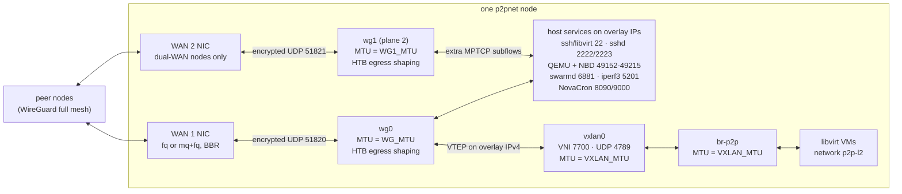

# p2pnet: zero-cost P2P node networking

`p2pnet` configures a private WireGuard full mesh, a VXLAN L2 overlay, traffic shaping, MPTCP for supported TCP applications, content-efficient replication, and libvirt VM migration. It uses Linux kernel, systemd, WireGuard, iproute2, ZFS, libvirt, restic and libtorrent; it does not require a paid relay or SaaS control plane. The static inventory is the source of truth: every rate, MTU, port range and peer list below is computed from it by `libexec/inventory.py`. Run every command on each node unless the step says otherwise.

## Architecture



HTB is the root qdisc of wg0 (and wg1 on dual-WAN nodes), so it shapes this node's egress before encryption, while TCP/UDP ports are still visible. A physical WAN device only sees encrypted UDP and cannot be classified. Inbound traffic is not shaped; the sender's HTB shapes it. Tenant VM frames leave through vxlan0 as UDP/4789 inside wg0 and use the default class; inner guest ports are not inspected.

### Port → class table

IPv4 filters, checked in this order; the first match wins. Every class has an `fq_codel` leaf. Rates are the formulas under [HTB rate derivation](#htb-rate-derivation).

| Match on wg0/wg1 egress | Traffic | Class | Guaranteed rate | Ceiling |
|---|---|---|---|---|
| ICMP, IP total length < 512 B | ping, PMTU errors | `1:10` control, prio 0 | `CTRL` (9.6 Mbit/s at 1 Gbit/s up, floor 1 Mbit/s) | `ROOT` |
| TCP pure ACK (no IP options, < 64 B) | ACKs for inbound downloads | `1:10` | shared with control | `ROOT` |
| UDP destination 53, 123 | DNS, NTP | `1:10` | shared with control | `ROOT` |
| TCP source or destination 22, 8090, 9000, IP length < 512 B | ssh and `qemu+ssh` libvirt control, NovaCron API and fabric RPC | `1:10` | shared with control | `ROOT` |
| TCP destination in `cluster.migration.port_min`–`port_max` (default 49152–49215) | libvirt/QEMU live migration and `--copy-storage` NBD; NovaCron migration and NBD | `1:20` migration, prio 1 | `MIG` = ROOT×200/940 | `ROOT` |
| TCP destination 2222 | ZFS `send` to the guarded replication sshd | `1:25` replication, prio 2 | `REPL` = ROOT×100/940 | `ROOT` |
| TCP source or destination 6881 and 2223 | swarm torrents; bulk SFTP (`swarm publish`, `restic copy` pulls, which leave the source with sport 2223) | `1:40` bulk, prio 4 | `BULK` = max(1000, ROOT/100) | night or day bulk ceiling |
| anything else | VM VXLAN (UDP 4789), iperf3 (5201), large 8090/9000 packets such as NovaCron's throughput probe, bulk data on port 22 | `1:30` default, prio 3 | `DEF` = remainder | `ROOT` |

If the inventory sets `overlay.ipv6_cidr`, the same port rules are added for IPv6, but without the length and pure-ACK tests: ICMPv6 and every IPv6 packet on ports 22/8090/9000 go to `1:10`.

## Install and configure

1. Every node needs Ubuntu 24.04 with a generic Linux kernel 6.8 or newer, and working WireGuard, MPTCP, BBR, ZFS and libvirt support. A component whose kernel feature is missing fails `install` and names the module. Host configuration requires root.
2. Install the toolkit and its packages on each node:

   ```bash
   sudo deploy/p2pnet/install.sh        # copies the checkout to /opt/p2pnet, links /usr/local/sbin/p2pnet
   sudo p2pnet deps install             # apt packages: wireguard-tools, iperf3, zfsutils-linux, libvirt, restic, python3-libtorrent, ...
   sudo p2pnet deps verify
   ```

3. Set the node identity, then create keys:

   ```bash
   sudo p2pnet init --node node-a       # /etc/p2pnet/node-name, users p2prepl/p2pbulk/p2pvirt, state directories
   sudo p2pnet keys                     # add --wan2 on dual-WAN nodes; add --restic-password on the seed node only
   ```

   `keys` prints an inventory snippet with `wg_pubkey`, `ssh_pubkey`, `ssh_bulk_pubkey`, `ssh_hostkey` and, with `--wan2`, `wan2.wg1_pubkey`. Private keys stay on the node. Copy the seed's `/etc/p2pnet/secrets/restic.pass` out of band to the same path on every other node, mode `0640 root:p2pbulk`.
4. Fill in the inventory from `deploy/p2pnet/inventory.example.yaml` (the file doubles as the schema; defaults are in comments). Replace every example name, overlay address, endpoint, `wan_mtu`, measured `uplink_mbit`/`downlink_mbit`, key, dataset and capacity with real values.
5. Distribute the same file to `/etc/p2pnet/inventory.yaml` on every node, then on each node:

   ```bash
   sudo p2pnet inventory validate                       # "inventory valid", or one ERROR line per problem
   sudo p2pnet init --node node-a                       # re-run: creates the inventory's images_dir owned by p2pbulk
   sudo p2pnet inventory env --node node-a              # computed MTUs, QoS rates, ports
   sudo p2pnet inventory qos-table --node node-a        # per-class rate and ceilings
   sudo p2pnet inventory render-all --out /tmp/p2pnet-rendered   # optional: review wg0/wg1/node.env for all nodes
   ```

6. Configure host firewalls yourself; p2pnet never edits a firewall (`wg install` and `sshd install` only warn when ufw is active). Allow inbound UDP `wg_port` (51820) and, on dual-WAN nodes, `wg1_port` (51821) on the WAN. On wg0/wg1 allow ICMP, UDP 4789 and TCP 22, 2222, 2223, 5201, 6881, the migration range, and NovaCron's 8090/9000.

## Runbook

Install and verify one component at a time, in this order, on every node before moving to the next step; there is no `all install`. `verify` prints `STATUS CHECK DETAIL` lines and exits non-zero on any FAIL. Rollback commands keep keys and data unless you add `--purge`.

1. **tune — high-BDP WAN tuning**
   - Commands: `sudo p2pnet tune install`. It saves the current values of every managed sysctl once, installs `/etc/sysctl.d/90-p2pnet-net.conf` (BBR, fq, 32 MiB buffer caps) and `/etc/modules-load.d/p2pnet.conf`, sets `fq` (or `mq` with `fq` children) on the WAN NICs, and enables `p2pnet-tune.service` to re-apply the qdisc at boot.
   - Verify: `sudo p2pnet tune verify`. Every `sysctl.*` line, `tune.bbr` and `qdisc.<wan>` must PASS.
   - Rollback: `sudo p2pnet tune uninstall` restores the saved sysctl values, deletes the WAN root qdisc and removes the files and unit.
2. **wg — WireGuard full mesh**
   - Commands: `sudo p2pnet wg install`. It refuses if `/etc/wireguard/wg0.key` does not match the inventory's `wg_pubkey`, renders `/etc/wireguard/wg0.conf` (0600, no private key inside), enables `wg-quick@wg0`, and enables `p2pnet-wg-reresolve.timer`, which re-resolves DNS endpoints of peers whose handshake is stale. Every pair needs a reachable endpoint on at least one side; `inventory validate` rejects pairs where both are behind NAT.
   - Verify: `sudo p2pnet wg verify`: unit active, wg0 MTU = `WG_MTU`, a handshake ≤ 180 s and ping replies for every peer, and a don't-fragment ping with a `WG_MTU − 28` byte payload. `sudo wg show` shows live peers.
   - Rollback: `sudo p2pnet wg uninstall` stops the tunnel and removes config and units; `--purge` also deletes the wg0 key pair.
3. **l2 — VXLAN over the overlay**
   - Commands: `sudo p2pnet l2 install` creates `br-p2p` and `vxlan0` (VNI 7700, UDP 4789, local = overlay IPv4), both with MTU `VXLAN_MTU`, adds one flood entry per peer, and enables `p2pnet-l2.service` to rebuild them at boot. Then run the selftest on both ends at the same time, e.g. `sudo p2pnet l2 selftest --peer node-b` on node-a and `sudo p2pnet l2 selftest --peer node-a` on node-b (`--wait 60` is the default).
   - Verify: `sudo p2pnet l2 verify`: bridge and vxlan0 up, both MTUs equal `VXLAN_MTU`, the flood list equals the inventory peers; a WARN `l2.bridge_nf` means Docker/br_netfilter may drop bridged frames (see [Limits](#limits-and-operational-risks)). The selftest passes only if a temporary namespace on the bridge reaches the peer's `169.254.77.x` test address and a don't-fragment ping at `VXLAN_MTU − 28` succeeds.
   - Rollback: `sudo p2pnet l2 uninstall` deletes vxlan0, the bridge and the unit. It refuses while ports other than vxlan0 are attached to `br-p2p`; detach VMs first, or use `--force`.
4. **bench — baseline before QoS**
   - Commands: `sudo p2pnet bench install` on every node (iperf3 server on `<overlay IPv4>:5201`), then `sudo p2pnet bench run node-b [--duration 10] [--json] [--perf]` from each node towards its peers. Record this unshaped baseline before step 7. For an underlay comparison, run a temporary `iperf3 -s` on the peer's WAN endpoint address and set that peer's `underlay_iperf: true`. `--perf` needs root and `linux-tools-$(uname -r)`; it shows `chacha20`/`poly1305`/`wg_packet_*` symbols when WireGuard crypto is hot.
   - Verify: `sudo p2pnet bench verify` (service active, listener present). `bench run` prints RTT, one-stream and eight-stream throughput, per-core CPU and a verdict: `CPU-bound`, `per-flow window/BDP-bound`, `link-bound` (≥ 90 % of the expected overlay ceiling) or `path-limited`. With underlay data it also prints `overlay/underlay` against the expected `(WG_MTU−52)/1448` ≈ 0.959.
   - Rollback: `sudo p2pnet bench uninstall`.
5. **mptcp — multipath TCP, dual-WAN ready**
   - Commands: `sudo p2pnet mptcp install` enables MPTCP sysctls (`/etc/sysctl.d/91-p2pnet-mptcp.conf`) and `ip mptcp limits set subflows 8 add_addr_accepted 8`, and enables `p2pnet-mptcp.service`. On dual-WAN nodes (run `keys --wan2` first) it also brings up `wg-quick@wg1`, the policy-routing tables `p2p-wan1`/`p2p-wan2`/`p2p-plane2`, and the plane-2 MPTCP endpoint (`id 51 subflow signal`). Wrap a TCP program with `p2pnet mptcp-run -- COMMAND`; when MPTCP is unavailable it prints why and runs over plain TCP.
   - Verify: `sudo p2pnet mptcp verify`, then `sudo p2pnet mptcp verify --peer node-b`. The peer check needs at least two paths when either side is dual-WAN; a single-WAN pair passes with one path.
   - Rollback: `sudo p2pnet mptcp uninstall` restores the saved sysctls, resets limits to `subflows 2 add_addr_accepted 0`, stops wg1 and removes routes and files; `--purge` also deletes the wg1 key pair.
6. **sshd — overlay transport for replication and bulk**
   - Commands: `sudo p2pnet sshd install` starts `p2pnet-sshd.service`, a second OpenSSH instance listening only on the overlay addresses. Port 2222 accepts `p2prepl`, whose key is forced through `zrepl-guard` (ZFS receive and state commands only). Port 2223 accepts `p2pbulk`, chrooted to `/var/lib/p2pnet/public` with `internal-sftp` only.
   - Verify: `sudo p2pnet sshd verify`: the service is active and listening on 2222/2223; for every peer the guard `state` probe works, an arbitrary command (`id`) is denied, and bulk SFTP can list `/torrents`.
   - Rollback: `sudo p2pnet sshd uninstall`. Only add `--purge` if you mean it: it deletes `/var/lib/p2pnet/public`, including the published torrents and the restic repository.
7. **qos — HTB on the overlay**
   - Commands: `sudo p2pnet qos install` builds the tree from the [port → class table](#port--class-table) with the profile for the current local time and enables `p2pnet-qos.service` (`qos apply --profile auto`), which re-applies whenever wg0/wg1 restart. `sudo p2pnet qos apply --profile night|day|auto [--dry-run]` switches the bulk ceiling by hand; `--dry-run` prints the tc commands.
   - Verify: `sudo p2pnet qos verify`: htb root on each device, all five leaf classes with rate/ceil within 1 % of the inventory values, the expected filter count (16, or 31 with an IPv6 overlay); WARN if control has drops. Then run `sudo p2pnet qos selftest --peer node-b`: 20 connection attempts each to ports 49152, 49215 (→ `1:20`), 49216 and 5999 (→ `1:30`), 2222 (→ `1:25`), 6881 and 2223 (→ `1:40`), 22 and 20 pings (→ `1:10`) must land in the expected class. Watch live counters with:

     ```bash
     watch -n1 "tc -s class show dev wg0 | grep -E '^class|Sent'"
     ```

   - Rollback: `sudo p2pnet qos uninstall` deletes the root qdisc on wg0/wg1 and removes the unit.
8. **libvirt + migrate plan on a test VM**
   - Commands: `sudo p2pnet libvirt install`. It maintains a managed block in `/etc/libvirt/qemu.conf` (`migration_address`/`migration_host` = this node's overlay IPv4, `migration_port_min`/`max` = the inventory range) and refuses if those keys are set elsewhere in the file; it adds `p2pvirt` to the `libvirt` group with peer keys, ensures the `default` storage pool, and defines the bridge-mode network `p2p-l2` on `br-p2p`. Attach a test guest with this interface fragment:

     ```xml
     <interface type='network'><source network='p2p-l2'/><model type='virtio'/></interface>
     ```

     The `p2p-l2` network XML has no `<mtu>` element, because libvirt rejects `<mtu>` for `forward mode='bridge'` networks. `l2` sets `VXLAN_MTU` on `br-p2p` and `vxlan0`, and libvirt derives each guest tap's MTU from the bridge, so the host side of the path carries `VXLAN_MTU` (T9 asserts this on the running guest's tap). **The guest does not adopt it automatically.** virtio-net exposes the host MTU to the guest as an advisory value, and the Linux driver does not apply it: a stock guest booted on `p2p-l2` reports `MTU:1500` while its tap on the host is at `VXLAN_MTU`. Until the guest is configured, it will either fragment or black-hole anything larger than 1500 on the overlay. Set the MTU inside the guest from your image's own mechanism (cloud-init `runcmd`, a network config, or `ip link set dev eth0 mtu <VXLAN_MTU>`), and verify with `ip link show eth0`. Then, with the guest running:

     ```bash
     sudo p2pnet migrate plan DOMAIN node-b [--json]
     sudo p2pnet migrate run DOMAIN node-b --dry-run                    # prints downtime_ms and the full virsh command
     sudo p2pnet migrate run DOMAIN node-b [--profile auto|multifd|xbzrle|postcopy] [--copy-storage] [--allow-postcopy]
     ```

     Run real migrations in a maintenance window. With `--copy-storage`, pre-create the destination disk at the same path in the destination's `default` pool, with the same size and format; on Ubuntu 24.04/libvirt 10, a missing target file fails with `Cannot access storage file`.
   - Verify: `sudo p2pnet libvirt verify`: the managed block matches the inventory, the `default` pool is active, `p2p-l2` is active and autostarted, `p2pvirt` can use `qemu:///system`, and `virsh version` works against every peer over `qemu+ssh://p2pvirt@<peer overlay>/system`. After a run, `/var/lib/p2pnet/migrate/last.json` records profile, downtime, elapsed time and bytes; `/var/log/p2pnet/migrate.log` holds virsh output.
   - Rollback: migrate the guest back with `sudo p2pnet migrate run DOMAIN node-a` on node-b. If a post-copy migration breaks, the only recovery is `virsh migrate --postcopy-resume DOMAIN`. `sudo p2pnet libvirt uninstall` removes the managed block, the `p2pvirt` keys and `p2p-l2`; it refuses while any domain references `p2p-l2`, unless `--force` is given.
9. **zrepl — incremental ZFS replication**
   - Commands: `sudo p2pnet zrepl install` on every node. Nodes with `zfs.replica_root` get the root (`canmount=off`, `readonly=on`) and a `zfs allow` delegation for `p2prepl`; source nodes get one `p2pnet-zrepl@JOB.timer` per job at its `interval_min`. Start the first full send with `sudo p2pnet zrepl run JOB` on the source; later runs are incremental and resumable. Replicas land at `<target replica_root>/<source node>/<dataset without pool>`.
   - Verify: `sudo p2pnet zrepl verify` (delegation present, timers enabled, last run successful; WARN before the first run) and `sudo p2pnet zrepl status [--json]`.
   - Rollback: `sudo p2pnet zrepl uninstall` removes timers and the delegation. Snapshots and replicas are kept, even with `--purge`.
10. **swarm — multi-source image distribution**
    - Commands: `sudo p2pnet swarm install` on every node starts `p2pnet-swarmd` (libtorrent, TCP 6881 on overlay addresses only; no DHT, tracker, UPnP or NAT-PMP). On the node that has the image, run `sudo p2pnet swarm publish PATH [--name NAME]`: this copies it into `images_dir`, builds a private v2 torrent and pushes it to every peer over bulk SFTP. On each receiver, run `sudo p2pnet swarm fetch NAME --wait [--timeout 3600]`. Every node that has pieces serves them.
    - Verify: `sudo p2pnet swarm verify` (unit active, listening on `<overlay>:6881`, `status.json` fresher than 30 s) and `sudo p2pnet swarm status [--json]`.
    - Rollback: `sudo p2pnet swarm uninstall` stops the daemon; `--purge` also deletes `images_dir`, torrents, the queue and resume data. `sudo p2pnet swarm unpublish NAME` only removes the local torrent.
11. **dedup — content-defined chunk store**
    - Commands: `sudo p2pnet dedup install` on every node (it needs the shared `restic.pass`). Then run `sudo p2pnet dedup init --seed` on the seed node, and `sudo p2pnet dedup init --from node-a` on every other node; this copies the seed's chunker parameters so chunks match everywhere. `init` is idempotent: on an existing repository it prints `repository already initialized`. `init --from` refuses if the local repository's chunker polynomial differs from the source's; recreate it with `dedup uninstall --purge`, `dedup install`, `dedup init --from node-a`. On the node that has an image, run `sudo p2pnet dedup ingest PATH [--name NAME]`, which prints the new unique bytes. On a receiver, run `sudo p2pnet dedup fetch NAME --from node-a [--output PATH]` (the default output is `images_dir/NAME`).
    - Verify: `sudo p2pnet dedup verify` (password file `root:p2pbulk 0640`, repository readable). `sudo p2pnet dedup stats [--json]` prints logical bytes, stored bytes and their ratio; `/var/lib/p2pnet/dedup/last-fetch.json` records the bytes transferred and the savings of the last fetch.
    - Rollback: `sudo p2pnet dedup uninstall`; `--purge` also deletes the repository, the cache and the dedup records.
12. **schedule — off-peak profile switching**
    - Commands: `sudo p2pnet schedule install` renders systemd timers (local time): `p2pnet-qos-night.timer` at `night_start` (`qos apply --profile night`), `p2pnet-qos-day.timer` at `night_end` (`--profile day`), and `p2pnet-swarm-preseed.timer` five minutes after `night_start` (`swarm preseed` queues every missing `swarm.base_images` entry). ZFS replication timers stay continuous. A switch time missed while the node was down is not replayed: `p2pnet-qos.service` applies `--profile auto` at boot, and a missed pre-seed waits for the next night.
    - Verify: `sudo p2pnet schedule verify` shows each timer enabled with its next elapse time.
    - Rollback: `sudo p2pnet schedule uninstall`. The bulk ceiling stays at the last applied profile until `sudo p2pnet qos apply --profile auto` or the next wg0 restart.
13. **health — one cluster check**
    - Commands: `sudo p2pnet health --quick` (no throughput tests), then `sudo p2pnet health`, or `sudo p2pnet health --json` for monitoring.
    - Verify: one `STATUS CHECK VALUE TARGET DETAIL` line per check, exit 1 on any FAIL, 20 s timeout per check. The checks are: WireGuard handshakes (including wg1/plane 2), `iperf.overlay.<peer>` against the inventory-derived target, MPTCP for dual-WAN pairs, replication lag per job and target (PASS ≤ 2·interval + 5 min), the last migration (`ok` and downtime within the planned limit for its destination, `P2P_PATH_DOWNTIME_MS`: 300–2000 ms; 1000 ms if the destination is no longer in the inventory), `qos verify`, `l2 verify`, `tune verify`, and the dedup ratio (INFO).
    - Rollback: none needed; health is read-only.

`sudo p2pnet all verify` runs each component's `verify` (uninstalled components SKIP) and exits non-zero if any component failed. `sudo p2pnet all uninstall [--purge]` removes components in reverse order; see [Uninstall everything](#uninstall-everything).

## Sizing and rates

Print a node's computed values with `p2pnet inventory env --node NODE` and `p2pnet inventory qos-table --node NODE`. Print pair values with `p2pnet inventory path --from A --to B`. All arithmetic is integer kbit, rounded down.

### MTU

WireGuard overhead is 60 bytes for an all-IPv4 underlay (IPv4 20 + UDP 8 + WireGuard header 16 + authentication tag 16), or 80 bytes when any node's `underlay_family` is ipv6 (IPv6 header 40). WireGuard never pads past the device MTU.

- `WG_MTU = min(all nodes' wan_mtu) − overhead`: 1440 for IPv4/1500, 1420 when IPv6 is used, 1432 for PPPoE/1492.
- `WG1_MTU = min(wan2.mtu, all wan_mtu) − overhead`.
- VXLAN adds 50 bytes (inner Ethernet 14 + VXLAN 8 + UDP 8 + overlay IPv4 20), so `VXLAN_MTU = WG_MTU − 50`: 1390, 1370 or 1382 respectively. VTEPs always use overlay IPv4.

`wg verify` and `l2 selftest` prove these values end to end with don't-fragment pings. `tcp_mtu_probing = 1` (from `tune`) recovers TCP from PMTU black holes behind PPPoE or nested tunnels.

### HTB rate derivation

HTB counts inner packets before encryption, so the root is derated by the encapsulation ratio:

- `outer = uplink_mbit × 1000 × shape_percent / 100`. The default `shape_percent` of 94 keeps the queue on the node instead of the modem.
- `ROOT = outer × WG_MTU / (WG_MTU + overhead)`.
- `CTRL = max(1000, ROOT×10/940)`, `MIG = ROOT×200/940`, `REPL = ROOT×100/940`, `BULK = max(1000, ROOT/100)`, and `DEF = ROOT − CTRL − MIG − REPL − BULK`.
- Bulk ceiling at night = `max(BULK, 0.8 × (ROOT − CTRL − MIG − REPL))`; by day = `max(BULK, ROOT × bulk_day_ceil_percent / 100)` (10 % by default).
- Every other class may borrow up to `ROOT`. wg1 uses `wan2.uplink_mbit` and `WG1_MTU`. Validation rejects an uplink whose `DEF` would fall below 1000 kbit.

Worked values (IPv4, `shape_percent` 94, `bulk_day_ceil_percent` 10), in kbit/s:

| Uplink | ROOT | CTRL | MIG | REPL | BULK | DEF | bulk ceil night | bulk ceil day |
|---|---:|---:|---:|---:|---:|---:|---:|---:|
| 1000 Mbit/s | 902400 | 9600 | 192000 | 96000 | 9024 | 595776 | 483840 | 90240 |
| 40 Mbit/s | 36096 | 1000 | 7680 | 3840 | 1000 | 22576 | 18860 | 3609 |

### Path capacity and health targets

For sender A and receiver B:

- `PATH = min(A.ROOT, B.downlink_mbit × 1000 × shape_percent/100 × WG_MTU/(WG_MTU+overhead))`.
- `OVERLAY_CEIL = PATH × (WG_MTU − 52)/WG_MTU`. The 52 bytes are IPv4 20 + TCP 20 + timestamps 12.
- `OVERLAY_TARGET = 0.95 × OVERLAY_CEIL`.
- `UNDERLAY_TARGET = 0.95 × min(A.uplink, B.downlink) × 1448/1538`.

A symmetric 1 Gbit/s pair has a ceiling of 869 Mbit/s and a health target of 826 Mbit/s, so the plain-link 900 Mbit/s is unreachable through the overlay. A 40 Mbit/s-up node sending to a 1 Gbit/s-down node has a ceiling of 34 Mbit/s and a target of 33 Mbit/s.

### BDP and buffer sizing

The bandwidth-delay product is rate × RTT: 1 Gbit/s at 100 ms is 12.5 MB in flight. Linux advertises roughly half the receive buffer as the TCP window, so `tune` raises `rmem_max`/`wmem_max` and the `tcp_rmem`/`tcp_wmem` autotuning maximum to 32 MiB. That covers about 130 ms at 1 Gbit/s, or about 250 ms at 500 Mbit/s. The tuning also sets:

- `tcp_notsent_lowat = 128 KiB`, so large send buffers stay in flight instead of queueing unsent data;
- `tcp_slow_start_after_idle = 0`, which keeps cwnd between replication bursts;
- `netdev_max_backlog = 5000`, which absorbs WireGuard decrypt bursts;
- BBR with `fq` pacing, which fills long fat pipes without depending on loss.

A 40 Mbit/s uplink at 100 ms has a BDP of only 0.5 MB; there, the uplink is the limit and default buffers suffice. `bench` separates these cases: one stream versus eight streams exposes a per-flow window limit, per-core CPU shows crypto limits, and the ceiling above identifies a link-bound path.

### Swarm piece size

`swarm_make.py` picks 16 MiB pieces for images up to 64 GiB, 32 MiB up to 256 GiB, and 64 MiB above that. That is at most 8192 pieces up to 512 GiB (a 20 GiB image has 1280). The metadata stays small, and there are enough pieces for several peers to serve one image in parallel early on. Torrents are v2-only, so every 16 KiB block is verified through a merkle tree; one corrupt block does not force a whole piece to be downloaded again.

Seeded images must not be modified. Use them as qcow2 backing files: `qemu-img create -f qcow2 -F qcow2 -b /var/lib/p2pnet/images/NAME vm.qcow2`.

### Dedup ratio

restic splits data into content-defined Rabin chunks (512 KiB–8 MiB, averaging 1 MiB). Because every repository shares the seed's chunker parameters, `restic copy` transfers only chunks the destination lacks.

- Dedup ratio = logical bytes ÷ unique stored bytes (`dedup stats`).
- Transfer savings for image `I` = `1 − transferred_bytes / size(I)` (`last-fetch.json`).
- Worked example: two 20 GiB images share 18 GiB of identical base blocks. Fetching the second one moves about 2 GiB, plus about 1 MiB per changed region, because a chunk boundary re-synchronises within about one average chunk after an edit.

Compressed qcow2 (`qemu-img convert -c`) defeats deduplication, so ingest raw or uncompressed qcow2. Use swarm (multi-source, whole image) to distribute a new base image to many nodes for the first time; `preseed` uses swarm. Use dedup (single source, deltas only) for derived images.

### Migration convergence and downtime

Migration bandwidth is `B = PATH × 0.95 / 8000` MB/s: 107 MB/s on a 1 Gbit/s path, 4 MB/s from a 40 Mbit/s uplink. Pre-copy only converges when the guest's dirty rate `D` is below `B`. `migrate plan` measures `D` with `virsh domdirtyrate-calc` and chooses a profile:

| Condition | Profile | Mechanism |
|---|---|---|
| `D < 0.5·B` (or D unavailable) | `multifd` | pre-copy converges geometrically; parallel connections (4 when the uplink is ≤ 1 Gbit/s, else 8) with zstd level 1 |
| `0.5·B ≤ D < 0.9·B` | `xbzrle` | single channel, delta-encodes re-dirtied pages (cache = RAM/4, clamped to 256 MiB–2 GiB) plus auto-converge throttling |
| `D ≥ 0.9·B` | `postcopy` | pre-copy cannot converge; requires `--allow-postcopy` |

- **Downtime.** QEMU switches over once the remaining dirty set fits in B × the downtime limit. p2pnet sets the limit to `min(2000, max(300, ⌈32 MiB / B⌉))` ms: 314 ms at 107 MB/s, rising automatically to 2000 ms on slow uplinks.
- **First pass.** It takes RAM/B: about 80 s for 8 GiB at 107 MB/s.
- **Timeout.** Pre-copy profiles use `--timeout T --timeout-suspend` with `T = max(300, ⌈3·RAM/B⌉)` s. The guest is paused to finish if the migration has not converged by then.
- **Channels.** QEMU 8.2 does not allow multifd together with xbzrle or post-copy, so those profiles use one channel. libvirt-managed QEMU is not MPTCP-wrapped; multifd connections provide the parallel streams.
- **Post-copy risk.** If the link fails during post-copy, guest state is split across both hosts; `virsh migrate --postcopy-resume` is the only recovery.

## Asymmetric uplinks

- **Queue on the node.** The HTB root derives from each node's real `uplink_mbit`, so congestion queues on the node (in `fq_codel`) rather than in the modem's oversized buffer, which avoids bufferbloat.
- **Downloads keep moving.** Control has a 1 Mbit/s floor and priority 0, and pure TCP ACKs are classified as control. Downloads keep flowing while uploads saturate the link.
- **Migration.** At 40 Mbit/s up, B ≈ 4 MB/s, so an 8 GiB first pass takes about 36 minutes. The dirty-rate thresholds scale with B (2 MB/s for xbzrle, 3.6 MB/s for post-copy), so `plan` picks xbzrle or post-copy much earlier than at 1 Gbit/s. Post-copy still needs the explicit `--allow-postcopy`. The downtime limit rises automatically to 2 s, and `health` judges `migrate.last` against that same per-destination limit.
- **Replication.** The guaranteed 3.84 Mbit/s replication class carries about 41 GB/day. If a dataset changes faster than that, lag grows until `health` reports `zrepl.<job>.<target>` FAIL (lag > 2·interval + 5 min).
- **Swarm.** The aggregate fetch rate is the sum of the peers' bulk ceilings: about 18.9 Mbit/s per 40 Mbit/s node at night and 3.6 Mbit/s by day. `schedule` therefore runs pre-seeding at night.
- **Dedup.** Deduplication is the main mitigation for a slow uplink, because unchanged chunks are never sent again.
- **Health targets.** `health` iperf targets derive from min(sender uplink, receiver downlink), not from a fixed 900 Mbit/s.

## NovaCron integration

- **Migration ports.** Set `NOVACRON_MIGRATION_PORT_RANGE` to the inventory's `cluster.migration` block. The default, `49152-49215`, matches libvirt's range, the `qemu.conf` block and the `1:20` filter. NovaCron accepts any range, but QoS matches one power-of-two block aligned to its size, so any other value leaves migration traffic in the default class.
- **Overlay addresses.** Put overlay addresses in:
  - `NOVACRON_PEERS` (`node-b=10.77.0.2:<API_PORT>,...`)
  - `NOVACRON_JOIN_ADDR` (`<own overlay IPv4>:<API_PORT>`)
  - `API_HOST` (the fallback for the join address)
  - `NOVACRON_JOIN_PEERS`

  Fabric RPC, joins and migration/NBD streams then traverse wg0 and are classified. The API server binds every interface; restricting it to wg0 is a firewall decision.
- **Ports 8090/9000.** Packets under 512 bytes on 8090 (API) and 9000 (fabric peer) go to control. Larger packets, such as the throughput probe, use the default class.
- **Scope.** This integration does not convert NovaCron's QMP driver to libvirt; both allocate from the same port range.

## Limits and operational risks

- **Migration and MPTCP.** Libvirt migration is not MPTCP-wrapped: libvirt 10/QEMU starts managed processes with no supported MPTCP option.
- **Tenant traffic.** Tenant VXLAN packets form one class; inner guest TCP/UDP ports are not visible at the host classifier.
- **IPv6 overlay classification.** IPv6 overlay traffic has no size or pure-ACK rules, so large IPv6 packets on 22/8090/9000 are shaped as control.
- **NAT on both sides.** If both peers are behind NAT without a port-forward, no direct WireGuard path exists. Inventory validation rejects that topology; a relay is out of scope.
- **Docker and br_netfilter.** If Docker's FORWARD drop policy and `br_netfilter` are both active, bridged VM frames are dropped. `l2 verify` warns and prints the remediation, `iptables -I DOCKER-USER -i br-p2p -o br-p2p -j ACCEPT`; persist it in your firewall policy.
- **Guest MTU.** The host path (bridge, VXLAN and the guest's tap) is `VXLAN_MTU` and is asserted by the lab, but a guest keeps its own NIC at 1500 until its image configures it. Guests must set an MTU no larger than `VXLAN_MTU`; see step 8.
- **Seeded images.** Seeded swarm images are immutable. Replace one by publishing a new image name or version.
- **Inventory changes.** Changes can restart wg0 (`wg install` restarts the tunnel when the rendered config changes), which drops peer traffic and re-applies QoS. Apply them during a maintenance window, one node at a time.
- **mptcp-exec fallback.** `mptcp-exec` degrades to ordinary TCP when kernel support or `mptcpize` is unavailable. It cannot create paths that do not exist.

## 3-VM acceptance lab

The lab is manual and not part of CI. It needs these host commands: `qemu-img`, the QEMU system emulator, `cloud-localds`, `ssh`, `rsync`, `curl` and `sha256sum`. It also needs read/write access to `/dev/kvm` and a reachable Ubuntu cloud-image mirror. No host root is required. State lives in `${P2PNET_LAB_DIR:-$HOME/.cache/p2pnet-lab}`.

```bash
deploy/p2pnet/lab/lab.sh up
deploy/p2pnet/lab/lab.sh provision
deploy/p2pnet/lab/lab.sh test            # all of T1–T16, or e.g. `test T3 T9`
deploy/p2pnet/lab/lab.sh down            # keeps cached images; `down --purge` removes them
```

If your account cannot open `/dev/kvm`, run each command as `sudo -n env HOME="$HOME" P2PNET_LAB_DIR="$HOME/.cache/p2pnet-lab" deploy/p2pnet/lab/lab.sh …` so the state stays in your cache directory.

## Uninstall everything

Detach guests from `p2p-l2` and foreign ports from `br-p2p` first: `libvirt` and `l2` refuse removal while those references exist, and `--purge` does not bypass that safety gate. Back up anything you still need. Then, on every node:

```bash
sudo p2pnet all uninstall --purge
sudo rm -rf /opt/p2pnet /usr/local/sbin/p2pnet
```

`all uninstall --purge` runs `schedule dedup swarm zrepl libvirt qos sshd bench mptcp l2 wg tune` in that order and stops at the first component that refuses (for example `libvirt` while a domain still references `p2p-l2`, or `l2` while a port other than vxlan0 is attached to `br-p2p`); fix the cause and run it again. It removes every unit, timer, sysctl file, qdisc, link and managed config, plus the images, torrents, restic repository and cache, `/var/lib/p2pnet/public`, and the wg0/wg1 keys.

The following are deliberately kept:

- ZFS replicas under `replica_root` and the `@p2pnet-*` snapshots on source datasets.
- The SSH identity keys and the shared restic password. To remove them, save them first, then run `sudo p2pnet keys uninstall --purge` before deleting `/opt/p2pnet`.
- The inventory and node identity in `/etc/p2pnet`, state and logs under `/var/lib/p2pnet`, `/var/log/p2pnet` and `/var/cache/p2pnet`, `/etc/logrotate.d/p2pnet`, the system users `p2prepl`, `p2pbulk` and `p2pvirt`, and the apt packages installed by `deps`.

To remove those as well:

```bash
sudo userdel p2prepl; sudo userdel p2pbulk; sudo userdel p2pvirt
sudo rm -rf /etc/p2pnet /var/lib/p2pnet /var/log/p2pnet /var/cache/p2pnet /etc/logrotate.d/p2pnet
```
