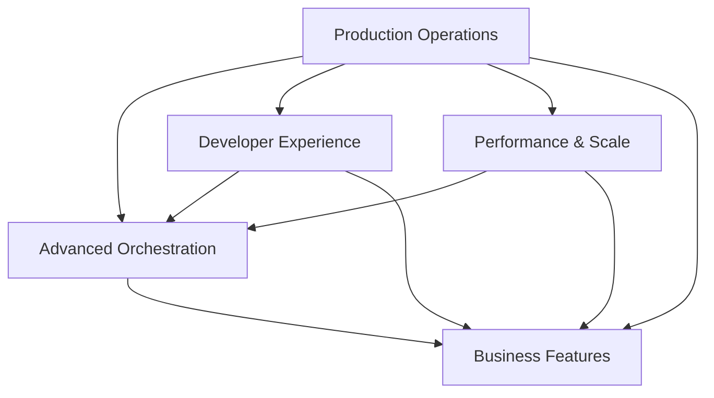

# NovaCron Platform Evolution Roadmap

## Executive Summary

This document outlines the comprehensive evolution of NovaCron from a distributed VM management system to an enterprise-grade cloud orchestration platform. The roadmap spans 5 strategic pillars across 12 months, with quarterly milestones and clear dependencies.

## Strategic Pillars Overview

### 1. 🏭 Production Operations Excellence
**Goal**: Enterprise-grade reliability and operations
- Kubernetes operators for automated deployment
- Full observability stack (metrics, logs, traces)
- GitOps workflows for declarative operations
- Disaster recovery and business continuity

### 2. 🚀 Advanced Orchestration Features  
**Goal**: Intelligent workload management
- ML-driven predictive auto-scaling
- Multi-cloud federation capabilities
- Container-VM hybrid orchestration
- GPU/TPU scheduling for AI/ML workloads

### 3. 🛠️ Developer Experience
**Goal**: Accelerate adoption through superior tooling
- CLI for streamlined operations
- Terraform provider for IaC
- Multi-language SDKs (Go, Python, JavaScript)
- VS Code extension with IntelliSense

### 4. ⚡ Performance & Scale
**Goal**: Internet-scale capabilities
- Event streaming architecture (Kafka)
- Graph-based resource optimization
- Edge computing support
- P2P VM migration protocols

### 5. 💰 Business Features
**Goal**: Enable commercialization
- Multi-tenancy with isolation
- Usage-based billing system
- VM template marketplace
- Compliance automation (HIPAA, SOC2)
- Cost optimization engine

## Dependency Analysis



### Critical Dependencies

1. **Production Operations is foundational** - Required for:
   - Reliable deployment of all other features
   - Monitoring and debugging capabilities
   - Rollback and recovery mechanisms

2. **Developer Experience accelerates everything** - Enables:
   - Faster feature adoption
   - Community contributions
   - Integration with existing workflows

3. **Performance & Scale unlocks enterprise** - Prerequisites for:
   - Multi-tenant isolation
   - Cost-effective operations
   - Geographic distribution

## Implementation Phases

### Phase 1: Foundation (Q1 - Months 1-3)
**Focus**: Production readiness and core infrastructure

#### Production Operations
- [ ] Kubernetes Operator for NovaCron
  - CRDs for VM, Network, Storage resources
  - Automated rollout and rollback
  - Health checks and self-healing
  
- [ ] Observability Stack
  - Prometheus metrics collection
  - Grafana dashboards
  - Jaeger distributed tracing
  - ELK stack for log aggregation

- [ ] GitOps Foundation
  - ArgoCD integration
  - Git-based configuration management
  - Automated sync and drift detection

#### Developer Experience (Quick Wins)
- [ ] Basic CLI Tool
  - VM lifecycle management
  - Resource monitoring
  - Configuration management
  
- [ ] API Documentation
  - OpenAPI specification
  - Interactive API explorer
  - Getting started guides

### Phase 2: Scale & Intelligence (Q2 - Months 4-6)
**Focus**: Performance optimization and smart orchestration

#### Performance & Scale
- [ ] Event Streaming Architecture
  - Kafka integration for event bus
  - Event sourcing for state management
  - CQRS pattern implementation
  
- [ ] Distributed Caching
  - Redis cluster for hot data
  - CDN integration for static assets
  - Query result caching

#### Advanced Orchestration (Foundation)
- [ ] Predictive Auto-scaling v1
  - Time-series data collection
  - ARIMA model implementation
  - Basic prediction engine
  
- [ ] Container-VM Bridge
  - Unified networking layer
  - Shared storage abstraction
  - Resource scheduling unification

### Phase 3: Multi-Cloud & Advanced Features (Q3 - Months 7-9)
**Focus**: Federation and advanced workload management

#### Advanced Orchestration (Complete)
- [ ] Multi-Cloud Federation
  - AWS EC2 integration
  - Azure VM integration
  - GCP Compute Engine support
  - Unified control plane
  
- [ ] GPU/TPU Scheduling
  - CUDA-aware scheduling
  - GPU partitioning support
  - ML framework integration
  
- [ ] Advanced ML Auto-scaling
  - Neural network predictors
  - Reinforcement learning optimization
  - Multi-metric scaling decisions

#### Developer Experience (Advanced)
- [ ] Terraform Provider
  - Full resource coverage
  - Import existing infrastructure
  - State management
  
- [ ] Language SDKs
  - Go SDK with full API coverage
  - Python SDK with async support
  - JavaScript/TypeScript SDK
  
- [ ] VS Code Extension
  - Syntax highlighting for configs
  - IntelliSense for API calls
  - Integrated debugging

### Phase 4: Business Platform (Q4 - Months 10-12)
**Focus**: Monetization and compliance

#### Business Features
- [ ] Multi-Tenancy
  - Namespace isolation
  - RBAC with fine-grained permissions
  - Resource quotas and limits
  
- [ ] Billing System
  - Usage metering (CPU, memory, storage, network)
  - Invoice generation
  - Payment gateway integration (Stripe)
  - Cost allocation and chargeback
  
- [ ] Marketplace
  - Template repository
  - Publisher portal
  - Automated testing and validation
  - Revenue sharing model
  
- [ ] Compliance Automation
  - HIPAA compliance templates
  - SOC2 audit trails
  - GDPR data management
  - Automated compliance reports

#### Performance & Scale (Advanced)
- [ ] Edge Computing
  - Edge node discovery
  - Workload placement optimization
  - WAN optimization
  
- [ ] P2P Migration
  - BitTorrent-based transfer
  - Deduplication and compression
  - Bandwidth aggregation
  
- [ ] Graph Optimization
  - Resource dependency graphs
  - Constraint satisfaction solver
  - Global optimization algorithms

## Technical Architecture Evolution

### Current State
```
┌─────────────────┐
│   Frontend UI   │
└────────┬────────┘
         │
┌────────▼────────┐
│   REST/WS API   │
└────────┬────────┘
         │
┌────────▼────────┐
│   Core Logic    │
├─────────────────┤
│  VM  │ Storage  │
│ Mgmt │  Mgmt    │
└─────────────────┘
```

### Target State
```
┌──────────────────────────────────────────┐
│          User Interfaces                 │
├────────┬─────────┬──────────┬───────────┤
│   UI   │  CLI    │   SDK    │ VS Code   │
└────────┴────┬────┴──────────┴───────────┘
              │
┌─────────────▼────────────────────────────┐
│         API Gateway (Kong/Envoy)         │
└─────────────┬────────────────────────────┘
              │
┌─────────────▼────────────────────────────┐
│        Service Mesh (Istio)              │
├──────────────────────────────────────────┤
│  Auth │ Billing │ Orchestration │ Market │
├──────────────────────────────────────────┤
│     Event Bus (Kafka/NATS)               │
├──────────────────────────────────────────┤
│  VM   │ Container │ Storage │ Network    │
│  Mgr  │    Mgr    │   Mgr   │   Mgr      │
└──────────────────────────────────────────┘
              │
┌─────────────▼────────────────────────────┐
│     Multi-Cloud Resource Layer           │
├──────────────────────────────────────────┤
│  AWS  │  Azure  │   GCP   │  On-Prem    │
└──────────────────────────────────────────┘
```

## Key Technical Decisions

### 1. Kubernetes as Universal Substrate
- **Rationale**: Industry standard for container orchestration
- **Benefits**: Ecosystem, portability, declarative model
- **Implementation**: Custom operators for VM resources

### 2. Event-Driven Architecture
- **Rationale**: Scalability, loose coupling, audit trail
- **Technology**: Kafka for high-throughput, NATS for low-latency
- **Pattern**: Event sourcing with CQRS

### 3. Multi-Cloud Abstraction Layer
- **Approach**: Provider-agnostic API with provider-specific drivers
- **Standards**: Cloud Provider Interface (CPI) pattern
- **Tools**: Terraform for provisioning, Pulumi for programmatic IaC

### 4. Observability-First Design
- **Metrics**: Prometheus with custom exporters
- **Tracing**: OpenTelemetry with Jaeger backend
- **Logging**: Structured logging with ELK stack
- **Dashboards**: Grafana with templated dashboards

### 5. Security by Default
- **Zero Trust**: mTLS between all services
- **Secrets**: Vault for all sensitive data
- **Compliance**: Automated scanning and reporting
- **Audit**: Immutable audit logs with blockchain option

## Success Metrics

### Technical KPIs
- **Availability**: 99.99% uptime SLA
- **Performance**: <100ms API response time (p99)
- **Scale**: Support 10,000+ VMs per cluster
- **Efficiency**: <5% overhead vs bare metal

### Business KPIs
- **Adoption**: 1000+ active deployments
- **Revenue**: $1M ARR by end of Year 1
- **Ecosystem**: 50+ marketplace templates
- **Community**: 100+ contributors

### Operational KPIs
- **MTTR**: <15 minutes
- **Deployment**: <5 minutes for updates
- **Automation**: 90% of operations automated
- **Documentation**: 100% API coverage

## Risk Analysis & Mitigation

### Technical Risks
1. **Complexity Explosion**
   - Risk: System becomes unmaintainable
   - Mitigation: Modular architecture, clear boundaries
   
2. **Performance Degradation**
   - Risk: Features impact core performance
   - Mitigation: Performance testing gates, optimization sprints

3. **Multi-Cloud Complexity**
   - Risk: Provider differences break abstraction
   - Mitigation: Provider-specific adapters, comprehensive testing

### Business Risks
1. **Market Competition**
   - Risk: Established players (VMware, OpenStack)
   - Mitigation: Focus on developer experience, modern stack

2. **Adoption Challenges**
   - Risk: Steep learning curve
   - Mitigation: Excellent documentation, migration tools

3. **Monetization Timing**
   - Risk: Premature monetization hurts adoption
   - Mitigation: Freemium model, gradual feature gating

## Resource Requirements

### Team Composition
- **Core Platform**: 4 engineers
- **Cloud Integrations**: 2 engineers
- **Developer Experience**: 2 engineers
- **DevOps/SRE**: 2 engineers
- **Product/Design**: 1 PM, 1 designer
- **Total**: 12 people

### Infrastructure Costs
- **Development**: $5k/month (AWS/GCP credits)
- **Testing**: $3k/month (multi-cloud testing)
- **Production**: $10k/month (reference deployment)
- **Total**: $18k/month

### Timeline
- **Phase 1**: 3 months, $150k budget
- **Phase 2**: 3 months, $200k budget
- **Phase 3**: 3 months, $250k budget
- **Phase 4**: 3 months, $300k budget
- **Total**: 12 months, $900k budget

## Implementation Priorities

### Must Have (MVP)
1. Kubernetes operator
2. Basic observability
3. CLI tool
4. Multi-cloud support (AWS, Azure)
5. Basic multi-tenancy

### Should Have (v1.0)
1. Full observability stack
2. GitOps workflows
3. Terraform provider
4. ML auto-scaling
5. Basic marketplace

### Nice to Have (v2.0)
1. P2P migration
2. Edge computing
3. Blockchain audit logs
4. Advanced cost optimization
5. VS Code extension

## Next Steps

### Immediate Actions (Week 1)
1. Set up development Kubernetes cluster
2. Create operator scaffold with Kubebuilder
3. Design CRD schemas for VM resources
4. Set up CI/CD pipeline
5. Create project board for tracking

### Short-term Goals (Month 1)
1. Working operator with basic VM lifecycle
2. Prometheus metrics exporter
3. Basic CLI with CRUD operations
4. API documentation with examples
5. Integration test suite

### First Milestone (Month 3)
1. Production-ready operator
2. Complete observability stack
3. GitOps workflow documentation
4. Multi-cloud proof of concept
5. Developer documentation site

## Appendices

### A. Technology Stack
- **Languages**: Go (backend), TypeScript (frontend), Python (ML)
- **Frameworks**: Kubernetes, Istio, Kafka, Prometheus
- **Databases**: PostgreSQL, Redis, Elasticsearch
- **Cloud**: AWS, Azure, GCP, OpenStack
- **Tools**: Terraform, ArgoCD, Grafana, Jaeger

### B. Reference Architecture
- Kubernetes-native design
- Microservices with service mesh
- Event-driven communication
- Multi-cloud abstraction layer
- Observability-first approach

### C. Competition Analysis
- **VMware vSphere**: Enterprise, expensive, legacy
- **OpenStack**: Complex, high barrier to entry
- **Proxmox**: Limited scale, single-node focus
- **NovaCron**: Modern, developer-friendly, cloud-native

### D. Market Opportunity
- $50B virtualization market
- 20% YoY growth in cloud adoption
- Shift to hybrid/multi-cloud strategies
- Developer-led adoption trend
- Edge computing emergence