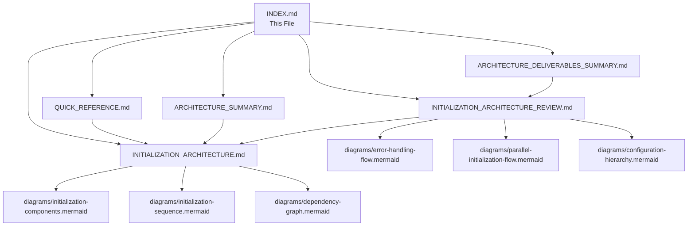

# NovaCron Architecture Documentation Index

**Last Updated:** 2025-11-10
**Version:** 2.0.0

---

## 🚀 Quick Navigation

### Latest Architecture (v2.0) - **START HERE**
- **Executive Summary:** [Architecture Design Summary](ARCHITECTURE_DESIGN_SUMMARY.md) - Complete overview of v2.0 design
- **Full Design Specification:** [Initialization Architecture Design v2.0](INITIALIZATION_ARCHITECTURE_DESIGN_V2.0.md) - 59KB comprehensive design
- **Quick Reference:** [Initialization Quick Reference](INITIALIZATION_QUICK_REFERENCE.md) - Fast lookup guide
- **Visual Diagrams:** [Dependency Graph](diagrams/initialization-dependency-graph.mermaid) | [Sequence Diagram](diagrams/initialization-sequence.mermaid)

### Previous Architecture (v1.0)
- **Original Specification:** [Initialization Architecture v1](INITIALIZATION_ARCHITECTURE.md)
- **Architecture Review:** [Implementation Analysis](INITIALIZATION_ARCHITECTURE_REVIEW.md)
- **Architecture Summary:** [High-Level Overview](ARCHITECTURE_SUMMARY.md)
- **Quick Reference v1:** [Quick Reference Guide](QUICK_REFERENCE.md)
- **Deliverables:** [Architecture Deliverables](ARCHITECTURE_DELIVERABLES_SUMMARY.md)

---

## 🆕 What's New in v2.0

### Major Enhancements
- ✅ **4-Phase Initialization:** Structured boot sequence with clear milestones
- ✅ **Parallel Execution:** 2.8-4.4x faster boot times through level-based parallelization
- ✅ **DWCP v3 Integration:** Full integration of 6 adaptive protocol components
- ✅ **15-25s Boot Time:** Optimized for production deployment
- ✅ **Comprehensive Error Handling:** Fail-fast for critical, graceful degradation for non-critical
- ✅ **Enhanced Observability:** Detailed metrics, logging, and tracing

### Key Documents
1. **[ARCHITECTURE_STATE_ASSESSMENT.md](ARCHITECTURE_STATE_ASSESSMENT.md)** ⭐ **NEW** - Complete architecture analysis (2025-11-10)
2. **[INITIALIZATION_REQUIREMENTS.md](INITIALIZATION_REQUIREMENTS.md)** ⭐ **NEW** - Requirements specification (2025-11-10)
3. **[ARCHITECTURE_DESIGN_SUMMARY.md](ARCHITECTURE_DESIGN_SUMMARY.md)** - Executive summary for stakeholders
4. **[INITIALIZATION_ARCHITECTURE_DESIGN_V2.0.md](INITIALIZATION_ARCHITECTURE_DESIGN_V2.0.md)** - Complete technical specification
5. **[INITIALIZATION_QUICK_REFERENCE.md](INITIALIZATION_QUICK_REFERENCE.md)** - Developer quick reference
6. **[diagrams/initialization-dependency-graph.mermaid](diagrams/initialization-dependency-graph.mermaid)** - Component dependency visualization
7. **[diagrams/initialization-sequence.mermaid](diagrams/initialization-sequence.mermaid)** - Initialization flow diagram

---

## Documentation Structure

### 1. Getting Started

**Quick Reference Guide**
- File: `QUICK_REFERENCE.md`
- Purpose: Fast lookup for developers
- Content: Cheat sheets, common tasks, troubleshooting
- Length: ~230 lines
- Audience: Developers, operators

**Architecture Summary**
- File: `ARCHITECTURE_SUMMARY.md`
- Purpose: High-level overview
- Content: Key components, implementation status
- Length: ~260 lines
- Audience: Product managers, architects

### 2. Architecture Specifications

**Initialization Architecture (Primary Specification)**
- File: `INITIALIZATION_ARCHITECTURE.md`
- Purpose: Complete architecture specification
- Content: Detailed design, interfaces, algorithms
- Length: ~970 lines
- Audience: Architects, senior developers

**Sections:**
- Executive Summary
- System Overview
- Initialization Phases (4 phases)
- Component Interfaces
- Dependency Management
- Error Handling Strategy
- Configuration Schema
- Performance Targets
- Architecture Decision Records
- Testing Strategy
- Implementation Roadmap

### 3. Architecture Analysis

**Architecture Review**
- File: `INITIALIZATION_ARCHITECTURE_REVIEW.md`
- Purpose: Implementation analysis and recommendations
- Content: Design alignment, optimization, production readiness
- Length: ~550 lines
- Audience: Architects, tech leads, DevOps

**Sections:**
- Implementation vs. Design Alignment
- Component Architecture Assessment
- Dependency Management Analysis
- Error Handling Strategy Review
- Configuration Architecture
- Performance Architecture
- Observability Architecture
- Advanced Patterns & Recommendations
- Security Architecture
- Testing Strategy
- Production Readiness Assessment
- Architecture Metrics

### 4. Project Deliverables

**Deliverables Summary**
- File: `ARCHITECTURE_DELIVERABLES_SUMMARY.md`
- Purpose: Track all architecture deliverables
- Content: Checklist, status, next steps
- Length: ~400 lines
- Audience: Project managers, stakeholders

---

## Architecture Diagrams

All diagrams are in Mermaid format for version control and easy editing.

### Component Architecture
- **File:** `diagrams/initialization-components.mermaid`
- **Shows:** Component hierarchy, relationships, layers
- **Layers:** Pre-Init, Core, Service, Application
- **Use Case:** Understanding system structure

### Initialization Sequence
- **File:** `diagrams/initialization-sequence.mermaid`
- **Shows:** Complete boot sequence with timing
- **Details:** Inter-component communication, health checks
- **Use Case:** Understanding initialization flow

### Dependency Graph
- **File:** `diagrams/dependency-graph.mermaid`
- **Shows:** 6-level dependency hierarchy
- **Details:** Initialization ordering, component relationships
- **Use Case:** Understanding dependencies

### Error Handling Flow
- **File:** `diagrams/error-handling-flow.mermaid`
- **Shows:** Error classification, retry logic, rollback
- **Details:** Decision tree, recovery paths
- **Use Case:** Understanding error handling

### Parallel Initialization Flow
- **File:** `diagrams/parallel-initialization-flow.mermaid`
- **Shows:** Level-based parallel initialization
- **Details:** Timing, concurrency, semaphores
- **Use Case:** Understanding parallelization

### Configuration Hierarchy
- **File:** `diagrams/configuration-hierarchy.mermaid`
- **Shows:** Configuration sources, precedence, validation
- **Details:** Override hierarchy, environment optimizations
- **Use Case:** Understanding configuration

---

## Implementation Files

### Core Initialization
- **Main:** `../../backend/core/initialization/init.go`
- **Orchestrator:** `../../backend/core/initialization/orchestrator/orchestrator.go`
- **Config:** `../../backend/core/initialization/config/loader.go`
- **DI Container:** `../../backend/core/initialization/di/container.go`
- **Recovery:** `../../backend/core/initialization/recovery/recovery.go`
- **Logger:** `../../backend/core/initialization/logger/logger.go`

### Configuration Examples
- **Datacenter:** `../../config/examples/novacron-datacenter.yaml`
- **Internet:** `../../config/examples/novacron-internet.yaml`

---

## Key Concepts

### Initialization Phases

1. **Pre-Init (0-5s):** Environment detection, configuration, logging
2. **Core Init (5-15s):** Security, database, cache, network, DWCP
3. **Service Init (15-25s):** Orchestration, API, monitoring, ML
4. **Post-Init (25-30s):** Health checks, service discovery, ready state

### Component Dependency Levels

```
Level 0: Foundation (Config, Logger, Environment)
Level 1: Security (no dependencies)
Level 2: Infrastructure (Database, Cache, Network) - Parallel
Level 3: Protocol (DWCP)
Level 4: Services (Orchestrator, API, ML) - Partial Parallel
Level 5: Monitoring (Metrics, Health) - Parallel
```

### Error Classification

- **Critical:** Halt initialization (Security, Database, Network)
- **Degraded:** Retry → Continue with warnings (Cache)
- **Warning:** Log → Continue (Monitoring, ML)

### Deployment Modes

- **Datacenter:** High-performance, RDMA, Raft consensus, 100ms sync
- **Internet:** Byzantine tolerance, PBFT, 5s sync
- **Hybrid:** Adaptive configuration, dynamic mode switching

---

## Architecture Decision Records (ADRs)

1. **ADR-001:** Component-Based Architecture
2. **ADR-002:** Phased Initialization
3. **ADR-003:** Fail-Fast for Critical Components
4. **ADR-004:** Graceful Degradation for Non-Critical
5. **ADR-005:** Parallel Initialization Strategy
6. **ADR-006:** Error Recovery Strategy
7. **ADR-007:** Configuration Override Hierarchy
8. **ADR-008:** Dependency Injection Container
9. **ADR-009:** Health Check Integration

See [Architecture Review](INITIALIZATION_ARCHITECTURE_REVIEW.md) for detailed ADRs.

---

## Common Tasks

### Reading the Documentation

**For Developers:**
1. Start with [Quick Reference](QUICK_REFERENCE.md)
2. Review [Initialization Sequence](diagrams/initialization-sequence.mermaid)
3. Check [Component Architecture](diagrams/initialization-components.mermaid)
4. Read [Initialization Architecture](INITIALIZATION_ARCHITECTURE.md) sections as needed

**For Architects:**
1. Read [Architecture Summary](ARCHITECTURE_SUMMARY.md)
2. Review [Architecture Review](INITIALIZATION_ARCHITECTURE_REVIEW.md)
3. Study [Dependency Graph](diagrams/dependency-graph.mermaid)
4. Review ADRs in [Architecture Review](INITIALIZATION_ARCHITECTURE_REVIEW.md)

**For Operators:**
1. Use [Quick Reference](QUICK_REFERENCE.md) for troubleshooting
2. Check [Error Handling Flow](diagrams/error-handling-flow.mermaid)
3. Review deployment mode configurations
4. Follow production checklist

**For Project Managers:**
1. Review [Deliverables Summary](ARCHITECTURE_DELIVERABLES_SUMMARY.md)
2. Check [Architecture Summary](ARCHITECTURE_SUMMARY.md)
3. Review implementation roadmap
4. Track production readiness status

---

## Viewing Diagrams

### Online (GitHub)
GitHub automatically renders Mermaid diagrams. Just open the `.mermaid` files.

### Local (VS Code)
Install the "Markdown Preview Mermaid Support" extension.

### Command Line
Use `mermaid-cli`:
```bash
npm install -g @mermaid-js/mermaid-cli
mmdc -i diagrams/initialization-sequence.mermaid -o sequence.png
```

### Online Editor
Visit [Mermaid Live Editor](https://mermaid.live/) and paste diagram content.

---

## Document Relationships



---

## Contribution Guidelines

### Updating Documentation

1. **Edit the appropriate document** based on the type of change
2. **Update diagrams** if component structure or flow changes
3. **Update this index** if adding new documents
4. **Update version numbers** in document headers
5. **Update "Last Updated" dates**

### Creating New Documents

1. Follow the existing naming convention
2. Add a header with version and date
3. Update this index with a link and description
4. Add to the appropriate section
5. Update document relationships diagram

### Reviewing Changes

1. Verify all internal links work
2. Check diagram rendering
3. Ensure consistency across documents
4. Validate technical accuracy
5. Update version numbers

---

## Version History

| Version | Date | Changes | Author |
|---------|------|---------|--------|
| 2.0.0 | 2025-11-10 | v2.0 Architecture Design: 4-phase init, parallel execution, DWCP v3 integration | System Architecture Designer |
| 1.0.0 | 2025-11-10 | Initial architecture documentation | System Architecture Designer |

---

## Support & Contact

- **Architecture Questions:** System Architecture Team
- **Implementation Questions:** Development Team
- **Issues:** GitHub Issues
- **Documentation Updates:** Pull Requests

---

## License

Copyright (c) 2025 NovaCron Project

---

**Index Version:** 2.0.0
**Last Updated:** 2025-11-10
**Maintained By:** System Architecture Designer

---

## 📊 Architecture v2.0 Summary

### Design Highlights
- **Boot Time:** 15-25 seconds (max 30s)
- **Performance Gain:** 2.8-4.4x faster than sequential
- **Phases:** 4 (Pre-Init, Core, Services, Post-Init)
- **Components:** 12+ core components
- **DWCP v3 Modules:** 6 (AMST, HDE, PBA, ASS, ACP, ITP)
- **Error Handling:** Fail-fast + Graceful degradation
- **Parallelization:** Level-based dependency grouping
- **Documentation:** 59KB comprehensive specification

### Implementation Status
- ✅ Design Complete
- ✅ Core Framework Implemented
- ⏳ Component Implementations Pending
- ⏳ DWCP v3 Integration Pending
- ⏳ Testing Suite Pending

### Next Steps
1. Implement core components (Security, Database, Network)
2. Implement DWCP v3 components (AMST, HDE, PBA, ASS, ACP, ITP)
3. Create comprehensive test suite
4. Performance validation
5. Production deployment
