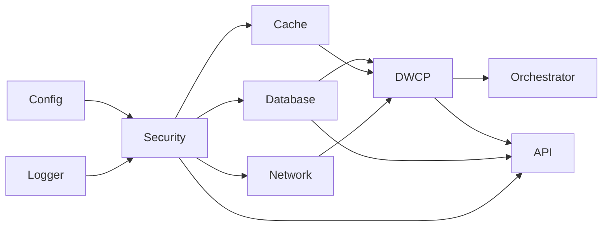

# NovaCron Initialization Architecture - Quick Reference

**Last Updated:** 2025-11-10
**Version:** 1.0.0

---

## Initialization Phases

```
Phase 1: Pre-Init     (0-5s)   → Config, Logger, Environment Detection
Phase 2: Core Init    (5-15s)  → Security, Database, Cache, Network, DWCP
Phase 3: Service Init (15-25s) → Orchestrator, API Server, Monitoring, ML
Phase 4: Post-Init    (25-30s) → Health Checks, Service Discovery, Ready State
```

**Total Boot Time:** 15-25 seconds (target), 30 seconds (max)

---

## Component Dependency Levels

```
Level 0: Foundation         → Config, Logger, Environment
Level 1: Security           → Security System (no dependencies)
Level 2: Infrastructure     → Database, Cache, Network (parallel)
Level 3: Protocol           → DWCP System
Level 4: Services           → Orchestrator, API Server, ML Engine (partial parallel)
Level 5: Monitoring         → Monitoring, Health Check (parallel)
```

---

## Initialization Order



---

## Error Handling Strategy

| Error Type | Action | Components |
|------------|--------|------------|
| **Critical** | Halt initialization | Security, Database, Network, API Server |
| **Degraded** | Retry → Continue with warnings | Cache |
| **Warning** | Log → Continue | Monitoring, ML Engine |

**Retry Policy:**
- Max Attempts: 3
- Initial Delay: 1 second
- Backoff: Exponential (2.0x)
- Total Retry Time: ~3 seconds

---

## Configuration Override Hierarchy

```
1. Environment Variables  (Highest Priority)
   ↓
2. Configuration File     (Medium Priority)
   ↓
3. Default Values         (Lowest Priority)
```

**Environment Variables:**
- `NOVACRON_NODE_ID`
- `NOVACRON_DATA_DIR`
- `NOVACRON_LOG_LEVEL`
- `NOVACRON_DWCP_MODE`
- `NOVACRON_LISTEN_ADDRESS`

---

## Deployment Modes

### Datacenter Mode
```yaml
- RDMA: Enabled
- Streams: 32-512
- Compression: High Performance
- Consensus: Raft
- Sync Interval: 100ms
```

### Internet Mode
```yaml
- RDMA: Disabled
- Streams: 16-256
- Compression: Balanced
- Consensus: PBFT (Byzantine Tolerance)
- Sync Interval: 5s
```

### Hybrid Mode
```yaml
- Adaptive Configuration
- Dynamic Mode Switching
- Peer Detection
```

---

## Key Interfaces

### Component Interface
```go
type Component interface {
    Name() string
    Dependencies() []string
    Initialize(ctx context.Context) error
    HealthCheck(ctx context.Context) error
    Shutdown(ctx context.Context) error
}
```

### Orchestrator Methods
```go
Register(component Component) error
Initialize(ctx context.Context) error
InitializeParallel(ctx context.Context, maxConcurrency int) error
Shutdown(ctx context.Context) error
HealthCheck(ctx context.Context) error
GetStatus() map[string]ComponentStatus
```

---

## File Locations

### Documentation
- Architecture: `/docs/architecture/INITIALIZATION_ARCHITECTURE.md`
- Review: `/docs/architecture/INITIALIZATION_ARCHITECTURE_REVIEW.md`
- Summary: `/docs/architecture/ARCHITECTURE_SUMMARY.md`
- Quick Reference: `/docs/architecture/QUICK_REFERENCE.md` (this file)

### Diagrams
- Components: `/docs/architecture/diagrams/initialization-components.mermaid`
- Sequence: `/docs/architecture/diagrams/initialization-sequence.mermaid`
- Dependencies: `/docs/architecture/diagrams/dependency-graph.mermaid`
- Error Handling: `/docs/architecture/diagrams/error-handling-flow.mermaid`
- Parallel Flow: `/docs/architecture/diagrams/parallel-initialization-flow.mermaid`
- Configuration: `/docs/architecture/diagrams/configuration-hierarchy.mermaid`

### Implementation
- Main: `/backend/core/initialization/init.go`
- Orchestrator: `/backend/core/initialization/orchestrator/orchestrator.go`
- Config Loader: `/backend/core/initialization/config/loader.go`
- DI Container: `/backend/core/initialization/di/container.go`
- Recovery: `/backend/core/initialization/recovery/recovery.go`
- Logger: `/backend/core/initialization/logger/logger.go`

### Configuration
- Datacenter: `/config/examples/novacron-datacenter.yaml`
- Internet: `/config/examples/novacron-internet.yaml`

---

## Common Tasks

### Initialize System
```go
import "novacron/backend/core/initialization"

initializer, err := initialization.NewInitializer("/path/to/config.yaml")
if err != nil {
    log.Fatal(err)
}

ctx := context.Background()
if err := initializer.Initialize(ctx); err != nil {
    log.Fatal(err)
}
```

### Shutdown System
```go
ctx := context.Background()
if err := initializer.Shutdown(ctx); err != nil {
    log.Error(err)
}
```

### Health Check
```go
ctx := context.Background()
if err := initializer.HealthCheck(ctx); err != nil {
    log.Error("Health check failed:", err)
}
```

### Get Status
```go
status := initializer.GetStatus()
fmt.Printf("Components: %v\n", status["components"])
fmt.Printf("Metrics: %v\n", status["metrics"])
```

---

## Performance Targets

| Metric | Target | Maximum |
|--------|--------|---------|
| Boot Time | 15-25s | 30s |
| Memory Usage | < 8 GB | 10 GB |
| CPU Usage (Init) | 40-80% | 100% |
| Initialization Success Rate | > 99.9% | - |

---

## Troubleshooting

### Initialization Hangs
- Check component dependencies for circular references
- Review logs for blocked components
- Verify network connectivity
- Check resource availability (CPU, memory, disk)

### Initialization Fails
- Review error classification (critical/degraded/warning)
- Check configuration validation errors
- Verify external service availability (database, cache)
- Review rollback logs

### Slow Initialization
- Enable debug logging
- Check parallel initialization settings
- Review component-level metrics
- Profile resource bottlenecks

### Health Check Failures
- Verify component initialization completed
- Check external dependencies
- Review component-specific health check logic
- Ensure network connectivity

---

## Monitoring Metrics

### Prometheus Metrics
```
novacron_init_duration_seconds{phase="pre_init|core_init|service_init|post_init"}
novacron_component_init_duration_seconds{component="..."}
novacron_component_init_success_total{component="..."}
novacron_component_init_failures_total{component="..."}
novacron_component_retry_attempts_total{component="..."}
novacron_init_total_duration_seconds
novacron_components_initialized_total
novacron_components_failed_total
```

### Logs
```json
{
  "timestamp": "2025-11-10T15:22:18Z",
  "level": "info",
  "component": "database",
  "phase": "core_init",
  "event": "initialization_complete",
  "duration_ms": 2340
}
```

---

## Architecture Decisions (ADRs)

- **ADR-001:** Component-Based Architecture
- **ADR-002:** Phased Initialization
- **ADR-003:** Fail-Fast for Critical Components
- **ADR-004:** Graceful Degradation for Non-Critical
- **ADR-005:** Parallel Initialization Strategy
- **ADR-006:** Error Recovery Strategy
- **ADR-007:** Configuration Override Hierarchy
- **ADR-008:** Dependency Injection Container
- **ADR-009:** Health Check Integration

---

## Production Checklist

**Pre-Deployment:**
- [ ] Configuration validated for target environment
- [ ] Secrets properly configured (Vault, env vars)
- [ ] Resource requirements verified (CPU, memory, disk)
- [ ] Network connectivity tested
- [ ] TLS certificates configured
- [ ] Database migrations tested
- [ ] Health check endpoints verified

**Deployment:**
- [ ] Blue-green or canary deployment planned
- [ ] Rollback procedure documented
- [ ] Monitoring dashboards configured
- [ ] Alerting rules configured
- [ ] Logging aggregation enabled
- [ ] Performance benchmarks established

**Post-Deployment:**
- [ ] Initialization metrics reviewed
- [ ] Health checks passing
- [ ] No degraded components
- [ ] Performance targets met
- [ ] No error spikes in logs
- [ ] Resource utilization within limits

---

## Next Steps

1. **Implementation:** Build component implementations based on interfaces
2. **Testing:** Create comprehensive test suite
3. **Integration:** Integrate with existing NovaCron components
4. **Optimization:** Profile and optimize boot time
5. **Documentation:** Create operational runbooks
6. **Production:** Deploy to staging → pilot → production

---

## Contact & Support

- **Architecture Team:** System Architecture Designer
- **Documentation:** `/docs/architecture/`
- **Issues:** GitHub Issues
- **Slack:** #novacron-architecture

---

**Quick Reference Version:** 1.0.0
**Last Updated:** 2025-11-10
