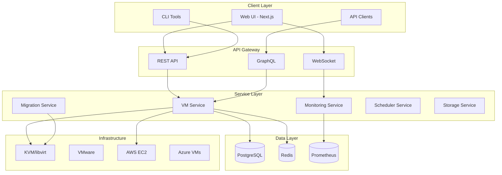
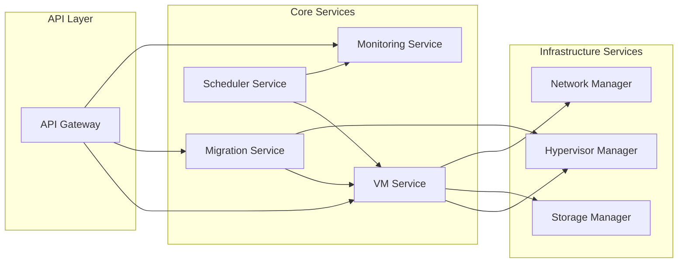
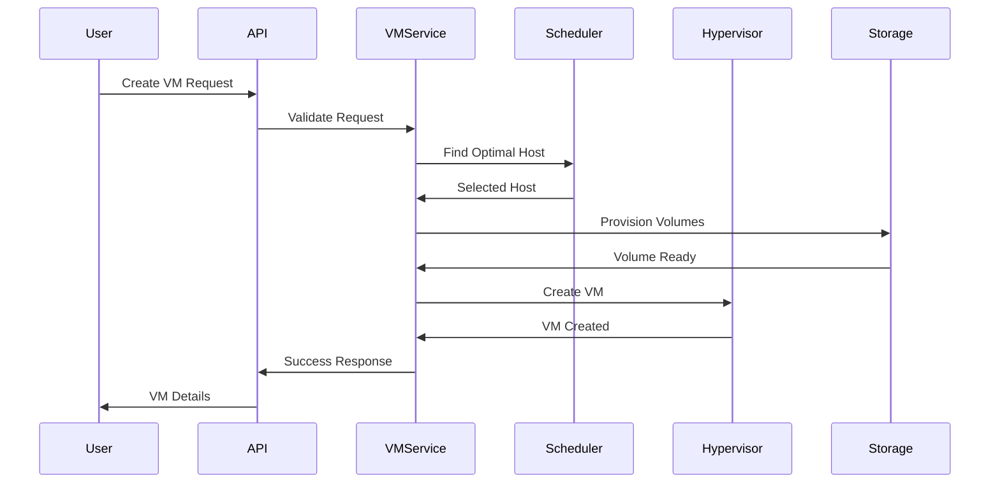

# NovaCron Architecture Document

## Introduction

This document outlines the overall project architecture for **NovaCron**, including backend systems, shared services, and non-UI specific concerns. Its primary goal is to serve as the guiding architectural blueprint for AI-driven development, ensuring consistency and adherence to chosen patterns and technologies.

**Relationship to Frontend Architecture:**
If the project includes a significant user interface, a separate Frontend Architecture Document will detail the frontend-specific design and MUST be used in conjunction with this document. Core technology stack choices documented herein (see "Tech Stack") are definitive for the entire project, including any frontend components.

### Starter Template or Existing Project
- This is an **existing project** with ~85% completion
- Already has established backend (Go) and frontend (Next.js) codebases
- Has defined project structure and architecture patterns in place
- Uses existing technologies: Go 1.21+, Next.js 13.5.6, PostgreSQL, Redis
- No starter template - custom implementation

### Change Log
| Date | Version | Description | Author |
|------|---------|-------------|--------|
| 2024 | 1.0 | Initial architecture documentation | BMad Master |

## High Level Architecture

### Technical Summary
NovaCron employs a **microservices architecture** with distributed consensus mechanisms for managing virtual machine orchestration across multiple hypervisors and cloud providers. The system consists of a Go-based backend with specialized services for VM management, monitoring, migration, and scheduling, coupled with a React/Next.js frontend for real-time visualization. Core architectural patterns include event-driven communication via WebSockets, CQRS for command/query separation, and a multi-layered security model. The architecture directly supports the platform's goals of providing enterprise-grade VM management with advanced features like live migration, predictive scaling, and multi-cloud orchestration.

### High Level Overview
1. **Architectural Style**: Microservices with event-driven communication
2. **Repository Structure**: Monorepo containing both backend and frontend
3. **Service Architecture**: Distributed services with specialized responsibilities:
   - VM Management Service (lifecycle, state)
   - Migration Service (live migration orchestration)
   - Monitoring Service (metrics, alerting)
   - Scheduler Service (placement, optimization)
   - Storage Service (volumes, snapshots)
4. **Primary Data Flow**: User → API Gateway → Service Layer → Hypervisor/Cloud APIs
5. **Key Decisions**: 
   - Go for performance-critical backend services
   - PostgreSQL for transactional data, Redis for caching/sessions
   - WebSocket for real-time updates
   - Distributed consensus (Raft) for HA

### High Level Project Diagram



### Architectural and Design Patterns
- **Event-Driven Architecture:** Using Redis Pub/Sub and WebSockets for real-time event propagation - *Rationale:* Enables responsive UI updates and decoupled service communication
- **CQRS Pattern:** Separate command and query models for VM operations - *Rationale:* Optimizes read/write paths and enables event sourcing for audit trails
- **Repository Pattern:** Abstract data access through repository interfaces - *Rationale:* Enables testing and potential database migration flexibility
- **Circuit Breaker Pattern:** For external API calls to hypervisors/clouds - *Rationale:* Prevents cascade failures when infrastructure endpoints are unavailable
- **Saga Pattern:** For distributed transactions during VM migration - *Rationale:* Maintains consistency across multiple services during complex operations

## Tech Stack

### Cloud Infrastructure
- **Provider:** Multi-cloud (AWS, Azure, GCP, On-premise)
- **Key Services:** EC2, Azure VMs, GCP Compute Engine, Private KVM clusters
- **Deployment Regions:** Configurable per deployment

### Technology Stack Table

| Category | Technology | Version | Purpose | Rationale |
|----------|-----------|---------|---------|-----------|
| **Backend Language** | Go | 1.21+ | Primary backend development | High performance, excellent concurrency, ideal for systems programming |
| **Frontend Language** | TypeScript | 5.3.3 | Frontend development | Type safety, better IDE support, reduces runtime errors |
| **Backend Framework** | Gorilla/mux | 1.8.0 | HTTP routing | Lightweight, performant, standard library compatible |
| **Frontend Framework** | Next.js | 13.5.6 | React framework | SSR/SSG support, excellent DX, production optimizations |
| **UI Library** | React | 18.2 | UI components | Industry standard, large ecosystem, team expertise |
| **Database** | PostgreSQL | 15.3 | Primary datastore | ACID compliance, complex queries, JSON support |
| **Cache** | Redis | 7.2 | Caching & pub/sub | High performance, versatile, excellent for real-time |
| **Message Queue** | NATS | 2.10 | Service communication | Lightweight, high performance, cloud native |
| **Container Runtime** | Docker | 24.0 | Containerization | Industry standard, excellent tooling |
| **Orchestration** | Kubernetes | 1.28 | Container orchestration | Production standard, scalability, self-healing |
| **Monitoring** | Prometheus | 2.47 | Metrics collection | Time-series DB, Kubernetes native, powerful queries |
| **Visualization** | Grafana | 10.2 | Metrics dashboards | Excellent Prometheus integration, customizable |
| **API Gateway** | Kong | 3.4 | API management | Rate limiting, auth, analytics built-in |
| **IaC** | Terraform | 1.6 | Infrastructure provisioning | Multi-cloud support, declarative, state management |

## Data Models

### VirtualMachine
**Purpose:** Core entity representing a virtual machine instance

**Key Attributes:**
- id: UUID - Unique identifier
- name: string - User-defined VM name
- status: enum - Current state (running, stopped, migrating, etc.)
- hypervisor_id: UUID - Associated hypervisor
- resources: JSON - CPU, memory, disk specifications
- metadata: JSON - User tags and labels

**Relationships:**
- Belongs to one Hypervisor
- Has many NetworkInterfaces
- Has many StorageVolumes

### Hypervisor
**Purpose:** Represents a physical host running VMs

**Key Attributes:**
- id: UUID - Unique identifier
- hostname: string - Network hostname
- type: enum - Hypervisor type (KVM, VMware, Hyper-V)
- capacity: JSON - Total resources
- available: JSON - Available resources
- status: enum - Health status

**Relationships:**
- Has many VirtualMachines
- Belongs to one Cluster

### Migration
**Purpose:** Tracks VM migration operations

**Key Attributes:**
- id: UUID - Unique identifier
- vm_id: UUID - VM being migrated
- source_host: UUID - Source hypervisor
- target_host: UUID - Destination hypervisor
- status: enum - Migration state
- started_at: timestamp - Start time
- completed_at: timestamp - Completion time

**Relationships:**
- References one VirtualMachine
- References source and target Hypervisors

## Components

### VM Management Service
**Responsibility:** Lifecycle management of virtual machines

**Key Interfaces:**
- CreateVM(spec) → VM
- UpdateVM(id, updates) → VM
- DeleteVM(id) → bool
- GetVMStatus(id) → Status

**Dependencies:** Hypervisor drivers, Storage service, Network service

**Technology Stack:** Go, libvirt bindings, gRPC

### Migration Service
**Responsibility:** Orchestrates live VM migrations

**Key Interfaces:**
- InitiateMigration(vmId, targetHost) → MigrationJob
- GetMigrationStatus(jobId) → Status
- CancelMigration(jobId) → bool

**Dependencies:** VM Service, Network Service, Storage Service

**Technology Stack:** Go, gRPC, state machine library

### Monitoring Service
**Responsibility:** Collects and aggregates metrics

**Key Interfaces:**
- CollectMetrics() → void
- GetMetrics(query) → TimeSeries
- CreateAlert(rule) → Alert

**Dependencies:** Prometheus, VM Service

**Technology Stack:** Go, Prometheus client, Time-series processing

### Component Diagram



## External APIs

### libvirt API
- **Purpose:** KVM hypervisor management
- **Documentation:** https://libvirt.org/html/index.html
- **Base URL(s):** qemu:///system (local), qemu+tcp://host/system (remote)
- **Authentication:** SSH keys, TLS certificates
- **Rate Limits:** None (local API)

**Key Endpoints Used:**
- `virDomainCreate()` - Create and start new VM
- `virDomainMigrate()` - Live migrate VM
- `virDomainGetInfo()` - Get VM status

**Integration Notes:** Use connection pooling, implement retry logic for transient failures

### AWS EC2 API
- **Purpose:** AWS cloud VM management
- **Documentation:** https://docs.aws.amazon.com/ec2/
- **Base URL(s):** https://ec2.{region}.amazonaws.com
- **Authentication:** AWS IAM credentials, STS tokens
- **Rate Limits:** Varies by operation (typically 100-2000 req/sec)

**Key Endpoints Used:**
- `RunInstances` - Launch new EC2 instances
- `DescribeInstances` - Get instance details
- `CreateSnapshot` - Create EBS snapshots

**Integration Notes:** Use AWS SDK, implement exponential backoff for rate limits

## Core Workflows



## REST API Specification

```yaml
openapi: 3.0.0
info:
  title: NovaCron VM Management API
  version: 1.0.0
  description: Enterprise VM orchestration platform
servers:
  - url: https://api.novacron.io/v1
    description: Production server

paths:
  /vms:
    get:
      summary: List all VMs
      parameters:
        - name: status
          in: query
          schema:
            type: string
            enum: [running, stopped, suspended]
      responses:
        200:
          description: List of VMs
          content:
            application/json:
              schema:
                type: array
                items:
                  $ref: '#/components/schemas/VM'
    
    post:
      summary: Create new VM
      requestBody:
        required: true
        content:
          application/json:
            schema:
              $ref: '#/components/schemas/VMSpec'
      responses:
        201:
          description: VM created
          content:
            application/json:
              schema:
                $ref: '#/components/schemas/VM'

components:
  schemas:
    VM:
      type: object
      properties:
        id:
          type: string
          format: uuid
        name:
          type: string
        status:
          type: string
        resources:
          type: object
          properties:
            cpu:
              type: integer
            memory:
              type: integer
            disk:
              type: integer
```

## Database Schema

```sql
-- PostgreSQL Schema for NovaCron

CREATE TABLE hypervisors (
    id UUID PRIMARY KEY DEFAULT gen_random_uuid(),
    hostname VARCHAR(255) UNIQUE NOT NULL,
    type VARCHAR(50) NOT NULL,
    capacity JSONB NOT NULL,
    available JSONB NOT NULL,
    status VARCHAR(50) DEFAULT 'active',
    created_at TIMESTAMP DEFAULT CURRENT_TIMESTAMP,
    updated_at TIMESTAMP DEFAULT CURRENT_TIMESTAMP
);

CREATE TABLE virtual_machines (
    id UUID PRIMARY KEY DEFAULT gen_random_uuid(),
    name VARCHAR(255) NOT NULL,
    status VARCHAR(50) NOT NULL,
    hypervisor_id UUID REFERENCES hypervisors(id),
    resources JSONB NOT NULL,
    metadata JSONB,
    created_at TIMESTAMP DEFAULT CURRENT_TIMESTAMP,
    updated_at TIMESTAMP DEFAULT CURRENT_TIMESTAMP
);

CREATE TABLE migrations (
    id UUID PRIMARY KEY DEFAULT gen_random_uuid(),
    vm_id UUID REFERENCES virtual_machines(id),
    source_host UUID REFERENCES hypervisors(id),
    target_host UUID REFERENCES hypervisors(id),
    status VARCHAR(50) NOT NULL,
    progress INTEGER DEFAULT 0,
    started_at TIMESTAMP DEFAULT CURRENT_TIMESTAMP,
    completed_at TIMESTAMP
);

-- Indexes
CREATE INDEX idx_vms_status ON virtual_machines(status);
CREATE INDEX idx_vms_hypervisor ON virtual_machines(hypervisor_id);
CREATE INDEX idx_migrations_vm ON migrations(vm_id);
CREATE INDEX idx_migrations_status ON migrations(status);
```

## Source Tree

```plaintext
novacron/
├── backend/
│   ├── cmd/
│   │   ├── api-server/
│   │   │   └── main.go
│   │   ├── migration-worker/
│   │   └── monitoring-agent/
│   ├── api/
│   │   ├── rest/
│   │   │   ├── handlers.go
│   │   │   └── routes.go
│   │   ├── graphql/
│   │   └── websocket/
│   ├── core/
│   │   ├── vm/
│   │   │   ├── manager.go
│   │   │   └── operations.go
│   │   ├── migration/
│   │   ├── monitoring/
│   │   ├── scheduler/
│   │   └── storage/
│   ├── pkg/
│   │   ├── hypervisor/
│   │   ├── database/
│   │   └── utils/
│   └── go.mod
├── frontend/
│   ├── src/
│   │   ├── app/
│   │   │   ├── dashboard/
│   │   │   ├── vms/
│   │   │   └── monitoring/
│   │   ├── components/
│   │   │   ├── ui/
│   │   │   └── charts/
│   │   └── lib/
│   │       ├── api/
│   │       └── hooks/
│   ├── package.json
│   └── next.config.js
├── infrastructure/
│   ├── terraform/
│   │   ├── modules/
│   │   └── environments/
│   └── kubernetes/
│       ├── base/
│       └── overlays/
├── scripts/
│   ├── deploy.sh
│   └── migrate.sh
└── docker-compose.yml
```

## Infrastructure and Deployment

### Infrastructure as Code
- **Tool:** Terraform 1.6
- **Location:** `infrastructure/terraform/`
- **Approach:** Modular, environment-specific configurations

### Deployment Strategy
- **Strategy:** Blue-Green deployment with canary releases
- **CI/CD Platform:** GitHub Actions / GitLab CI
- **Pipeline Configuration:** `.github/workflows/` or `.gitlab-ci.yml`

### Environments
- **Development:** Local development with Docker Compose
- **Staging:** Full production mirror with reduced capacity
- **Production:** Multi-region, HA deployment

### Environment Promotion Flow
```
dev → staging (automated) → production (manual approval)
```

### Rollback Strategy
- **Primary Method:** Blue-Green swap back to previous deployment
- **Trigger Conditions:** Failed health checks, error rate >5%, manual trigger
- **Recovery Time Objective:** <5 minutes

## Error Handling Strategy

### General Approach
- **Error Model:** Structured errors with error codes and context
- **Exception Hierarchy:** Custom error types per service
- **Error Propagation:** Wrap errors with context at each layer

### Logging Standards
- **Library:** zerolog (Go), winston (Node.js)
- **Format:** JSON structured logging
- **Levels:** trace, debug, info, warn, error, fatal
- **Required Context:**
  - Correlation ID: UUID per request
  - Service Context: service name, version, instance ID
  - User Context: user ID (hashed), tenant ID

### Error Handling Patterns

#### External API Errors
- **Retry Policy:** Exponential backoff with jitter, max 3 retries
- **Circuit Breaker:** Open after 5 failures in 1 minute
- **Timeout Configuration:** 30s default, configurable per endpoint
- **Error Translation:** Map external errors to internal error codes

#### Business Logic Errors
- **Custom Exceptions:** VMNotFoundError, InsufficientResourcesError, MigrationInProgressError
- **User-Facing Errors:** Sanitized messages without internal details
- **Error Codes:** NOVA-XXXX format (e.g., NOVA-1001: VM not found)

#### Data Consistency
- **Transaction Strategy:** Database transactions with rollback on error
- **Compensation Logic:** Saga pattern for distributed transactions
- **Idempotency:** Request IDs for idempotent operations

## Coding Standards

### Core Standards
- **Languages & Runtimes:** Go 1.21+, TypeScript 5.3+
- **Style & Linting:** golangci-lint (Go), ESLint + Prettier (TypeScript)
- **Test Organization:** `*_test.go` alongside source, `__tests__/` for frontend

### Naming Conventions
| Element | Convention | Example |
|---------|------------|---------|
| Go packages | lowercase | `vmmanager` |
| Go types | PascalCase | `VirtualMachine` |
| Go functions | PascalCase/camelCase | `CreateVM` / `getStatus` |
| TypeScript components | PascalCase | `VMDashboard` |
| TypeScript functions | camelCase | `fetchVMData` |

### Critical Rules
- **No Direct Database Access:** All database operations must go through repository layer
- **Use Logger:** Never use fmt.Println or console.log in production code
- **Error Wrapping:** Always wrap errors with context using fmt.Errorf or errors.Wrap
- **API Responses:** All API responses must use standardized response wrapper
- **Configuration:** Never hardcode configuration values, use environment variables

## Test Strategy and Standards

### Testing Philosophy
- **Approach:** Test-Driven Development (TDD) encouraged
- **Coverage Goals:** Minimum 80% code coverage
- **Test Pyramid:** 70% unit, 20% integration, 10% E2E

### Test Types and Organization

#### Unit Tests
- **Framework:** Go standard testing, Jest for TypeScript
- **File Convention:** `*_test.go`, `*.test.ts`
- **Location:** Same directory as source code
- **Mocking Library:** testify/mock (Go), jest mocks (TypeScript)
- **Coverage Requirement:** 80% minimum

**AI Agent Requirements:**
- Generate tests for all public methods
- Cover edge cases and error conditions
- Follow AAA pattern (Arrange, Act, Assert)
- Mock all external dependencies

#### Integration Tests
- **Scope:** Service boundaries, database operations
- **Location:** `tests/integration/`
- **Test Infrastructure:**
  - **Database:** Testcontainers PostgreSQL
  - **Redis:** Testcontainers Redis
  - **Message Queue:** Embedded NATS

#### End-to-End Tests
- **Framework:** Playwright
- **Scope:** Critical user journeys
- **Environment:** Dedicated test cluster
- **Test Data:** Seed data scripts

### Test Data Management
- **Strategy:** Test fixtures with factory pattern
- **Fixtures:** `tests/fixtures/`
- **Factories:** Test data builders for complex objects
- **Cleanup:** Automatic cleanup after test runs

### Continuous Testing
- **CI Integration:** Tests run on every PR
- **Performance Tests:** Nightly performance regression tests
- **Security Tests:** Weekly dependency scanning

## Security

### Input Validation
- **Validation Library:** go-playground/validator (Go), zod (TypeScript)
- **Validation Location:** API boundary before processing
- **Required Rules:**
  - All external inputs MUST be validated
  - Validation at API boundary before processing
  - Whitelist approach preferred over blacklist

### Authentication & Authorization
- **Auth Method:** JWT tokens with refresh tokens
- **Session Management:** Redis-backed sessions
- **Required Patterns:**
  - Role-Based Access Control (RBAC)
  - API key authentication for service-to-service

### Secrets Management
- **Development:** .env files (never committed)
- **Production:** HashiCorp Vault / AWS Secrets Manager
- **Code Requirements:**
  - NEVER hardcode secrets
  - Access via configuration service only
  - No secrets in logs or error messages

### API Security
- **Rate Limiting:** 100 req/min per user, configurable
- **CORS Policy:** Strict origin validation
- **Security Headers:** HSTS, CSP, X-Frame-Options
- **HTTPS Enforcement:** TLS 1.3 minimum

### Data Protection
- **Encryption at Rest:** AES-256 for sensitive data
- **Encryption in Transit:** TLS 1.3 for all connections
- **PII Handling:** Minimize collection, encrypt, audit access
- **Logging Restrictions:** No passwords, tokens, or PII in logs

### Dependency Security
- **Scanning Tool:** Dependabot, Snyk
- **Update Policy:** Security patches within 48 hours
- **Approval Process:** Security review for new dependencies

### Security Testing
- **SAST Tool:** SonarQube, gosec
- **DAST Tool:** OWASP ZAP
- **Penetration Testing:** Quarterly external assessment

## Next Steps

1. If project has UI components:
   - Use "Frontend Architecture Mode"
   - Provide this document as input

2. For all projects:
   - Review with Product Owner
   - Begin story implementation with Dev agent
   - Set up infrastructure with DevOps agent

3. Architect Prompt for Frontend:
   "Create detailed frontend architecture for NovaCron based on the backend architecture document. Focus on the Next.js/React implementation, component structure, state management with Jotai, real-time WebSocket integration, and dashboard visualization requirements."