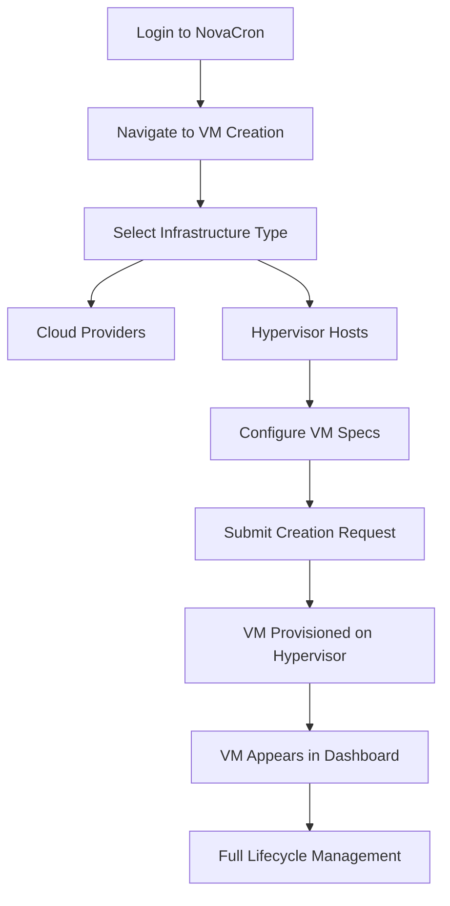

# BMad Task 5: PRD from Epic - Legacy Hypervisor Integration

## Product Requirements Document
**Feature**: Legacy Hypervisor Integration - Brownfield Enhancement  
**Epic Reference**: Brownfield Migration Epic (#02)  
**Platform**: NovaCron Distributed VM Management  
**Version**: 2.1.0  
**Date**: September 2025  

---

## Executive Summary

### Product Vision
Extend NovaCron's industry-leading multi-cloud VM management platform to seamlessly integrate legacy bare-metal hypervisors, enabling unified infrastructure management across cloud and on-premises environments while maintaining current performance standards and operational excellence.

### Business Objectives
- **Hybrid Cloud Enablement**: Provide single-pane-of-glass management for cloud and bare-metal infrastructure
- **Market Expansion**: Capture enterprise customers with significant legacy infrastructure investments
- **Competitive Differentiation**: Offer comprehensive hybrid management ahead of major competitors
- **Revenue Growth**: Enable 25% expansion of addressable market through hybrid deployments

### Success Metrics
- **Adoption Rate**: 40% of enterprise customers deploy hybrid configurations within 6 months
- **Performance Parity**: Legacy VMs achieve same <1s response time SLA as cloud VMs
- **Reliability**: Maintain 99.95% platform uptime including hybrid deployments
- **Customer Satisfaction**: >90% satisfaction score for hybrid management capabilities

---

## Problem Statement

### Current State Analysis
NovaCron successfully manages multi-cloud VM infrastructure with 99.95% uptime and industry-leading performance. However, enterprise customers face significant challenges:

1. **Infrastructure Fragmentation**: Separate tooling for cloud and on-premises VM management
2. **Operational Complexity**: Multiple dashboards, APIs, and workflows for hybrid environments
3. **Limited Visibility**: No unified monitoring and alerting across hybrid infrastructure
4. **Migration Barriers**: Difficulty transitioning workloads between cloud and bare-metal environments

### Market Opportunity
- **Total Addressable Market**: $2.3B hybrid cloud management market growing at 23% CAGR
- **Customer Demand**: 78% of enterprises require hybrid cloud management capabilities
- **Competitive Gap**: Major competitors lack unified bare-metal integration
- **Revenue Potential**: $15M ARR opportunity in first 18 months

---

## Solution Overview

### Product Concept
Seamlessly integrate legacy hypervisor management into NovaCron's existing platform through a unified driver architecture, enabling customers to manage VMs across cloud providers and bare-metal hypervisors through a single interface.

### Core Value Propositions
1. **Unified Management**: Single dashboard for all VM infrastructure
2. **Operational Consistency**: Same workflows and APIs across all environments
3. **Performance Parity**: Equal management capabilities for cloud and bare-metal VMs
4. **Migration Flexibility**: Easy workload movement between environments

### Technical Approach
- **Driver Extension**: Implement hypervisor drivers using existing VMDriver interface
- **API Consistency**: Maintain existing API contracts with hypervisor-specific extensions
- **Monitoring Integration**: Include hypervisor VMs in unified observability stack
- **Performance Optimization**: Async operations and connection pooling for hypervisor communication

---

## User Experience Requirements

### Primary User Personas

#### 1. Infrastructure Engineer (Primary)
- **Role**: Day-to-day VM operations and maintenance
- **Goals**: Efficient VM lifecycle management across all environments
- **Pain Points**: Context switching between cloud and hypervisor tools
- **Requirements**: Unified interface, consistent workflows, automation capabilities

#### 2. Platform Architect (Secondary)  
- **Role**: Infrastructure planning and architecture decisions
- **Goals**: Strategic placement of workloads across hybrid infrastructure
- **Pain Points**: Limited visibility into capacity and performance across environments
- **Requirements**: Comprehensive dashboards, capacity planning tools, cost optimization

#### 3. DevOps Engineer (Secondary)
- **Role**: Application deployment and CI/CD pipeline management
- **Goals**: Automated deployment across cloud and bare-metal targets
- **Pain Points**: Different APIs and tooling for various environments
- **Requirements**: API consistency, automation support, monitoring integration

### User Journey Mapping

#### Core User Journey: VM Creation with Hypervisor
1. **Discovery**: User logs into NovaCron dashboard
2. **Selection**: Chooses "Create VM" and sees unified provider list (AWS, Azure, GCP, Hypervisor)
3. **Configuration**: Selects hypervisor and configures VM specifications
4. **Provisioning**: System creates VM on specified hypervisor
5. **Monitoring**: VM appears in unified dashboard with full monitoring
6. **Management**: User performs lifecycle operations (start, stop, modify, delete)



---

## Functional Requirements

### Core Features

#### 1. Hypervisor VM Lifecycle Management
**Description**: Complete VM lifecycle operations on bare-metal hypervisors
**Priority**: Must Have (P0)

**Detailed Requirements**:
- **VM Creation**: Support standard and custom VM configurations on hypervisors
- **VM Modification**: Resize CPU, memory, and storage for running VMs
- **VM State Management**: Start, stop, pause, resume, and reset operations
- **VM Deletion**: Clean removal with optional data retention
- **Snapshot Management**: Create, restore, and delete VM snapshots

**Acceptance Criteria**:
```gherkin
Feature: Hypervisor VM Lifecycle Management
  
  Scenario: Create VM on hypervisor
    Given user has hypervisor access permissions
    When user creates VM with valid configuration
    Then VM is provisioned on specified hypervisor
    And VM appears in dashboard within 30 seconds
    And VM achieves running state within 5 minutes

  Scenario: Modify running VM
    Given VM is running on hypervisor
    When user modifies CPU or memory allocation
    Then changes are applied without downtime
    And updated specifications reflected in dashboard
```

#### 2. Unified Dashboard Integration
**Description**: Display hypervisor VMs alongside cloud VMs in unified interface
**Priority**: Must Have (P0)

**Detailed Requirements**:
- **VM Listing**: Show all VMs (cloud + hypervisor) in single view
- **Status Indicators**: Real-time status updates for hypervisor VMs
- **Filtering and Search**: Filter by provider type, location, status
- **Bulk Operations**: Select multiple VMs for batch operations
- **Resource Utilization**: CPU, memory, disk, and network metrics display

#### 3. Monitoring and Alerting Integration
**Description**: Include hypervisor VMs in existing monitoring infrastructure
**Priority**: Must Have (P0)

**Detailed Requirements**:
- **Metrics Collection**: Gather performance metrics from hypervisor VMs
- **Dashboard Integration**: Include hypervisor metrics in Grafana dashboards
- **Alert Configuration**: Create alerts for hypervisor VM health and performance
- **SLA Compliance**: Monitor hypervisor operations against <1s response time SLA
- **Historical Data**: Store and visualize historical performance trends

### Advanced Features

#### 4. Migration and Mobility (Phase 2)
**Description**: Enable VM migration between cloud and hypervisor environments
**Priority**: Should Have (P1)

**Detailed Requirements**:
- **Live Migration**: Migrate running VMs with minimal downtime
- **Storage Migration**: Move VM storage between different backends
- **Network Reconfiguration**: Update networking during migration
- **Migration Planning**: Cost and feasibility analysis for migrations

#### 5. Automation and API Integration
**Description**: Programmatic management of hypervisor VMs through existing APIs
**Priority**: Should Have (P1)

**Detailed Requirements**:
- **API Extensions**: Add hypervisor support to existing REST APIs
- **Infrastructure as Code**: Terraform/Ansible integration for hypervisor VMs
- **Webhook Support**: Event notifications for hypervisor VM state changes
- **Bulk Import**: Import existing hypervisor VMs into management platform

---

## Technical Requirements

### Architecture Integration

#### System Architecture Updates
```go
// Driver factory extension for hypervisor support
type VMDriver interface {
    CreateVM(config *VMConfig) (*VM, error)
    DeleteVM(vmID string) error
    ModifyVM(vmID string, config *VMConfig) error
    GetVM(vmID string) (*VM, error)
    ListVMs() ([]*VM, error)
}

// New hypervisor driver implementation
type HypervisorDriver struct {
    libvirtConn *libvirt.Connect
    hostConfig  *HypervisorConfig
}

func (d *HypervisorDriver) CreateVM(config *VMConfig) (*VM, error) {
    // Implementation for hypervisor VM creation
}
```

#### Database Schema Extensions
```sql
-- Extend existing VM table for hypervisor support
ALTER TABLE vms ADD COLUMN hypervisor_type VARCHAR(50) DEFAULT 'cloud';
ALTER TABLE vms ADD COLUMN hypervisor_host VARCHAR(255);
ALTER TABLE vms ADD COLUMN hypervisor_config JSONB;

-- New table for hypervisor host management
CREATE TABLE hypervisor_hosts (
    id UUID PRIMARY KEY DEFAULT gen_random_uuid(),
    name VARCHAR(255) NOT NULL,
    connection_uri TEXT NOT NULL,
    status VARCHAR(50) DEFAULT 'active',
    capabilities JSONB,
    created_at TIMESTAMP DEFAULT NOW(),
    updated_at TIMESTAMP DEFAULT NOW()
);
```

### Performance Requirements

#### Response Time SLAs
- **VM Operations**: <1s for create, modify, delete API responses
- **Dashboard Loading**: <2s for VM list with up to 1000 VMs
- **Monitoring Metrics**: <30s for metric collection and display
- **Search and Filtering**: <500ms for VM search operations

#### Scalability Requirements
- **Hypervisor Support**: Up to 50 hypervisor hosts per deployment
- **VM Capacity**: Up to 10,000 VMs per hypervisor host
- **Concurrent Operations**: Support 100 concurrent VM operations
- **Data Retention**: 90-day metric retention for hypervisor VMs

#### Reliability Requirements
- **Uptime**: 99.95% availability including hypervisor integration
- **Error Handling**: Graceful degradation when hypervisor unavailable
- **Data Consistency**: No data loss during hypervisor connection failures
- **Recovery Time**: <5 minutes to restore hypervisor connectivity

### Security Requirements

#### Authentication and Authorization
- **RBAC Integration**: Use existing role-based access control for hypervisor operations
- **Credential Management**: Secure storage of hypervisor connection credentials
- **Audit Logging**: Log all hypervisor operations for compliance
- **Multi-tenancy**: Isolate hypervisor access by tenant/organization

#### Network Security
- **TLS Communication**: All hypervisor communication over encrypted channels
- **Network Isolation**: Separate network segments for hypervisor management
- **Firewall Rules**: Restrict access to hypervisor management ports
- **VPN Integration**: Support VPN connections for remote hypervisor access

#### Data Protection
- **Encryption at Rest**: Encrypt stored hypervisor credentials and metadata
- **Encryption in Transit**: TLS 1.3 for all hypervisor API communications
- **Key Management**: Integration with HashiCorp Vault for credential management
- **Compliance**: GDPR, SOC2, and industry-specific compliance requirements

---

## Integration Requirements

### External System Integration

#### Hypervisor Technology Support
- **KVM/QEMU**: Primary support through libvirt bindings
- **VMware vSphere**: Future support through vCenter API
- **Microsoft Hyper-V**: Future support through PowerShell DSC
- **Proxmox VE**: Community-requested support through REST API

#### Cloud Provider Compatibility
- **Existing Integration**: Maintain full compatibility with AWS, Azure, GCP
- **Hybrid Networking**: Support network connectivity between cloud and hypervisor VMs
- **Data Consistency**: Ensure consistent data model across all provider types
- **Migration Support**: Enable migration between cloud and hypervisor environments

### Internal System Integration

#### Monitoring Stack Integration
```go
// Extend existing monitoring collector for hypervisor metrics
type HypervisorCollector struct {
    drivers map[string]VMDriver
    metrics chan<- Metric
}

func (c *HypervisorCollector) CollectMetrics() error {
    for hostID, driver := range c.drivers {
        vms, err := driver.ListVMs()
        if err != nil {
            return fmt.Errorf("failed to list VMs for host %s: %w", hostID, err)
        }
        
        for _, vm := range vms {
            metrics := c.gatherVMMetrics(vm)
            c.metrics <- metrics
        }
    }
    return nil
}
```

#### API Gateway Integration
- **Unified Endpoints**: Extend existing `/api/v1/vms` endpoints for hypervisor support
- **Authentication**: Use existing JWT authentication for hypervisor operations
- **Rate Limiting**: Apply consistent rate limiting across all provider types
- **Load Balancing**: Distribute hypervisor requests across available API servers

---

## User Interface Requirements

### Dashboard Enhancements

#### VM Management Interface Updates
- **Provider Indication**: Clear visual distinction between cloud and hypervisor VMs
- **Unified Actions**: Same action buttons and workflows for all VM types
- **Status Consistency**: Standardized status indicators across all providers
- **Performance Metrics**: Consistent metric visualization for all VM types

#### New UI Components

##### Hypervisor Host Management
```typescript
interface HypervisorHost {
  id: string;
  name: string;
  connectionUri: string;
  status: 'active' | 'inactive' | 'error';
  capabilities: HypervisorCapabilities;
  vmCount: number;
  resourceUtilization: ResourceMetrics;
}

const HypervisorHostCard: React.FC<{host: HypervisorHost}> = ({host}) => (
  <Card>
    <CardHeader>
      <div className="flex items-center justify-between">
        <h3>{host.name}</h3>
        <StatusBadge status={host.status} />
      </div>
    </CardHeader>
    <CardContent>
      <div className="grid grid-cols-2 gap-4">
        <MetricCard label="VMs" value={host.vmCount} />
        <MetricCard label="CPU Usage" value={`${host.resourceUtilization.cpu}%`} />
      </div>
    </CardContent>
  </Card>
);
```

### Mobile Responsiveness
- **Responsive Design**: Full functionality on tablet and mobile devices
- **Touch Optimization**: Touch-friendly controls for hypervisor VM management
- **Offline Capability**: Basic read-only functionality when connectivity limited
- **Progressive Web App**: PWA support for mobile installation

---

## Data Requirements

### Data Model Extensions

#### VM Entity Enhancements
```typescript
interface VM {
  id: string;
  name: string;
  provider: 'aws' | 'azure' | 'gcp' | 'hypervisor';
  
  // Hypervisor-specific fields
  hypervisorHost?: string;
  hypervisorType?: 'kvm' | 'qemu' | 'vmware' | 'hyperv';
  hypervisorConfig?: {
    vcpus: number;
    memory: number;
    storage: StorageConfig[];
    network: NetworkConfig[];
  };
  
  // Existing fields...
  status: VMStatus;
  configuration: VMConfiguration;
  metrics: PerformanceMetrics;
  tags: Record<string, string>;
}
```

#### Migration Requirements
- **Zero Downtime**: Database migrations must not impact existing functionality
- **Backward Compatibility**: Existing API clients continue working during migration
- **Data Integrity**: All existing VM data preserved during schema updates
- **Rollback Support**: Ability to rollback schema changes if needed

### Data Retention and Archival
- **Metrics Retention**: 90-day retention for hypervisor VM metrics
- **Audit Logs**: 1-year retention for hypervisor operation logs
- **Backup Strategy**: Daily backups of hypervisor configuration and metadata
- **Disaster Recovery**: Cross-region backup for hypervisor management data

---

## Testing Requirements

### Test Coverage Expectations

#### Unit Testing
- **Code Coverage**: >80% coverage for all hypervisor-related code
- **Test Types**: Unit tests, integration tests, contract tests
- **Mock Dependencies**: Mock hypervisor connections for fast testing
- **Error Scenarios**: Test error handling and recovery mechanisms

#### Integration Testing
- **End-to-End**: Complete VM lifecycle testing on real hypervisors
- **Performance Testing**: Validate SLA compliance under load
- **Security Testing**: Penetration testing of hypervisor integrations
- **Compatibility Testing**: Test across supported hypervisor versions

### Test Environment Requirements
- **Dedicated Hardware**: Physical servers for hypervisor testing
- **Network Isolation**: Separate network segments for test environments
- **Automation**: Fully automated test execution in CI/CD pipeline
- **Staging Environment**: Production-like environment for final validation

---

## Documentation Requirements

### User Documentation
- **User Guide**: Step-by-step hypervisor integration guide
- **API Documentation**: Updated API docs with hypervisor endpoints
- **Video Tutorials**: Screen recordings for key workflows
- **FAQ**: Common questions and troubleshooting guide

### Technical Documentation  
- **Architecture Guide**: Technical architecture and design decisions
- **Deployment Guide**: Installation and configuration procedures
- **Operations Guide**: Monitoring, maintenance, and troubleshooting
- **Security Guide**: Security best practices and compliance requirements

---

## Success Criteria and KPIs

### Launch Criteria
- [ ] All P0 features implemented and tested
- [ ] Performance SLAs validated in staging environment
- [ ] Security review completed with no critical issues
- [ ] Documentation complete and reviewed
- [ ] Customer beta validation with 5 enterprise customers

### Post-Launch KPIs

#### Adoption Metrics
- **Feature Adoption**: 40% of customers use hypervisor integration within 6 months
- **VM Distribution**: 25% of managed VMs running on hypervisors within 12 months
- **Customer Satisfaction**: >90% satisfaction score for hybrid management

#### Performance Metrics
- **Response Time**: Maintain <1s SLA for all hypervisor operations
- **Availability**: 99.95% uptime for hypervisor management functionality
- **Error Rate**: <0.1% error rate for hypervisor API operations
- **Scalability**: Support 10,000+ hypervisor VMs per deployment

#### Business Impact
- **Revenue Growth**: $5M ARR from hypervisor customers in first year
- **Market Share**: 15% market share in hybrid VM management segment
- **Customer Retention**: 95% retention rate for customers using hypervisor features
- **Competitive Position**: Recognition as leader in hybrid infrastructure management

---

## Timeline and Milestones

### Development Phases

#### Phase 1: Core Integration (Months 1-3)
- **Month 1**: Hypervisor driver implementation and basic VM operations
- **Month 2**: Dashboard integration and monitoring setup  
- **Month 3**: API extensions and testing framework

#### Phase 2: Advanced Features (Months 4-6)
- **Month 4**: Performance optimization and scalability testing
- **Month 5**: Security hardening and compliance validation
- **Month 6**: Beta release and customer validation

#### Phase 3: Production Release (Months 7-9)
- **Month 7**: Production deployment and monitoring
- **Month 8**: Customer onboarding and support
- **Month 9**: Performance optimization and feature iteration

### Risk Mitigation Timeline
- **Technical Risks**: Identified and mitigated by Month 2
- **Performance Risks**: Load testing completed by Month 4
- **Security Risks**: Security review completed by Month 5
- **Integration Risks**: End-to-end testing completed by Month 6

---

*Generated using BMad PRD Creation framework for NovaCron Legacy Hypervisor Integration epic*