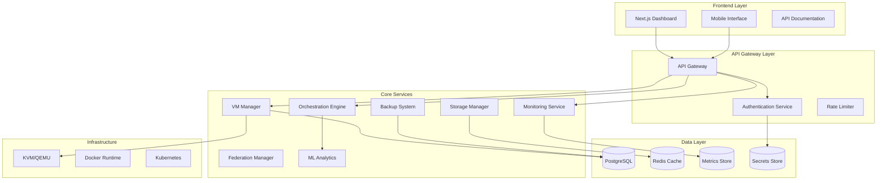

# NovaCron Technical Architecture Guide

## Architecture Overview

NovaCron employs a modern microservices architecture built on Go 1.23.0 backend services with a Next.js 13.5.6 frontend, designed for enterprise scalability, multi-tenancy, and high availability across hybrid cloud environments.

### System Architecture Diagram



## Core Components

### 1. Backend Services Architecture

#### 1.1 API Server (`backend/cmd/api-server/main.go`)

**Primary Functions:**
- Central HTTP server handling all REST API requests
- JWT-based authentication and authorization
- Request routing and middleware orchestration
- Database connection management and migration execution
- WebSocket support for real-time communication

**Technical Specifications:**
```go
type ServerConfig struct {
    APIPort         string        // Default: 8080
    WSPort          string        // Default: 8081
    ReadTimeout     time.Duration // 30s
    WriteTimeout    time.Duration // 30s
    IdleTimeout     time.Duration // 120s
    ShutdownTimeout time.Duration // 30s
}
```

**Key Features:**
- Graceful shutdown with connection draining
- CORS support for cross-origin requests
- Structured logging with configurable levels
- Health check endpoints with dependency verification
- Mock handlers for development environment

#### 1.2 VM Management Service (`backend/core/vm/`)

**Architecture Components:**
- **VM Manager**: Central coordination and lifecycle management
- **Driver Factory**: Pluggable hypervisor abstraction layer
- **Storage Manager**: Persistent volume and snapshot management
- **Network Manager**: Virtual network configuration and isolation
- **Scheduler**: Intelligent VM placement and resource allocation

**Driver Architecture:**
```go
type VMDriver interface {
    CreateVM(config VMConfig) (*VM, error)
    StartVM(vmID string) error
    StopVM(vmID string) error
    DeleteVM(vmID string) error
    MigrateVM(vmID, targetNode string) error
    GetVMMetrics(vmID string) (*VMMetrics, error)
}

type VMManager struct {
    drivers   map[VMType]VMDriver
    scheduler VMScheduler
    storage   StorageManager
    network   NetworkManager
}
```

**Supported Hypervisors:**
- **KVM/QEMU**: Primary hypervisor for Linux environments
- **VMware vSphere**: Enterprise virtualization platform
- **Hyper-V**: Microsoft Windows Server virtualization
- **Docker Containers**: Lightweight containerization support

#### 1.3 Orchestration Engine (`backend/core/orchestration/`)

**Core Functions:**
- **Event-Driven Architecture**: NATS messaging for component coordination
- **Placement Engine**: AI-powered VM placement optimization
- **Auto-scaling**: Dynamic resource allocation based on metrics
- **Migration Orchestrator**: Zero-downtime VM migration coordination
- **Policy Engine**: Rule-based automation and compliance enforcement

**Event Bus Implementation:**
```go
type EventBus interface {
    Publish(topic string, event Event) error
    Subscribe(topic string, handler EventHandler) error
    Unsubscribe(topic string, handler EventHandler) error
}

type OrchestrationEngine struct {
    eventBus        EventBus
    placementEngine PlacementEngine
    migrationEngine MigrationEngine
    policyEngine    PolicyEngine
}
```

**Machine Learning Integration:**
- Predictive scaling based on historical patterns
- Anomaly detection for performance monitoring
- Resource optimization recommendations
- Failure prediction and proactive mitigation

### 2. Frontend Architecture

#### 2.1 Next.js Application Structure

**Directory Organization:**
```
frontend/src/
├── app/                    # App Router (Next.js 13+)
│   ├── dashboard/         # Main management dashboard
│   ├── vms/              # VM management interface
│   ├── monitoring/       # System monitoring views
│   ├── settings/         # Configuration interface
│   └── auth/             # Authentication flows
├── components/           # Reusable UI components
│   ├── ui/              # Base UI components (shadcn/ui)
│   ├── charts/          # Data visualization components
│   └── forms/           # Form components with validation
├── lib/                 # Utility libraries and APIs
│   ├── api/            # API client and hooks
│   ├── auth/           # Authentication utilities
│   └── utils/          # Helper functions
└── types/              # TypeScript type definitions
```

**Key Technical Features:**
- **Server-Side Rendering**: SEO optimization and initial page load performance
- **Static Site Generation**: Performance optimization for static content
- **Real-time Updates**: WebSocket integration for live data streaming
- **Progressive Web App**: Mobile-responsive with offline capabilities
- **Type Safety**: Full TypeScript implementation with strict type checking

#### 2.2 State Management Architecture

**Technology Stack:**
- **Jotai**: Atomic state management for component-level state
- **React Query**: Server state management with caching and synchronization
- **React Hook Form**: Form state management with validation
- **Context API**: Global application state for authentication and themes

**Data Flow Pattern:**
```typescript
interface AppState {
  auth: AuthState;           // User authentication and session
  ui: UIState;              // Theme, layout, and UI preferences
  realtime: RealtimeState;  // WebSocket connection and live data
  cache: CacheState;        // API response caching and invalidation
}
```

### 3. Data Architecture

#### 3.1 Database Schema Design

**Core Tables:**
```sql
-- Users and Authentication
CREATE TABLE users (
    id SERIAL PRIMARY KEY,
    username VARCHAR(255) UNIQUE NOT NULL,
    email VARCHAR(255) UNIQUE NOT NULL,
    password_hash VARCHAR(255) NOT NULL,
    role VARCHAR(50) DEFAULT 'user',
    tenant_id VARCHAR(255) DEFAULT 'default',
    created_at TIMESTAMP DEFAULT CURRENT_TIMESTAMP,
    updated_at TIMESTAMP DEFAULT CURRENT_TIMESTAMP
);

-- Virtual Machine Management
CREATE TABLE vms (
    id VARCHAR(255) PRIMARY KEY,
    name VARCHAR(255) NOT NULL,
    state VARCHAR(50) NOT NULL,
    node_id VARCHAR(255),
    owner_id INTEGER REFERENCES users(id),
    tenant_id VARCHAR(255) DEFAULT 'default',
    config JSONB,
    created_at TIMESTAMP DEFAULT CURRENT_TIMESTAMP,
    updated_at TIMESTAMP DEFAULT CURRENT_TIMESTAMP
);

-- Performance Metrics
CREATE TABLE vm_metrics (
    id SERIAL PRIMARY KEY,
    vm_id VARCHAR(255) REFERENCES vms(id),
    cpu_usage FLOAT,
    memory_usage FLOAT,
    network_sent BIGINT,
    network_recv BIGINT,
    timestamp TIMESTAMP DEFAULT CURRENT_TIMESTAMP
);
```

**Advanced Features:**
- **Row-Level Security**: Multi-tenant data isolation
- **JSONB Configuration**: Flexible VM configuration storage
- **Time-Series Optimization**: Partitioned metrics tables
- **Audit Logging**: Complete change tracking and compliance

#### 3.2 Caching Strategy

**Multi-Layer Caching:**
1. **Application Cache**: In-memory caching with Go sync.Map
2. **Redis Cache**: Distributed caching for session data and frequently accessed objects
3. **Database Query Cache**: PostgreSQL query result caching
4. **Frontend Cache**: Browser caching with service worker support

**Cache Invalidation Strategy:**
```go
type CacheManager struct {
    redis      redis.Client
    localCache sync.Map
    ttl        map[string]time.Duration
}

func (cm *CacheManager) InvalidatePattern(pattern string) error {
    // Implement cache invalidation by pattern
    // Used for tenant-specific or resource-specific invalidation
}
```

### 4. Security Architecture

#### 4.1 Authentication & Authorization

**JWT Implementation:**
```go
type JWTClaims struct {
    UserID   string   `json:"user_id"`
    Username string   `json:"username"`
    Email    string   `json:"email"`
    Role     string   `json:"role"`
    TenantID string   `json:"tenant_id"`
    Permissions []string `json:"permissions"`
    jwt.RegisteredClaims
}
```

**Security Features:**
- **Multi-factor Authentication**: TOTP and SMS support
- **Role-Based Access Control**: Hierarchical permission system
- **API Key Management**: Service-to-service authentication
- **Session Management**: Secure session handling with automatic expiration

#### 4.2 Network Security

**Security Layers:**
1. **TLS Termination**: All communications encrypted in transit
2. **API Gateway**: Rate limiting and request validation
3. **VPC Isolation**: Network segmentation for multi-tenancy
4. **Firewall Rules**: Automated security group management

**Zero-Trust Implementation:**
```go
type SecurityPolicy struct {
    TenantID    string
    ResourceID  string
    Actions     []string
    Conditions  map[string]interface{}
    Effect      PolicyEffect // Allow/Deny
}
```

### 5. Monitoring & Observability

#### 5.1 Metrics Collection

**Prometheus Integration:**
```go
var (
    requestDuration = prometheus.NewHistogramVec(
        prometheus.HistogramOpts{
            Name: "http_request_duration_seconds",
            Help: "HTTP request duration in seconds",
        },
        []string{"method", "endpoint", "status"},
    )
    
    vmOperations = prometheus.NewCounterVec(
        prometheus.CounterOpts{
            Name: "vm_operations_total",
            Help: "Total number of VM operations",
        },
        []string{"operation", "status", "tenant"},
    )
)
```

**Key Metrics:**
- **System Metrics**: CPU, memory, disk, network utilization
- **Application Metrics**: Request rate, latency, error rate
- **Business Metrics**: VM lifecycle events, tenant usage, cost allocation
- **Custom Metrics**: Domain-specific performance indicators

#### 5.2 Distributed Tracing

**OpenTelemetry Implementation:**
- **Span Creation**: Automatic instrumentation for HTTP requests and database queries
- **Context Propagation**: Request tracing across service boundaries
- **Error Correlation**: Link errors to specific request traces
- **Performance Analysis**: Identify bottlenecks and optimization opportunities

### 6. Deployment Architecture

#### 6.1 Containerization

**Docker Configuration:**
```dockerfile
# Multi-stage build for optimized production images
FROM golang:1.23-alpine AS builder
WORKDIR /app
COPY . .
RUN go mod download && go build -o novacron-api

FROM alpine:3.18
RUN apk --no-cache add ca-certificates
COPY --from=builder /app/novacron-api /usr/local/bin/
EXPOSE 8080
CMD ["novacron-api"]
```

#### 6.2 Kubernetes Deployment

**Resource Management:**
```yaml
apiVersion: apps/v1
kind: Deployment
metadata:
  name: novacron-api
spec:
  replicas: 3
  template:
    spec:
      containers:
      - name: api
        image: novacron/api:latest
        resources:
          requests:
            memory: "256Mi"
            cpu: "250m"
          limits:
            memory: "512Mi"
            cpu: "500m"
```

**High Availability Features:**
- **Pod Anti-affinity**: Distribute replicas across nodes
- **Health Checks**: Readiness and liveness probes
- **Rolling Updates**: Zero-downtime deployments
- **Horizontal Pod Autoscaling**: Dynamic scaling based on metrics

### 7. Performance Optimization

#### 7.1 Database Optimization

**Indexing Strategy:**
```sql
-- Performance-critical indexes
CREATE INDEX CONCURRENTLY idx_vm_metrics_vm_id_timestamp 
ON vm_metrics(vm_id, timestamp);

CREATE INDEX CONCURRENTLY idx_vms_tenant_state 
ON vms(tenant_id, state) WHERE state != 'deleted';
```

**Query Optimization:**
- **Prepared Statements**: Reduce parsing overhead
- **Connection Pooling**: Efficient database connection management
- **Read Replicas**: Scale read operations across multiple database instances
- **Partitioning**: Time-based partitioning for metrics tables

#### 7.2 Application Performance

**Go Performance Features:**
- **Goroutine Pool**: Controlled concurrency for request handling
- **Memory Management**: Efficient memory allocation and garbage collection tuning
- **CPU Profiling**: Continuous performance monitoring and optimization
- **Caching**: Multi-level caching strategy for frequently accessed data

### 8. Scalability Design

#### 8.1 Horizontal Scaling

**Microservices Decomposition:**
```go
type ServiceRegistry struct {
    services map[string]ServiceConfig
    discovery ServiceDiscovery
    loadbalancer LoadBalancer
}

type ServiceConfig struct {
    Name        string
    Instances   []ServiceInstance
    HealthCheck HealthCheckConfig
    Scaling     ScalingConfig
}
```

#### 8.2 Data Scaling

**Sharding Strategy:**
- **Tenant-based Sharding**: Isolate tenant data across database instances
- **Geographic Sharding**: Distribute data based on geographic regions
- **Feature Sharding**: Separate services based on functional domains
- **Read Scaling**: Implement read replicas with automated failover

### 9. Integration Architecture

#### 9.1 Cloud Provider Integration

**Multi-cloud Abstraction:**
```go
type CloudProvider interface {
    CreateInstance(config InstanceConfig) (*Instance, error)
    DeleteInstance(instanceID string) error
    ListInstances(filter InstanceFilter) ([]*Instance, error)
    GetInstanceMetrics(instanceID string) (*InstanceMetrics, error)
}

type CloudManager struct {
    providers map[CloudType]CloudProvider
    resolver  CloudResolver
}
```

**Supported Platforms:**
- **AWS**: EC2, VPC, EBS, CloudWatch integration
- **Azure**: Virtual Machines, Virtual Networks, Storage integration
- **Google Cloud**: Compute Engine, VPC, Persistent Disks integration
- **On-premises**: KVM, VMware vSphere, Hyper-V integration

#### 9.2 API Design

**RESTful API Standards:**
- **OpenAPI 3.0**: Complete API specification and documentation
- **Versioning**: Backward-compatible API evolution
- **Pagination**: Cursor-based pagination for large datasets
- **Rate Limiting**: Per-tenant and per-user rate limiting
- **Error Handling**: Consistent error response format

### 10. Development & Testing

#### 10.1 Testing Strategy

**Test Pyramid Implementation:**
```go
// Unit Tests
func TestVMManager_CreateVM(t *testing.T) {
    manager := NewVMManager(mockConfig)
    vm, err := manager.CreateVM(testConfig)
    assert.NoError(t, err)
    assert.Equal(t, "running", vm.State)
}

// Integration Tests
func TestVMLifecycle_EndToEnd(t *testing.T) {
    // Test complete VM lifecycle
}
```

**Testing Levels:**
- **Unit Tests**: Component-level testing with 90%+ code coverage
- **Integration Tests**: Service-to-service communication testing
- **End-to-End Tests**: Complete user workflow validation
- **Performance Tests**: Load testing and benchmark validation
- **Security Tests**: Vulnerability scanning and penetration testing

#### 10.2 Development Workflow

**CI/CD Pipeline:**
1. **Code Quality**: Automated linting, formatting, and security scanning
2. **Testing**: Parallel execution of unit, integration, and e2e tests
3. **Building**: Multi-architecture container image building
4. **Security**: Vulnerability scanning and compliance checking
5. **Deployment**: Automated deployment to staging and production environments

## Conclusion

The NovaCron technical architecture provides a robust, scalable, and secure foundation for enterprise virtual machine management. The microservices design enables independent scaling and development, while the multi-cloud abstraction ensures vendor independence and flexibility.

Key architectural strengths include:
- **Modern Technology Stack**: Go and Next.js provide performance and developer experience
- **Cloud-Native Design**: Kubernetes-native deployment with container orchestration
- **Security-First Approach**: Zero-trust architecture with comprehensive audit capabilities
- **Observability**: Complete monitoring and tracing for operational excellence
- **Scalability**: Horizontal scaling capabilities for enterprise workloads

---

**Document Classification**: Technical - Internal Use  
**Last Updated**: September 2, 2025  
**Version**: 1.0  
**Next Review**: October 15, 2025