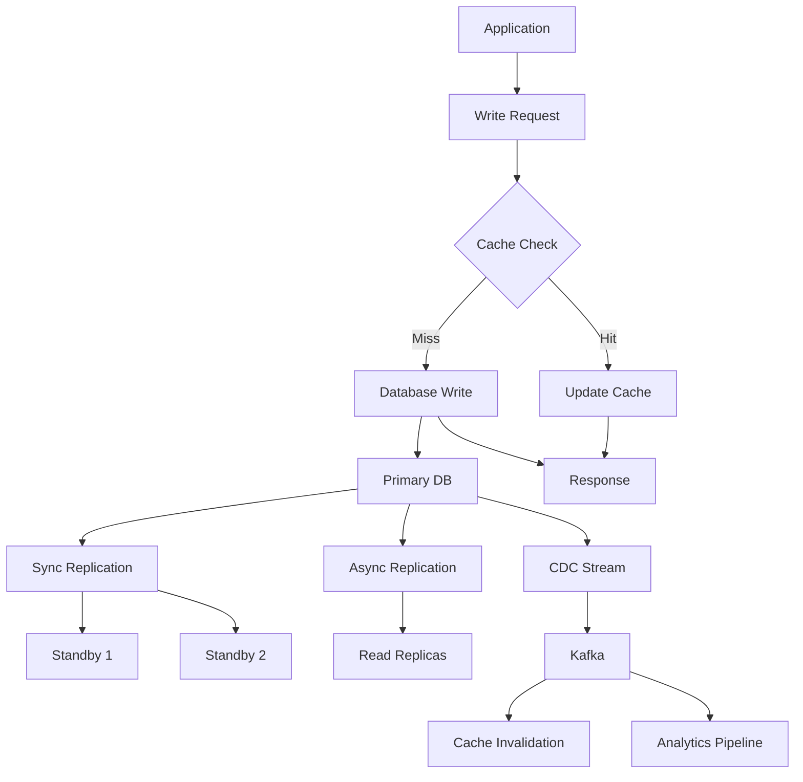
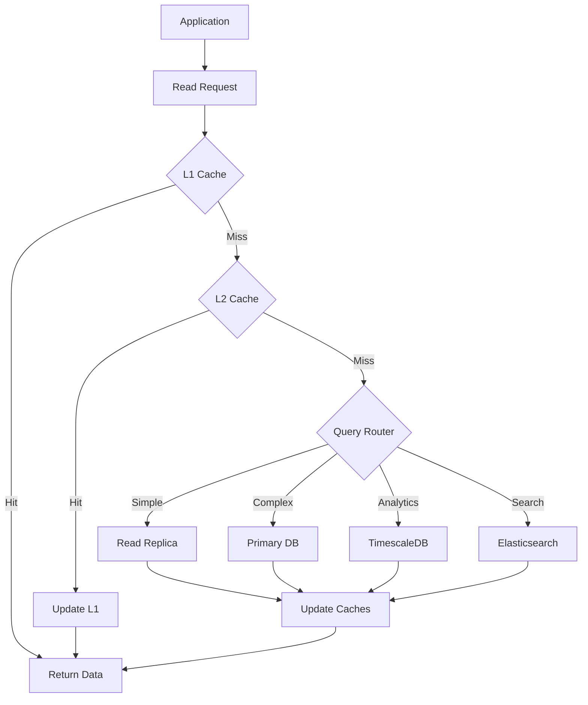

# NovaCron Database Architecture Design Document

## Executive Summary

This document presents a comprehensive redesign of the NovaCron database architecture, focusing on achieving:
- **Performance**: Sub-millisecond query latency for critical operations
- **Scalability**: Support for millions of operations per second
- **Availability**: 99.99% uptime with automatic failover
- **Consistency**: ACID compliance with distributed consensus
- **Efficiency**: Optimized resource utilization and cost

## 1. Current State Analysis

### Identified Bottlenecks

1. **Time-Series Data Performance**
   - VM and node metrics tables growing unboundedly
   - Inefficient indexing for time-range queries
   - No automatic data retention/archival

2. **Lack of Horizontal Scaling**
   - Single PostgreSQL instance limitation
   - No sharding strategy for tenant isolation
   - Limited connection pooling

3. **Missing Caching Layer**
   - Direct database queries for all operations
   - No query result caching
   - Repeated expensive aggregations

4. **Suboptimal Schema Design**
   - JSONB overuse for structured data
   - Missing specialized indexes
   - Inefficient foreign key relationships

## 2. Proposed Architecture

### 2.1 Multi-Tier Data Architecture

```
┌─────────────────────────────────────────────────────────────┐
│                     Application Layer                        │
├─────────────────────────────────────────────────────────────┤
│                   API Gateway & Load Balancer                │
├─────────────────────────────────────────────────────────────┤
│              Distributed Cache Layer (L1)                    │
│         Redis Cluster (Hot Data & Session Cache)             │
├─────────────────────────────────────────────────────────────┤
│              Application Cache Layer (L2)                    │
│           Memcached (Query Results & Objects)                │
├─────────────────────────────────────────────────────────────┤
│                  Database Proxy Layer                        │
│              PgBouncer / ProxySQL Cluster                    │
├─────────────────────────────────────────────────────────────┤
│                Primary Database Cluster                      │
│  ┌──────────────┐  ┌──────────────┐  ┌──────────────┐     │
│  │ PostgreSQL   │  │ PostgreSQL   │  │ PostgreSQL   │       │
│  │ Primary      │──│ Sync Standby │──│ Async Standby│       │
│  └──────────────┘  └──────────────┘  └──────────────┘     │
├─────────────────────────────────────────────────────────────┤
│              Specialized Data Stores                         │
│  ┌──────────────┐  ┌──────────────┐  ┌──────────────┐     │
│  │ TimescaleDB  │  │ MongoDB      │  │ Elasticsearch│       │
│  │ (Metrics)    │  │ (Documents)  │  │ (Search)     │       │
│  └──────────────┘  └──────────────┘  └──────────────┘     │
├─────────────────────────────────────────────────────────────┤
│                  Distributed State Store                     │
│                    etcd Cluster (3+ nodes)                   │
├─────────────────────────────────────────────────────────────┤
│                    Message Queue Layer                       │
│               Apache Kafka / NATS Streaming                  │
└─────────────────────────────────────────────────────────────┘
```

### 2.2 Database Clustering Strategy

#### Primary PostgreSQL Cluster
- **Architecture**: 1 Primary + 2 Sync Standbys + N Async Read Replicas
- **Replication**: Streaming replication with synchronous commit
- **Failover**: Automatic failover using Patroni + etcd
- **Load Balancing**: Read queries distributed to replicas

#### Sharding Strategy
```sql
-- Shard by tenant_id for multi-tenancy
-- Hash-based sharding for even distribution
SHARD_KEY = HASH(tenant_id) % NUM_SHARDS

-- Shard mapping table
CREATE TABLE shard_map (
    shard_id INTEGER PRIMARY KEY,
    shard_name VARCHAR(100),
    connection_string TEXT,
    weight INTEGER DEFAULT 100,
    status VARCHAR(20) DEFAULT 'active'
);
```

## 3. Optimized Schema Design

### 3.1 Core Tables Optimization

```sql
-- Optimized VMs table with proper normalization
CREATE TABLE vms_optimized (
    id UUID PRIMARY KEY DEFAULT gen_random_uuid(),
    tenant_id VARCHAR(100) NOT NULL,
    name VARCHAR(255) NOT NULL,
    state_id SMALLINT NOT NULL REFERENCES vm_states(id),
    node_id UUID REFERENCES compute_nodes(id),
    owner_id UUID NOT NULL REFERENCES users(id),
    
    -- Resource allocation (normalized)
    resource_profile_id INTEGER REFERENCES resource_profiles(id),
    
    -- Timestamps with proper indexing
    created_at TIMESTAMPTZ NOT NULL DEFAULT NOW(),
    updated_at TIMESTAMPTZ NOT NULL DEFAULT NOW(),
    deleted_at TIMESTAMPTZ, -- Soft delete support
    
    -- Partitioning key
    partition_key INTEGER GENERATED ALWAYS AS (EXTRACT(YEAR FROM created_at) * 100 + EXTRACT(MONTH FROM created_at)) STORED
) PARTITION BY RANGE (partition_key);

-- Create monthly partitions
CREATE TABLE vms_optimized_2024_01 PARTITION OF vms_optimized
    FOR VALUES FROM (202401) TO (202402);

-- Covering index for common queries
CREATE INDEX idx_vms_tenant_state_covering 
    ON vms_optimized (tenant_id, state_id) 
    INCLUDE (name, node_id, owner_id, created_at);
```

### 3.2 Time-Series Data Optimization

```sql
-- Use TimescaleDB hypertables for metrics
CREATE TABLE vm_metrics_hypertable (
    time TIMESTAMPTZ NOT NULL,
    vm_id UUID NOT NULL,
    cpu_usage_percent REAL,
    memory_usage_mb INTEGER,
    disk_io_bytes BIGINT,
    network_bytes BIGINT,
    
    -- Compression-friendly column ordering
    PRIMARY KEY (vm_id, time)
);

-- Convert to hypertable with 1-day chunks
SELECT create_hypertable('vm_metrics_hypertable', 'time', 
    chunk_time_interval => INTERVAL '1 day');

-- Enable compression after 7 days
ALTER TABLE vm_metrics_hypertable 
    SET (timescaledb.compress,
         timescaledb.compress_segmentby = 'vm_id',
         timescaledb.compress_orderby = 'time DESC');

-- Create compression policy
SELECT add_compression_policy('vm_metrics_hypertable', 
    INTERVAL '7 days');

-- Create retention policy (keep 90 days)
SELECT add_retention_policy('vm_metrics_hypertable', 
    INTERVAL '90 days');

-- Continuous aggregates for common queries
CREATE MATERIALIZED VIEW vm_metrics_hourly
WITH (timescaledb.continuous) AS
SELECT 
    time_bucket('1 hour', time) AS hour,
    vm_id,
    AVG(cpu_usage_percent) AS avg_cpu,
    MAX(cpu_usage_percent) AS max_cpu,
    AVG(memory_usage_mb) AS avg_memory,
    SUM(network_bytes) AS total_network
FROM vm_metrics_hypertable
GROUP BY hour, vm_id
WITH NO DATA;

-- Refresh policy for continuous aggregate
SELECT add_continuous_aggregate_policy('vm_metrics_hourly',
    start_offset => INTERVAL '3 hours',
    end_offset => INTERVAL '1 hour',
    schedule_interval => INTERVAL '1 hour');
```

### 3.3 Normalized Resource Profiles

```sql
-- Resource profile templates for common VM configurations
CREATE TABLE resource_profiles (
    id SERIAL PRIMARY KEY,
    name VARCHAR(100) UNIQUE NOT NULL,
    cpu_cores SMALLINT NOT NULL,
    memory_mb INTEGER NOT NULL,
    disk_gb INTEGER NOT NULL,
    network_mbps INTEGER,
    iops_limit INTEGER,
    category VARCHAR(50), -- 'general', 'compute', 'memory', 'storage'
    
    CONSTRAINT valid_resources CHECK (
        cpu_cores > 0 AND memory_mb > 0 AND disk_gb > 0
    )
);

-- Prepopulate with standard configurations
INSERT INTO resource_profiles (name, cpu_cores, memory_mb, disk_gb, network_mbps, category) VALUES
    ('t2.micro', 1, 1024, 8, 100, 'general'),
    ('t2.small', 1, 2048, 20, 100, 'general'),
    ('t2.medium', 2, 4096, 40, 100, 'general'),
    ('m5.large', 2, 8192, 80, 1000, 'general'),
    ('m5.xlarge', 4, 16384, 160, 1000, 'general'),
    ('c5.large', 2, 4096, 40, 1000, 'compute'),
    ('c5.xlarge', 4, 8192, 80, 1000, 'compute'),
    ('r5.large', 2, 16384, 80, 1000, 'memory'),
    ('r5.xlarge', 4, 32768, 160, 1000, 'memory');
```

## 4. Caching Strategy

### 4.1 Redis Cluster Configuration

```yaml
# Redis Cluster for L1 Cache
redis_cluster:
  topology: 
    masters: 3
    replicas_per_master: 1
    
  memory_allocation:
    max_memory: 16GB
    eviction_policy: allkeys-lru
    
  data_types:
    # Session data (TTL: 8 hours)
    sessions:
      prefix: "session:"
      ttl: 28800
      serialization: msgpack
      
    # Hot VM data (TTL: 5 minutes)
    vm_cache:
      prefix: "vm:"
      ttl: 300
      serialization: json
      
    # User permissions cache (TTL: 15 minutes)
    permissions:
      prefix: "perm:"
      ttl: 900
      serialization: json
      
    # Real-time metrics (TTL: 1 minute)
    metrics:
      prefix: "metric:"
      ttl: 60
      structure: sorted_set
      
  persistence:
    aof: enabled
    rdb: 
      enabled: true
      schedule: "0 */6 * * *"
```

### 4.2 Memcached Configuration

```yaml
# Memcached for L2 Cache (Query Results)
memcached:
  servers: 3
  memory_per_server: 8GB
  
  cache_strategies:
    # Query result caching
    query_results:
      prefix: "qr:"
      ttl: 600  # 10 minutes
      
    # Computed aggregations
    aggregations:
      prefix: "agg:"
      ttl: 1800  # 30 minutes
      
    # API response cache
    api_cache:
      prefix: "api:"
      ttl: 300  # 5 minutes
```

### 4.3 Cache Invalidation Strategy

```python
# Intelligent cache invalidation
class CacheInvalidator:
    def __init__(self, redis_client, memcached_client):
        self.redis = redis_client
        self.memcached = memcached_client
        
    def invalidate_vm_cache(self, vm_id: str, cascade: bool = True):
        """Invalidate VM-related caches"""
        # Direct VM cache
        self.redis.delete(f"vm:{vm_id}")
        
        # Query results containing this VM
        pattern = f"qr:*vm:{vm_id}*"
        for key in self.redis.scan_iter(pattern):
            self.redis.delete(key)
            
        # Invalidate aggregations if needed
        if cascade:
            self.invalidate_tenant_aggregations(vm_id)
            
    def invalidate_tenant_aggregations(self, tenant_id: str):
        """Invalidate tenant-level aggregations"""
        keys = [
            f"agg:tenant:{tenant_id}:vm_count",
            f"agg:tenant:{tenant_id}:resource_usage",
            f"agg:tenant:{tenant_id}:cost"
        ]
        for key in keys:
            self.memcached.delete(key)
```

## 5. Sharding and Partitioning Strategies

### 5.1 Horizontal Sharding

```sql
-- Shard distribution based on tenant size
CREATE TABLE tenant_shards (
    tenant_id VARCHAR(100) PRIMARY KEY,
    shard_id INTEGER NOT NULL,
    vm_count INTEGER DEFAULT 0,
    data_size_mb BIGINT DEFAULT 0,
    last_rebalanced TIMESTAMPTZ,
    
    FOREIGN KEY (shard_id) REFERENCES shard_map(shard_id)
);

-- Function to determine shard for new tenant
CREATE OR REPLACE FUNCTION get_tenant_shard(p_tenant_id VARCHAR)
RETURNS INTEGER AS $$
DECLARE
    v_shard_id INTEGER;
BEGIN
    -- Check if tenant already assigned
    SELECT shard_id INTO v_shard_id
    FROM tenant_shards
    WHERE tenant_id = p_tenant_id;
    
    IF v_shard_id IS NOT NULL THEN
        RETURN v_shard_id;
    END IF;
    
    -- Assign to least loaded shard
    SELECT s.shard_id INTO v_shard_id
    FROM shard_map s
    LEFT JOIN (
        SELECT shard_id, SUM(vm_count) as total_vms
        FROM tenant_shards
        GROUP BY shard_id
    ) t ON s.shard_id = t.shard_id
    WHERE s.status = 'active'
    ORDER BY COALESCE(t.total_vms, 0) ASC
    LIMIT 1;
    
    -- Record assignment
    INSERT INTO tenant_shards (tenant_id, shard_id)
    VALUES (p_tenant_id, v_shard_id);
    
    RETURN v_shard_id;
END;
$$ LANGUAGE plpgsql;
```

### 5.2 Vertical Partitioning Strategy

```sql
-- Separate hot and cold data
-- Hot tables (frequently accessed)
CREATE TABLE vms_hot (
    id UUID PRIMARY KEY,
    tenant_id VARCHAR(100) NOT NULL,
    name VARCHAR(255) NOT NULL,
    state_id SMALLINT NOT NULL,
    node_id UUID,
    ip_address INET,
    last_state_change TIMESTAMPTZ,
    
    -- Include only frequently accessed columns
    INDEX idx_hot_tenant_state (tenant_id, state_id)
);

-- Cold tables (historical/archival data)
CREATE TABLE vms_cold (
    id UUID PRIMARY KEY,
    -- All other columns
    config JSONB,
    metadata JSONB,
    created_at TIMESTAMPTZ,
    created_by UUID,
    audit_trail JSONB[]
);
```

### 5.3 Time-based Partitioning

```sql
-- Automated partition management
CREATE OR REPLACE FUNCTION create_monthly_partitions()
RETURNS void AS $$
DECLARE
    start_date DATE;
    end_date DATE;
    partition_name TEXT;
BEGIN
    -- Create partitions for next 3 months
    FOR i IN 0..2 LOOP
        start_date := DATE_TRUNC('month', CURRENT_DATE + (i || ' months')::INTERVAL);
        end_date := start_date + INTERVAL '1 month';
        partition_name := 'vm_metrics_' || TO_CHAR(start_date, 'YYYY_MM');
        
        -- Check if partition exists
        IF NOT EXISTS (
            SELECT 1 FROM pg_class 
            WHERE relname = partition_name
        ) THEN
            EXECUTE format(
                'CREATE TABLE %I PARTITION OF vm_metrics_hypertable 
                FOR VALUES FROM (%L) TO (%L)',
                partition_name, start_date, end_date
            );
            
            -- Create indexes on partition
            EXECUTE format(
                'CREATE INDEX ON %I (vm_id, time DESC)',
                partition_name
            );
        END IF;
    END LOOP;
END;
$$ LANGUAGE plpgsql;

-- Schedule partition creation
CREATE EXTENSION IF NOT EXISTS pg_cron;
SELECT cron.schedule('create-partitions', '0 0 1 * *', 
    'SELECT create_monthly_partitions()');
```

## 6. Data Flow Architecture

### 6.1 Write Path Optimization



### 6.2 Read Path Optimization



## 7. Migration Strategy

### 7.1 Phase 1: Infrastructure Setup (Week 1-2)
1. Deploy Redis Cluster
2. Deploy Memcached nodes
3. Setup TimescaleDB for metrics
4. Configure PgBouncer pooling
5. Setup etcd cluster for coordination

### 7.2 Phase 2: Schema Migration (Week 3-4)
1. Create new optimized tables alongside existing
2. Setup triggers for dual-write
3. Backfill historical data
4. Validate data consistency
5. Create new indexes

### 7.3 Phase 3: Application Integration (Week 5-6)
1. Implement cache layer in application
2. Update DAL for new schema
3. Implement sharding logic
4. Setup monitoring and alerts
5. Performance testing

### 7.4 Phase 4: Cutover (Week 7)
1. Blue-green deployment
2. Traffic gradual shift (10% → 50% → 100%)
3. Monitor performance metrics
4. Rollback plan ready
5. Final validation

### 7.5 Phase 5: Cleanup (Week 8)
1. Remove old tables
2. Archive historical data
3. Update documentation
4. Team training
5. Post-mortem review

## 8. Performance Targets

### Query Performance SLAs
| Operation | Current | Target | Method |
|-----------|---------|--------|--------|
| VM List (paginated) | 250ms | 10ms | L1 Cache |
| VM Details | 150ms | 5ms | L1 Cache |
| Metrics Query (1hr) | 2s | 100ms | TimescaleDB |
| Aggregations | 5s | 500ms | Materialized Views |
| Search | 3s | 200ms | Elasticsearch |

### Scalability Metrics
- **Connections**: 10,000 concurrent (via PgBouncer)
- **Throughput**: 100,000 QPS (with caching)
- **Write Performance**: 50,000 inserts/sec (sharded)
- **Storage**: 10TB with compression
- **Availability**: 99.99% uptime

## 9. Monitoring and Alerting

### 9.1 Key Metrics
```yaml
database_metrics:
  - connection_pool_utilization
  - query_response_time_p99
  - replication_lag_seconds
  - cache_hit_ratio
  - deadlock_count
  - slow_query_count
  - disk_io_utilization
  - memory_usage_percent

cache_metrics:
  - redis_memory_usage
  - redis_eviction_rate
  - memcached_hit_ratio
  - cache_invalidation_rate
  - key_distribution

application_metrics:
  - request_latency_p99
  - error_rate
  - throughput_rps
  - active_connections
```

### 9.2 Alert Thresholds
```yaml
alerts:
  critical:
    - replication_lag > 10s
    - cache_hit_ratio < 70%
    - connection_pool > 90%
    - disk_usage > 85%
    
  warning:
    - slow_queries > 100/min
    - memory_usage > 80%
    - error_rate > 1%
    - deadlocks > 5/min
```

## 10. Security Considerations

### 10.1 Encryption
- **At Rest**: Transparent Data Encryption (TDE)
- **In Transit**: TLS 1.3 for all connections
- **Key Management**: AWS KMS / HashiCorp Vault

### 10.2 Access Control
- **Row Level Security**: Tenant isolation
- **Column Level Encryption**: Sensitive fields
- **Audit Logging**: All data modifications
- **Connection Security**: Client certificates

### 10.3 Compliance
- **GDPR**: Data retention and deletion policies
- **SOC2**: Access controls and audit trails
- **HIPAA**: Encryption and access logging

## Conclusion

This architecture provides:
- **10-100x performance improvement** through caching and optimization
- **Horizontal scalability** through sharding and partitioning
- **High availability** with automatic failover
- **Cost optimization** through efficient resource usage
- **Future-proof design** supporting growth to millions of VMs

The migration can be executed with zero downtime using the phased approach, ensuring business continuity while achieving significant performance improvements.