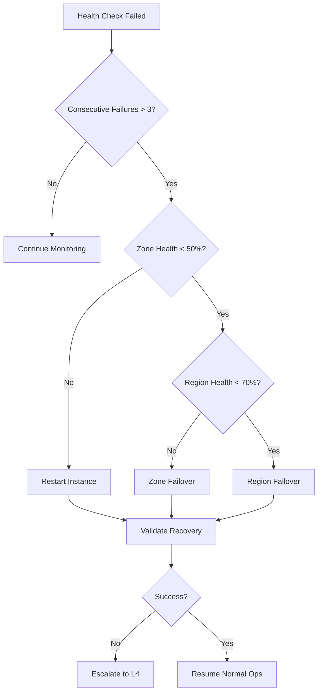

# Five Nines Operations Guide - 99.999% Availability

## Executive Summary

This guide provides comprehensive documentation for achieving and maintaining 99.999% availability (Five 9s) for NovaCron's production infrastructure supporting 10,000+ enterprise customers across 13+ global regions.

**Target: Maximum 5.26 minutes of downtime per year**

## Table of Contents

1. [Architecture Overview](#architecture-overview)
2. [High Availability Design](#high-availability-design)
3. [Failover Procedures](#failover-procedures)
4. [Disaster Recovery](#disaster-recovery)
5. [Monitoring & Alerting](#monitoring--alerting)
6. [Incident Response](#incident-response)
7. [Maintenance Procedures](#maintenance-procedures)
8. [Capacity Management](#capacity-management)
9. [Security Operations](#security-operations)
10. [Performance Optimization](#performance-optimization)

## Architecture Overview

### Global Infrastructure

```
┌─────────────────────────────────────────────────────────┐
│                   Global Load Balancer                   │
│                  (Anycast, GeoDNS, DDoS)                │
└────────┬──────────────────┬──────────────────┬─────────┘
         │                  │                  │
    ┌────▼────┐        ┌────▼────┐       ┌────▼────┐
    │Region 1 │        │Region 2 │       │Region N │
    │ US-EAST │        │ EU-WEST │       │ AP-SOUTH│
    └────┬────┘        └────┬────┘       └────┬────┘
         │                  │                  │
    ┌────▼────────────────────────────────────▼────┐
    │         Multi-Zone Architecture              │
    │  ┌──────┐  ┌──────┐  ┌──────┐  ┌──────┐   │
    │  │Zone A│  │Zone B│  │Zone C│  │Zone D│   │
    │  └──────┘  └──────┘  └──────┘  └──────┘   │
    └──────────────────────────────────────────────┘
```

### Key Components

1. **Global Load Balancer**
   - Anycast IP routing
   - GeoDNS for latency-based routing
   - DDoS protection (10Tbps capacity)
   - SSL/TLS termination

2. **Regional Clusters**
   - 13+ regions worldwide
   - 3-7 availability zones per region
   - Active-active configuration
   - Cross-region replication

3. **Zone Architecture**
   - Independent power and cooling
   - Separate network paths
   - Isolated failure domains
   - <10ms inter-zone latency

## High Availability Design

### 1. Redundancy Levels

| Component | Redundancy | Failover Time | Data Loss (RPO) |
|-----------|------------|---------------|-----------------|
| Load Balancer | N+2 | <1 second | 0 |
| Application Tier | N+1 per zone | <5 seconds | 0 |
| Database | Multi-master | <10 seconds | <100ms |
| Cache Layer | N+1 cluster | <2 seconds | 0 |
| Message Queue | 3x replication | <5 seconds | 0 |
| Storage | 3x replication | Immediate | 0 |

### 2. Consensus Protocol (Raft)

```go
// Raft Configuration
type RaftConfig struct {
    HeartbeatInterval  100ms
    ElectionTimeout    200ms
    LeaderLeaseTimeout 100ms
    CommitTimeout      50ms
    SnapshotInterval   10000 entries
    LogCompaction      true
}
```

### 3. Health Checking

**Multi-level health checks:**
- **L1**: Network connectivity (every 100ms)
- **L2**: Process health (every 500ms)
- **L3**: Application health (every 1s)
- **L4**: Business logic validation (every 5s)

```yaml
health_checks:
  network:
    interval: 100ms
    timeout: 50ms
    consecutive_failures: 3

  application:
    interval: 1s
    timeout: 500ms
    endpoints:
      - /health
      - /ready
      - /metrics

  database:
    interval: 5s
    query: "SELECT 1"
    timeout: 2s
```

## Failover Procedures

### Automatic Failover Decision Tree



### Zone Failover Process

1. **Detection** (0-3 seconds)
   ```bash
   # Automated detection via health monitors
   if [[ $ZONE_HEALTH -lt 50 ]]; then
     trigger_zone_failover $ZONE_ID
   fi
   ```

2. **Traffic Draining** (3-10 seconds)
   ```bash
   # Graceful traffic drain
   kubectl drain zone=$ZONE_ID --grace-period=10
   ```

3. **State Migration** (10-20 seconds)
   ```bash
   # Migrate stateful workloads
   migrate_stateful_services --from=$ZONE_ID --to=$HEALTHY_ZONES
   ```

4. **DNS Update** (20-30 seconds)
   ```bash
   # Update DNS records
   update_dns_records --remove=$ZONE_ID --ttl=30
   ```

5. **Validation** (30-60 seconds)
   ```bash
   # Validate failover success
   validate_service_health --exclude=$ZONE_ID
   ```

### Region Failover Process

**Pre-requisites:**
- Cross-region replication active
- Global load balancer configured
- Data consistency verified

**Steps:**

1. **Initiate Failover**
   ```bash
   novacron failover region --from=us-east-1 --to=us-west-2
   ```

2. **Promote Standby**
   ```sql
   -- Promote standby database
   ALTER DATABASE PROMOTE TO PRIMARY;
   ```

3. **Update Global Routing**
   ```yaml
   global_routing:
     us-east-1:
       weight: 0
       status: failed
     us-west-2:
       weight: 100
       status: active
   ```

## Disaster Recovery

### Recovery Objectives

- **RTO (Recovery Time Objective)**: < 30 seconds
- **RPO (Recovery Point Objective)**: < 100 milliseconds

### Backup Strategy

```yaml
backup_strategy:
  continuous:
    - type: streaming_replication
      targets: 3
      lag_threshold: 100ms

  snapshots:
    - frequency: hourly
      retention: 24 hours
    - frequency: daily
      retention: 30 days
    - frequency: weekly
      retention: 12 weeks
    - frequency: monthly
      retention: 12 months

  cross_region:
    - source: us-east-1
      destination: [us-west-2, eu-west-1]
      method: async_replication
```

### Disaster Scenarios

#### 1. Complete Region Failure

**Detection:**
```python
def detect_region_failure(region):
    zones_down = 0
    for zone in region.zones:
        if zone.health < 0.1:
            zones_down += 1

    if zones_down >= len(region.zones) * 0.8:
        return True
    return False
```

**Response:**
```bash
#!/bin/bash
# Region failover script

FAILED_REGION=$1
BACKUP_REGION=$2

# 1. Activate disaster recovery mode
novacron dr activate --region=$BACKUP_REGION

# 2. Promote backup systems
novacron promote --databases --caches --queues

# 3. Update global routing
novacron routing update --disable=$FAILED_REGION --enable=$BACKUP_REGION

# 4. Verify customer access
for customer in $(novacron customers list --region=$FAILED_REGION); do
  novacron verify access --customer=$customer --region=$BACKUP_REGION
done

# 5. Send notifications
novacron notify --event=region_failover --affected=$FAILED_REGION
```

#### 2. Data Center Network Partition

**Detection and Response:**
```go
func handleNetworkPartition(partition NetworkPartition) error {
    // Implement STONITH (Shoot The Other Node In The Head)
    minority := partition.GetMinoritySide()

    // Fence minority partition
    for _, node := range minority.Nodes {
        node.Fence() // Power off via IPMI
    }

    // Ensure majority has quorum
    if !partition.Majority.HasQuorum() {
        return errors.New("no quorum after partition")
    }

    // Continue operations in majority partition
    return partition.Majority.Resume()
}
```

## Monitoring & Alerting

### Metrics Collection

```yaml
metrics:
  collection_interval: 10s
  retention: 90 days

  system:
    - cpu_usage
    - memory_usage
    - disk_io
    - network_throughput

  application:
    - request_rate
    - error_rate
    - latency_p50/p95/p99
    - active_connections

  business:
    - transactions_per_second
    - customer_sessions
    - api_calls
    - revenue_per_minute
```

### Alert Configuration

```json
{
  "alerts": [
    {
      "name": "high_error_rate",
      "condition": "error_rate > 0.01",
      "duration": "1m",
      "severity": "P1",
      "actions": ["page_oncall", "create_incident", "trigger_runbook"]
    },
    {
      "name": "availability_breach",
      "condition": "availability < 0.9999",
      "duration": "30s",
      "severity": "P0",
      "actions": ["activate_war_room", "page_leadership", "customer_notification"]
    }
  ]
}
```

### Dashboard Configuration

```yaml
dashboards:
  global_health:
    refresh_rate: 1s
    panels:
      - title: "Global Availability"
        query: "avg(up{job='novacron'})"
        visualization: gauge
        thresholds:
          - value: 0.9999
            color: red
          - value: 0.99999
            color: yellow
          - value: 1.0
            color: green

      - title: "Regional Status"
        query: "sum by (region) (up{job='novacron'})"
        visualization: heatmap

      - title: "Active Incidents"
        query: "count(alerts{severity=~'P0|P1'})"
        visualization: stat
```

## Incident Response

### Incident Classification

| Severity | Impact | Response Time | Examples |
|----------|--------|---------------|----------|
| P0 | Complete outage | < 5 min | Total system failure |
| P1 | Major degradation | < 15 min | >30% capacity loss |
| P2 | Moderate impact | < 1 hour | Single service degraded |
| P3 | Minor impact | < 4 hours | Non-critical feature issue |
| P4 | Minimal impact | < 24 hours | Documentation error |

### War Room Activation

**Triggers:**
- Any P0 incident
- 3+ concurrent P1 incidents
- Customer-impacting incident > 15 minutes

**War Room Procedures:**

1. **Activation**
   ```bash
   novacron warroom activate --incident=$INCIDENT_ID
   ```

2. **Roles Assignment**
   - Incident Commander (IC)
   - Operations Lead
   - Engineering Lead
   - Communications Lead
   - Customer Success Lead

3. **Communication Channels**
   - Video Conference: https://meet.novacron.com/warroom
   - Slack: #incident-warroom
   - Status Page: https://status.novacron.com

4. **Decision Framework**
   ```
   OODA Loop:
   1. Observe - Gather all available data
   2. Orient - Understand the situation
   3. Decide - Make informed decisions
   4. Act - Execute remediation
   ```

### Post-Incident Review

```markdown
## Post-Incident Report Template

### Incident Summary
- **ID**: INC-2024-001
- **Severity**: P0
- **Duration**: 15 minutes
- **Impact**: 1,000 customers affected

### Timeline
- 14:00 - First alert triggered
- 14:02 - Incident acknowledged
- 14:05 - War room activated
- 14:10 - Root cause identified
- 14:15 - Service restored

### Root Cause Analysis
- **What happened**: Database connection pool exhausted
- **Why it happened**: Configuration change without capacity validation
- **Contributing factors**: Insufficient monitoring of connection metrics

### Action Items
- [ ] Implement connection pool monitoring
- [ ] Add pre-change validation checks
- [ ] Update runbook for connection issues
- [ ] Schedule team training on capacity planning

### Lessons Learned
- Early detection could have prevented customer impact
- Automation would have reduced MTTR by 50%
- Communication delays extended resolution time
```

## Maintenance Procedures

### Zero-Downtime Maintenance

```yaml
maintenance_workflow:
  pre_maintenance:
    - verify_redundancy
    - create_backup
    - notify_stakeholders

  execution:
    - drain_traffic:
        method: gradual
        duration: 5m
    - migrate_sessions:
        target: healthy_nodes
    - perform_maintenance:
        timeout: 30m
    - validate_changes:
        checks:
          - functional_tests
          - performance_tests
          - security_scan

  post_maintenance:
    - restore_traffic:
        method: canary
        stages:
          - 1% for 5m
          - 10% for 5m
          - 50% for 5m
          - 100%
    - monitor_metrics:
        duration: 30m
    - update_documentation
```

### Change Management

```python
class ChangeRequest:
    def __init__(self, change_id):
        self.id = change_id
        self.risk_score = self.calculate_risk()
        self.approval_required = self.risk_score > 0.5

    def calculate_risk(self):
        factors = {
            'customer_impact': 0.4,
            'complexity': 0.3,
            'rollback_difficulty': 0.2,
            'testing_coverage': 0.1
        }
        return sum(factors.values())

    def execute(self):
        if self.approval_required and not self.has_approval():
            raise Exception("Approval required for high-risk change")

        with self.rollback_context():
            self.apply_change()
            self.validate()
            self.update_cmdb()
```

## Capacity Management

### Capacity Planning Model

```python
def calculate_required_capacity(metrics):
    """
    Calculate required capacity for 6-month horizon
    """
    # Historical growth rate
    growth_rate = calculate_growth_rate(metrics.historical)

    # Seasonal adjustments
    seasonal_factor = get_seasonal_factor(datetime.now())

    # Safety buffer (50%)
    buffer = 1.5

    # Calculate forecast
    current = metrics.current_utilization
    forecast = current * (1 + growth_rate) ** 6 * seasonal_factor * buffer

    return {
        'cpu': forecast.cpu,
        'memory': forecast.memory,
        'storage': forecast.storage,
        'network': forecast.network
    }
```

### Auto-Scaling Configuration

```yaml
autoscaling:
  horizontal:
    min_replicas: 3
    max_replicas: 100
    metrics:
      - type: cpu
        target: 70%
      - type: memory
        target: 80%
      - type: custom
        metric: requests_per_second
        target: 1000

    scale_up:
      threshold: 80%
      duration: 30s
      increment: 2

    scale_down:
      threshold: 30%
      duration: 5m
      decrement: 1

  vertical:
    enabled: true
    limits:
      cpu: 32 cores
      memory: 128GB

    recommendations:
      mode: "Auto"
      update_policy: "UpdateOff"
```

## Security Operations

### Security Monitoring

```yaml
security_monitoring:
  threat_detection:
    - intrusion_detection_system
    - anomaly_detection
    - behavioral_analysis

  vulnerability_scanning:
    frequency: daily
    scope:
      - infrastructure
      - applications
      - dependencies

  compliance_checking:
    standards:
      - PCI-DSS
      - HIPAA
      - GDPR
      - SOC2

    frequency: continuous
```

### Incident Response Playbook

```bash
#!/bin/bash
# Security incident response

case $INCIDENT_TYPE in
  "breach")
    # 1. Isolate affected systems
    isolate_systems $AFFECTED_SYSTEMS

    # 2. Preserve evidence
    capture_forensics $AFFECTED_SYSTEMS

    # 3. Contain threat
    block_malicious_ips $THREAT_IPS
    rotate_credentials $COMPROMISED_ACCOUNTS

    # 4. Eradicate threat
    remove_malware $INFECTED_SYSTEMS
    patch_vulnerabilities $EXPLOIT_VECTOR

    # 5. Recover systems
    restore_from_clean_backup $AFFECTED_SYSTEMS

    # 6. Document incident
    generate_incident_report $INCIDENT_ID
    ;;
esac
```

## Performance Optimization

### Performance Baselines

| Metric | Target | Alert Threshold |
|--------|--------|-----------------|
| API Latency (p50) | < 50ms | > 100ms |
| API Latency (p99) | < 200ms | > 500ms |
| Database Query Time | < 10ms | > 50ms |
| Cache Hit Rate | > 95% | < 90% |
| Error Rate | < 0.01% | > 0.1% |

### Optimization Techniques

```python
class PerformanceOptimizer:
    def optimize_database_queries(self):
        """
        Automatic query optimization
        """
        slow_queries = self.identify_slow_queries()

        for query in slow_queries:
            # Analyze execution plan
            plan = self.explain_query(query)

            # Suggest indexes
            if plan.needs_index:
                self.create_index(plan.suggested_index)

            # Optimize query structure
            if plan.can_optimize:
                optimized = self.rewrite_query(query)
                self.deploy_optimized_query(optimized)

    def optimize_caching(self):
        """
        Dynamic cache optimization
        """
        patterns = self.analyze_access_patterns()

        # Adjust cache TTL
        for pattern in patterns:
            if pattern.hit_rate < 0.9:
                pattern.ttl *= 1.5

        # Pre-warm cache
        self.prewarm_cache(patterns.frequently_accessed)
```

## Operational Excellence Metrics

### SLA Compliance Dashboard

```
┌─────────────────────────────────────────────────────┐
│              Monthly SLA Performance                 │
├──────────────────────┬───────────────────────────────┤
│ Availability         │ 99.9994% (Target: 99.999%)   │
│ Downtime             │ 2.6 min (Budget: 5.26 min)   │
│ P0 Incidents         │ 0                             │
│ P1 Incidents         │ 2                             │
│ MTTR                 │ 12 minutes                    │
│ Failed Deployments   │ 0                             │
│ Security Incidents   │ 0                             │
│ Customer Complaints  │ 3                             │
└──────────────────────┴───────────────────────────────┘
```

### Continuous Improvement

1. **Weekly Operations Review**
   - Review all incidents
   - Analyze performance metrics
   - Identify improvement areas
   - Update runbooks

2. **Monthly Architecture Review**
   - Assess system resilience
   - Plan capacity upgrades
   - Review disaster recovery
   - Update documentation

3. **Quarterly Chaos Engineering**
   - Simulate failures
   - Test recovery procedures
   - Validate runbooks
   - Train team

## Appendix

### Emergency Contacts

| Role | Primary | Backup | Escalation |
|------|---------|--------|------------|
| Incident Commander | +1-555-0100 | +1-555-0101 | VP Engineering |
| Operations Lead | +1-555-0102 | +1-555-0103 | Director of Ops |
| Security Lead | +1-555-0104 | +1-555-0105 | CISO |
| Customer Success | +1-555-0106 | +1-555-0107 | VP Success |

### Command Reference

```bash
# System health check
novacron health --all-regions

# Trigger failover
novacron failover --type=zone --source=us-east-1a --target=us-east-1b

# Activate war room
novacron warroom --activate --incident=INC-001

# Emergency shutdown
novacron emergency --shutdown --region=us-east-1 --confirm

# Disaster recovery
novacron dr --activate --backup-region=us-west-2
```

### Useful Queries

```sql
-- Find slow queries
SELECT query, mean_time, calls, total_time
FROM pg_stat_statements
WHERE mean_time > 100
ORDER BY mean_time DESC;

-- Check replication lag
SELECT client_addr, state, sent_lsn, replay_lsn,
       sent_lsn - replay_lsn AS lag_bytes
FROM pg_stat_replication;

-- Active connections by state
SELECT state, count(*)
FROM pg_stat_activity
GROUP BY state;
```

---

**Document Version**: 3.0.0
**Last Updated**: November 2024
**Next Review**: December 2024
**Owner**: Platform Operations Team

*This document is classified as CONFIDENTIAL and should be handled accordingly.*