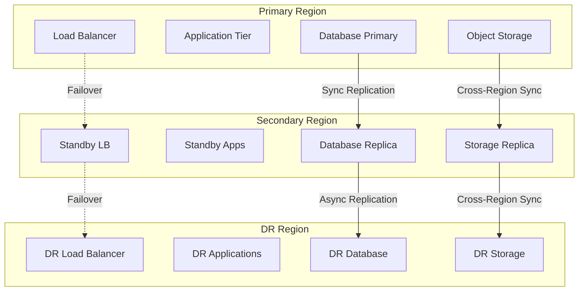

# Disaster Recovery Runbook
## NovaCron v10 Extended - Business Continuity & Disaster Recovery

### Document Information
- **Version**: 1.0.0
- **Last Updated**: 2025-01-05  
- **Classification**: CRITICAL
- **Review Frequency**: Quarterly
- **RPO Target**: < 1 hour
- **RTO Target**: < 4 hours

---

## 1. Disaster Recovery Overview

### Recovery Objectives

```yaml
recovery_objectives:
  rpo_targets:  # Recovery Point Objective - Maximum data loss
    tier_1_critical:
      target: 15_minutes
      services: [payment_processing, user_authentication, core_scheduling]
      backup_frequency: continuous
      replication: synchronous
      
    tier_2_essential:
      target: 1_hour
      services: [api_gateway, worker_pool, message_queue]
      backup_frequency: 15_minutes
      replication: asynchronous
      
    tier_3_standard:
      target: 4_hours
      services: [reporting, analytics, batch_processing]
      backup_frequency: hourly
      replication: scheduled
      
  rto_targets:  # Recovery Time Objective - Maximum downtime
    tier_1_critical:
      target: 1_hour
      automation: full
      validation: automated
      
    tier_2_essential:
      target: 4_hours
      automation: partial
      validation: semi_automated
      
    tier_3_standard:
      target: 24_hours
      automation: minimal
      validation: manual

disaster_scenarios:
  - datacenter_failure
  - regional_outage  
  - ransomware_attack
  - data_corruption
  - natural_disaster
  - pandemic_response
  - cyber_attack
  - supply_chain_failure
```

### DR Architecture



---

## 2. Backup Procedures

### Automated Backup System

```python
#!/usr/bin/env python3
# backup_system.py

import os
import subprocess
import boto3
import hashlib
from datetime import datetime, timedelta
from typing import Dict, List, Optional
import logging

logging.basicConfig(level=logging.INFO)
logger = logging.getLogger(__name__)

class BackupManager:
    def __init__(self):
        self.s3 = boto3.client('s3')
        self.rds = boto3.client('rds')
        self.ec2 = boto3.client('ec2')
        self.backup_bucket = 'novacron-backups'
        self.dr_bucket = 'novacron-dr-backups'
        
    def run_full_backup(self) -> Dict:
        """Execute complete backup procedure"""
        
        backup_id = f"backup-{datetime.now().strftime('%Y%m%d-%H%M%S')}"
        logger.info(f"Starting full backup: {backup_id}")
        
        backup_manifest = {
            'backup_id': backup_id,
            'timestamp': datetime.now().isoformat(),
            'components': {},
            'status': 'in_progress'
        }
        
        try:
            # Database backups
            backup_manifest['components']['database'] = self.backup_databases()
            
            # Application state
            backup_manifest['components']['application'] = self.backup_application_state()
            
            # Configuration and secrets
            backup_manifest['components']['configuration'] = self.backup_configuration()
            
            # File systems
            backup_manifest['components']['filesystems'] = self.backup_filesystems()
            
            # Container images
            backup_manifest['components']['containers'] = self.backup_container_images()
            
            # Verify backup integrity
            if self.verify_backup_integrity(backup_id):
                backup_manifest['status'] = 'completed'
                
                # Replicate to DR region
                self.replicate_to_dr(backup_id)
            else:
                backup_manifest['status'] = 'verification_failed'
                
        except Exception as e:
            logger.error(f"Backup failed: {e}")
            backup_manifest['status'] = 'failed'
            backup_manifest['error'] = str(e)
            
        # Save manifest
        self.save_backup_manifest(backup_manifest)
        
        return backup_manifest
    
    def backup_databases(self) -> Dict:
        """Backup all databases"""
        
        results = {}
        
        # PostgreSQL backup
        logger.info("Backing up PostgreSQL...")
        pg_backup = self.backup_postgresql()
        results['postgresql'] = pg_backup
        
        # Redis backup
        logger.info("Backing up Redis...")
        redis_backup = self.backup_redis()
        results['redis'] = redis_backup
        
        # RDS automated snapshot
        logger.info("Creating RDS snapshot...")
        rds_snapshot = self.create_rds_snapshot()
        results['rds_snapshot'] = rds_snapshot
        
        return results
    
    def backup_postgresql(self) -> Dict:
        """Backup PostgreSQL database"""
        
        timestamp = datetime.now().strftime('%Y%m%d-%H%M%S')
        backup_file = f"/tmp/postgresql-backup-{timestamp}.sql.gz"
        
        # Create backup with pg_dump
        dump_cmd = [
            'pg_dump',
            '-h', os.environ['DB_HOST'],
            '-U', os.environ['DB_USER'],
            '-d', 'novacron',
            '--no-password',
            '--verbose',
            '--format=custom',
            '--compress=9',
            '--file=' + backup_file
        ]
        
        subprocess.run(dump_cmd, check=True, env={
            **os.environ,
            'PGPASSWORD': os.environ['DB_PASSWORD']
        })
        
        # Calculate checksum
        checksum = self.calculate_checksum(backup_file)
        
        # Upload to S3
        s3_key = f"database/postgresql/{timestamp}/backup.sql.gz"
        self.s3.upload_file(
            backup_file,
            self.backup_bucket,
            s3_key,
            ExtraArgs={
                'Metadata': {
                    'checksum': checksum,
                    'timestamp': timestamp
                },
                'StorageClass': 'STANDARD_IA'
            }
        )
        
        # Cleanup local file
        os.remove(backup_file)
        
        return {
            'type': 'postgresql',
            'location': f"s3://{self.backup_bucket}/{s3_key}",
            'size': os.path.getsize(backup_file),
            'checksum': checksum,
            'timestamp': timestamp
        }
    
    def backup_redis(self) -> Dict:
        """Backup Redis data"""
        
        timestamp = datetime.now().strftime('%Y%m%d-%H%M%S')
        
        # Trigger Redis backup
        import redis
        r = redis.Redis(host=os.environ['REDIS_HOST'], port=6379)
        r.bgsave()
        
        # Wait for backup to complete
        while r.lastsave() < datetime.now().timestamp() - 10:
            time.sleep(1)
        
        # Copy RDB file
        backup_file = f"/tmp/redis-backup-{timestamp}.rdb"
        subprocess.run([
            'scp',
            f"{os.environ['REDIS_HOST']}:/var/lib/redis/dump.rdb",
            backup_file
        ], check=True)
        
        # Upload to S3
        s3_key = f"database/redis/{timestamp}/dump.rdb"
        self.s3.upload_file(backup_file, self.backup_bucket, s3_key)
        
        return {
            'type': 'redis',
            'location': f"s3://{self.backup_bucket}/{s3_key}",
            'timestamp': timestamp
        }
    
    def backup_application_state(self) -> Dict:
        """Backup application state and data"""
        
        timestamp = datetime.now().strftime('%Y%m%d-%H%M%S')
        state_backup = {}
        
        # Kubernetes resources
        logger.info("Backing up Kubernetes resources...")
        
        resources = [
            'deployments', 'services', 'configmaps', 
            'secrets', 'persistentvolumeclaims', 'ingresses'
        ]
        
        for resource in resources:
            output = subprocess.run([
                'kubectl', 'get', resource,
                '--all-namespaces', '-o', 'yaml'
            ], capture_output=True, text=True, check=True)
            
            s3_key = f"kubernetes/{timestamp}/{resource}.yaml"
            self.s3.put_object(
                Bucket=self.backup_bucket,
                Key=s3_key,
                Body=output.stdout.encode('utf-8')
            )
            
            state_backup[resource] = f"s3://{self.backup_bucket}/{s3_key}"
        
        return state_backup
    
    def backup_configuration(self) -> Dict:
        """Backup configuration and secrets"""
        
        timestamp = datetime.now().strftime('%Y%m%d-%H%M%S')
        
        # Encrypt sensitive data
        from cryptography.fernet import Fernet
        encryption_key = os.environ['BACKUP_ENCRYPTION_KEY'].encode()
        cipher = Fernet(encryption_key)
        
        configs = {}
        
        # Backup environment variables
        env_data = json.dumps(dict(os.environ))
        encrypted_env = cipher.encrypt(env_data.encode())
        
        s3_key = f"configuration/{timestamp}/environment.enc"
        self.s3.put_object(
            Bucket=self.backup_bucket,
            Key=s3_key,
            Body=encrypted_env,
            ServerSideEncryption='AES256'
        )
        
        configs['environment'] = s3_key
        
        # Backup secrets from vault
        vault_backup = self.backup_vault_secrets()
        configs['vault'] = vault_backup
        
        return configs
    
    def verify_backup_integrity(self, backup_id: str) -> bool:
        """Verify backup integrity"""
        
        logger.info(f"Verifying backup integrity: {backup_id}")
        
        # List all backup objects
        response = self.s3.list_objects_v2(
            Bucket=self.backup_bucket,
            Prefix=backup_id
        )
        
        if 'Contents' not in response:
            logger.error("No backup files found")
            return False
        
        # Verify each file
        for obj in response['Contents']:
            # Get metadata
            head = self.s3.head_object(
                Bucket=self.backup_bucket,
                Key=obj['Key']
            )
            
            # Verify checksum if present
            if 'checksum' in head.get('Metadata', {}):
                # Download and verify
                local_file = f"/tmp/verify-{os.path.basename(obj['Key'])}"
                self.s3.download_file(
                    self.backup_bucket,
                    obj['Key'],
                    local_file
                )
                
                calculated = self.calculate_checksum(local_file)
                expected = head['Metadata']['checksum']
                
                if calculated != expected:
                    logger.error(f"Checksum mismatch for {obj['Key']}")
                    return False
                
                os.remove(local_file)
        
        logger.info("Backup integrity verified")
        return True
    
    def replicate_to_dr(self, backup_id: str):
        """Replicate backup to DR region"""
        
        logger.info(f"Replicating backup to DR region: {backup_id}")
        
        # List objects to replicate
        response = self.s3.list_objects_v2(
            Bucket=self.backup_bucket,
            Prefix=backup_id
        )
        
        if 'Contents' not in response:
            return
        
        # Copy to DR bucket
        for obj in response['Contents']:
            copy_source = {
                'Bucket': self.backup_bucket,
                'Key': obj['Key']
            }
            
            self.s3.copy_object(
                CopySource=copy_source,
                Bucket=self.dr_bucket,
                Key=obj['Key'],
                StorageClass='GLACIER_IR'  # Instant retrieval
            )
        
        logger.info(f"Replicated {len(response['Contents'])} objects to DR")
    
    def calculate_checksum(self, file_path: str) -> str:
        """Calculate SHA-256 checksum"""
        sha256 = hashlib.sha256()
        with open(file_path, 'rb') as f:
            for chunk in iter(lambda: f.read(4096), b''):
                sha256.update(chunk)
        return sha256.hexdigest()

class IncrementalBackup:
    def __init__(self):
        self.last_backup_marker = self.get_last_backup_marker()
        
    def run_incremental(self) -> Dict:
        """Run incremental backup"""
        
        logger.info("Running incremental backup...")
        
        changes = self.detect_changes_since(self.last_backup_marker)
        
        if not changes:
            logger.info("No changes detected")
            return {'status': 'no_changes'}
        
        # Backup only changed data
        backup_result = {
            'type': 'incremental',
            'timestamp': datetime.now().isoformat(),
            'changes': {}
        }
        
        # Backup changed database records
        if changes.get('database'):
            backup_result['changes']['database'] = self.backup_changed_records(
                changes['database']
            )
        
        # Backup modified files
        if changes.get('files'):
            backup_result['changes']['files'] = self.backup_changed_files(
                changes['files']
            )
        
        # Update marker
        self.update_backup_marker()
        
        return backup_result
    
    def detect_changes_since(self, marker: datetime) -> Dict:
        """Detect changes since last backup"""
        
        changes = {}
        
        # Database changes using WAL
        db_changes = self.detect_database_changes(marker)
        if db_changes:
            changes['database'] = db_changes
        
        # File system changes
        file_changes = self.detect_file_changes(marker)
        if file_changes:
            changes['files'] = file_changes
        
        return changes
```

---

## 3. Recovery Procedures

### Disaster Recovery Execution

```bash
#!/bin/bash
# disaster_recovery.sh

execute_disaster_recovery() {
    DR_TYPE=$1  # full|partial|test
    DISASTER_SCENARIO=$2  # datacenter_failure|regional_outage|cyber_attack|data_corruption
    
    echo "=== DISASTER RECOVERY INITIATED ==="
    echo "Type: $DR_TYPE"
    echo "Scenario: $DISASTER_SCENARIO"
    echo "Start Time: $(date)"
    
    # Create DR incident
    DR_INCIDENT_ID=$(create_dr_incident "$DISASTER_SCENARIO")
    
    # Phase 1: Assessment
    assess_damage
    
    # Phase 2: Activation
    activate_dr_plan $DR_TYPE
    
    # Phase 3: Recovery
    execute_recovery $DISASTER_SCENARIO
    
    # Phase 4: Validation
    validate_recovery
    
    # Phase 5: Cutover (if not test)
    if [ "$DR_TYPE" != "test" ]; then
        execute_cutover
    fi
    
    # Phase 6: Documentation
    document_dr_execution $DR_INCIDENT_ID
    
    echo "DR Execution completed at: $(date)"
}

assess_damage() {
    echo ""
    echo "=== Phase 1: Damage Assessment ==="
    
    # Check primary site status
    echo "Checking primary site..."
    PRIMARY_STATUS=$(check_site_status "primary")
    echo "Primary site status: $PRIMARY_STATUS"
    
    # Check secondary site status
    echo "Checking secondary site..."
    SECONDARY_STATUS=$(check_site_status "secondary")
    echo "Secondary site status: $SECONDARY_STATUS"
    
    # Assess data loss
    echo "Assessing potential data loss..."
    LAST_BACKUP=$(get_last_backup_time)
    CURRENT_TIME=$(date +%s)
    POTENTIAL_DATA_LOSS=$((CURRENT_TIME - LAST_BACKUP))
    echo "Potential data loss: $((POTENTIAL_DATA_LOSS / 60)) minutes"
    
    # Check available resources
    echo "Checking DR resources..."
    check_dr_resources
    
    # Generate assessment report
    cat > /tmp/dr-assessment.json << EOF
{
    "incident_id": "$DR_INCIDENT_ID",
    "primary_status": "$PRIMARY_STATUS",
    "secondary_status": "$SECONDARY_STATUS",
    "potential_data_loss_minutes": $((POTENTIAL_DATA_LOSS / 60)),
    "dr_resources_available": true,
    "recommendation": "proceed_with_recovery"
}
EOF
}

activate_dr_plan() {
    local dr_type=$1
    
    echo ""
    echo "=== Phase 2: DR Plan Activation ==="
    
    # Notify stakeholders
    echo "Notifying stakeholders..."
    notify_dr_activation
    
    # Activate DR team
    echo "Activating DR team..."
    page_dr_team
    
    # Enable DR mode
    echo "Enabling DR mode..."
    kubectl set env deployment/novacron-api DR_MODE=active
    
    # Prepare DR infrastructure
    echo "Preparing DR infrastructure..."
    
    case $dr_type in
        "full")
            prepare_full_dr_infrastructure
            ;;
        "partial")
            prepare_partial_dr_infrastructure
            ;;
        "test")
            prepare_test_dr_infrastructure
            ;;
    esac
    
    # Update DNS for DR (if not test)
    if [ "$dr_type" != "test" ]; then
        echo "Updating DNS to point to DR site..."
        update_dns_for_dr
    fi
}

execute_recovery() {
    local scenario=$1
    
    echo ""
    echo "=== Phase 3: Recovery Execution ==="
    
    case $scenario in
        "datacenter_failure")
            recover_from_datacenter_failure
            ;;
        "regional_outage")
            recover_from_regional_outage
            ;;
        "cyber_attack")
            recover_from_cyber_attack
            ;;
        "data_corruption")
            recover_from_data_corruption
            ;;
        *)
            echo "Unknown scenario: $scenario"
            exit 1
            ;;
    esac
}

recover_from_datacenter_failure() {
    echo "Recovering from datacenter failure..."
    
    # 1. Activate DR site
    echo "Activating DR site..."
    aws ec2 start-instances --instance-ids $(get_dr_instance_ids)
    
    # 2. Restore database
    echo "Restoring database from replica..."
    promote_database_replica
    
    # 3. Deploy applications
    echo "Deploying applications to DR site..."
    deploy_to_dr_site
    
    # 4. Restore data from backups
    echo "Restoring data from backups..."
    restore_latest_backups
    
    # 5. Configure networking
    echo "Configuring DR networking..."
    configure_dr_networking
    
    # 6. Start services
    echo "Starting services..."
    start_dr_services
}

recover_from_cyber_attack() {
    echo "Recovering from cyber attack..."
    
    # 1. Isolate affected systems
    echo "Isolating compromised systems..."
    isolate_compromised_systems
    
    # 2. Identify clean backup
    echo "Identifying clean backup before attack..."
    CLEAN_BACKUP=$(find_clean_backup_before_attack)
    echo "Clean backup found: $CLEAN_BACKUP"
    
    # 3. Deploy clean infrastructure
    echo "Deploying clean infrastructure..."
    terraform apply -var-file=dr-clean.tfvars -auto-approve
    
    # 4. Restore from clean backup
    echo "Restoring from clean backup..."
    restore_from_backup $CLEAN_BACKUP
    
    # 5. Apply security patches
    echo "Applying security patches..."
    apply_emergency_security_patches
    
    # 6. Enable enhanced monitoring
    echo "Enabling enhanced security monitoring..."
    enable_enhanced_security_monitoring
}

recover_from_data_corruption() {
    echo "Recovering from data corruption..."
    
    # 1. Stop all writes
    echo "Halting write operations..."
    enable_readonly_mode
    
    # 2. Identify corruption extent
    echo "Analyzing corruption extent..."
    CORRUPTION_REPORT=$(analyze_data_corruption)
    
    # 3. Find last good backup
    echo "Finding last known good backup..."
    GOOD_BACKUP=$(find_last_good_backup)
    
    # 4. Restore database
    echo "Restoring database from backup..."
    restore_database $GOOD_BACKUP
    
    # 5. Replay transactions
    echo "Replaying transactions from WAL..."
    replay_wal_from $GOOD_BACKUP
    
    # 6. Verify data integrity
    echo "Verifying data integrity..."
    verify_data_integrity
    
    # 7. Resume operations
    echo "Resuming normal operations..."
    disable_readonly_mode
}

promote_database_replica() {
    echo "Promoting database replica to primary..."
    
    # PostgreSQL promotion
    aws rds promote-read-replica \
        --db-instance-identifier novacron-dr-replica \
        --backup-retention-period 7
    
    # Wait for promotion
    aws rds wait db-instance-available \
        --db-instance-identifier novacron-dr-replica
    
    # Update connection strings
    update_database_connections "novacron-dr-replica"
}

restore_latest_backups() {
    echo "Restoring from latest backups..."
    
    # Get latest backup
    LATEST_BACKUP=$(aws s3 ls s3://novacron-backups/ --recursive \
        | sort | tail -n 1 | awk '{print $4}')
    
    echo "Latest backup: $LATEST_BACKUP"
    
    # Download backup
    aws s3 sync s3://novacron-backups/$LATEST_BACKUP /tmp/restore/
    
    # Restore database
    echo "Restoring database..."
    pg_restore -h $DR_DB_HOST -U $DB_USER -d novacron /tmp/restore/database.dump
    
    # Restore files
    echo "Restoring application files..."
    rsync -avz /tmp/restore/files/ /app/
    
    # Restore configurations
    echo "Restoring configurations..."
    kubectl apply -f /tmp/restore/kubernetes/
}

validate_recovery() {
    echo ""
    echo "=== Phase 4: Recovery Validation ==="
    
    local all_checks_passed=true
    
    # 1. Service health checks
    echo "Running service health checks..."
    for service in api scheduler worker database cache; do
        if check_service_health $service; then
            echo "  ✅ $service is healthy"
        else
            echo "  ❌ $service is unhealthy"
            all_checks_passed=false
        fi
    done
    
    # 2. Data integrity check
    echo "Checking data integrity..."
    if verify_data_integrity; then
        echo "  ✅ Data integrity verified"
    else
        echo "  ❌ Data integrity check failed"
        all_checks_passed=false
    fi
    
    # 3. Connectivity tests
    echo "Testing connectivity..."
    if test_connectivity; then
        echo "  ✅ Connectivity tests passed"
    else
        echo "  ❌ Connectivity tests failed"
        all_checks_passed=false
    fi
    
    # 4. Application functionality
    echo "Testing application functionality..."
    if run_smoke_tests; then
        echo "  ✅ Smoke tests passed"
    else
        echo "  ❌ Smoke tests failed"
        all_checks_passed=false
    fi
    
    # 5. Performance validation
    echo "Validating performance..."
    if validate_performance; then
        echo "  ✅ Performance acceptable"
    else
        echo "  ⚠️  Performance degraded"
    fi
    
    if [ "$all_checks_passed" = true ]; then
        echo ""
        echo "✅ Recovery validation successful"
        return 0
    else
        echo ""
        echo "❌ Recovery validation failed"
        return 1
    fi
}

execute_cutover() {
    echo ""
    echo "=== Phase 5: Cutover Execution ==="
    
    # 1. Final validation
    echo "Running final validation..."
    if ! validate_recovery; then
        echo "Validation failed, aborting cutover"
        return 1
    fi
    
    # 2. Update DNS
    echo "Updating DNS records..."
    update_dns_records "dr-site.novacron.io"
    
    # 3. Update load balancers
    echo "Updating load balancer configuration..."
    update_load_balancer_config
    
    # 4. Notify users
    echo "Sending user notifications..."
    send_user_notifications "DR site is now active"
    
    # 5. Monitor cutover
    echo "Monitoring cutover..."
    monitor_cutover_metrics
    
    echo "Cutover completed successfully"
}

# Execute DR
execute_disaster_recovery "$@"
```

---

## 4. Failover Procedures

### Automated Failover System

```go
// failover_controller.go
package dr

import (
    "context"
    "fmt"
    "time"
    "sync"
)

type FailoverController struct {
    HealthChecker    HealthChecker
    DNSManager       DNSManager
    LoadBalancer     LoadBalancerManager
    Database         DatabaseManager
    NotificationSvc  NotificationService
    mu              sync.Mutex
    failoverActive  bool
}

type FailoverDecision struct {
    ShouldFailover bool
    Reason         string
    TargetRegion   string
    Services       []string
    Confidence     float64
}

func (fc *FailoverController) MonitorAndFailover(ctx context.Context) {
    ticker := time.NewTicker(10 * time.Second)
    defer ticker.Stop()
    
    consecutiveFailures := 0
    
    for {
        select {
        case <-ctx.Done():
            return
        case <-ticker.C:
            health := fc.checkPrimaryHealth()
            
            if !health.Healthy {
                consecutiveFailures++
                
                if consecutiveFailures >= 3 {
                    decision := fc.makeFailoverDecision(health)
                    
                    if decision.ShouldFailover && decision.Confidence > 0.8 {
                        fc.executeFailover(decision)
                        consecutiveFailures = 0
                    }
                }
            } else {
                consecutiveFailures = 0
            }
        }
    }
}

func (fc *FailoverController) makeFailoverDecision(health HealthStatus) FailoverDecision {
    decision := FailoverDecision{}
    
    // Analyze failure patterns
    if health.DatabaseDown && health.APIDown && health.WorkerDown {
        decision.ShouldFailover = true
        decision.Reason = "Complete primary site failure"
        decision.Confidence = 0.95
    } else if health.DatabaseDown {
        decision.ShouldFailover = true
        decision.Reason = "Database failure"
        decision.Confidence = 0.9
    } else if health.NetworkPartition {
        decision.ShouldFailover = true
        decision.Reason = "Network partition detected"
        decision.Confidence = 0.85
    } else if health.ResponseTime > 5000 { // 5 second timeout
        decision.ShouldFailover = true
        decision.Reason = "Severe performance degradation"
        decision.Confidence = 0.7
    }
    
    // Select target region
    if decision.ShouldFailover {
        decision.TargetRegion = fc.selectBestRegion()
        decision.Services = fc.identifyAffectedServices(health)
    }
    
    return decision
}

func (fc *FailoverController) executeFailover(decision FailoverDecision) error {
    fc.mu.Lock()
    defer fc.mu.Unlock()
    
    if fc.failoverActive {
        return fmt.Errorf("failover already in progress")
    }
    
    fc.failoverActive = true
    defer func() { fc.failoverActive = false }()
    
    logger.Warning("INITIATING AUTOMATIC FAILOVER")
    logger.Info("Reason: %s", decision.Reason)
    logger.Info("Target: %s", decision.TargetRegion)
    
    // Step 1: Alert all stakeholders
    fc.NotificationSvc.SendCriticalAlert(
        "Automatic failover initiated",
        decision,
    )
    
    // Step 2: Prepare target region
    if err := fc.prepareTargetRegion(decision.TargetRegion); err != nil {
        return fmt.Errorf("failed to prepare target region: %w", err)
    }
    
    // Step 3: Database failover
    if err := fc.failoverDatabase(decision.TargetRegion); err != nil {
        return fmt.Errorf("database failover failed: %w", err)
    }
    
    // Step 4: Application failover
    if err := fc.failoverApplications(decision.TargetRegion); err != nil {
        return fmt.Errorf("application failover failed: %w", err)
    }
    
    // Step 5: Update routing
    if err := fc.updateRouting(decision.TargetRegion); err != nil {
        return fmt.Errorf("routing update failed: %w", err)
    }
    
    // Step 6: Validate failover
    if err := fc.validateFailover(decision.TargetRegion); err != nil {
        // Attempt rollback
        fc.rollbackFailover()
        return fmt.Errorf("failover validation failed: %w", err)
    }
    
    logger.Info("Failover completed successfully")
    
    // Step 7: Post-failover tasks
    go fc.postFailoverTasks(decision)
    
    return nil
}

func (fc *FailoverController) failoverDatabase(targetRegion string) error {
    // Promote standby to primary
    if err := fc.Database.PromoteStandby(targetRegion); err != nil {
        return err
    }
    
    // Wait for promotion to complete
    ctx, cancel := context.WithTimeout(context.Background(), 5*time.Minute)
    defer cancel()
    
    if err := fc.Database.WaitForPromotion(ctx, targetRegion); err != nil {
        return err
    }
    
    // Update connection pools
    if err := fc.Database.UpdateConnectionPools(targetRegion); err != nil {
        return err
    }
    
    return nil
}

func (fc *FailoverController) updateRouting(targetRegion string) error {
    // Update DNS
    if err := fc.DNSManager.UpdateRecords(targetRegion); err != nil {
        return err
    }
    
    // Update load balancers
    if err := fc.LoadBalancer.SwitchToRegion(targetRegion); err != nil {
        return err
    }
    
    // Update CDN
    if err := fc.updateCDNOrigin(targetRegion); err != nil {
        return err
    }
    
    return nil
}

func (fc *FailoverController) validateFailover(targetRegion string) error {
    // Run health checks on new primary
    health := fc.HealthChecker.CheckRegion(targetRegion)
    
    if !health.Healthy {
        return fmt.Errorf("target region unhealthy")
    }
    
    // Run smoke tests
    if err := fc.runSmokeTests(targetRegion); err != nil {
        return fmt.Errorf("smoke tests failed: %w", err)
    }
    
    // Verify data consistency
    if err := fc.verifyDataConsistency(targetRegion); err != nil {
        return fmt.Errorf("data consistency check failed: %w", err)
    }
    
    return nil
}

func (fc *FailoverController) rollbackFailover() {
    logger.Warning("Attempting failover rollback")
    
    // Best effort rollback
    // This is complex and depends on how far the failover progressed
    
    // Revert DNS if changed
    fc.DNSManager.RevertLastChange()
    
    // Revert load balancer
    fc.LoadBalancer.RevertLastChange()
    
    // Alert about rollback
    fc.NotificationSvc.SendCriticalAlert(
        "Failover failed - rollback initiated",
        nil,
    )
}
```

---

## 5. Restoration Procedures

### Post-Disaster Restoration

```python
#!/usr/bin/env python3
# restoration_procedures.py

import os
import time
import subprocess
from datetime import datetime, timedelta
from typing import Dict, List, Optional
import logging

logging.basicConfig(level=logging.INFO)
logger = logging.getLogger(__name__)

class RestorationManager:
    def __init__(self):
        self.original_site = None
        self.dr_site = None
        self.restoration_plan = None
        
    def plan_restoration(self, disaster_type: str) -> Dict:
        """Create restoration plan after disaster"""
        
        logger.info(f"Planning restoration after {disaster_type}")
        
        self.restoration_plan = {
            'disaster_type': disaster_type,
            'start_time': datetime.now(),
            'phases': [],
            'estimated_duration': None
        }
        
        # Phase 1: Assessment
        self.restoration_plan['phases'].append({
            'name': 'assessment',
            'duration': '2 hours',
            'tasks': [
                'Evaluate primary site status',
                'Assess damage extent',
                'Inventory available resources',
                'Review DR site performance'
            ]
        })
        
        # Phase 2: Preparation
        self.restoration_plan['phases'].append({
            'name': 'preparation',
            'duration': '4 hours',
            'tasks': [
                'Repair primary infrastructure',
                'Restore network connectivity',
                'Prepare databases for sync',
                'Configure security settings'
            ]
        })
        
        # Phase 3: Data Synchronization
        self.restoration_plan['phases'].append({
            'name': 'synchronization',
            'duration': '6 hours',
            'tasks': [
                'Sync data from DR to primary',
                'Verify data integrity',
                'Reconcile conflicts',
                'Update indexes and constraints'
            ]
        })
        
        # Phase 4: Service Restoration
        self.restoration_plan['phases'].append({
            'name': 'service_restoration',
            'duration': '3 hours',
            'tasks': [
                'Deploy applications',
                'Restore configurations',
                'Test service health',
                'Validate integrations'
            ]
        })
        
        # Phase 5: Cutback
        self.restoration_plan['phases'].append({
            'name': 'cutback',
            'duration': '2 hours',
            'tasks': [
                'Switch traffic to primary',
                'Monitor performance',
                'Validate user access',
                'Document restoration'
            ]
        })
        
        # Calculate total duration
        total_hours = sum([
            int(phase['duration'].split()[0]) 
            for phase in self.restoration_plan['phases']
        ])
        self.restoration_plan['estimated_duration'] = f"{total_hours} hours"
        
        return self.restoration_plan
    
    def execute_restoration(self) -> bool:
        """Execute restoration plan"""
        
        if not self.restoration_plan:
            logger.error("No restoration plan available")
            return False
        
        logger.info("Starting restoration execution")
        
        for phase in self.restoration_plan['phases']:
            logger.info(f"Executing phase: {phase['name']}")
            
            if phase['name'] == 'assessment':
                if not self.execute_assessment():
                    return False
                    
            elif phase['name'] == 'preparation':
                if not self.execute_preparation():
                    return False
                    
            elif phase['name'] == 'synchronization':
                if not self.execute_synchronization():
                    return False
                    
            elif phase['name'] == 'service_restoration':
                if not self.execute_service_restoration():
                    return False
                    
            elif phase['name'] == 'cutback':
                if not self.execute_cutback():
                    return False
        
        logger.info("Restoration completed successfully")
        return True
    
    def execute_assessment(self) -> bool:
        """Execute assessment phase"""
        
        logger.info("Assessing primary site readiness...")
        
        # Check infrastructure
        infra_status = self.check_infrastructure_status()
        if infra_status['status'] != 'ready':
            logger.error(f"Infrastructure not ready: {infra_status['issues']}")
            return False
        
        # Check network
        network_status = self.check_network_connectivity()
        if not network_status['connected']:
            logger.error("Network connectivity issues")
            return False
        
        # Check resources
        resources = self.check_resource_availability()
        if resources['available'] < resources['required']:
            logger.error("Insufficient resources for restoration")
            return False
        
        logger.info("Assessment complete - ready for restoration")
        return True
    
    def execute_synchronization(self) -> bool:
        """Synchronize data from DR to primary"""
        
        logger.info("Starting data synchronization...")
        
        # Get changes made during DR period
        dr_changes = self.get_dr_period_changes()
        
        # Create sync plan
        sync_plan = self.create_sync_plan(dr_changes)
        
        # Execute synchronization
        for item in sync_plan:
            logger.info(f"Syncing {item['type']}: {item['description']}")
            
            if item['type'] == 'database':
                if not self.sync_database(item):
                    return False
                    
            elif item['type'] == 'files':
                if not self.sync_files(item):
                    return False
                    
            elif item['type'] == 'configuration':
                if not self.sync_configuration(item):
                    return False
        
        # Verify sync
        if not self.verify_synchronization():
            logger.error("Synchronization verification failed")
            return False
        
        logger.info("Data synchronization complete")
        return True
    
    def sync_database(self, sync_item: Dict) -> bool:
        """Synchronize database from DR to primary"""
        
        try:
            # Create replication slot
            subprocess.run([
                'psql', '-h', self.dr_site['db_host'],
                '-c', f"SELECT pg_create_logical_replication_slot('restore_slot', 'pgoutput');"
            ], check=True)
            
            # Start logical replication
            subprocess.run([
                'psql', '-h', self.original_site['db_host'],
                '-c', f"""
                CREATE SUBSCRIPTION restore_sub
                CONNECTION 'host={self.dr_site["db_host"]} dbname=novacron'
                PUBLICATION restore_pub
                WITH (slot_name = 'restore_slot', create_slot = false);
                """
            ], check=True)
            
            # Wait for sync to complete
            while not self.check_replication_lag() < 1:
                time.sleep(5)
            
            # Drop subscription
            subprocess.run([
                'psql', '-h', self.original_site['db_host'],
                '-c', "DROP SUBSCRIPTION restore_sub;"
            ], check=True)
            
            return True
            
        except subprocess.CalledProcessError as e:
            logger.error(f"Database sync failed: {e}")
            return False
    
    def execute_cutback(self) -> bool:
        """Execute cutback to primary site"""
        
        logger.info("Starting cutback to primary site...")
        
        # Prepare for cutback
        if not self.prepare_cutback():
            return False
        
        # Switch DNS
        logger.info("Updating DNS records...")
        if not self.update_dns_to_primary():
            return False
        
        # Update load balancers
        logger.info("Updating load balancers...")
        if not self.update_load_balancers_to_primary():
            return False
        
        # Monitor cutback
        logger.info("Monitoring cutback...")
        if not self.monitor_cutback():
            logger.error("Issues detected during cutback")
            return False
        
        # Deactivate DR site
        logger.info("Deactivating DR site...")
        self.deactivate_dr_site()
        
        logger.info("Cutback completed successfully")
        return True
    
    def monitor_cutback(self) -> bool:
        """Monitor cutback process"""
        
        monitoring_duration = 300  # 5 minutes
        end_time = time.time() + monitoring_duration
        
        issues_detected = False
        
        while time.time() < end_time:
            # Check error rates
            error_rate = self.get_error_rate()
            if error_rate > 0.01:  # 1% threshold
                logger.warning(f"High error rate detected: {error_rate:.2%}")
                issues_detected = True
            
            # Check response times
            response_time = self.get_average_response_time()
            if response_time > 500:  # 500ms threshold
                logger.warning(f"High response time: {response_time}ms")
                issues_detected = True
            
            # Check service health
            unhealthy_services = self.get_unhealthy_services()
            if unhealthy_services:
                logger.warning(f"Unhealthy services: {unhealthy_services}")
                issues_detected = True
            
            time.sleep(10)
        
        return not issues_detected

class DisasterRecoveryTest:
    def __init__(self):
        self.test_results = []
        
    def run_dr_test(self, test_type: str = 'tabletop') -> Dict:
        """Run disaster recovery test"""
        
        logger.info(f"Starting DR test: {test_type}")
        
        test_result = {
            'type': test_type,
            'start_time': datetime.now(),
            'scenarios_tested': [],
            'issues_found': [],
            'recommendations': []
        }
        
        if test_type == 'tabletop':
            self.run_tabletop_exercise(test_result)
        elif test_type == 'partial':
            self.run_partial_failover_test(test_result)
        elif test_type == 'full':
            self.run_full_dr_test(test_result)
        
        test_result['end_time'] = datetime.now()
        test_result['duration'] = str(test_result['end_time'] - test_result['start_time'])
        
        # Generate test report
        self.generate_test_report(test_result)
        
        return test_result
    
    def run_tabletop_exercise(self, test_result: Dict):
        """Run tabletop DR exercise"""
        
        scenarios = [
            'Datacenter fire',
            'Ransomware attack',
            'Major earthquake',
            'Pandemic lockdown',
            'Cyber attack'
        ]
        
        for scenario in scenarios:
            logger.info(f"Testing scenario: {scenario}")
            
            # Validate runbook exists
            if not self.validate_runbook(scenario):
                test_result['issues_found'].append(f"Missing runbook for {scenario}")
            
            # Check team readiness
            if not self.check_team_readiness(scenario):
                test_result['issues_found'].append(f"Team not ready for {scenario}")
            
            # Validate communication plan
            if not self.validate_communication_plan(scenario):
                test_result['issues_found'].append(f"Communication plan incomplete for {scenario}")
            
            test_result['scenarios_tested'].append(scenario)
    
    def run_full_dr_test(self, test_result: Dict):
        """Run full DR test with actual failover"""
        
        logger.info("Starting full DR test...")
        
        # Create test environment
        test_env = self.create_test_environment()
        
        try:
            # Simulate primary failure
            self.simulate_primary_failure(test_env)
            
            # Execute failover
            failover_start = time.time()
            if not self.execute_test_failover(test_env):
                test_result['issues_found'].append("Failover execution failed")
                return
            failover_time = time.time() - failover_start
            
            # Validate RTO
            if failover_time > 14400:  # 4 hours
                test_result['issues_found'].append(f"RTO exceeded: {failover_time/3600:.1f} hours")
            
            # Test functionality
            if not self.test_dr_functionality(test_env):
                test_result['issues_found'].append("Functionality tests failed")
            
            # Test restoration
            restoration_start = time.time()
            if not self.test_restoration(test_env):
                test_result['issues_found'].append("Restoration failed")
            restoration_time = time.time() - restoration_start
            
            test_result['metrics'] = {
                'failover_time': failover_time,
                'restoration_time': restoration_time,
                'data_loss': self.calculate_data_loss(test_env)
            }
            
        finally:
            # Cleanup test environment
            self.cleanup_test_environment(test_env)
```

---

## 6. Communication Plan

### DR Communication Procedures

```yaml
communication_plan:
  stakeholder_matrix:
    executive_team:
      members: [CEO, CTO, CFO, COO]
      notification_method: phone_call
      update_frequency: hourly
      escalation_time: immediate
      
    technical_team:
      members: [Infrastructure, Development, Security, Database]
      notification_method: pagerduty
      update_frequency: 30_minutes
      escalation_time: 5_minutes
      
    customer_success:
      members: [CS_Manager, Support_Lead]
      notification_method: email_and_slack
      update_frequency: hourly
      escalation_time: 15_minutes
      
    customers:
      tier_1:
        notification_method: [email, phone, account_manager]
        update_frequency: 30_minutes
        communication_start: immediately
      tier_2:
        notification_method: [email, status_page]
        update_frequency: hourly
        communication_start: 15_minutes
      tier_3:
        notification_method: status_page
        update_frequency: 2_hours
        communication_start: 30_minutes
        
  communication_templates:
    initial_notification:
      subject: "Service Disruption Alert - DR Activated"
      body: |
        We are currently experiencing a service disruption affecting [SERVICES].
        
        Impact: [IMPACT_DESCRIPTION]
        Start Time: [START_TIME]
        
        Our disaster recovery procedures have been activated and we are working
        to restore normal service as quickly as possible.
        
        Next update in: [UPDATE_INTERVAL]
        
        For real-time updates: https://status.novacron.io
        
    progress_update:
      subject: "DR Progress Update - [UPDATE_NUMBER]"
      body: |
        Status: [CURRENT_STATUS]
        Progress: [PROGRESS_PERCENTAGE]%
        
        Completed:
        [COMPLETED_TASKS]
        
        In Progress:
        [CURRENT_TASKS]
        
        Estimated Time to Recovery: [ETA]
        
        Next update: [NEXT_UPDATE_TIME]
        
    resolution_notice:
      subject: "Service Restored - DR Complete"
      body: |
        We are pleased to inform you that service has been fully restored.
        
        Resolution Time: [RESOLUTION_TIME]
        Total Downtime: [TOTAL_DOWNTIME]
        
        A detailed post-mortem report will be provided within 48 hours.
        
        We apologize for any inconvenience caused.
```

---

## 7. Testing Schedule

### DR Testing Program

```bash
#!/bin/bash
# dr_testing_schedule.sh

execute_dr_testing_program() {
    TEST_YEAR=$(date +%Y)
    
    echo "=== DR Testing Program $TEST_YEAR ==="
    
    # Quarterly test schedule
    schedule_quarterly_tests
    
    # Monthly exercises
    schedule_monthly_exercises
    
    # Annual full test
    schedule_annual_full_test
}

schedule_quarterly_tests() {
    echo "Scheduling quarterly DR tests..."
    
    # Q1 - Backup/Restore Test
    schedule_test "2025-03-15" "backup_restore" "Test backup and restoration procedures"
    
    # Q2 - Partial Failover
    schedule_test "2025-06-15" "partial_failover" "Test failover of non-critical services"
    
    # Q3 - Network Failover
    schedule_test "2025-09-15" "network_failover" "Test network path failover"
    
    # Q4 - Full DR Test
    schedule_test "2025-12-15" "full_dr_test" "Complete DR simulation"
}

schedule_monthly_exercises() {
    echo "Scheduling monthly tabletop exercises..."
    
    for month in {1..12}; do
        date=$(printf "2025-%02d-05" $month)
        schedule_test "$date" "tabletop" "Monthly tabletop exercise"
    done
}

schedule_test() {
    local test_date=$1
    local test_type=$2
    local description=$3
    
    cat >> /etc/cron.d/dr-tests << EOF
# $description
0 10 $(date -d $test_date +%d) $(date -d $test_date +%m) * root /usr/local/bin/run-dr-test.sh $test_type
EOF
    
    echo "  Scheduled: $test_date - $test_type - $description"
}

# Execute scheduling
execute_dr_testing_program
```

---

## 8. Appendix

### Quick Reference - DR Commands

```bash
# Backup operations
pg_dump novacron | gzip > backup.sql.gz
aws s3 sync /data/ s3://novacron-backups/
velero backup create manual-backup

# Failover commands
aws rds promote-read-replica --db-instance-identifier dr-replica
kubectl config use-context dr-cluster
aws route53 change-resource-record-sets --hosted-zone-id Z123 --change-batch file://dr-dns.json

# Recovery validation
curl https://dr.novacron.io/health
psql -h dr-db.novacron.io -c "SELECT count(*) FROM users;"
kubectl get pods --all-namespaces

# Restoration commands
pg_restore -h primary-db -d novacron backup.sql.gz
rsync -avz dr-site:data/ primary-site:data/
kubectl config use-context primary-cluster

# Monitoring
watch -n 5 'curl -s https://api.novacron.io/metrics'
tail -f /var/log/dr/recovery.log
prometheus-query 'up{job="novacron"}'
```

### DR Contacts

| Role | Name | Phone (Primary) | Phone (Backup) | Email |
|------|------|----------------|----------------|-------|
| DR Coordinator | John Smith | +1-555-0100 | +1-555-0101 | dr-lead@novacron.io |
| Infrastructure Lead | Jane Doe | +1-555-0102 | +1-555-0103 | infra-lead@novacron.io |
| Database Lead | Bob Johnson | +1-555-0104 | +1-555-0105 | db-lead@novacron.io |
| Security Lead | Alice Brown | +1-555-0106 | +1-555-0107 | security-lead@novacron.io |
| Communications | Tom Wilson | +1-555-0108 | +1-555-0109 | comms@novacron.io |

### DR Site Information

| Site | Type | Location | Capacity | Network | Status |
|------|------|----------|----------|---------|--------|
| Primary | Production | US-East-1 | 100% | 10Gbps | Active |
| Secondary | Hot Standby | US-West-2 | 100% | 10Gbps | Standby |
| DR | Cold Standby | EU-West-1 | 50% | 5Gbps | Ready |
| Archive | Backup | Glacier | Unlimited | N/A | Active |

### Recovery Time Estimates

| Scenario | Detection | Decision | Execution | Validation | Total RTO |
|----------|-----------|----------|-----------|------------|-----------|
| Database Failure | 5 min | 10 min | 30 min | 15 min | 1 hour |
| Regional Outage | 2 min | 5 min | 45 min | 20 min | 1.2 hours |
| Cyber Attack | 15 min | 30 min | 2 hours | 30 min | 3.25 hours |
| Data Corruption | 30 min | 20 min | 1.5 hours | 20 min | 2.5 hours |
| Complete Disaster | 10 min | 15 min | 3 hours | 30 min | 3.9 hours |

---

**Document Review Schedule**: Quarterly
**Last Review**: 2025-01-05
**Next Review**: 2025-04-05
**Owner**: Disaster Recovery Team
**24/7 DR Hotline**: +1-555-DR-HELP (374357)