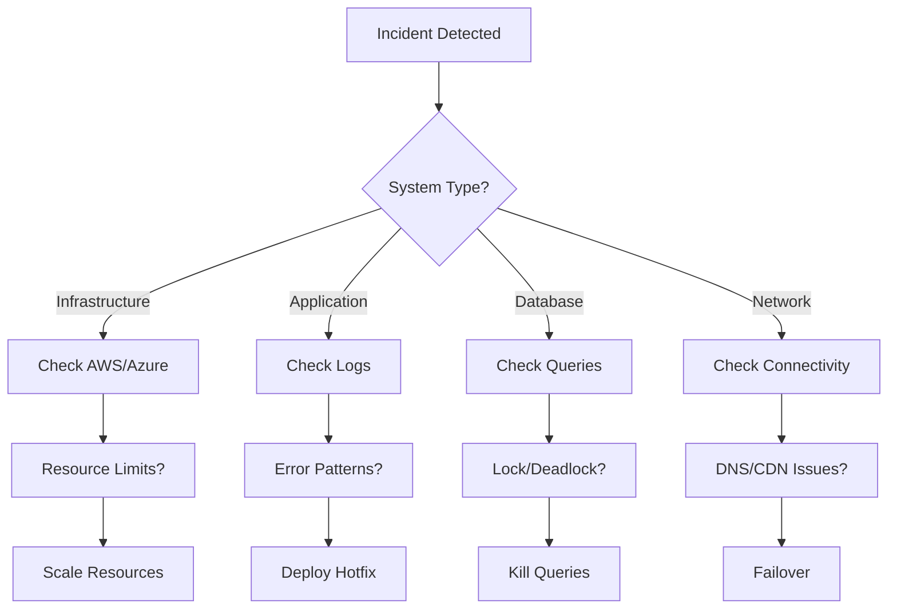
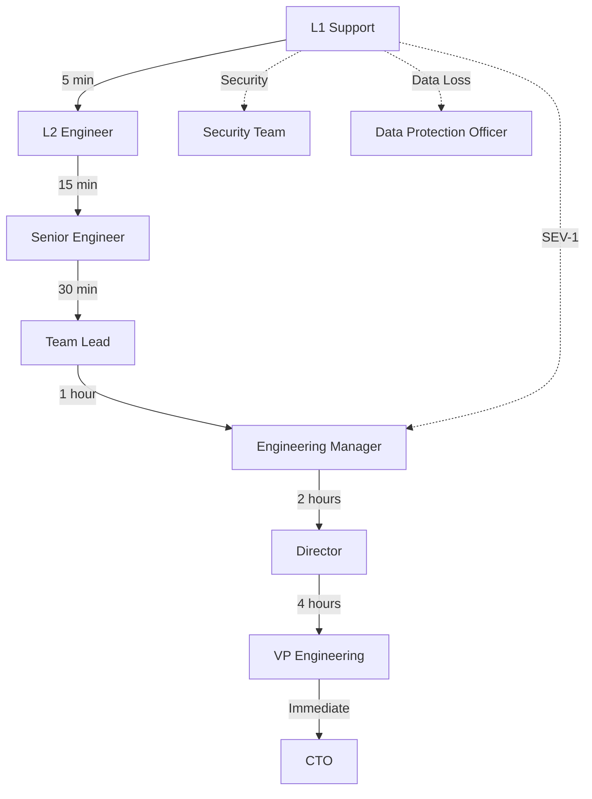

# Incident Response Runbook
## NovaCron v10 Extended - Critical Incident Management

### Document Information
- **Version**: 1.0.0
- **Last Updated**: 2025-01-05
- **Classification**: CRITICAL
- **Review Frequency**: Monthly

---

## 1. Incident Severity Classification

### Severity Levels

#### SEV-1 (Critical)
- **Definition**: Complete system outage or data loss risk
- **Response Time**: < 5 minutes
- **Escalation**: Immediate to CTO/VP Engineering
- **Examples**:
  - Complete platform unavailability
  - Data corruption or loss
  - Security breach detected
  - Payment system failure

#### SEV-2 (High)
- **Definition**: Major feature degradation affecting >30% users
- **Response Time**: < 15 minutes
- **Escalation**: 30 minutes to Engineering Manager
- **Examples**:
  - Core service degradation
  - Database performance critical
  - Authentication system issues
  - Scheduling engine failures

#### SEV-3 (Medium)
- **Definition**: Service degradation affecting <30% users
- **Response Time**: < 30 minutes
- **Escalation**: 2 hours to Team Lead
- **Examples**:
  - Single region performance issues
  - Non-critical feature failures
  - UI/UX bugs affecting workflow

#### SEV-4 (Low)
- **Definition**: Minor issues with workarounds available
- **Response Time**: < 2 hours
- **Escalation**: Next business day
- **Examples**:
  - Minor UI glitches
  - Non-critical API delays
  - Documentation issues

---

## 2. Incident Response Procedures

### Initial Response (0-5 minutes)

```bash
#!/bin/bash
# incident-response.sh

INCIDENT_ID=$(date +%Y%m%d%H%M%S)
SEVERITY=$1
DESCRIPTION="$2"

# Step 1: Create incident record
echo "Creating incident $INCIDENT_ID - SEV-$SEVERITY"
curl -X POST https://api.novacron.io/v1/incidents \
  -H "Authorization: Bearer $INCIDENT_TOKEN" \
  -d "{
    \"id\": \"$INCIDENT_ID\",
    \"severity\": $SEVERITY,
    \"description\": \"$DESCRIPTION\",
    \"status\": \"investigating\"
  }"

# Step 2: Trigger automated diagnostics
./scripts/auto-diagnostics.sh $INCIDENT_ID

# Step 3: Page on-call engineer
./scripts/page-oncall.sh $SEVERITY $INCIDENT_ID

# Step 4: Create war room
if [ $SEVERITY -le 2 ]; then
  ./scripts/create-warroom.sh $INCIDENT_ID
fi

# Step 5: Start recording metrics
./scripts/incident-metrics.sh start $INCIDENT_ID
```

### Triage Process (5-15 minutes)

#### 1. System Status Check
```bash
# Check all critical systems
novacron health check --all --verbose

# Service status matrix
┌─────────────────┬──────────┬─────────┬──────────┐
│ Service         │ Status   │ Latency │ Error %  │
├─────────────────┼──────────┼─────────┼──────────┤
│ API Gateway     │ ✓ Online │ 45ms    │ 0.01%    │
│ Scheduler       │ ✓ Online │ 12ms    │ 0.00%    │
│ Worker Pool     │ ⚠ Degraded│ 230ms   │ 2.3%     │
│ Database        │ ✓ Online │ 5ms     │ 0.00%    │
│ Cache Layer     │ ✓ Online │ 1ms     │ 0.00%    │
│ Message Queue   │ ✓ Online │ 8ms     │ 0.02%    │
└─────────────────┴──────────┴─────────┴──────────┘
```

#### 2. Impact Assessment
```yaml
impact_assessment:
  affected_users:
    query: |
      SELECT COUNT(DISTINCT user_id) 
      FROM error_logs 
      WHERE timestamp > NOW() - INTERVAL '15 minutes'
    threshold: 
      critical: "> 10000"
      high: "> 1000"
      medium: "> 100"
      low: "< 100"
  
  affected_regions:
    - us-east-1: check
    - us-west-2: check
    - eu-central-1: check
    - ap-southeast-1: check
  
  business_impact:
    revenue_loss: calculate_per_minute
    sla_breach: check_agreements
    compliance_risk: assess_requirements
```

#### 3. Root Cause Analysis


### Mitigation Actions

#### Automated Recovery Procedures
```go
// auto_recovery.go
package incident

type RecoveryAction struct {
    ID          string
    Type        string
    Automated   bool
    Approval    string
}

var RecoveryPlaybook = map[string][]RecoveryAction{
    "high_cpu": {
        {ID: "scale_horizontal", Type: "infrastructure", Automated: true},
        {ID: "cache_clear", Type: "application", Automated: true},
        {ID: "query_optimization", Type: "database", Automated: false},
    },
    "memory_leak": {
        {ID: "restart_pods", Type: "kubernetes", Automated: true},
        {ID: "heap_dump", Type: "diagnostic", Automated: true},
        {ID: "rollback_deploy", Type: "deployment", Automated: false},
    },
    "database_slow": {
        {ID: "kill_long_queries", Type: "database", Automated: true},
        {ID: "index_rebuild", Type: "database", Automated: false},
        {ID: "read_replica_promote", Type: "database", Automated: false},
    },
}
```

#### Manual Intervention Procedures

##### Database Recovery
```sql
-- Emergency query termination
SELECT pg_cancel_backend(pid) 
FROM pg_stat_activity 
WHERE state = 'active' 
  AND query_start < NOW() - INTERVAL '5 minutes'
  AND query NOT LIKE '%pg_stat_activity%';

-- Connection pool reset
ALTER SYSTEM SET max_connections = 500;
SELECT pg_reload_conf();

-- Emergency vacuum
VACUUM ANALYZE VERBOSE;
```

##### Application Recovery
```bash
# Rolling restart with health checks
kubectl rollout restart deployment/novacron-api -n production
kubectl rollout status deployment/novacron-api -n production --timeout=10m

# Circuit breaker reset
curl -X POST https://internal.novacron.io/admin/circuit-breaker/reset \
  -H "X-Admin-Token: $ADMIN_TOKEN"

# Cache invalidation
redis-cli --cluster call all FLUSHALL
```

---

## 3. Communication Protocols

### Internal Communication

#### War Room Structure
```yaml
war_room:
  channels:
    primary: "#incident-${INCIDENT_ID}"
    status: "#incident-status"
    engineering: "#engineering-oncall"
  
  roles:
    incident_commander:
      responsibilities:
        - Overall coordination
        - External communication
        - Decision authority
    
    technical_lead:
      responsibilities:
        - Technical investigation
        - Solution implementation
        - Resource coordination
    
    communications_lead:
      responsibilities:
        - Status updates
        - Stakeholder communication
        - Documentation
    
    scribe:
      responsibilities:
        - Timeline documentation
        - Action items tracking
        - Post-mortem preparation
```

### External Communication

#### Customer Notification Templates

##### Initial Alert
```markdown
Subject: [NovaCron] Service Degradation Detected

We are currently investigating reports of service degradation affecting [AFFECTED_FEATURE].

**Impact**: [DESCRIPTION]
**Affected Regions**: [REGIONS]
**Start Time**: [TIMESTAMP]
**Status**: Investigating

We will provide updates every 30 minutes at status.novacron.io
```

##### Resolution Notice
```markdown
Subject: [NovaCron] Service Restored

The service degradation affecting [AFFECTED_FEATURE] has been resolved.

**Resolution Time**: [TIMESTAMP]
**Root Cause**: [BRIEF_DESCRIPTION]
**Actions Taken**: [SUMMARY]

A detailed post-mortem will be available within 48 hours.
```

---

## 4. Escalation Matrix

### Escalation Paths



### Contact Information

| Role | Primary | Backup | Phone |
|------|---------|--------|-------|
| On-Call Engineer | PagerDuty | Slack | +1-xxx-xxx-xxxx |
| Team Lead | Email | Slack | +1-xxx-xxx-xxxx |
| Engineering Manager | Phone | PagerDuty | +1-xxx-xxx-xxxx |
| Director | Phone | Email | +1-xxx-xxx-xxxx |
| VP Engineering | Phone | Phone | +1-xxx-xxx-xxxx |
| CTO | Phone | Phone | +1-xxx-xxx-xxxx |
| Security Team | PagerDuty | Phone | +1-xxx-xxx-xxxx |
| Legal | Email | Phone | +1-xxx-xxx-xxxx |

---

## 5. Recovery Validation

### Service Restoration Checklist

```bash
#!/bin/bash
# recovery-validation.sh

echo "=== Recovery Validation Checklist ==="

# 1. Service Health
echo "[1/8] Checking service health..."
for service in api scheduler worker database cache queue; do
  status=$(curl -s https://internal.novacron.io/health/$service | jq -r .status)
  echo "  - $service: $status"
done

# 2. Error Rates
echo "[2/8] Validating error rates..."
ERROR_RATE=$(curl -s https://metrics.novacron.io/error-rate | jq -r .rate)
if (( $(echo "$ERROR_RATE < 0.1" | bc -l) )); then
  echo "  ✓ Error rate normal: ${ERROR_RATE}%"
else
  echo "  ✗ Error rate high: ${ERROR_RATE}%"
fi

# 3. Response Times
echo "[3/8] Checking response times..."
P99=$(curl -s https://metrics.novacron.io/latency/p99 | jq -r .value)
echo "  - P99 Latency: ${P99}ms"

# 4. Database Performance
echo "[4/8] Validating database performance..."
DB_CONNS=$(psql -h $DB_HOST -U $DB_USER -c "SELECT count(*) FROM pg_stat_activity;" -t)
echo "  - Active connections: $DB_CONNS"

# 5. Queue Depth
echo "[5/8] Checking message queues..."
QUEUE_DEPTH=$(aws sqs get-queue-attributes --queue-url $QUEUE_URL --attribute-names ApproximateNumberOfMessages | jq -r .Attributes.ApproximateNumberOfMessages)
echo "  - Queue depth: $QUEUE_DEPTH"

# 6. Cache Hit Rate
echo "[6/8] Validating cache performance..."
CACHE_HIT=$(redis-cli INFO stats | grep keyspace_hits | cut -d: -f2)
echo "  - Cache hit rate: ${CACHE_HIT}%"

# 7. User Impact
echo "[7/8] Checking user impact..."
AFFECTED_USERS=$(curl -s https://analytics.novacron.io/affected-users | jq -r .count)
echo "  - Currently affected users: $AFFECTED_USERS"

# 8. Monitoring Alerts
echo "[8/8] Checking monitoring alerts..."
ACTIVE_ALERTS=$(curl -s https://alerts.novacron.io/active | jq -r '.alerts | length')
echo "  - Active alerts: $ACTIVE_ALERTS"

echo "=== Validation Complete ==="
```

### Success Criteria

```yaml
recovery_success_criteria:
  mandatory:
    - all_services_healthy: true
    - error_rate: "< 0.1%"
    - p99_latency: "< 500ms"
    - active_alerts: 0
    - user_complaints: 0
  
  recommended:
    - cache_hit_rate: "> 95%"
    - database_connections: "< 80%"
    - queue_depth: "< 1000"
    - cpu_usage: "< 70%"
    - memory_usage: "< 80%"
```

---

## 6. Post-Incident Procedures

### Immediate Actions (Within 2 hours)

1. **Incident Timeline Documentation**
```markdown
## Incident Timeline - INC-[ID]

- **[TIME]** - Initial alert received
- **[TIME]** - On-call engineer engaged
- **[TIME]** - War room created
- **[TIME]** - Root cause identified
- **[TIME]** - Mitigation started
- **[TIME]** - Service restored
- **[TIME]** - Monitoring confirmed normal
```

2. **Stakeholder Notification**
3. **Evidence Collection**
4. **Metric Preservation**

### Post-Mortem Process (Within 48 hours)

#### Post-Mortem Template
```markdown
# Post-Mortem: [INCIDENT_ID]

## Executive Summary
[2-3 sentences describing the incident and impact]

## Impact
- **Duration**: [START] to [END] ([TOTAL_TIME])
- **Affected Users**: [NUMBER] ([PERCENTAGE]%)
- **Revenue Impact**: $[AMOUNT]
- **SLA Impact**: [YES/NO]

## Timeline
[Detailed timeline of events]

## Root Cause
[Technical explanation of what caused the incident]

## Contributing Factors
1. [Factor 1]
2. [Factor 2]
3. [Factor 3]

## What Went Well
- [Success 1]
- [Success 2]

## What Could Be Improved
- [Improvement 1]
- [Improvement 2]

## Action Items
| Action | Owner | Due Date | Priority |
|--------|-------|----------|----------|
| [Action 1] | [Name] | [Date] | [P0/P1/P2] |
| [Action 2] | [Name] | [Date] | [P0/P1/P2] |

## Lessons Learned
[Key takeaways for the organization]
```

---

## 7. Automation Scripts

### Auto-Diagnostics Script
```python
#!/usr/bin/env python3
# auto-diagnostics.py

import subprocess
import json
import boto3
import requests
from datetime import datetime, timedelta

class IncidentDiagnostics:
    def __init__(self, incident_id):
        self.incident_id = incident_id
        self.diagnostics = {}
        
    def collect_system_metrics(self):
        """Collect system-level metrics"""
        metrics = {
            'cpu_usage': self.get_cpu_usage(),
            'memory_usage': self.get_memory_usage(),
            'disk_usage': self.get_disk_usage(),
            'network_stats': self.get_network_stats(),
            'process_count': self.get_process_count()
        }
        self.diagnostics['system'] = metrics
        
    def collect_application_metrics(self):
        """Collect application-level metrics"""
        metrics = {
            'error_rate': self.get_error_rate(),
            'response_time': self.get_response_times(),
            'throughput': self.get_throughput(),
            'active_users': self.get_active_users()
        }
        self.diagnostics['application'] = metrics
        
    def collect_database_metrics(self):
        """Collect database metrics"""
        metrics = {
            'connection_pool': self.get_db_connections(),
            'slow_queries': self.get_slow_queries(),
            'lock_waits': self.get_lock_waits(),
            'replication_lag': self.get_replication_lag()
        }
        self.diagnostics['database'] = metrics
        
    def analyze_patterns(self):
        """Analyze patterns in collected metrics"""
        patterns = {
            'anomalies': self.detect_anomalies(),
            'correlations': self.find_correlations(),
            'trends': self.identify_trends()
        }
        self.diagnostics['analysis'] = patterns
        
    def generate_report(self):
        """Generate diagnostic report"""
        report = {
            'incident_id': self.incident_id,
            'timestamp': datetime.utcnow().isoformat(),
            'diagnostics': self.diagnostics,
            'recommendations': self.get_recommendations()
        }
        return json.dumps(report, indent=2)
    
    def get_recommendations(self):
        """Generate recommendations based on diagnostics"""
        recommendations = []
        
        # Check CPU usage
        if self.diagnostics['system']['cpu_usage'] > 80:
            recommendations.append({
                'type': 'scale',
                'action': 'Increase compute resources',
                'priority': 'high'
            })
            
        # Check error rate
        if self.diagnostics['application']['error_rate'] > 1:
            recommendations.append({
                'type': 'investigate',
                'action': 'Review application logs for errors',
                'priority': 'critical'
            })
            
        return recommendations
```

### Incident Metrics Collection
```go
// incident_metrics.go
package metrics

import (
    "time"
    "github.com/prometheus/client_golang/prometheus"
)

type IncidentMetrics struct {
    StartTime    time.Time
    DetectionTime time.Duration
    ResponseTime  time.Duration
    ResolutionTime time.Duration
    Severity     int
    AffectedUsers int
    ErrorRate    float64
}

func CollectIncidentMetrics(incidentID string) *IncidentMetrics {
    metrics := &IncidentMetrics{
        StartTime: time.Now(),
    }
    
    // Collect detection metrics
    metrics.DetectionTime = calculateDetectionTime(incidentID)
    
    // Collect response metrics
    metrics.ResponseTime = calculateResponseTime(incidentID)
    
    // Collect impact metrics
    metrics.AffectedUsers = getAffectedUserCount()
    metrics.ErrorRate = getCurrentErrorRate()
    
    // Export to Prometheus
    incidentDuration.WithLabelValues(incidentID).Set(
        metrics.ResolutionTime.Seconds(),
    )
    
    return metrics
}

func calculateMTTR(incidents []IncidentMetrics) time.Duration {
    var total time.Duration
    for _, inc := range incidents {
        total += inc.ResolutionTime
    }
    return total / time.Duration(len(incidents))
}
```

---

## 8. Special Scenarios

### Data Loss Incident
```bash
#!/bin/bash
# data-loss-response.sh

# 1. Immediate isolation
echo "Isolating affected systems..."
kubectl cordon -n production node/$AFFECTED_NODE

# 2. Stop writes
echo "Halting write operations..."
curl -X POST https://internal.novacron.io/admin/readonly-mode \
  -H "X-Admin-Token: $ADMIN_TOKEN"

# 3. Assess damage
echo "Assessing data loss extent..."
psql -h $DB_HOST -U $DB_USER << EOF
SELECT 
    schemaname,
    tablename,
    pg_size_pretty(pg_total_relation_size(schemaname||'.'||tablename)) AS size,
    n_live_tup AS row_count
FROM pg_stat_user_tables
ORDER BY n_live_tup DESC;
EOF

# 4. Initiate recovery
echo "Starting recovery procedures..."
./scripts/restore-from-backup.sh --point-in-time "$INCIDENT_TIME"
```

### Security Breach
```python
# security-breach-response.py
import os
import hashlib
import requests
from datetime import datetime

class SecurityIncidentResponse:
    def __init__(self):
        self.incident_id = self.generate_incident_id()
        self.containment_actions = []
        
    def immediate_containment(self):
        """Execute immediate containment actions"""
        
        # 1. Revoke all tokens
        self.revoke_all_tokens()
        
        # 2. Reset passwords
        self.force_password_reset()
        
        # 3. Block suspicious IPs
        self.block_suspicious_ips()
        
        # 4. Enable enhanced monitoring
        self.enable_enhanced_monitoring()
        
        # 5. Preserve evidence
        self.preserve_evidence()
        
    def revoke_all_tokens(self):
        """Revoke all active authentication tokens"""
        response = requests.post(
            "https://auth.novacron.io/admin/revoke-all",
            headers={"X-Admin-Token": os.environ['ADMIN_TOKEN']}
        )
        self.containment_actions.append({
            'action': 'revoke_tokens',
            'timestamp': datetime.utcnow(),
            'status': response.status_code
        })
        
    def preserve_evidence(self):
        """Preserve forensic evidence"""
        commands = [
            "tar -czf /secure/evidence/logs-{}.tar.gz /var/log/",
            "mysqldump --all-databases > /secure/evidence/db-{}.sql",
            "cp -r /var/lib/docker /secure/evidence/containers-{}"
        ]
        
        for cmd in commands:
            os.system(cmd.format(self.incident_id))
```

---

## 9. Appendix

### Quick Reference Commands

```bash
# Service Status
novacron status --all

# Recent Errors
novacron logs --errors --since 1h

# Database Status
novacron db status --detailed

# Cache Status
novacron cache status

# Queue Status
novacron queue status --all

# Network Diagnostics
novacron network test --all-regions

# Deployment Rollback
novacron deploy rollback --to-previous

# Emergency Scale
novacron scale --service all --replicas +50%

# Circuit Breaker Status
novacron circuit-breaker status

# Feature Flags
novacron feature-flags disable --all
```

### Important URLs

- **Status Page**: https://status.novacron.io
- **Metrics Dashboard**: https://metrics.novacron.io
- **Admin Panel**: https://admin.novacron.io
- **War Room**: https://warroom.novacron.io
- **Runbook Library**: https://runbooks.novacron.io
- **Post-Mortem Archive**: https://postmortems.novacron.io

### Regulatory Compliance

- **GDPR**: Data breach notification within 72 hours
- **CCPA**: Consumer notification without unreasonable delay
- **HIPAA**: Breach notification within 60 days
- **PCI-DSS**: Immediate notification to card brands
- **SOC2**: Documented incident response procedures

---

**Document Review Schedule**: Monthly
**Last Review**: 2025-01-05
**Next Review**: 2025-02-05
**Owner**: Platform Operations Team