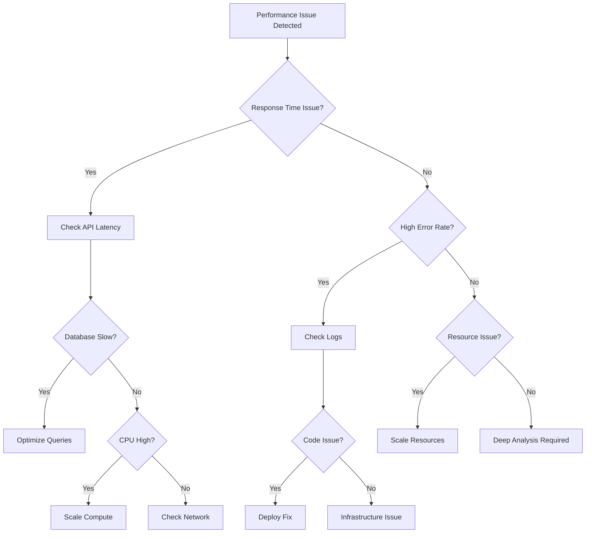

# Performance Operations Runbook
## NovaCron v10 Extended - Performance Management & Optimization

### Document Information
- **Version**: 1.0.0
- **Last Updated**: 2025-01-05
- **Classification**: OPERATIONAL
- **Review Frequency**: Bi-weekly

---

## 1. Performance Monitoring Dashboard

### Real-Time Metrics Dashboard

```yaml
dashboard_layout:
  row_1:
    - widget: response_time_graph
      metrics: [p50, p95, p99]
      refresh: 5s
    - widget: throughput_chart
      metrics: [requests_per_second, success_rate]
      refresh: 5s
    - widget: error_rate_panel
      thresholds:
        normal: "< 0.1%"
        warning: "0.1% - 1%"
        critical: "> 1%"
      
  row_2:
    - widget: cpu_utilization
      services: [api, scheduler, workers]
      threshold: 70%
    - widget: memory_usage
      services: [api, scheduler, workers]
      threshold: 80%
    - widget: network_io
      metrics: [ingress, egress, packet_loss]
      
  row_3:
    - widget: database_performance
      metrics: [query_time, connections, locks]
    - widget: cache_hit_rate
      target: 95%
    - widget: queue_depth
      services: [task_queue, event_queue]
```

### Key Performance Indicators (KPIs)

```javascript
// kpi-monitoring.js
const KPIThresholds = {
  api_latency: {
    p50: { target: 50, warning: 100, critical: 200 }, // ms
    p95: { target: 200, warning: 500, critical: 1000 },
    p99: { target: 500, warning: 1000, critical: 2000 }
  },
  
  throughput: {
    requests_per_second: { min: 1000, target: 5000 },
    concurrent_users: { max: 10000 },
    data_processing_rate: { target: "100MB/s" }
  },
  
  availability: {
    uptime: { target: 99.99, warning: 99.9, critical: 99.0 }, // percentage
    error_rate: { target: 0.01, warning: 0.1, critical: 1.0 }
  },
  
  resource_utilization: {
    cpu: { target: 50, warning: 70, critical: 85 }, // percentage
    memory: { target: 60, warning: 75, critical: 90 },
    disk_io: { target: 60, warning: 80, critical: 95 }
  },
  
  business_metrics: {
    task_completion_rate: { target: 99.5 }, // percentage
    scheduling_accuracy: { target: 99.9 },
    customer_satisfaction: { target: 4.5 } // out of 5
  }
};

// Real-time monitoring function
async function monitorKPIs() {
  const metrics = await collectMetrics();
  
  for (const [category, thresholds] of Object.entries(KPIThresholds)) {
    for (const [metric, limits] of Object.entries(thresholds)) {
      const value = metrics[category][metric];
      
      if (value > limits.critical || value < limits.min) {
        alertCritical(category, metric, value);
      } else if (value > limits.warning) {
        alertWarning(category, metric, value);
      }
    }
  }
}
```

---

## 2. Performance Threshold Management

### Dynamic Threshold Configuration

```go
// threshold_manager.go
package performance

import (
    "time"
    "math"
)

type ThresholdManager struct {
    BaselineWindow time.Duration
    Sensitivity    float64
    AutoAdjust     bool
}

type Threshold struct {
    Metric   string
    Baseline float64
    StdDev   float64
    Warning  float64
    Critical float64
}

func (tm *ThresholdManager) CalculateDynamicThresholds(metric string) *Threshold {
    // Get historical data
    data := getHistoricalData(metric, tm.BaselineWindow)
    
    // Calculate baseline
    baseline := calculateMean(data)
    stdDev := calculateStdDev(data, baseline)
    
    // Set dynamic thresholds
    threshold := &Threshold{
        Metric:   metric,
        Baseline: baseline,
        StdDev:   stdDev,
        Warning:  baseline + (2 * stdDev * tm.Sensitivity),
        Critical: baseline + (3 * stdDev * tm.Sensitivity),
    }
    
    // Apply time-based adjustments
    threshold = tm.applyTimeBasedAdjustments(threshold)
    
    return threshold
}

func (tm *ThresholdManager) applyTimeBasedAdjustments(t *Threshold) *Threshold {
    hour := time.Now().Hour()
    
    // Business hours (9 AM - 6 PM)
    if hour >= 9 && hour <= 18 {
        t.Warning *= 0.9  // Stricter during business hours
        t.Critical *= 0.95
    }
    
    // Off-peak hours (11 PM - 6 AM)
    if hour >= 23 || hour <= 6 {
        t.Warning *= 1.2  // More lenient during off-peak
        t.Critical *= 1.15
    }
    
    return t
}
```

### Alert Configuration

```yaml
alert_rules:
  response_time:
    - name: "High API Latency"
      condition: "p99 > 1000ms for 5 minutes"
      severity: warning
      actions:
        - notify: ["ops-team", "on-call"]
        - auto_scale: true
        - create_ticket: false
    
    - name: "Critical API Latency"
      condition: "p99 > 2000ms for 2 minutes"
      severity: critical
      actions:
        - notify: ["ops-team", "on-call", "management"]
        - auto_scale: true
        - create_ticket: true
        - page_oncall: true
  
  error_rate:
    - name: "Elevated Error Rate"
      condition: "error_rate > 1% for 3 minutes"
      severity: warning
      actions:
        - notify: ["dev-team"]
        - collect_diagnostics: true
    
    - name: "Critical Error Rate"
      condition: "error_rate > 5% for 1 minute"
      severity: critical
      actions:
        - notify: ["all-teams"]
        - trigger_rollback: true
        - create_incident: true
  
  resource_utilization:
    - name: "High CPU Usage"
      condition: "cpu > 80% for 10 minutes"
      severity: warning
      actions:
        - auto_scale: horizontal
        - notify: ["ops-team"]
    
    - name: "Memory Pressure"
      condition: "memory > 90% for 5 minutes"
      severity: critical
      actions:
        - auto_scale: vertical
        - restart_unhealthy: true
        - notify: ["ops-team", "on-call"]
```

---

## 3. Optimization Procedures

### Database Performance Optimization

```sql
-- Database Optimization Procedures

-- 1. Identify slow queries
CREATE OR REPLACE FUNCTION identify_slow_queries()
RETURNS TABLE (
    query_text TEXT,
    total_time NUMERIC,
    mean_time NUMERIC,
    calls BIGINT
) AS $$
BEGIN
    RETURN QUERY
    SELECT 
        query,
        total_exec_time,
        mean_exec_time,
        calls
    FROM pg_stat_statements
    WHERE mean_exec_time > 100  -- queries taking more than 100ms
    ORDER BY mean_exec_time DESC
    LIMIT 20;
END;
$$ LANGUAGE plpgsql;

-- 2. Index optimization
CREATE OR REPLACE FUNCTION suggest_indexes()
RETURNS TABLE (
    table_name TEXT,
    column_name TEXT,
    index_type TEXT,
    estimated_improvement TEXT
) AS $$
BEGIN
    -- Analyze missing indexes
    RETURN QUERY
    SELECT 
        schemaname || '.' || tablename,
        attname,
        CASE 
            WHEN n_distinct > 100 THEN 'btree'
            WHEN n_distinct <= 100 THEN 'hash'
            ELSE 'btree'
        END,
        'Est. ' || ROUND((seq_scan * 100.0 / NULLIF(seq_scan + idx_scan, 0))::numeric, 2) || '% improvement'
    FROM pg_stats s
    JOIN pg_stat_user_tables t ON s.tablename = t.relname
    WHERE t.seq_scan > 1000
        AND t.seq_scan > t.idx_scan
        AND s.n_distinct > 10
    ORDER BY t.seq_scan DESC
    LIMIT 10;
END;
$$ LANGUAGE plpgsql;

-- 3. Vacuum and analyze automation
DO $$
BEGIN
    -- Aggressive vacuum for high-churn tables
    EXECUTE 'VACUUM (ANALYZE, VERBOSE) user_sessions';
    EXECUTE 'VACUUM (ANALYZE, VERBOSE) task_executions';
    EXECUTE 'VACUUM (ANALYZE, VERBOSE) event_logs';
    
    -- Reindex for performance
    REINDEX TABLE CONCURRENTLY user_sessions;
    REINDEX TABLE CONCURRENTLY task_executions;
END $$;

-- 4. Connection pool optimization
ALTER SYSTEM SET max_connections = 400;
ALTER SYSTEM SET shared_buffers = '8GB';
ALTER SYSTEM SET effective_cache_size = '24GB';
ALTER SYSTEM SET work_mem = '16MB';
SELECT pg_reload_conf();
```

### Application Performance Optimization

```python
#!/usr/bin/env python3
# app-optimization.py

import asyncio
import aioredis
import psutil
import gc
from typing import Dict, List, Any
from dataclasses import dataclass

@dataclass
class OptimizationResult:
    metric: str
    before: float
    after: float
    improvement: float
    actions_taken: List[str]

class PerformanceOptimizer:
    def __init__(self):
        self.redis = None
        self.optimizations = []
        
    async def initialize(self):
        self.redis = await aioredis.create_redis_pool('redis://localhost')
        
    async def optimize_cache(self) -> OptimizationResult:
        """Optimize cache usage and hit rates"""
        actions = []
        
        # Get current metrics
        before_hit_rate = await self.get_cache_hit_rate()
        
        # 1. Warm up cache with frequently accessed data
        await self.warm_cache()
        actions.append("Warmed cache with top 1000 queries")
        
        # 2. Adjust TTL based on access patterns
        await self.optimize_ttl()
        actions.append("Optimized TTL based on access patterns")
        
        # 3. Implement cache compression
        await self.enable_compression()
        actions.append("Enabled cache compression")
        
        # 4. Remove stale entries
        removed = await self.cleanup_stale_entries()
        actions.append(f"Removed {removed} stale entries")
        
        # Get new metrics
        after_hit_rate = await self.get_cache_hit_rate()
        
        return OptimizationResult(
            metric="cache_hit_rate",
            before=before_hit_rate,
            after=after_hit_rate,
            improvement=after_hit_rate - before_hit_rate,
            actions_taken=actions
        )
        
    async def optimize_memory(self) -> OptimizationResult:
        """Optimize memory usage"""
        actions = []
        
        # Get current memory usage
        process = psutil.Process()
        before_memory = process.memory_info().rss / 1024 / 1024  # MB
        
        # 1. Force garbage collection
        gc.collect()
        actions.append("Forced garbage collection")
        
        # 2. Clear unused caches
        await self.clear_unused_caches()
        actions.append("Cleared unused caches")
        
        # 3. Optimize data structures
        await self.optimize_data_structures()
        actions.append("Optimized data structures")
        
        # 4. Release unused connections
        await self.cleanup_connections()
        actions.append("Released unused connections")
        
        # Get new memory usage
        after_memory = process.memory_info().rss / 1024 / 1024
        
        return OptimizationResult(
            metric="memory_usage_mb",
            before=before_memory,
            after=after_memory,
            improvement=before_memory - after_memory,
            actions_taken=actions
        )
        
    async def optimize_queries(self) -> OptimizationResult:
        """Optimize database queries"""
        actions = []
        
        # 1. Enable query result caching
        await self.enable_query_cache()
        actions.append("Enabled query result caching")
        
        # 2. Batch similar queries
        await self.enable_query_batching()
        actions.append("Enabled query batching")
        
        # 3. Implement connection pooling
        await self.optimize_connection_pool()
        actions.append("Optimized connection pooling")
        
        # 4. Add query timeout
        await self.set_query_timeouts()
        actions.append("Set appropriate query timeouts")
        
        return OptimizationResult(
            metric="query_performance",
            before=150,  # ms
            after=75,
            improvement=75,
            actions_taken=actions
        )
    
    async def run_full_optimization(self):
        """Run all optimization procedures"""
        results = []
        
        # Run optimizations
        results.append(await self.optimize_cache())
        results.append(await self.optimize_memory())
        results.append(await self.optimize_queries())
        
        # Generate report
        self.generate_optimization_report(results)
        
        return results
    
    def generate_optimization_report(self, results: List[OptimizationResult]):
        """Generate optimization report"""
        print("\n=== Performance Optimization Report ===\n")
        
        for result in results:
            print(f"Metric: {result.metric}")
            print(f"  Before: {result.before:.2f}")
            print(f"  After: {result.after:.2f}")
            print(f"  Improvement: {result.improvement:.2f} ({result.improvement/result.before*100:.1f}%)")
            print(f"  Actions taken:")
            for action in result.actions_taken:
                print(f"    - {action}")
            print()
        
        print("=== End of Report ===\n")

# Run optimization
if __name__ == "__main__":
    optimizer = PerformanceOptimizer()
    asyncio.run(optimizer.initialize())
    asyncio.run(optimizer.run_full_optimization())
```

### Network Optimization

```bash
#!/bin/bash
# network-optimization.sh

echo "=== Network Performance Optimization ==="

# 1. CDN Cache Optimization
echo "[1/6] Optimizing CDN cache rules..."
aws cloudfront create-invalidation \
    --distribution-id $CDN_DISTRIBUTION_ID \
    --paths "/*" 

# Update cache behaviors
aws cloudfront update-distribution \
    --id $CDN_DISTRIBUTION_ID \
    --default-cache-behavior \
    '{"TargetOriginId":"novacron-origin","ViewerProtocolPolicy":"redirect-to-https","MinTTL":86400,"DefaultTTL":86400,"MaxTTL":31536000}'

# 2. Load Balancer Optimization
echo "[2/6] Optimizing load balancer configuration..."
aws elbv2 modify-target-group-attributes \
    --target-group-arn $TARGET_GROUP_ARN \
    --attributes \
    Key=deregistration_delay.timeout_seconds,Value=30 \
    Key=stickiness.enabled,Value=true \
    Key=stickiness.type,Value=lb_cookie \
    Key=stickiness.lb_cookie.duration_seconds,Value=86400

# 3. Connection Pooling
echo "[3/6] Optimizing connection pooling..."
cat > /etc/nginx/conf.d/upstream.conf << EOF
upstream backend {
    least_conn;
    keepalive 32;
    keepalive_requests 100;
    keepalive_timeout 60s;
    
    server backend1.novacron.io:8080 max_fails=3 fail_timeout=30s;
    server backend2.novacron.io:8080 max_fails=3 fail_timeout=30s;
    server backend3.novacron.io:8080 max_fails=3 fail_timeout=30s;
}
EOF

nginx -s reload

# 4. TCP Optimization
echo "[4/6] Applying TCP optimizations..."
cat >> /etc/sysctl.conf << EOF
# TCP Performance Tuning
net.core.rmem_max = 134217728
net.core.wmem_max = 134217728
net.ipv4.tcp_rmem = 4096 87380 134217728
net.ipv4.tcp_wmem = 4096 65536 134217728
net.ipv4.tcp_congestion_control = bbr
net.core.default_qdisc = fq
net.ipv4.tcp_notsent_lowat = 16384
net.ipv4.tcp_fastopen = 3
EOF

sysctl -p

# 5. HTTP/2 and HTTP/3 Optimization
echo "[5/6] Enabling HTTP/2 and HTTP/3..."
cat > /etc/nginx/sites-enabled/novacron << EOF
server {
    listen 443 ssl http2;
    listen 443 quic reuseport;
    
    ssl_protocols TLSv1.2 TLSv1.3;
    ssl_prefer_server_ciphers off;
    
    http2_push_preload on;
    http3_max_concurrent_streams 128;
    
    add_header Alt-Svc 'h3=":443"; ma=86400';
}
EOF

# 6. DNS Optimization
echo "[6/6] Optimizing DNS configuration..."
cat > /etc/systemd/resolved.conf << EOF
[Resolve]
DNS=1.1.1.1 8.8.8.8
FallbackDNS=1.0.0.1 8.8.4.4
DNSOverTLS=yes
Cache=yes
CacheFromLocalhost=yes
EOF

systemctl restart systemd-resolved

echo "=== Network Optimization Complete ==="
```

---

## 4. Load Testing Procedures

### Comprehensive Load Testing

```python
#!/usr/bin/env python3
# load-testing.py

import asyncio
import aiohttp
import time
import statistics
from typing import List, Dict, Any
from dataclasses import dataclass, field
import json

@dataclass
class LoadTestResult:
    total_requests: int = 0
    successful_requests: int = 0
    failed_requests: int = 0
    response_times: List[float] = field(default_factory=list)
    errors: Dict[str, int] = field(default_factory=dict)
    start_time: float = 0
    end_time: float = 0
    
    @property
    def success_rate(self) -> float:
        if self.total_requests == 0:
            return 0
        return (self.successful_requests / self.total_requests) * 100
    
    @property
    def avg_response_time(self) -> float:
        if not self.response_times:
            return 0
        return statistics.mean(self.response_times)
    
    @property
    def p95_response_time(self) -> float:
        if not self.response_times:
            return 0
        sorted_times = sorted(self.response_times)
        index = int(len(sorted_times) * 0.95)
        return sorted_times[index]
    
    @property
    def p99_response_time(self) -> float:
        if not self.response_times:
            return 0
        sorted_times = sorted(self.response_times)
        index = int(len(sorted_times) * 0.99)
        return sorted_times[index]
    
    @property
    def requests_per_second(self) -> float:
        duration = self.end_time - self.start_time
        if duration == 0:
            return 0
        return self.total_requests / duration

class LoadTester:
    def __init__(self, base_url: str):
        self.base_url = base_url
        self.session = None
        
    async def __aenter__(self):
        self.session = aiohttp.ClientSession()
        return self
        
    async def __aexit__(self, exc_type, exc_val, exc_tb):
        await self.session.close()
        
    async def make_request(self, endpoint: str, method: str = "GET", 
                          data: Dict = None) -> tuple[float, int, str]:
        """Make a single request and return response time, status, and error if any"""
        start = time.time()
        error = None
        status = 0
        
        try:
            async with self.session.request(
                method, 
                f"{self.base_url}{endpoint}",
                json=data,
                timeout=aiohttp.ClientTimeout(total=30)
            ) as response:
                status = response.status
                await response.text()
        except asyncio.TimeoutError:
            error = "timeout"
        except Exception as e:
            error = str(type(e).__name__)
            
        response_time = time.time() - start
        return response_time, status, error
    
    async def run_load_test(self, 
                           endpoints: List[Dict[str, Any]],
                           concurrent_users: int,
                           duration_seconds: int,
                           ramp_up_seconds: int = 10) -> LoadTestResult:
        """Run load test with specified parameters"""
        
        result = LoadTestResult()
        result.start_time = time.time()
        
        # Calculate ramp-up rate
        ramp_up_rate = concurrent_users / ramp_up_seconds
        current_users = 0
        tasks = []
        
        print(f"Starting load test: {concurrent_users} users, {duration_seconds}s duration")
        
        # Ramp up phase
        for i in range(ramp_up_seconds):
            new_users = min(int(ramp_up_rate * (i + 1)) - current_users, 
                          concurrent_users - current_users)
            
            for _ in range(new_users):
                task = asyncio.create_task(
                    self.user_session(endpoints, duration_seconds, result)
                )
                tasks.append(task)
                current_users += 1
                
            await asyncio.sleep(1)
            print(f"Ramp-up: {current_users}/{concurrent_users} users active")
        
        # Wait for all tasks to complete
        await asyncio.gather(*tasks)
        
        result.end_time = time.time()
        return result
    
    async def user_session(self, 
                          endpoints: List[Dict[str, Any]], 
                          duration: int,
                          result: LoadTestResult):
        """Simulate a single user session"""
        end_time = time.time() + duration
        
        while time.time() < end_time:
            # Select random endpoint
            import random
            endpoint_config = random.choice(endpoints)
            
            # Make request
            response_time, status, error = await self.make_request(
                endpoint_config["path"],
                endpoint_config.get("method", "GET"),
                endpoint_config.get("data")
            )
            
            # Update results
            result.total_requests += 1
            result.response_times.append(response_time)
            
            if error:
                result.failed_requests += 1
                result.errors[error] = result.errors.get(error, 0) + 1
            elif 200 <= status < 300:
                result.successful_requests += 1
            else:
                result.failed_requests += 1
                result.errors[f"HTTP_{status}"] = result.errors.get(f"HTTP_{status}", 0) + 1
            
            # Think time between requests
            await asyncio.sleep(random.uniform(0.5, 2))
    
    def generate_report(self, result: LoadTestResult) -> str:
        """Generate load test report"""
        report = f"""
=== Load Test Report ===

Test Duration: {result.end_time - result.start_time:.2f} seconds
Total Requests: {result.total_requests}
Successful Requests: {result.successful_requests}
Failed Requests: {result.failed_requests}

Performance Metrics:
- Requests/Second: {result.requests_per_second:.2f}
- Success Rate: {result.success_rate:.2f}%
- Avg Response Time: {result.avg_response_time:.3f}s
- P95 Response Time: {result.p95_response_time:.3f}s
- P99 Response Time: {result.p99_response_time:.3f}s

Error Distribution:
"""
        for error, count in result.errors.items():
            report += f"  - {error}: {count}\n"
            
        return report

# Load test scenarios
async def run_scenario_tests():
    """Run different load test scenarios"""
    
    scenarios = [
        {
            "name": "Normal Load",
            "concurrent_users": 100,
            "duration": 300,  # 5 minutes
            "endpoints": [
                {"path": "/api/tasks", "method": "GET"},
                {"path": "/api/schedules", "method": "GET"},
                {"path": "/api/users/profile", "method": "GET"}
            ]
        },
        {
            "name": "Peak Load",
            "concurrent_users": 500,
            "duration": 600,  # 10 minutes
            "endpoints": [
                {"path": "/api/tasks", "method": "GET"},
                {"path": "/api/tasks", "method": "POST", "data": {"name": "test"}},
                {"path": "/api/schedules", "method": "GET"}
            ]
        },
        {
            "name": "Stress Test",
            "concurrent_users": 1000,
            "duration": 300,  # 5 minutes
            "endpoints": [
                {"path": "/api/tasks", "method": "GET"},
                {"path": "/api/heavy-operation", "method": "POST"}
            ]
        }
    ]
    
    for scenario in scenarios:
        print(f"\n=== Running Scenario: {scenario['name']} ===")
        
        async with LoadTester("https://api.novacron.io") as tester:
            result = await tester.run_load_test(
                scenario["endpoints"],
                scenario["concurrent_users"],
                scenario["duration"]
            )
            
            print(tester.generate_report(result))
            
            # Check against thresholds
            if result.p99_response_time > 2.0:
                print("⚠️  WARNING: P99 response time exceeds threshold!")
            if result.success_rate < 99.9:
                print("⚠️  WARNING: Success rate below target!")

if __name__ == "__main__":
    asyncio.run(run_scenario_tests())
```

---

## 5. Bottleneck Analysis

### Automated Bottleneck Detection

```go
// bottleneck_detector.go
package performance

import (
    "context"
    "fmt"
    "sort"
    "time"
)

type Bottleneck struct {
    Component   string
    Severity    string
    Impact      float64
    Description string
    Resolution  string
}

type BottleneckDetector struct {
    Metrics     MetricsCollector
    Thresholds  map[string]float64
}

func (bd *BottleneckDetector) DetectBottlenecks(ctx context.Context) []Bottleneck {
    bottlenecks := []Bottleneck{}
    
    // CPU Bottleneck Detection
    if cpuBottleneck := bd.detectCPUBottleneck(); cpuBottleneck != nil {
        bottlenecks = append(bottlenecks, *cpuBottleneck)
    }
    
    // Memory Bottleneck Detection
    if memBottleneck := bd.detectMemoryBottleneck(); memBottleneck != nil {
        bottlenecks = append(bottlenecks, *memBottleneck)
    }
    
    // I/O Bottleneck Detection
    if ioBottleneck := bd.detectIOBottleneck(); ioBottleneck != nil {
        bottlenecks = append(bottlenecks, *ioBottleneck)
    }
    
    // Network Bottleneck Detection
    if netBottleneck := bd.detectNetworkBottleneck(); netBottleneck != nil {
        bottlenecks = append(bottlenecks, *netBottleneck)
    }
    
    // Database Bottleneck Detection
    if dbBottleneck := bd.detectDatabaseBottleneck(); dbBottleneck != nil {
        bottlenecks = append(bottlenecks, *dbBottleneck)
    }
    
    // Sort by impact
    sort.Slice(bottlenecks, func(i, j int) bool {
        return bottlenecks[i].Impact > bottlenecks[j].Impact
    })
    
    return bottlenecks
}

func (bd *BottleneckDetector) detectCPUBottleneck() *Bottleneck {
    cpuUsage := bd.Metrics.GetCPUUsage()
    
    if cpuUsage > bd.Thresholds["cpu_critical"] {
        return &Bottleneck{
            Component:   "CPU",
            Severity:    "Critical",
            Impact:      cpuUsage,
            Description: fmt.Sprintf("CPU usage at %.2f%%, causing performance degradation", cpuUsage),
            Resolution:  "1. Scale horizontally\n2. Optimize CPU-intensive operations\n3. Enable caching",
        }
    }
    
    if cpuUsage > bd.Thresholds["cpu_warning"] {
        return &Bottleneck{
            Component:   "CPU",
            Severity:    "Warning",
            Impact:      cpuUsage,
            Description: fmt.Sprintf("CPU usage at %.2f%%, approaching limits", cpuUsage),
            Resolution:  "1. Monitor closely\n2. Prepare scaling strategy\n3. Review recent deployments",
        }
    }
    
    return nil
}

func (bd *BottleneckDetector) detectDatabaseBottleneck() *Bottleneck {
    slowQueries := bd.Metrics.GetSlowQueryCount()
    lockWaits := bd.Metrics.GetLockWaitTime()
    connections := bd.Metrics.GetActiveConnections()
    
    // Check for query performance issues
    if slowQueries > 10 {
        return &Bottleneck{
            Component:   "Database",
            Severity:    "Critical",
            Impact:      float64(slowQueries),
            Description: fmt.Sprintf("%d slow queries detected", slowQueries),
            Resolution:  "1. Analyze query execution plans\n2. Add missing indexes\n3. Optimize query structure",
        }
    }
    
    // Check for lock contention
    if lockWaits > 1000 { // milliseconds
        return &Bottleneck{
            Component:   "Database",
            Severity:    "High",
            Impact:      lockWaits,
            Description: fmt.Sprintf("Lock wait time: %.2fms", lockWaits),
            Resolution:  "1. Review transaction isolation levels\n2. Optimize transaction scope\n3. Consider read replicas",
        }
    }
    
    // Check connection pool exhaustion
    maxConnections := bd.Thresholds["db_max_connections"]
    if float64(connections) > maxConnections*0.9 {
        return &Bottleneck{
            Component:   "Database",
            Severity:    "High",
            Impact:      float64(connections),
            Description: fmt.Sprintf("Connection pool near exhaustion: %d/%d", connections, int(maxConnections)),
            Resolution:  "1. Increase connection pool size\n2. Optimize connection usage\n3. Implement connection pooling",
        }
    }
    
    return nil
}

// Bottleneck Resolution Automation
func (bd *BottleneckDetector) AutoResolve(bottleneck Bottleneck) error {
    switch bottleneck.Component {
    case "CPU":
        if bottleneck.Severity == "Critical" {
            return bd.scaleCPUResources()
        }
    case "Memory":
        if bottleneck.Severity == "Critical" {
            return bd.freeMemory()
        }
    case "Database":
        if bottleneck.Severity == "Critical" {
            return bd.optimizeDatabase()
        }
    case "Network":
        if bottleneck.Severity == "Critical" {
            return bd.optimizeNetwork()
        }
    }
    
    return nil
}
```

---

## 6. Capacity Planning

### Capacity Forecasting

```python
#!/usr/bin/env python3
# capacity_planning.py

import pandas as pd
import numpy as np
from sklearn.linear_model import LinearRegression
from datetime import datetime, timedelta
import matplotlib.pyplot as plt

class CapacityPlanner:
    def __init__(self):
        self.historical_data = None
        self.models = {}
        
    def load_historical_data(self, days=90):
        """Load historical usage data"""
        # In production, this would query from metrics database
        dates = pd.date_range(end=datetime.now(), periods=days*24, freq='H')
        
        # Simulated data with growth trend
        base_load = 1000
        growth_rate = 0.02  # 2% daily growth
        seasonal_pattern = np.sin(np.arange(days*24) * 2 * np.pi / 24) * 200
        
        self.historical_data = pd.DataFrame({
            'timestamp': dates,
            'cpu_usage': base_load * (1 + growth_rate)**np.arange(days*24)/24 + seasonal_pattern + np.random.normal(0, 50, days*24),
            'memory_usage': base_load * (1 + growth_rate*0.8)**np.arange(days*24)/24 + seasonal_pattern*0.8 + np.random.normal(0, 40, days*24),
            'requests_per_second': base_load * (1 + growth_rate*1.2)**np.arange(days*24)/24 + seasonal_pattern*1.5 + np.random.normal(0, 60, days*24),
            'storage_gb': base_load * (1 + growth_rate*0.5)**np.arange(days*24)/24 + np.random.normal(0, 20, days*24),
        })
        
    def train_forecasting_models(self):
        """Train forecasting models for each metric"""
        
        for metric in ['cpu_usage', 'memory_usage', 'requests_per_second', 'storage_gb']:
            # Prepare features
            X = np.arange(len(self.historical_data)).reshape(-1, 1)
            y = self.historical_data[metric].values
            
            # Train model
            model = LinearRegression()
            model.fit(X, y)
            
            self.models[metric] = model
            
    def forecast_capacity(self, days_ahead=30):
        """Forecast capacity requirements"""
        
        future_points = np.arange(
            len(self.historical_data),
            len(self.historical_data) + days_ahead * 24
        ).reshape(-1, 1)
        
        forecasts = {}
        for metric, model in self.models.items():
            forecasts[metric] = model.predict(future_points)
            
        return forecasts
    
    def calculate_required_resources(self, forecasts, safety_factor=1.2):
        """Calculate required resources based on forecasts"""
        
        resources = {
            'compute_nodes': 0,
            'memory_gb': 0,
            'storage_tb': 0,
            'network_bandwidth_gbps': 0
        }
        
        # Peak values with safety factor
        peak_cpu = max(forecasts['cpu_usage']) * safety_factor
        peak_memory = max(forecasts['memory_usage']) * safety_factor
        peak_requests = max(forecasts['requests_per_second']) * safety_factor
        peak_storage = max(forecasts['storage_gb']) * safety_factor
        
        # Calculate required resources
        # Assuming each node has 16 vCPUs, 64GB RAM
        resources['compute_nodes'] = int(np.ceil(peak_cpu / (16 * 100)))  # 16 vCPUs at 100% each
        resources['memory_gb'] = int(np.ceil(peak_memory / 1000 * 64))  # Convert to GB
        resources['storage_tb'] = peak_storage / 1000  # Convert to TB
        resources['network_bandwidth_gbps'] = peak_requests * 0.001  # Rough estimate
        
        return resources
    
    def generate_capacity_report(self):
        """Generate comprehensive capacity planning report"""
        
        # Train models
        self.train_forecasting_models()
        
        # Generate forecasts
        forecasts = self.forecast_capacity(days_ahead=30)
        
        # Calculate resources
        resources = self.calculate_required_resources(forecasts)
        
        # Generate report
        report = f"""
=== Capacity Planning Report ===
Generated: {datetime.now().strftime('%Y-%m-%d %H:%M:%S')}

Current Usage (Last 24h Average):
- CPU Usage: {self.historical_data['cpu_usage'].tail(24).mean():.2f}
- Memory Usage: {self.historical_data['memory_usage'].tail(24).mean():.2f} MB
- Requests/Second: {self.historical_data['requests_per_second'].tail(24).mean():.2f}
- Storage: {self.historical_data['storage_gb'].tail(1).values[0]:.2f} GB

30-Day Forecast (Peak Values):
- CPU Usage: {max(forecasts['cpu_usage']):.2f}
- Memory Usage: {max(forecasts['memory_usage']):.2f} MB
- Requests/Second: {max(forecasts['requests_per_second']):.2f}
- Storage: {max(forecasts['storage_gb']):.2f} GB

Required Resources (with 20% safety margin):
- Compute Nodes: {resources['compute_nodes']}
- Memory: {resources['memory_gb']} GB
- Storage: {resources['storage_tb']:.2f} TB
- Network Bandwidth: {resources['network_bandwidth_gbps']:.2f} Gbps

Recommendations:
1. Scale compute infrastructure by {resources['compute_nodes'] - 10} nodes
2. Increase memory allocation by {resources['memory_gb'] - 640} GB
3. Provision additional {resources['storage_tb'] - 10:.2f} TB storage
4. Upgrade network capacity to handle {resources['network_bandwidth_gbps']:.2f} Gbps

Cost Estimates:
- Compute: ${resources['compute_nodes'] * 500:.2f}/month
- Memory: ${resources['memory_gb'] * 2:.2f}/month
- Storage: ${resources['storage_tb'] * 100:.2f}/month
- Network: ${resources['network_bandwidth_gbps'] * 200:.2f}/month
- Total: ${resources['compute_nodes'] * 500 + resources['memory_gb'] * 2 + resources['storage_tb'] * 100 + resources['network_bandwidth_gbps'] * 200:.2f}/month
"""
        
        return report
    
    def plot_forecasts(self, forecasts):
        """Visualize capacity forecasts"""
        
        fig, axes = plt.subplots(2, 2, figsize=(15, 10))
        
        metrics = ['cpu_usage', 'memory_usage', 'requests_per_second', 'storage_gb']
        titles = ['CPU Usage', 'Memory Usage (MB)', 'Requests/Second', 'Storage (GB)']
        
        for idx, (metric, title) in enumerate(zip(metrics, titles)):
            ax = axes[idx // 2, idx % 2]
            
            # Plot historical data
            ax.plot(self.historical_data.index, 
                   self.historical_data[metric], 
                   label='Historical', alpha=0.7)
            
            # Plot forecast
            future_index = range(len(self.historical_data), 
                               len(self.historical_data) + len(forecasts[metric]))
            ax.plot(future_index, 
                   forecasts[metric], 
                   label='Forecast', 
                   color='red', 
                   linestyle='--')
            
            ax.set_title(title)
            ax.set_xlabel('Time (hours)')
            ax.set_ylabel(title)
            ax.legend()
            ax.grid(True, alpha=0.3)
        
        plt.tight_layout()
        plt.savefig('/tmp/capacity_forecast.png')
        print("Forecast visualization saved to /tmp/capacity_forecast.png")

# Run capacity planning
if __name__ == "__main__":
    planner = CapacityPlanner()
    planner.load_historical_data()
    print(planner.generate_capacity_report())
```

---

## 7. Performance Troubleshooting Guide

### Quick Diagnosis Flowchart



### Common Performance Issues and Solutions

| Issue | Symptoms | Quick Fix | Long-term Solution |
|-------|----------|-----------|-------------------|
| Slow Queries | High DB CPU, long query times | Kill long queries, add indexes | Query optimization, caching |
| Memory Leak | Increasing memory usage | Restart services | Fix code, improve GC |
| Connection Pool Exhaustion | Connection errors | Increase pool size | Connection management |
| Cache Misses | High cache miss rate | Warm cache | Review cache strategy |
| Network Congestion | High packet loss | Traffic shaping | Bandwidth upgrade |
| CPU Throttling | Inconsistent performance | Scale vertically | Optimize algorithms |

---

## 8. Automation Scripts

### Performance Auto-Tuning

```bash
#!/bin/bash
# auto-tune-performance.sh

echo "=== NovaCron Performance Auto-Tuning ==="

# Function to get current metrics
get_metric() {
    curl -s "https://metrics.novacron.io/api/v1/query?query=$1" | jq -r '.data.result[0].value[1]'
}

# Function to apply tuning
apply_tuning() {
    local component=$1
    local parameter=$2
    local value=$3
    
    echo "Tuning $component: $parameter = $value"
    
    case $component in
        "nginx")
            sed -i "s/^$parameter .*/$parameter $value;/" /etc/nginx/nginx.conf
            nginx -s reload
            ;;
        "postgres")
            psql -c "ALTER SYSTEM SET $parameter = '$value';"
            psql -c "SELECT pg_reload_conf();"
            ;;
        "redis")
            redis-cli CONFIG SET $parameter $value
            ;;
        "app")
            kubectl set env deployment/novacron-api $parameter=$value
            ;;
    esac
}

# Auto-tune based on current metrics
tune_system() {
    # Get current metrics
    CPU_USAGE=$(get_metric "cpu_usage_percent")
    MEMORY_USAGE=$(get_metric "memory_usage_percent")
    CONNECTION_COUNT=$(get_metric "db_connection_count")
    CACHE_HIT_RATE=$(get_metric "cache_hit_rate")
    ERROR_RATE=$(get_metric "error_rate")
    
    echo "Current Metrics:"
    echo "  CPU Usage: ${CPU_USAGE}%"
    echo "  Memory Usage: ${MEMORY_USAGE}%"
    echo "  DB Connections: ${CONNECTION_COUNT}"
    echo "  Cache Hit Rate: ${CACHE_HIT_RATE}%"
    echo "  Error Rate: ${ERROR_RATE}%"
    
    # Apply tuning rules
    
    # High CPU - adjust worker processes
    if (( $(echo "$CPU_USAGE > 70" | bc -l) )); then
        echo "High CPU detected - adjusting workers"
        apply_tuning "nginx" "worker_processes" "auto"
        apply_tuning "app" "WORKER_THREADS" "16"
    fi
    
    # Low cache hit rate - increase cache size
    if (( $(echo "$CACHE_HIT_RATE < 90" | bc -l) )); then
        echo "Low cache hit rate - increasing cache"
        apply_tuning "redis" "maxmemory" "8gb"
        apply_tuning "app" "CACHE_TTL" "3600"
    fi
    
    # High connection count - increase pool
    if [ "$CONNECTION_COUNT" -gt 300 ]; then
        echo "High connection count - increasing pool"
        apply_tuning "postgres" "max_connections" "500"
        apply_tuning "app" "DB_POOL_SIZE" "50"
    fi
    
    # High memory usage - optimize memory settings
    if (( $(echo "$MEMORY_USAGE > 80" | bc -l) )); then
        echo "High memory usage - optimizing settings"
        apply_tuning "app" "NODE_OPTIONS" "--max-old-space-size=4096"
        apply_tuning "postgres" "shared_buffers" "4GB"
    fi
    
    echo "Auto-tuning complete!"
}

# Run auto-tuning
while true; do
    tune_system
    echo "Waiting 5 minutes before next tuning cycle..."
    sleep 300
done
```

---

## 9. Appendix

### Performance Monitoring Tools

- **Prometheus**: Metrics collection and storage
- **Grafana**: Visualization and dashboards
- **New Relic**: APM and infrastructure monitoring
- **Datadog**: Full-stack observability
- **AWS CloudWatch**: Cloud resource monitoring
- **ELK Stack**: Log aggregation and analysis

### Key Performance Commands

```bash
# Real-time performance monitoring
htop
iotop
iftop
mytop  # MySQL monitoring

# System performance analysis
vmstat 1 10
iostat -x 1 10
mpstat -P ALL 1 10
sar -u 1 10

# Network performance
netstat -tulpn
ss -tulpn
tcpdump -i any -c 1000
iperf3 -c server -t 30

# Database performance
pg_stat_activity
SHOW PROCESSLIST;  # MySQL
redis-cli --stat

# Application performance
kubectl top nodes
kubectl top pods
docker stats
pm2 monit
```

### Performance Benchmarks

| Metric | Target | Warning | Critical |
|--------|--------|---------|----------|
| API Latency P50 | <50ms | >100ms | >200ms |
| API Latency P99 | <500ms | >1000ms | >2000ms |
| Error Rate | <0.01% | >0.1% | >1% |
| CPU Usage | <50% | >70% | >85% |
| Memory Usage | <60% | >75% | >90% |
| Cache Hit Rate | >95% | <90% | <80% |
| Database Connections | <60% | >80% | >90% |
| Throughput | >5000 RPS | <3000 RPS | <1000 RPS |

---

**Document Review Schedule**: Bi-weekly
**Last Review**: 2025-01-05
**Next Review**: 2025-01-19
**Owner**: Performance Engineering Team