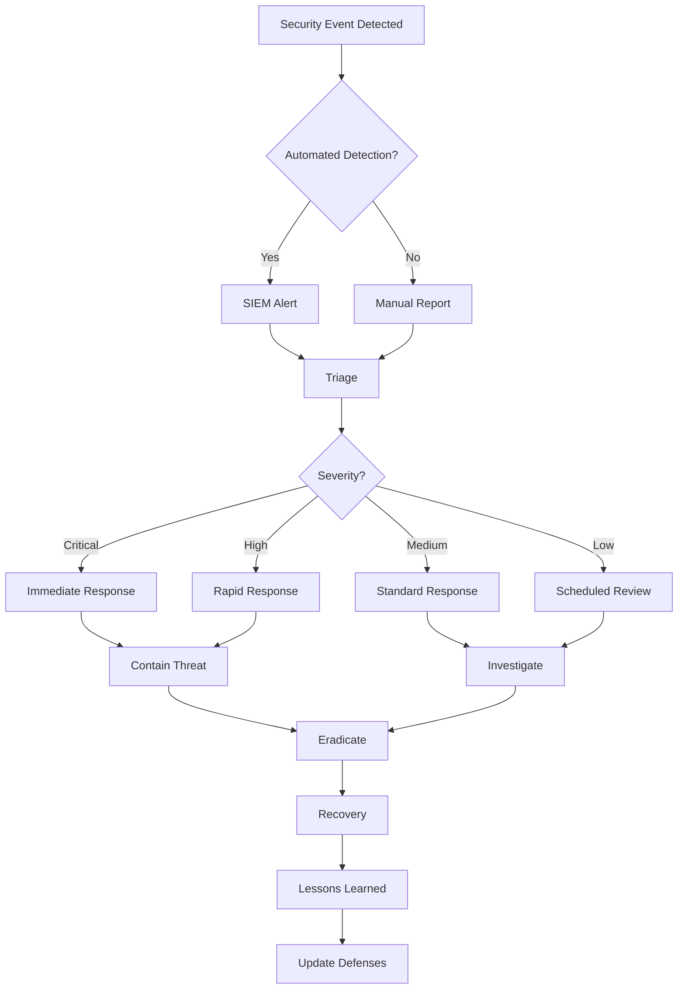

# Security Operations Runbook
## NovaCron v10 Extended - Security Monitoring & Incident Response

### Document Information
- **Version**: 1.0.0
- **Last Updated**: 2025-01-05
- **Classification**: CONFIDENTIAL
- **Review Frequency**: Weekly
- **Compliance Standards**: ISO 27001, SOC2, PCI-DSS, GDPR, HIPAA

---

## 1. Security Monitoring Dashboard

### Real-Time Security Metrics

```yaml
security_dashboard:
  threat_detection:
    panels:
      - active_threats:
          severity_levels: [critical, high, medium, low]
          refresh_rate: 1s
          data_retention: 90_days
      
      - attack_patterns:
          types: [DDoS, SQL_injection, XSS, CSRF, brute_force]
          visualization: heatmap
          time_window: 24h
      
      - geographic_threats:
          map_view: world
          threat_origins: true
          blocked_ips: true
          
  authentication_monitoring:
    panels:
      - failed_logins:
          threshold: 5_per_minute
          alert_on: consecutive_failures
      
      - suspicious_access:
          patterns: [unusual_time, new_location, impossible_travel]
          ml_model: anomaly_detection_v2
      
      - privilege_escalation:
          monitor: role_changes
          audit: admin_actions
          
  compliance_tracking:
    standards:
      - pci_dss:
          controls: 12
          last_audit: "2024-12-15"
          next_audit: "2025-03-15"
      
      - gdpr:
          data_subjects: active_monitoring
          breach_notification: 72h_compliance
      
      - hipaa:
          phi_access: logged
          encryption: AES-256
```

### Security Event Correlation

```python
#!/usr/bin/env python3
# security_correlation.py

import asyncio
from datetime import datetime, timedelta
from typing import Dict, List, Optional
import hashlib
import json

class SecurityEventCorrelator:
    def __init__(self):
        self.events = []
        self.patterns = {}
        self.threat_scores = {}
        
    async def correlate_events(self, new_event: Dict) -> Optional[Dict]:
        """
        Correlate security events to identify threats
        """
        # Add event to buffer
        self.events.append(new_event)
        
        # Clean old events (keep last hour)
        cutoff = datetime.now() - timedelta(hours=1)
        self.events = [e for e in self.events if e['timestamp'] > cutoff]
        
        # Analyze patterns
        threat = None
        
        # Check for brute force
        if threat := self.detect_brute_force(new_event):
            return threat
            
        # Check for privilege escalation
        if threat := self.detect_privilege_escalation(new_event):
            return threat
            
        # Check for data exfiltration
        if threat := self.detect_data_exfiltration(new_event):
            return threat
            
        # Check for lateral movement
        if threat := self.detect_lateral_movement(new_event):
            return threat
            
        return None
    
    def detect_brute_force(self, event: Dict) -> Optional[Dict]:
        """Detect brute force attacks"""
        if event['type'] != 'authentication_failure':
            return None
            
        # Count failures for this IP in last 5 minutes
        recent_failures = [
            e for e in self.events
            if e['type'] == 'authentication_failure'
            and e['source_ip'] == event['source_ip']
            and e['timestamp'] > datetime.now() - timedelta(minutes=5)
        ]
        
        if len(recent_failures) >= 10:
            return {
                'threat_type': 'brute_force',
                'severity': 'high',
                'source_ip': event['source_ip'],
                'target_accounts': list(set([e['username'] for e in recent_failures])),
                'attempt_count': len(recent_failures),
                'recommendation': 'Block IP and enforce MFA'
            }
        
        return None
    
    def detect_privilege_escalation(self, event: Dict) -> Optional[Dict]:
        """Detect privilege escalation attempts"""
        if event['type'] != 'permission_change':
            return None
            
        # Check if user recently had failed admin access attempts
        user_events = [
            e for e in self.events
            if e['username'] == event['username']
            and e['timestamp'] > datetime.now() - timedelta(minutes=30)
        ]
        
        failed_admin_attempts = [
            e for e in user_events
            if e['type'] == 'authorization_failure'
            and 'admin' in e.get('requested_resource', '')
        ]
        
        if failed_admin_attempts and event['new_role'] in ['admin', 'root', 'superuser']:
            return {
                'threat_type': 'privilege_escalation',
                'severity': 'critical',
                'username': event['username'],
                'new_role': event['new_role'],
                'failed_attempts': len(failed_admin_attempts),
                'recommendation': 'Revoke privileges and investigate'
            }
        
        return None
    
    def detect_data_exfiltration(self, event: Dict) -> Optional[Dict]:
        """Detect potential data exfiltration"""
        if event['type'] != 'data_access':
            return None
            
        # Check for unusual data access patterns
        user = event['username']
        
        # Get user's data access in last hour
        user_access = [
            e for e in self.events
            if e['username'] == user
            and e['type'] == 'data_access'
            and e['timestamp'] > datetime.now() - timedelta(hours=1)
        ]
        
        # Calculate data volume
        total_volume = sum([e.get('data_size', 0) for e in user_access])
        
        # Check if volume is unusual (> 1GB in an hour)
        if total_volume > 1024 * 1024 * 1024:  # 1GB
            return {
                'threat_type': 'data_exfiltration',
                'severity': 'critical',
                'username': user,
                'data_volume': f"{total_volume / (1024*1024):.2f} MB",
                'access_count': len(user_access),
                'recommendation': 'Suspend account and audit access'
            }
        
        return None
    
    def detect_lateral_movement(self, event: Dict) -> Optional[Dict]:
        """Detect lateral movement in the network"""
        if event['type'] not in ['network_connection', 'service_access']:
            return None
            
        source = event.get('source_host')
        
        # Track unique destinations per source
        source_connections = [
            e for e in self.events
            if e.get('source_host') == source
            and e['type'] in ['network_connection', 'service_access']
            and e['timestamp'] > datetime.now() - timedelta(minutes=15)
        ]
        
        unique_destinations = set([e.get('destination_host') for e in source_connections])
        
        # Alert if connecting to many different hosts rapidly
        if len(unique_destinations) > 10:
            return {
                'threat_type': 'lateral_movement',
                'severity': 'high',
                'source_host': source,
                'destinations': list(unique_destinations),
                'connection_count': len(source_connections),
                'recommendation': 'Isolate host and investigate'
            }
        
        return None

    def calculate_threat_score(self, entity: str) -> float:
        """Calculate threat score for an entity (user, IP, host)"""
        score = 0.0
        
        # Get all events for this entity
        entity_events = [
            e for e in self.events
            if entity in [e.get('username'), e.get('source_ip'), e.get('source_host')]
        ]
        
        # Score based on event types
        for event in entity_events:
            if event['type'] == 'authentication_failure':
                score += 1
            elif event['type'] == 'authorization_failure':
                score += 2
            elif event['type'] == 'suspicious_activity':
                score += 5
            elif event['type'] == 'malware_detected':
                score += 10
        
        # Decay score over time
        age = (datetime.now() - entity_events[0]['timestamp']).seconds / 3600 if entity_events else 1
        score = score / (1 + age * 0.1)
        
        return min(score, 100)  # Cap at 100
```

---

## 2. Threat Response Procedures

### Immediate Threat Response

```bash
#!/bin/bash
# immediate-threat-response.sh

THREAT_TYPE=$1
THREAT_SOURCE=$2
SEVERITY=$3

respond_to_threat() {
    echo "=== Immediate Threat Response ==="
    echo "Threat Type: $THREAT_TYPE"
    echo "Source: $THREAT_SOURCE"
    echo "Severity: $SEVERITY"
    
    case $THREAT_TYPE in
        "brute_force")
            block_brute_force $THREAT_SOURCE
            ;;
        "ddos")
            mitigate_ddos $THREAT_SOURCE
            ;;
        "sql_injection")
            block_sql_injection $THREAT_SOURCE
            ;;
        "malware")
            quarantine_malware $THREAT_SOURCE
            ;;
        "data_breach")
            contain_breach $THREAT_SOURCE
            ;;
        "insider_threat")
            handle_insider_threat $THREAT_SOURCE
            ;;
        *)
            echo "Unknown threat type"
            generic_response $THREAT_SOURCE
            ;;
    esac
}

block_brute_force() {
    local source=$1
    echo "Blocking brute force attack from $source"
    
    # Block at firewall
    iptables -A INPUT -s $source -j DROP
    
    # Add to WAF block list
    aws wafv2 put-ip-set \
        --name blocked-ips \
        --addresses $source/32 \
        --scope REGIONAL \
        --region us-east-1
    
    # Block at application level
    redis-cli SADD blocked_ips $source
    
    # Enable rate limiting
    redis-cli SET "rate_limit:$source" 1 EX 3600
    
    # Force MFA for affected accounts
    psql -h $DB_HOST -U $DB_USER -c \
        "UPDATE users SET require_mfa = true WHERE last_login_ip = '$source';"
    
    # Send alert
    send_security_alert "Brute force blocked" "$source blocked due to brute force attempts"
}

mitigate_ddos() {
    local source=$1
    echo "Mitigating DDoS attack"
    
    # Enable DDoS protection
    aws shield associate-drt-role --role-arn arn:aws:iam::account:role/DDoSResponseTeam
    
    # Scale up capacity
    kubectl scale deployment novacron-api --replicas=50
    
    # Enable Cloudflare Under Attack mode
    curl -X PATCH "https://api.cloudflare.com/client/v4/zones/$CF_ZONE_ID/settings/security_level" \
        -H "Authorization: Bearer $CF_API_TOKEN" \
        -H "Content-Type: application/json" \
        --data '{"value":"under_attack"}'
    
    # Increase rate limits
    redis-cli SET global_rate_limit 10
    
    # Enable emergency caching
    redis-cli SET cache_everything true EX 3600
}

quarantine_malware() {
    local host=$1
    echo "Quarantining infected host $host"
    
    # Isolate network
    kubectl cordon node/$host
    
    # Disable host
    ssh $host "systemctl stop novacron-agent"
    
    # Move to quarantine network
    aws ec2 modify-instance-attribute \
        --instance-id $(get_instance_id $host) \
        --groups sg-quarantine
    
    # Snapshot for forensics
    aws ec2 create-snapshot \
        --volume-id $(get_volume_id $host) \
        --description "Malware investigation - $(date)"
    
    # Initiate AV scan
    ssh $host "clamscan -r / --log=/var/log/malware-scan.log"
    
    # Alert security team
    send_security_alert "Malware detected" "Host $host quarantined for malware"
}

contain_breach() {
    local source=$1
    echo "Containing data breach"
    
    # Revoke all active sessions
    redis-cli FLUSHDB
    
    # Reset all passwords
    psql -h $DB_HOST -U $DB_USER -c \
        "UPDATE users SET password_reset_required = true, password_reset_token = gen_random_uuid();"
    
    # Revoke API keys
    psql -h $DB_HOST -U $DB_USER -c \
        "UPDATE api_keys SET revoked = true, revoked_at = NOW();"
    
    # Enable read-only mode
    kubectl set env deployment/novacron-api READ_ONLY_MODE=true
    
    # Preserve evidence
    mkdir -p /forensics/breach-$(date +%Y%m%d)
    tar -czf /forensics/breach-$(date +%Y%m%d)/logs.tar.gz /var/log/
    pg_dump -h $DB_HOST -U $DB_USER novacron > /forensics/breach-$(date +%Y%m%d)/database.sql
    
    # Notify compliance officer
    send_compliance_notification "Data breach detected and contained"
}

handle_insider_threat() {
    local user=$1
    echo "Handling insider threat from user $user"
    
    # Suspend user account
    psql -h $DB_HOST -U $DB_USER -c \
        "UPDATE users SET status = 'suspended', suspended_at = NOW() WHERE username = '$user';"
    
    # Revoke all access
    kubectl delete rolebinding --all-namespaces -l user=$user
    
    # Preserve audit trail
    psql -h $DB_HOST -U $DB_USER -c \
        "INSERT INTO security_incidents (type, user, details, timestamp) 
         VALUES ('insider_threat', '$user', 'Account suspended for investigation', NOW());"
    
    # Collect user activity
    grep $user /var/log/audit/audit.log > /forensics/user-activity-$user.log
    
    # Notify legal and HR
    send_notification "legal@novacron.io" "Insider threat detected: $user"
    send_notification "hr@novacron.io" "Employee security incident: $user"
}

# Execute response
respond_to_threat
```

### Security Incident Workflow



---

## 3. Compliance Monitoring

### Automated Compliance Checks

```python
#!/usr/bin/env python3
# compliance_monitor.py

import json
import boto3
from datetime import datetime, timedelta
from typing import Dict, List, Tuple

class ComplianceMonitor:
    def __init__(self):
        self.standards = {
            'PCI_DSS': self.check_pci_dss,
            'GDPR': self.check_gdpr,
            'HIPAA': self.check_hipaa,
            'SOC2': self.check_soc2,
            'ISO27001': self.check_iso27001
        }
        self.findings = []
        
    def run_compliance_checks(self) -> Dict:
        """Run all compliance checks"""
        results = {}
        
        for standard, check_func in self.standards.items():
            print(f"Checking {standard} compliance...")
            results[standard] = check_func()
            
        return results
    
    def check_pci_dss(self) -> Dict:
        """Check PCI-DSS compliance"""
        checks = {
            'network_segmentation': self.verify_network_segmentation(),
            'encryption_at_rest': self.verify_encryption_at_rest(),
            'encryption_in_transit': self.verify_encryption_in_transit(),
            'access_control': self.verify_access_control(),
            'logging_monitoring': self.verify_logging(),
            'vulnerability_management': self.verify_vulnerability_management(),
            'secure_development': self.verify_secure_development(),
            'physical_security': True,  # Assumed for cloud
            'incident_response': self.verify_incident_response(),
            'security_testing': self.verify_security_testing(),
            'security_policies': self.verify_security_policies(),
            'vendor_management': self.verify_vendor_management()
        }
        
        compliant = all(checks.values())
        score = sum(checks.values()) / len(checks) * 100
        
        return {
            'compliant': compliant,
            'score': score,
            'checks': checks,
            'findings': self.findings
        }
    
    def check_gdpr(self) -> Dict:
        """Check GDPR compliance"""
        checks = {
            'lawful_basis': self.verify_lawful_basis(),
            'consent_management': self.verify_consent_management(),
            'data_minimization': self.verify_data_minimization(),
            'purpose_limitation': self.verify_purpose_limitation(),
            'data_accuracy': self.verify_data_accuracy(),
            'storage_limitation': self.verify_storage_limitation(),
            'security': self.verify_gdpr_security(),
            'breach_notification': self.verify_breach_notification(),
            'dpia': self.verify_dpia(),
            'data_subject_rights': self.verify_data_subject_rights(),
            'international_transfers': self.verify_international_transfers(),
            'dpo_appointment': True  # Assumed appointed
        }
        
        compliant = all(checks.values())
        score = sum(checks.values()) / len(checks) * 100
        
        return {
            'compliant': compliant,
            'score': score,
            'checks': checks
        }
    
    def check_hipaa(self) -> Dict:
        """Check HIPAA compliance"""
        checks = {
            'access_controls': self.verify_hipaa_access_controls(),
            'audit_controls': self.verify_audit_logs(),
            'integrity_controls': self.verify_data_integrity(),
            'transmission_security': self.verify_transmission_security(),
            'administrative_safeguards': self.verify_admin_safeguards(),
            'physical_safeguards': True,  # Cloud provider responsibility
            'organizational_requirements': self.verify_baa(),
            'policies_procedures': self.verify_hipaa_policies()
        }
        
        compliant = all(checks.values())
        score = sum(checks.values()) / len(checks) * 100
        
        return {
            'compliant': compliant,
            'score': score,
            'checks': checks
        }
    
    def verify_encryption_at_rest(self) -> bool:
        """Verify all data is encrypted at rest"""
        ec2 = boto3.client('ec2')
        rds = boto3.client('rds')
        s3 = boto3.client('s3')
        
        # Check EBS volumes
        volumes = ec2.describe_volumes()
        for volume in volumes['Volumes']:
            if not volume.get('Encrypted'):
                self.findings.append({
                    'type': 'encryption',
                    'resource': f"EBS Volume {volume['VolumeId']}",
                    'issue': 'Not encrypted',
                    'severity': 'high'
                })
                return False
        
        # Check RDS instances
        instances = rds.describe_db_instances()
        for instance in instances['DBInstances']:
            if not instance.get('StorageEncrypted'):
                self.findings.append({
                    'type': 'encryption',
                    'resource': f"RDS Instance {instance['DBInstanceIdentifier']}",
                    'issue': 'Not encrypted',
                    'severity': 'high'
                })
                return False
        
        # Check S3 buckets
        buckets = s3.list_buckets()
        for bucket in buckets['Buckets']:
            try:
                encryption = s3.get_bucket_encryption(Bucket=bucket['Name'])
            except:
                self.findings.append({
                    'type': 'encryption',
                    'resource': f"S3 Bucket {bucket['Name']}",
                    'issue': 'No encryption configured',
                    'severity': 'high'
                })
                return False
        
        return True
    
    def verify_access_control(self) -> bool:
        """Verify proper access controls are in place"""
        iam = boto3.client('iam')
        
        # Check for MFA on root account
        account_summary = iam.get_account_summary()
        if account_summary['SummaryMap']['AccountMFAEnabled'] == 0:
            self.findings.append({
                'type': 'access_control',
                'resource': 'Root Account',
                'issue': 'MFA not enabled',
                'severity': 'critical'
            })
            return False
        
        # Check for overly permissive policies
        policies = iam.list_policies(Scope='Local')
        for policy in policies['Policies']:
            policy_version = iam.get_policy_version(
                PolicyArn=policy['Arn'],
                VersionId=policy['DefaultVersionId']
            )
            
            document = json.loads(policy_version['PolicyVersion']['Document'])
            for statement in document.get('Statement', []):
                if statement.get('Effect') == 'Allow' and statement.get('Action') == '*':
                    self.findings.append({
                        'type': 'access_control',
                        'resource': f"Policy {policy['PolicyName']}",
                        'issue': 'Overly permissive (allows all actions)',
                        'severity': 'high'
                    })
                    return False
        
        return True
    
    def verify_logging(self) -> bool:
        """Verify comprehensive logging is enabled"""
        cloudtrail = boto3.client('cloudtrail')
        
        # Check CloudTrail is enabled
        trails = cloudtrail.describe_trails()
        if not trails['trailList']:
            self.findings.append({
                'type': 'logging',
                'resource': 'CloudTrail',
                'issue': 'No trails configured',
                'severity': 'critical'
            })
            return False
        
        for trail in trails['trailList']:
            status = cloudtrail.get_trail_status(Name=trail['TrailARN'])
            if not status['IsLogging']:
                self.findings.append({
                    'type': 'logging',
                    'resource': f"CloudTrail {trail['Name']}",
                    'issue': 'Not logging',
                    'severity': 'critical'
                })
                return False
        
        return True
    
    def generate_compliance_report(self) -> str:
        """Generate compliance report"""
        results = self.run_compliance_checks()
        
        report = f"""
=== Compliance Report ===
Generated: {datetime.now().isoformat()}

Overall Compliance Status:
"""
        
        for standard, result in results.items():
            status = "✅ COMPLIANT" if result['compliant'] else "❌ NON-COMPLIANT"
            report += f"\n{standard}: {status} (Score: {result['score']:.1f}%)"
            
            if not result['compliant']:
                report += "\n  Failed checks:"
                for check, passed in result['checks'].items():
                    if not passed:
                        report += f"\n    - {check}"
        
        if self.findings:
            report += "\n\nFindings:"
            for finding in self.findings:
                report += f"\n- [{finding['severity'].upper()}] {finding['resource']}: {finding['issue']}"
        
        report += "\n\nRecommendations:"
        report += "\n1. Address all critical and high severity findings immediately"
        report += "\n2. Schedule remediation for medium and low severity findings"
        report += "\n3. Conduct quarterly compliance reviews"
        report += "\n4. Maintain evidence of compliance controls"
        
        return report

# Run compliance check
if __name__ == "__main__":
    monitor = ComplianceMonitor()
    report = monitor.generate_compliance_report()
    print(report)
    
    # Save report
    with open(f"/reports/compliance-{datetime.now().strftime('%Y%m%d')}.txt", 'w') as f:
        f.write(report)
```

---

## 4. Vulnerability Management

### Vulnerability Scanning & Remediation

```bash
#!/bin/bash
# vulnerability-management.sh

run_vulnerability_scan() {
    echo "=== Running Vulnerability Scan ==="
    
    SCAN_ID=$(date +%Y%m%d%H%M%S)
    SCAN_DIR="/security/scans/$SCAN_ID"
    mkdir -p $SCAN_DIR
    
    # Container scanning
    echo "[1/5] Scanning containers..."
    trivy image --severity HIGH,CRITICAL --format json \
        novacron/api:latest > $SCAN_DIR/container-scan.json
    
    # Dependency scanning
    echo "[2/5] Scanning dependencies..."
    npm audit --json > $SCAN_DIR/npm-audit.json
    pip-audit --format json > $SCAN_DIR/pip-audit.json
    
    # Infrastructure scanning
    echo "[3/5] Scanning infrastructure..."
    prowler aws --json-file $SCAN_DIR/prowler-scan.json
    
    # Web application scanning
    echo "[4/5] Scanning web application..."
    nikto -h https://api.novacron.io -Format json -output $SCAN_DIR/nikto-scan.json
    
    # Database scanning
    echo "[5/5] Scanning database..."
    sqlmap -u "https://api.novacron.io/search?q=test" \
        --batch --random-agent --output-dir=$SCAN_DIR/sqlmap
    
    # Generate report
    generate_vulnerability_report $SCAN_DIR
}

generate_vulnerability_report() {
    local scan_dir=$1
    
    echo "Generating vulnerability report..."
    
    # Parse results
    CRITICAL_COUNT=$(jq '[.Results[].Vulnerabilities[] | select(.Severity=="CRITICAL")] | length' $scan_dir/container-scan.json)
    HIGH_COUNT=$(jq '[.Results[].Vulnerabilities[] | select(.Severity=="HIGH")] | length' $scan_dir/container-scan.json)
    
    # Create report
    cat > $scan_dir/report.md << EOF
# Vulnerability Scan Report
Date: $(date)
Scan ID: $(basename $scan_dir)

## Summary
- Critical Vulnerabilities: $CRITICAL_COUNT
- High Vulnerabilities: $HIGH_COUNT

## Container Vulnerabilities
$(jq -r '.Results[].Vulnerabilities[] | select(.Severity=="CRITICAL" or .Severity=="HIGH") | "- [\(.Severity)] \(.VulnerabilityID): \(.Title)"' $scan_dir/container-scan.json)

## Dependency Vulnerabilities
### NPM
$(jq -r '.vulnerabilities | to_entries[] | "- [\(.value.severity)] \(.key): \(.value.title)"' $scan_dir/npm-audit.json)

### Python
$(jq -r '.vulnerabilities[] | "- [\(.fix_versions[0] // "No fix")] \(.name): \(.description)"' $scan_dir/pip-audit.json)

## Remediation Priority
1. Patch all CRITICAL vulnerabilities immediately
2. Schedule HIGH vulnerabilities for next release
3. Review MEDIUM vulnerabilities quarterly
EOF
    
    # Send notifications if critical vulnerabilities found
    if [ $CRITICAL_COUNT -gt 0 ]; then
        send_security_alert "Critical Vulnerabilities Found" \
            "$CRITICAL_COUNT critical vulnerabilities require immediate attention"
    fi
}

automated_remediation() {
    echo "=== Automated Vulnerability Remediation ==="
    
    # Update base images
    echo "Updating base images..."
    docker pull node:18-alpine
    docker pull python:3.11-slim
    docker pull nginx:alpine
    
    # Update dependencies
    echo "Updating dependencies..."
    
    # NPM updates
    npm audit fix --force
    npm update
    
    # Python updates
    pip install --upgrade pip
    pip list --outdated --format=json | jq -r '.[].name' | xargs -I {} pip install --upgrade {}
    
    # System packages
    apt-get update && apt-get upgrade -y
    
    # Rebuild containers
    echo "Rebuilding containers..."
    docker build -t novacron/api:latest .
    docker push novacron/api:latest
    
    # Deploy patched version
    kubectl set image deployment/novacron-api api=novacron/api:latest
    kubectl rollout status deployment/novacron-api
    
    echo "Remediation complete"
}

# Patch management
patch_management() {
    PATCH_TYPE=$1  # security|bug|feature
    
    echo "=== Patch Management ==="
    
    case $PATCH_TYPE in
        "security")
            echo "Applying security patches..."
            
            # Critical security patches - immediate
            apply_critical_patches
            
            # High security patches - within 24 hours
            schedule_patch "high_security" "0 2 * * *"
            
            # Medium security patches - within 7 days
            schedule_patch "medium_security" "0 2 * * 0"
            ;;
            
        "bug")
            echo "Applying bug fixes..."
            
            # Critical bugs - immediate
            if [ -f /patches/critical_bugs.sql ]; then
                psql -h $DB_HOST -U $DB_USER -f /patches/critical_bugs.sql
            fi
            
            # Standard bugs - next maintenance window
            schedule_patch "bug_fixes" "0 4 * * 0"
            ;;
            
        "feature")
            echo "Applying feature updates..."
            
            # Feature updates - scheduled maintenance
            schedule_patch "features" "0 2 1 * *"
            ;;
    esac
}

apply_critical_patches() {
    # Download patches
    aws s3 sync s3://novacron-patches/critical/ /tmp/patches/
    
    # Apply OS patches
    yum update --security -y
    
    # Apply application patches
    for patch in /tmp/patches/*.patch; do
        git apply $patch
    done
    
    # Rebuild and deploy
    ./build.sh
    ./deploy.sh
    
    # Verify patch application
    ./verify-patches.sh
}
```

---

## 5. Identity & Access Management

### Access Control Procedures

```go
// access_control.go
package security

import (
    "context"
    "crypto/rand"
    "encoding/base64"
    "fmt"
    "time"
)

type AccessController struct {
    RBACEnabled     bool
    MFARequired     bool
    SessionTimeout  time.Duration
    PasswordPolicy  PasswordPolicy
}

type PasswordPolicy struct {
    MinLength           int
    RequireUppercase    bool
    RequireLowercase    bool
    RequireNumbers      bool
    RequireSpecialChars bool
    MaxAge              time.Duration
    HistoryCount        int
}

type AccessRequest struct {
    UserID      string
    Resource    string
    Action      string
    Context     map[string]interface{}
    MFAToken    string
}

func (ac *AccessController) ValidateAccess(ctx context.Context, req AccessRequest) (bool, error) {
    // Step 1: Authenticate user
    if !ac.authenticateUser(req.UserID) {
        return false, fmt.Errorf("authentication failed")
    }
    
    // Step 2: Check MFA if required
    if ac.MFARequired && !ac.validateMFA(req.UserID, req.MFAToken) {
        return false, fmt.Errorf("MFA validation failed")
    }
    
    // Step 3: Check authorization
    if !ac.authorizeAction(req.UserID, req.Resource, req.Action) {
        return false, fmt.Errorf("authorization failed")
    }
    
    // Step 4: Check contextual access
    if !ac.validateContext(req) {
        return false, fmt.Errorf("contextual validation failed")
    }
    
    // Step 5: Audit access
    ac.auditAccess(req, true)
    
    return true, nil
}

func (ac *AccessController) EnforcePasswordPolicy(password string, userID string) error {
    policy := ac.PasswordPolicy
    
    // Check length
    if len(password) < policy.MinLength {
        return fmt.Errorf("password must be at least %d characters", policy.MinLength)
    }
    
    // Check complexity
    var hasUpper, hasLower, hasNumber, hasSpecial bool
    
    for _, char := range password {
        switch {
        case char >= 'A' && char <= 'Z':
            hasUpper = true
        case char >= 'a' && char <= 'z':
            hasLower = true
        case char >= '0' && char <= '9':
            hasNumber = true
        case isSpecialChar(char):
            hasSpecial = true
        }
    }
    
    if policy.RequireUppercase && !hasUpper {
        return fmt.Errorf("password must contain uppercase letters")
    }
    if policy.RequireLowercase && !hasLower {
        return fmt.Errorf("password must contain lowercase letters")
    }
    if policy.RequireNumbers && !hasNumber {
        return fmt.Errorf("password must contain numbers")
    }
    if policy.RequireSpecialChars && !hasSpecial {
        return fmt.Errorf("password must contain special characters")
    }
    
    // Check password history
    if ac.isPasswordInHistory(userID, password) {
        return fmt.Errorf("password was recently used")
    }
    
    return nil
}

func (ac *AccessController) RotateCredentials(userID string) (string, error) {
    // Generate new API key
    key := make([]byte, 32)
    if _, err := rand.Read(key); err != nil {
        return "", err
    }
    
    apiKey := base64.URLEncoding.EncodeToString(key)
    
    // Store new key
    if err := ac.storeAPIKey(userID, apiKey); err != nil {
        return "", err
    }
    
    // Revoke old keys
    if err := ac.revokeOldKeys(userID); err != nil {
        return "", err
    }
    
    // Send notification
    ac.notifyCredentialRotation(userID)
    
    return apiKey, nil
}

// Privilege escalation monitoring
type PrivilegeMonitor struct {
    AlertThreshold int
    TimeWindow     time.Duration
}

func (pm *PrivilegeMonitor) DetectPrivilegeEscalation(userID string) bool {
    // Get recent privilege changes
    changes := pm.getRecentPrivilegeChanges(userID, pm.TimeWindow)
    
    // Check for suspicious patterns
    if len(changes) > pm.AlertThreshold {
        pm.alertPrivilegeEscalation(userID, changes)
        return true
    }
    
    // Check for unauthorized elevation
    for _, change := range changes {
        if !pm.isAuthorizedChange(change) {
            pm.alertUnauthorizedElevation(userID, change)
            return true
        }
    }
    
    return false
}

// Session management
type SessionManager struct {
    MaxSessions      int
    SessionTimeout   time.Duration
    IdleTimeout      time.Duration
    GeoLocationCheck bool
}

func (sm *SessionManager) CreateSession(userID string, metadata map[string]string) (string, error) {
    // Check existing sessions
    activeSessions := sm.getActiveSessions(userID)
    if len(activeSessions) >= sm.MaxSessions {
        // Terminate oldest session
        sm.terminateSession(activeSessions[0].ID)
    }
    
    // Generate session token
    token := sm.generateSecureToken()
    
    // Store session
    session := Session{
        ID:        token,
        UserID:    userID,
        CreatedAt: time.Now(),
        ExpiresAt: time.Now().Add(sm.SessionTimeout),
        Metadata:  metadata,
    }
    
    if err := sm.storeSession(session); err != nil {
        return "", err
    }
    
    return token, nil
}

func (sm *SessionManager) ValidateSession(token string) (bool, error) {
    session, err := sm.getSession(token)
    if err != nil {
        return false, err
    }
    
    // Check expiration
    if time.Now().After(session.ExpiresAt) {
        sm.terminateSession(token)
        return false, fmt.Errorf("session expired")
    }
    
    // Check idle timeout
    if time.Since(session.LastActivity) > sm.IdleTimeout {
        sm.terminateSession(token)
        return false, fmt.Errorf("session idle timeout")
    }
    
    // Check geo-location if enabled
    if sm.GeoLocationCheck {
        if !sm.validateLocation(session) {
            sm.terminateSession(token)
            return false, fmt.Errorf("suspicious location change")
        }
    }
    
    // Update activity
    session.LastActivity = time.Now()
    sm.updateSession(session)
    
    return true, nil
}
```

---

## 6. Security Audit Procedures

### Automated Security Auditing

```python
#!/usr/bin/env python3
# security_audit.py

import os
import subprocess
import json
from datetime import datetime, timedelta
from typing import Dict, List

class SecurityAuditor:
    def __init__(self):
        self.audit_results = []
        self.risk_score = 0
        
    def run_comprehensive_audit(self) -> Dict:
        """Run comprehensive security audit"""
        
        print("Starting comprehensive security audit...")
        
        # User access audit
        self.audit_user_access()
        
        # Permission audit
        self.audit_permissions()
        
        # Network security audit
        self.audit_network_security()
        
        # Data security audit
        self.audit_data_security()
        
        # Application security audit
        self.audit_application_security()
        
        # Infrastructure audit
        self.audit_infrastructure()
        
        # Calculate overall risk score
        self.calculate_risk_score()
        
        return self.generate_audit_report()
    
    def audit_user_access(self):
        """Audit user access patterns"""
        
        findings = []
        
        # Check for inactive users
        inactive_users = self.find_inactive_users(days=90)
        if inactive_users:
            findings.append({
                'category': 'user_access',
                'finding': f'{len(inactive_users)} inactive users found',
                'severity': 'medium',
                'recommendation': 'Disable or remove inactive accounts',
                'users': inactive_users
            })
        
        # Check for shared accounts
        shared_accounts = self.detect_shared_accounts()
        if shared_accounts:
            findings.append({
                'category': 'user_access',
                'finding': 'Shared account usage detected',
                'severity': 'high',
                'recommendation': 'Eliminate shared accounts',
                'accounts': shared_accounts
            })
        
        # Check for privilege creep
        privilege_creep = self.detect_privilege_creep()
        if privilege_creep:
            findings.append({
                'category': 'user_access',
                'finding': 'Privilege creep detected',
                'severity': 'medium',
                'recommendation': 'Review and adjust permissions',
                'users': privilege_creep
            })
        
        self.audit_results.extend(findings)
    
    def audit_permissions(self):
        """Audit permission configurations"""
        
        # Check for overly permissive rules
        cmd = """
        kubectl get clusterrolebindings -o json | \
        jq '.items[] | select(.roleRef.name=="cluster-admin") | .subjects[]'
        """
        
        result = subprocess.run(cmd, shell=True, capture_output=True, text=True)
        if result.stdout:
            admins = json.loads(result.stdout)
            if len(admins) > 3:  # More than 3 cluster admins is suspicious
                self.audit_results.append({
                    'category': 'permissions',
                    'finding': f'Excessive cluster-admin bindings: {len(admins)}',
                    'severity': 'high',
                    'recommendation': 'Review and minimize cluster-admin access'
                })
    
    def audit_network_security(self):
        """Audit network security configurations"""
        
        # Check for open ports
        open_ports = self.scan_open_ports()
        unnecessary_ports = [p for p in open_ports if p not in [80, 443, 22]]
        
        if unnecessary_ports:
            self.audit_results.append({
                'category': 'network',
                'finding': f'Unnecessary open ports: {unnecessary_ports}',
                'severity': 'medium',
                'recommendation': 'Close unnecessary ports'
            })
        
        # Check SSL/TLS configuration
        ssl_issues = self.check_ssl_configuration()
        if ssl_issues:
            self.audit_results.append({
                'category': 'network',
                'finding': 'SSL/TLS configuration issues',
                'severity': 'high',
                'issues': ssl_issues,
                'recommendation': 'Update SSL/TLS configuration'
            })
    
    def audit_data_security(self):
        """Audit data security measures"""
        
        # Check encryption status
        unencrypted_data = self.find_unencrypted_data()
        if unencrypted_data:
            self.audit_results.append({
                'category': 'data',
                'finding': 'Unencrypted sensitive data found',
                'severity': 'critical',
                'locations': unencrypted_data,
                'recommendation': 'Encrypt all sensitive data immediately'
            })
        
        # Check data retention
        excessive_retention = self.check_data_retention()
        if excessive_retention:
            self.audit_results.append({
                'category': 'data',
                'finding': 'Data retained beyond policy',
                'severity': 'medium',
                'data_types': excessive_retention,
                'recommendation': 'Implement data retention policy'
            })
    
    def calculate_risk_score(self):
        """Calculate overall security risk score"""
        
        severity_weights = {
            'critical': 10,
            'high': 5,
            'medium': 2,
            'low': 1
        }
        
        for finding in self.audit_results:
            self.risk_score += severity_weights.get(finding['severity'], 0)
        
        # Normalize to 0-100 scale
        self.risk_score = min(self.risk_score, 100)
    
    def generate_audit_report(self) -> Dict:
        """Generate audit report"""
        
        report = {
            'audit_date': datetime.now().isoformat(),
            'risk_score': self.risk_score,
            'risk_level': self.get_risk_level(),
            'total_findings': len(self.audit_results),
            'critical_findings': len([f for f in self.audit_results if f['severity'] == 'critical']),
            'high_findings': len([f for f in self.audit_results if f['severity'] == 'high']),
            'findings': self.audit_results,
            'recommendations': self.generate_recommendations()
        }
        
        return report
    
    def get_risk_level(self) -> str:
        """Determine risk level based on score"""
        if self.risk_score >= 70:
            return 'CRITICAL'
        elif self.risk_score >= 50:
            return 'HIGH'
        elif self.risk_score >= 30:
            return 'MEDIUM'
        elif self.risk_score >= 10:
            return 'LOW'
        else:
            return 'MINIMAL'
    
    def generate_recommendations(self) -> List[str]:
        """Generate prioritized recommendations"""
        
        recommendations = []
        
        # Critical recommendations
        critical = [f for f in self.audit_results if f['severity'] == 'critical']
        if critical:
            recommendations.append("IMMEDIATE ACTION REQUIRED:")
            for finding in critical:
                recommendations.append(f"  - {finding['recommendation']}")
        
        # High priority recommendations
        high = [f for f in self.audit_results if f['severity'] == 'high']
        if high:
            recommendations.append("\nHIGH PRIORITY (within 24 hours):")
            for finding in high:
                recommendations.append(f"  - {finding['recommendation']}")
        
        # Medium priority recommendations
        medium = [f for f in self.audit_results if f['severity'] == 'medium']
        if medium:
            recommendations.append("\nMEDIUM PRIORITY (within 7 days):")
            for finding in medium:
                recommendations.append(f"  - {finding['recommendation']}")
        
        return recommendations

# Run audit
if __name__ == "__main__":
    auditor = SecurityAuditor()
    report = auditor.run_comprehensive_audit()
    
    print(f"\n=== Security Audit Report ===")
    print(f"Date: {report['audit_date']}")
    print(f"Risk Score: {report['risk_score']}/100")
    print(f"Risk Level: {report['risk_level']}")
    print(f"Total Findings: {report['total_findings']}")
    print(f"  Critical: {report['critical_findings']}")
    print(f"  High: {report['high_findings']}")
    
    print("\nRecommendations:")
    for rec in report['recommendations']:
        print(rec)
    
    # Save detailed report
    with open(f"/reports/security-audit-{datetime.now().strftime('%Y%m%d')}.json", 'w') as f:
        json.dump(report, f, indent=2)
```

---

## 7. Incident Response Automation

### Automated Incident Response

```bash
#!/bin/bash
# automated-incident-response.sh

# Incident response orchestrator
incident_response_orchestrator() {
    INCIDENT_TYPE=$1
    INCIDENT_DATA=$2
    
    echo "=== Automated Incident Response ==="
    echo "Type: $INCIDENT_TYPE"
    echo "Timestamp: $(date)"
    
    # Create incident record
    INCIDENT_ID=$(create_incident_record "$INCIDENT_TYPE" "$INCIDENT_DATA")
    
    # Execute response playbook
    case $INCIDENT_TYPE in
        "unauthorized_access")
            playbook_unauthorized_access $INCIDENT_ID "$INCIDENT_DATA"
            ;;
        "data_exfiltration")
            playbook_data_exfiltration $INCIDENT_ID "$INCIDENT_DATA"
            ;;
        "malware_detection")
            playbook_malware $INCIDENT_ID "$INCIDENT_DATA"
            ;;
        "dos_attack")
            playbook_dos_attack $INCIDENT_ID "$INCIDENT_DATA"
            ;;
        "credential_compromise")
            playbook_credential_compromise $INCIDENT_ID "$INCIDENT_DATA"
            ;;
        *)
            playbook_generic $INCIDENT_ID "$INCIDENT_DATA"
            ;;
    esac
    
    # Post-incident actions
    post_incident_actions $INCIDENT_ID
}

playbook_unauthorized_access() {
    local incident_id=$1
    local data=$2
    
    echo "Executing unauthorized access playbook..."
    
    # Step 1: Identify affected systems
    affected_systems=$(echo $data | jq -r '.affected_systems[]')
    
    # Step 2: Isolate systems
    for system in $affected_systems; do
        isolate_system $system
    done
    
    # Step 3: Revoke access
    user=$(echo $data | jq -r '.user')
    revoke_user_access $user
    
    # Step 4: Collect evidence
    collect_forensic_evidence $incident_id $affected_systems
    
    # Step 5: Analyze attack vector
    analyze_attack_vector $incident_id
    
    # Step 6: Patch vulnerabilities
    patch_identified_vulnerabilities $incident_id
    
    # Step 7: Restore services
    restore_services $affected_systems
    
    # Step 8: Enhanced monitoring
    enable_enhanced_monitoring $affected_systems
}

playbook_data_exfiltration() {
    local incident_id=$1
    local data=$2
    
    echo "Executing data exfiltration playbook..."
    
    # Step 1: Block data egress
    block_outbound_traffic
    
    # Step 2: Identify compromised accounts
    compromised_accounts=$(identify_compromised_accounts)
    
    # Step 3: Reset credentials
    for account in $compromised_accounts; do
        force_password_reset $account
        revoke_api_keys $account
    done
    
    # Step 4: Identify exfiltrated data
    exfiltrated_data=$(analyze_data_transfers)
    
    # Step 5: Legal notifications
    if [[ $(echo $exfiltrated_data | jq -r '.contains_pii') == "true" ]]; then
        notify_legal_team $incident_id
        prepare_breach_notification
    fi
    
    # Step 6: Contain breach
    contain_data_breach $incident_id
    
    # Step 7: Forensic analysis
    perform_forensic_analysis $incident_id
}

# Evidence collection
collect_forensic_evidence() {
    local incident_id=$1
    local systems=$2
    
    EVIDENCE_DIR="/forensics/$incident_id"
    mkdir -p $EVIDENCE_DIR
    
    for system in $systems; do
        echo "Collecting evidence from $system..."
        
        # Memory dump
        ssh $system "sudo dd if=/proc/kcore of=/tmp/memory.dump"
        scp $system:/tmp/memory.dump $EVIDENCE_DIR/memory-$system.dump
        
        # Disk image
        ssh $system "sudo dd if=/dev/sda of=/tmp/disk.img bs=4M"
        scp $system:/tmp/disk.img $EVIDENCE_DIR/disk-$system.img
        
        # Logs
        ssh $system "sudo tar -czf /tmp/logs.tar.gz /var/log/"
        scp $system:/tmp/logs.tar.gz $EVIDENCE_DIR/logs-$system.tar.gz
        
        # Network connections
        ssh $system "sudo netstat -tulpn > /tmp/connections.txt"
        scp $system:/tmp/connections.txt $EVIDENCE_DIR/connections-$system.txt
        
        # Process list
        ssh $system "sudo ps aux > /tmp/processes.txt"
        scp $system:/tmp/processes.txt $EVIDENCE_DIR/processes-$system.txt
    done
    
    # Create evidence hash for integrity
    find $EVIDENCE_DIR -type f -exec sha256sum {} \; > $EVIDENCE_DIR/evidence-hashes.txt
    
    echo "Evidence collection complete: $EVIDENCE_DIR"
}

# Post-incident actions
post_incident_actions() {
    local incident_id=$1
    
    echo "Executing post-incident actions..."
    
    # Generate incident report
    generate_incident_report $incident_id
    
    # Update security controls
    update_security_controls $incident_id
    
    # Lessons learned session
    schedule_lessons_learned $incident_id
    
    # Update playbooks
    update_response_playbooks $incident_id
    
    # Compliance reporting
    generate_compliance_report $incident_id
    
    # Customer communication
    if [[ $(check_customer_impact $incident_id) == "true" ]]; then
        send_customer_notification $incident_id
    fi
}

# Run orchestrator
incident_response_orchestrator "$@"
```

---

## 8. Appendix

### Security Tools & Commands

```bash
# Security scanning tools
nmap -sV -sC -O -p- target.com        # Port scanning
nikto -h https://target.com           # Web vulnerability scanning
sqlmap -u "https://target.com?id=1"   # SQL injection testing
metasploit                             # Penetration testing
burpsuite                              # Web application testing

# Log analysis
grep "Failed password" /var/log/auth.log | tail -50
awk '/Failed/{print $(NF-3)}' /var/log/auth.log | sort | uniq -c | sort -rn

# Security monitoring
fail2ban-client status
ossec-control status
aide --check

# Certificate management
openssl x509 -in cert.pem -text -noout
certbot renew --dry-run

# Firewall management
iptables -L -v -n
ufw status verbose

# AWS security
aws iam get-account-password-policy
aws ec2 describe-security-groups
aws s3api get-bucket-encryption --bucket bucket-name
```

### Security Contacts

| Role | Contact | Phone | Escalation |
|------|---------|-------|------------|
| Security Lead | security@novacron.io | +1-XXX-XXX-XXXX | Primary |
| CISO | ciso@novacron.io | +1-XXX-XXX-XXXX | Executive |
| Incident Response | incident@novacron.io | +1-XXX-XXX-XXXX | 24/7 |
| Legal | legal@novacron.io | +1-XXX-XXX-XXXX | Compliance |
| DPO | dpo@novacron.io | +1-XXX-XXX-XXXX | Privacy |

### Compliance Requirements

- **PCI-DSS**: Quarterly scans, annual assessment
- **GDPR**: 72-hour breach notification
- **HIPAA**: Encryption required, BAA needed
- **SOC2**: Annual audit, continuous monitoring
- **ISO27001**: Annual surveillance audit

---

**Document Review Schedule**: Weekly
**Last Review**: 2025-01-05
**Next Review**: 2025-01-12
**Owner**: Security Operations Team