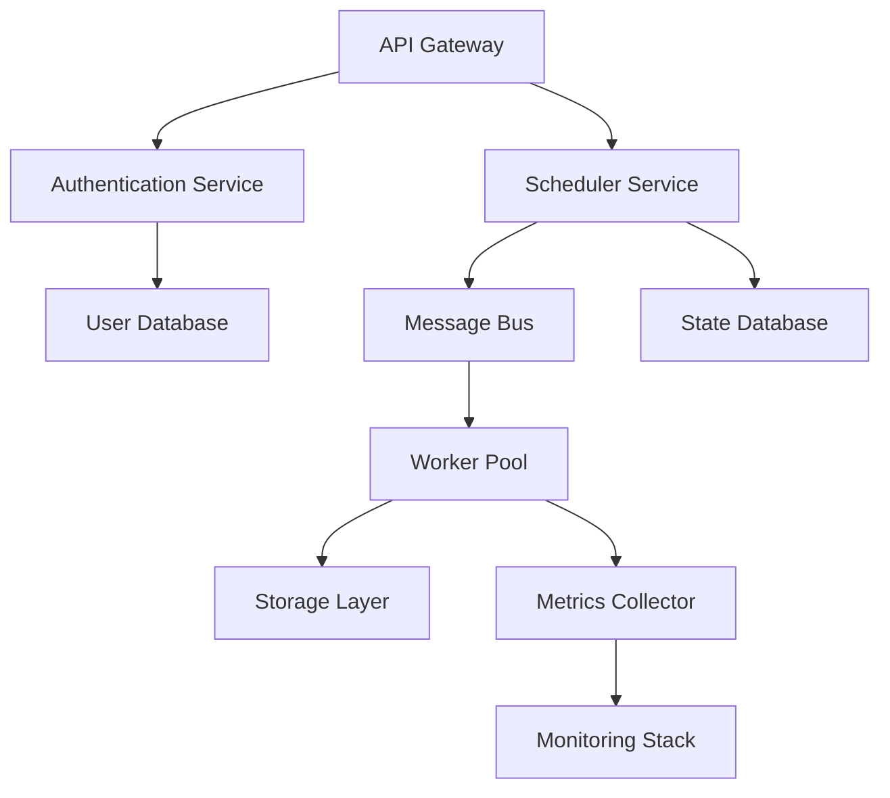

# DWCP v3 Production Operations Runbook

**Version**: 1.0.0
**Last Updated**: 2025-11-10
**Audience**: Operations Team, SREs, DevOps Engineers
**Classification**: Internal Use - Production Critical

---

## Table of Contents

1. [Overview](#overview)
2. [System Architecture](#system-architecture)
3. [Operational Procedures](#operational-procedures)
4. [Monitoring and Alerting](#monitoring-and-alerting)
5. [Troubleshooting Guide](#troubleshooting-guide)
6. [Emergency Procedures](#emergency-procedures)
7. [Escalation Matrix](#escalation-matrix)
8. [Maintenance Windows](#maintenance-windows)
9. [Capacity Management](#capacity-management)
10. [Performance Tuning](#performance-tuning)
11. [Backup and Recovery](#backup-and-recovery)
12. [Security Operations](#security-operations)

---

## Overview

### Purpose

This runbook provides comprehensive operational guidance for the DWCP v3 distributed system in production environments. It covers all routine operations, emergency procedures, and troubleshooting scenarios.

### Scope

- Production environment operations (all regions)
- Staging environment for production validation
- DR (Disaster Recovery) environment operations
- Multi-cloud deployment management

### Key Principles

1. **Reliability First**: Never compromise system reliability
2. **Minimize Blast Radius**: Contain issues to smallest possible scope
3. **Graceful Degradation**: Maintain partial functionality during incidents
4. **Data Integrity**: Never lose or corrupt user data
5. **Observability**: Every action must be logged and traceable

### System Components

```
DWCP v3 Production Stack
├── Control Plane (Kubernetes)
│   ├── API Servers (3 replicas)
│   ├── Scheduler (leader-elected)
│   ├── Controller Managers (3 replicas)
│   └── etcd Cluster (5 nodes)
├── Data Plane
│   ├── Worker Nodes (auto-scaling)
│   ├── Storage Layer (distributed)
│   └── Network Layer (overlay)
├── Message Bus
│   ├── Kafka Cluster (6 brokers)
│   ├── ZooKeeper Ensemble (5 nodes)
│   └── Schema Registry
├── Monitoring Stack
│   ├── Prometheus (federated)
│   ├── Grafana Dashboards
│   ├── AlertManager
│   └── Jaeger Tracing
└── Support Services
    ├── Load Balancers
    ├── DNS Services
    ├── Certificate Management
    └── Backup Systems
```

---

## System Architecture

### Deployment Topology

#### Production Regions

| Region | Purpose | Capacity | Failover Target |
|--------|---------|----------|-----------------|
| us-east-1 | Primary Production | 10,000 nodes | us-west-2 |
| us-west-2 | Secondary Production | 8,000 nodes | us-east-1 |
| eu-west-1 | European Production | 6,000 nodes | eu-central-1 |
| eu-central-1 | European Backup | 4,000 nodes | eu-west-1 |
| ap-southeast-1 | APAC Production | 5,000 nodes | ap-northeast-1 |

#### Network Architecture

```
Internet
    ↓
Global Load Balancer (CloudFlare)
    ↓
Regional Load Balancers (ALB)
    ↓
WAF & DDoS Protection
    ↓
Ingress Controllers (NGINX)
    ↓
Service Mesh (Istio)
    ↓
Application Pods
```

### Component Dependencies



---

## Operational Procedures

### 1. Daily Operations

#### Morning Checklist (8:00 AM Local)

**Performed By**: On-call SRE

```bash
# 1. Check system health dashboard
open https://grafana.dwcp.io/d/system-health

# 2. Review overnight alerts
kubectl logs -n monitoring alertmanager-0 --since=8h | grep -i "warning\|critical"

# 3. Check cluster status across all regions
for region in us-east-1 us-west-2 eu-west-1 eu-central-1 ap-southeast-1; do
    echo "=== Region: $region ==="
    kubectl --context $region get nodes -o wide
    kubectl --context $region top nodes
done

# 4. Verify message bus health
kafka-topics.sh --bootstrap-server kafka.dwcp.io:9092 --list
kafka-consumer-groups.sh --bootstrap-server kafka.dwcp.io:9092 --list

# 5. Check etcd cluster health
for endpoint in etcd-0 etcd-1 etcd-2 etcd-3 etcd-4; do
    etcdctl --endpoints=$endpoint:2379 endpoint health
done

# 6. Review capacity metrics
kubectl top nodes --sort-by=cpu
kubectl top nodes --sort-by=memory

# 7. Check backup status
./scripts/verify-backups.sh --last 24h

# 8. Review failed jobs
kubectl get jobs --all-namespaces --field-selector status.successful!=1

# 9. Check certificate expiration
./scripts/check-certs.sh --warn-days 30

# 10. Document findings in operations log
echo "$(date): Morning checklist complete" >> /var/log/operations/daily.log
```

#### Mid-day Verification (2:00 PM Local)

**Performed By**: Operations Team

```bash
# 1. Traffic pattern analysis
./scripts/analyze-traffic.sh --window 6h

# 2. Performance metrics review
curl -s "http://prometheus.dwcp.io/api/v1/query?query=rate(http_request_duration_seconds[5m])"

# 3. Error rate check
kubectl logs -n production --selector=app=api-gateway --since=6h | grep -c "ERROR"

# 4. Resource utilization trending
./scripts/capacity-trend.sh --hours 6

# 5. Security events review
kubectl logs -n security audit-logger --since=6h | grep -i "suspicious\|blocked"
```

#### End of Day Summary (6:00 PM Local)

**Performed By**: On-call SRE

```bash
# 1. Generate daily metrics report
./scripts/daily-report.sh --date $(date +%Y-%m-%d)

# 2. Review and acknowledge all warnings
kubectl logs -n monitoring alertmanager-0 --since=8h > /tmp/alerts.log

# 3. Update operations wiki with significant events
./scripts/update-ops-wiki.sh --events /tmp/daily-events.json

# 4. Handoff to next shift
./scripts/shift-handoff.sh --summary "$(cat /tmp/daily-summary.txt)"

# 5. Check on-call rotation
./scripts/verify-oncall.sh --date tomorrow
```

### 2. Service Deployment

#### Standard Deployment Procedure

**Prerequisites**:
- Change Request (CR) approved
- Deployment tested in staging
- Rollback plan documented
- Communication to stakeholders sent

**Deployment Steps**:

```bash
#!/bin/bash
# Standard deployment script

set -euo pipefail

DEPLOYMENT_ID="deploy-$(date +%Y%m%d-%H%M%S)"
SERVICE_NAME=$1
VERSION=$2
REGION=${3:-"us-east-1"}

echo "=== Starting Deployment ==="
echo "ID: $DEPLOYMENT_ID"
echo "Service: $SERVICE_NAME"
echo "Version: $VERSION"
echo "Region: $REGION"

# 1. Pre-deployment health check
echo "Step 1: Pre-deployment health check"
./scripts/health-check.sh --service $SERVICE_NAME --region $REGION
if [ $? -ne 0 ]; then
    echo "ERROR: Service unhealthy before deployment"
    exit 1
fi

# 2. Create deployment snapshot
echo "Step 2: Creating snapshot"
kubectl --context $REGION get deployment $SERVICE_NAME -o yaml > /tmp/$DEPLOYMENT_ID-snapshot.yaml

# 3. Enable enhanced monitoring
echo "Step 3: Enabling enhanced monitoring"
./scripts/enable-monitoring.sh --deployment $DEPLOYMENT_ID --duration 30m

# 4. Update deployment with canary strategy
echo "Step 4: Deploying canary (10% traffic)"
kubectl --context $REGION set image deployment/$SERVICE_NAME \
    $SERVICE_NAME=dwcp/$SERVICE_NAME:$VERSION

kubectl --context $REGION patch deployment $SERVICE_NAME -p \
    '{"spec":{"strategy":{"rollingUpdate":{"maxSurge":"10%","maxUnavailable":"0"}}}}'

# 5. Monitor canary for 10 minutes
echo "Step 5: Monitoring canary deployment"
for i in {1..10}; do
    sleep 60
    ERROR_RATE=$(./scripts/get-error-rate.sh --service $SERVICE_NAME --window 1m)
    echo "Minute $i: Error rate = $ERROR_RATE%"

    if (( $(echo "$ERROR_RATE > 1.0" | bc -l) )); then
        echo "ERROR: Error rate exceeded threshold"
        ./scripts/rollback.sh --deployment $DEPLOYMENT_ID
        exit 1
    fi
done

# 6. Gradually increase traffic
echo "Step 6: Increasing traffic to 50%"
kubectl --context $REGION patch deployment $SERVICE_NAME -p \
    '{"spec":{"strategy":{"rollingUpdate":{"maxSurge":"50%","maxUnavailable":"0"}}}}'

sleep 300  # Wait 5 minutes

ERROR_RATE=$(./scripts/get-error-rate.sh --service $SERVICE_NAME --window 5m)
if (( $(echo "$ERROR_RATE > 0.5" | bc -l) )); then
    echo "ERROR: Error rate exceeded threshold at 50%"
    ./scripts/rollback.sh --deployment $DEPLOYMENT_ID
    exit 1
fi

# 7. Complete rollout to 100%
echo "Step 7: Completing rollout to 100%"
kubectl --context $REGION patch deployment $SERVICE_NAME -p \
    '{"spec":{"strategy":{"rollingUpdate":{"maxSurge":"100%","maxUnavailable":"0"}}}}'

kubectl --context $REGION rollout status deployment/$SERVICE_NAME

# 8. Post-deployment verification
echo "Step 8: Post-deployment verification"
sleep 120
./scripts/health-check.sh --service $SERVICE_NAME --region $REGION
./scripts/smoke-test.sh --service $SERVICE_NAME --region $REGION

# 9. Update deployment tracking
echo "Step 9: Recording deployment"
./scripts/record-deployment.sh \
    --id $DEPLOYMENT_ID \
    --service $SERVICE_NAME \
    --version $VERSION \
    --region $REGION \
    --status "SUCCESS"

echo "=== Deployment Complete ==="
echo "Deployment ID: $DEPLOYMENT_ID"
echo "Service: $SERVICE_NAME:$VERSION"
echo "Region: $REGION"
```

#### Emergency Deployment Procedure

**Use Case**: Critical security patches, severe bug fixes

```bash
#!/bin/bash
# Emergency deployment - bypasses canary, uses blue-green

set -euo pipefail

EMERGENCY_ID="emergency-$(date +%Y%m%d-%H%M%S)"
SERVICE_NAME=$1
VERSION=$2
REGION=${3:-"all"}

# 1. Notify all stakeholders
./scripts/notify.sh --severity CRITICAL --message "Emergency deployment: $SERVICE_NAME:$VERSION"

# 2. Create blue-green deployment
kubectl --context $REGION create deployment ${SERVICE_NAME}-green \
    --image=dwcp/${SERVICE_NAME}:${VERSION} \
    --replicas=$(kubectl --context $REGION get deployment $SERVICE_NAME -o jsonpath='{.spec.replicas}')

# 3. Wait for green deployment to be ready
kubectl --context $REGION rollout status deployment/${SERVICE_NAME}-green

# 4. Switch traffic to green
kubectl --context $REGION patch service $SERVICE_NAME -p \
    '{"spec":{"selector":{"deployment":"'${SERVICE_NAME}'-green"}}}'

# 5. Monitor for 2 minutes
sleep 120
./scripts/health-check.sh --service ${SERVICE_NAME}-green --region $REGION

# 6. Scale down blue deployment
kubectl --context $REGION scale deployment/$SERVICE_NAME --replicas=0

# 7. Record emergency deployment
./scripts/record-deployment.sh \
    --id $EMERGENCY_ID \
    --service $SERVICE_NAME \
    --version $VERSION \
    --type EMERGENCY \
    --region $REGION
```

### 3. Scaling Operations

#### Manual Scaling Procedure

```bash
#!/bin/bash
# Manual scaling of DWCP v3 cluster

SERVICE=$1
TARGET_REPLICAS=$2
REGION=${3:-"us-east-1"}

echo "=== Scaling Service ==="
echo "Service: $SERVICE"
echo "Current replicas: $(kubectl --context $REGION get deployment $SERVICE -o jsonpath='{.spec.replicas}')"
echo "Target replicas: $TARGET_REPLICAS"

# 1. Check resource availability
AVAILABLE_CAPACITY=$(./scripts/check-capacity.sh --region $REGION)
REQUIRED_CAPACITY=$((TARGET_REPLICAS * 2))  # 2 CPU per replica

if [ $AVAILABLE_CAPACITY -lt $REQUIRED_CAPACITY ]; then
    echo "WARNING: Insufficient capacity. Available: $AVAILABLE_CAPACITY, Required: $REQUIRED_CAPACITY"
    read -p "Proceed with scaling? (yes/no): " CONFIRM
    if [ "$CONFIRM" != "yes" ]; then
        exit 1
    fi
fi

# 2. Perform scaling
kubectl --context $REGION scale deployment/$SERVICE --replicas=$TARGET_REPLICAS

# 3. Monitor rollout
kubectl --context $REGION rollout status deployment/$SERVICE

# 4. Verify all replicas are healthy
READY_REPLICAS=$(kubectl --context $REGION get deployment $SERVICE -o jsonpath='{.status.readyReplicas}')
if [ "$READY_REPLICAS" != "$TARGET_REPLICAS" ]; then
    echo "ERROR: Not all replicas are ready. Ready: $READY_REPLICAS, Expected: $TARGET_REPLICAS"
    exit 1
fi

echo "=== Scaling Complete ==="
```

#### Auto-scaling Configuration

```yaml
# HorizontalPodAutoscaler for DWCP services
apiVersion: autoscaling/v2
kind: HorizontalPodAutoscaler
metadata:
  name: dwcp-api-hpa
  namespace: production
spec:
  scaleTargetRef:
    apiVersion: apps/v1
    kind: Deployment
    name: dwcp-api
  minReplicas: 10
  maxReplicas: 500
  metrics:
  - type: Resource
    resource:
      name: cpu
      target:
        type: Utilization
        averageUtilization: 70
  - type: Resource
    resource:
      name: memory
      target:
        type: Utilization
        averageUtilization: 80
  - type: Pods
    pods:
      metric:
        name: http_requests_per_second
      target:
        type: AverageValue
        averageValue: "1000"
  behavior:
    scaleUp:
      stabilizationWindowSeconds: 60
      policies:
      - type: Percent
        value: 50
        periodSeconds: 60
      - type: Pods
        value: 10
        periodSeconds: 60
      selectPolicy: Max
    scaleDown:
      stabilizationWindowSeconds: 300
      policies:
      - type: Percent
        value: 10
        periodSeconds: 60
      - type: Pods
        value: 5
        periodSeconds: 60
      selectPolicy: Min
```

### 4. Configuration Management

#### Configuration Update Procedure

```bash
#!/bin/bash
# Update configuration in production

CONFIG_NAME=$1
CONFIG_FILE=$2
REGION=${3:-"us-east-1"}

echo "=== Updating Configuration ==="
echo "Config: $CONFIG_NAME"
echo "File: $CONFIG_FILE"
echo "Region: $REGION"

# 1. Validate configuration
./scripts/validate-config.sh --file $CONFIG_FILE
if [ $? -ne 0 ]; then
    echo "ERROR: Configuration validation failed"
    exit 1
fi

# 2. Backup current configuration
kubectl --context $REGION get configmap $CONFIG_NAME -o yaml > \
    /backup/configs/${CONFIG_NAME}-$(date +%Y%m%d-%H%M%S).yaml

# 3. Create new configmap
kubectl --context $REGION create configmap ${CONFIG_NAME}-new \
    --from-file=$CONFIG_FILE \
    --dry-run=client -o yaml | kubectl --context $REGION apply -f -

# 4. Update deployments to use new configmap (gradual rollout)
DEPLOYMENTS=$(kubectl --context $REGION get deployments -o json | \
    jq -r ".items[] | select(.spec.template.spec.volumes[]?.configMap.name==\"$CONFIG_NAME\") | .metadata.name")

for deployment in $DEPLOYMENTS; do
    echo "Updating deployment: $deployment"

    # Update to use new configmap
    kubectl --context $REGION patch deployment $deployment -p \
        "{\"spec\":{\"template\":{\"spec\":{\"volumes\":[{\"name\":\"config\",\"configMap\":{\"name\":\"${CONFIG_NAME}-new\"}}]}}}}"

    # Wait for rollout
    kubectl --context $REGION rollout status deployment/$deployment

    # Verify health
    sleep 60
    ./scripts/health-check.sh --service $deployment --region $REGION
done

# 5. Remove old configmap
kubectl --context $REGION delete configmap $CONFIG_NAME

# 6. Rename new configmap
kubectl --context $REGION get configmap ${CONFIG_NAME}-new -o yaml | \
    sed "s/${CONFIG_NAME}-new/${CONFIG_NAME}/g" | \
    kubectl --context $REGION apply -f -

kubectl --context $REGION delete configmap ${CONFIG_NAME}-new

echo "=== Configuration Update Complete ==="
```

#### Secret Rotation Procedure

```bash
#!/bin/bash
# Rotate secrets in production

SECRET_NAME=$1
NEW_SECRET_VALUE=$2
REGION=${3:-"us-east-1"}

echo "=== Rotating Secret ==="
echo "Secret: $SECRET_NAME"
echo "Region: $REGION"

# 1. Verify new secret
if [ -z "$NEW_SECRET_VALUE" ]; then
    echo "ERROR: New secret value is required"
    exit 1
fi

# 2. Create new secret
kubectl --context $REGION create secret generic ${SECRET_NAME}-new \
    --from-literal=value="$NEW_SECRET_VALUE"

# 3. Update all consuming deployments (zero-downtime)
DEPLOYMENTS=$(kubectl --context $REGION get deployments -o json | \
    jq -r ".items[] | select(.spec.template.spec.containers[].env[]?.valueFrom.secretKeyRef.name==\"$SECRET_NAME\") | .metadata.name")

for deployment in $DEPLOYMENTS; do
    echo "Rotating secret for deployment: $deployment"

    # Blue-green deployment for zero downtime
    kubectl --context $REGION create deployment ${deployment}-new \
        --image=$(kubectl --context $REGION get deployment $deployment -o jsonpath='{.spec.template.spec.containers[0].image}') \
        --replicas=$(kubectl --context $REGION get deployment $deployment -o jsonpath='{.spec.replicas}')

    # Update new deployment to use new secret
    kubectl --context $REGION set env deployment/${deployment}-new \
        --from=secret/${SECRET_NAME}-new --keys=value

    # Wait for new deployment
    kubectl --context $REGION rollout status deployment/${deployment}-new

    # Switch traffic
    kubectl --context $REGION patch service $deployment -p \
        '{"spec":{"selector":{"app":"'${deployment}'-new"}}}'

    sleep 30

    # Verify health
    ./scripts/health-check.sh --service ${deployment}-new --region $REGION

    # Remove old deployment
    kubectl --context $REGION delete deployment $deployment

    # Rename new deployment
    kubectl --context $REGION get deployment ${deployment}-new -o yaml | \
        sed "s/${deployment}-new/${deployment}/g" | \
        kubectl --context $REGION apply -f -

    kubectl --context $REGION delete deployment ${deployment}-new
done

# 4. Remove old secret
kubectl --context $REGION delete secret $SECRET_NAME

# 5. Rename new secret
kubectl --context $REGION get secret ${SECRET_NAME}-new -o yaml | \
    sed "s/${SECRET_NAME}-new/${SECRET_NAME}/g" | \
    kubectl --context $REGION apply -f -

kubectl --context $REGION delete secret ${SECRET_NAME}-new

echo "=== Secret Rotation Complete ==="
```

---

## Monitoring and Alerting

### Key Metrics Dashboard

#### System Health Metrics

| Metric | Normal Range | Warning Threshold | Critical Threshold | Action Required |
|--------|--------------|-------------------|--------------------|--------------------|
| CPU Utilization | 40-70% | >85% | >95% | Scale up |
| Memory Utilization | 50-75% | >85% | >92% | Scale up |
| Disk I/O Wait | <5% | >15% | >30% | Check storage |
| Network Throughput | Varies | >80% capacity | >95% capacity | Scale network |
| API Response Time (p95) | <200ms | >500ms | >1000ms | Investigate |
| Error Rate | <0.1% | >0.5% | >1% | Immediate action |
| Request Rate | Varies | N/A | >120% capacity | Scale immediately |

#### Application Metrics

```promql
# Key Prometheus queries for monitoring

# 1. Request rate (per second)
rate(http_requests_total[5m])

# 2. Error rate (percentage)
sum(rate(http_requests_total{status=~"5.."}[5m])) / sum(rate(http_requests_total[5m])) * 100

# 3. Response time (95th percentile)
histogram_quantile(0.95, rate(http_request_duration_seconds_bucket[5m]))

# 4. Active connections
dwcp_active_connections

# 5. Queue depth
dwcp_message_queue_depth

# 6. Worker utilization
sum(dwcp_worker_busy) / sum(dwcp_worker_total) * 100

# 7. Cache hit rate
sum(rate(dwcp_cache_hits[5m])) / sum(rate(dwcp_cache_requests[5m])) * 100

# 8. Database connection pool
dwcp_db_connections_active / dwcp_db_connections_max * 100
```

### Alert Rules

#### Critical Alerts (Page Immediately)

```yaml
# AlertManager configuration for critical alerts

groups:
- name: critical
  interval: 30s
  rules:
  - alert: ServiceDown
    expr: up{job="dwcp-api"} == 0
    for: 1m
    labels:
      severity: critical
      team: sre
    annotations:
      summary: "Service {{ $labels.instance }} is down"
      description: "{{ $labels.job }} on {{ $labels.instance }} has been down for more than 1 minute"
      runbook: "https://wiki.dwcp.io/runbooks/service-down"

  - alert: HighErrorRate
    expr: sum(rate(http_requests_total{status=~"5.."}[5m])) / sum(rate(http_requests_total[5m])) > 0.01
    for: 2m
    labels:
      severity: critical
      team: sre
    annotations:
      summary: "High error rate detected"
      description: "Error rate is {{ $value | humanizePercentage }} which exceeds 1%"
      runbook: "https://wiki.dwcp.io/runbooks/high-error-rate"

  - alert: DatabaseConnectionPoolExhausted
    expr: dwcp_db_connections_active / dwcp_db_connections_max > 0.95
    for: 2m
    labels:
      severity: critical
      team: database
    annotations:
      summary: "Database connection pool nearly exhausted"
      description: "Connection pool utilization is {{ $value | humanizePercentage }}"
      runbook: "https://wiki.dwcp.io/runbooks/db-pool-exhausted"

  - alert: MessageQueueBacklog
    expr: dwcp_message_queue_depth > 10000
    for: 5m
    labels:
      severity: critical
      team: platform
    annotations:
      summary: "Message queue backlog is high"
      description: "Queue depth is {{ $value }} messages"
      runbook: "https://wiki.dwcp.io/runbooks/queue-backlog"

  - alert: DiskSpaceLow
    expr: (node_filesystem_avail_bytes / node_filesystem_size_bytes) * 100 < 10
    for: 5m
    labels:
      severity: critical
      team: infrastructure
    annotations:
      summary: "Disk space critically low on {{ $labels.instance }}"
      description: "Only {{ $value | humanize }}% disk space remaining"
      runbook: "https://wiki.dwcp.io/runbooks/disk-space-low"
```

#### Warning Alerts (Ticket Created)

```yaml
groups:
- name: warnings
  interval: 60s
  rules:
  - alert: HighCPUUsage
    expr: avg(rate(node_cpu_seconds_total{mode!="idle"}[5m])) by (instance) > 0.85
    for: 10m
    labels:
      severity: warning
      team: platform
    annotations:
      summary: "High CPU usage on {{ $labels.instance }}"
      description: "CPU usage is {{ $value | humanizePercentage }}"

  - alert: HighMemoryUsage
    expr: (node_memory_MemTotal_bytes - node_memory_MemAvailable_bytes) / node_memory_MemTotal_bytes > 0.85
    for: 10m
    labels:
      severity: warning
      team: platform
    annotations:
      summary: "High memory usage on {{ $labels.instance }}"
      description: "Memory usage is {{ $value | humanizePercentage }}"

  - alert: SlowResponseTime
    expr: histogram_quantile(0.95, rate(http_request_duration_seconds_bucket[5m])) > 0.5
    for: 5m
    labels:
      severity: warning
      team: application
    annotations:
      summary: "Slow API response times"
      description: "95th percentile response time is {{ $value | humanizeDuration }}"

  - alert: CertificateExpiringSoon
    expr: (x509_cert_not_after - time()) / 86400 < 30
    labels:
      severity: warning
      team: security
    annotations:
      summary: "Certificate {{ $labels.subject }} expiring soon"
      description: "Certificate expires in {{ $value }} days"
```

### Monitoring Dashboards

#### Main Operations Dashboard

```json
{
  "dashboard": {
    "title": "DWCP v3 Operations Dashboard",
    "panels": [
      {
        "title": "Request Rate",
        "targets": [{"expr": "sum(rate(http_requests_total[5m]))"}],
        "type": "graph"
      },
      {
        "title": "Error Rate",
        "targets": [{"expr": "sum(rate(http_requests_total{status=~\"5..\"}[5m])) / sum(rate(http_requests_total[5m])) * 100"}],
        "type": "graph",
        "alert": {"threshold": 1}
      },
      {
        "title": "Response Time (p95)",
        "targets": [{"expr": "histogram_quantile(0.95, rate(http_request_duration_seconds_bucket[5m]))"}],
        "type": "graph"
      },
      {
        "title": "Active Services",
        "targets": [{"expr": "count(up{job=~\"dwcp-.*\"} == 1)"}],
        "type": "stat"
      },
      {
        "title": "CPU Usage by Service",
        "targets": [{"expr": "sum(rate(container_cpu_usage_seconds_total[5m])) by (pod)"}],
        "type": "graph"
      },
      {
        "title": "Memory Usage by Service",
        "targets": [{"expr": "sum(container_memory_working_set_bytes) by (pod)"}],
        "type": "graph"
      }
    ]
  }
}
```

---

## Troubleshooting Guide

### Common Issues and Resolutions

#### Issue: High API Latency

**Symptoms**:
- API response times > 1 second (p95)
- User complaints about slow performance
- Dashboard shows elevated latency metrics

**Investigation Steps**:

```bash
# 1. Check current latency
curl -s "http://prometheus.dwcp.io/api/v1/query?query=histogram_quantile(0.95,%20rate(http_request_duration_seconds_bucket[5m]))"

# 2. Identify slow endpoints
kubectl logs -n production deployment/dwcp-api --tail=1000 | \
    grep -E "duration=[0-9]+" | \
    awk '{print $5, $8}' | \
    sort -t= -k2 -n -r | \
    head -20

# 3. Check database query performance
kubectl exec -n production deployment/postgres-primary -- \
    psql -c "SELECT query, mean_exec_time, calls FROM pg_stat_statements ORDER BY mean_exec_time DESC LIMIT 20;"

# 4. Analyze resource utilization
kubectl top pods -n production --sort-by=cpu
kubectl top pods -n production --sort-by=memory

# 5. Check for network issues
./scripts/network-diagnostics.sh --namespace production
```

**Resolution Steps**:

1. **If database queries are slow**:
   ```bash
   # Add missing indexes
   kubectl exec -n production deployment/postgres-primary -- \
       psql -c "CREATE INDEX CONCURRENTLY idx_users_email ON users(email);"

   # Increase connection pool
   kubectl scale deployment/dwcp-api --replicas=$(expr $(kubectl get deployment/dwcp-api -o jsonpath='{.spec.replicas}') + 5)
   ```

2. **If CPU bound**:
   ```bash
   # Scale up replicas
   kubectl scale deployment/dwcp-api --replicas=$(expr $(kubectl get deployment/dwcp-api -o jsonpath='{.spec.replicas}') \* 2)
   ```

3. **If memory bound**:
   ```bash
   # Increase memory limits
   kubectl set resources deployment/dwcp-api --limits=memory=4Gi
   ```

4. **If network bound**:
   ```bash
   # Check network policies
   kubectl get networkpolicies -n production

   # Verify service mesh configuration
   kubectl get virtualservices -n production
   ```

#### Issue: Message Queue Backlog

**Symptoms**:
- Kafka lag > 10,000 messages
- Consumer group lag increasing
- Delayed message processing

**Investigation Steps**:

```bash
# 1. Check consumer group lag
kafka-consumer-groups.sh --bootstrap-server kafka.dwcp.io:9092 \
    --group dwcp-workers --describe

# 2. Identify slow consumers
./scripts/analyze-consumers.sh --group dwcp-workers

# 3. Check broker health
kafka-broker-api-versions.sh --bootstrap-server kafka.dwcp.io:9092

# 4. Analyze message patterns
kafka-console-consumer.sh --bootstrap-server kafka.dwcp.io:9092 \
    --topic dwcp-tasks --max-messages 100 | \
    jq '.type' | sort | uniq -c
```

**Resolution Steps**:

1. **Scale consumers**:
   ```bash
   kubectl scale deployment/dwcp-workers --replicas=$(expr $(kubectl get deployment/dwcp-workers -o jsonpath='{.spec.replicas}') \* 2)
   ```

2. **Increase partition count** (if needed):
   ```bash
   kafka-topics.sh --bootstrap-server kafka.dwcp.io:9092 \
       --alter --topic dwcp-tasks --partitions 20
   ```

3. **Optimize consumer configuration**:
   ```bash
   kubectl set env deployment/dwcp-workers \
       KAFKA_FETCH_MIN_BYTES=1048576 \
       KAFKA_MAX_POLL_RECORDS=500
   ```

#### Issue: Database Connection Pool Exhausted

**Symptoms**:
- Error logs: "Connection pool exhausted"
- API errors: 503 Service Unavailable
- Database connections at maximum

**Investigation Steps**:

```bash
# 1. Check current connections
kubectl exec -n production deployment/postgres-primary -- \
    psql -c "SELECT count(*) FROM pg_stat_activity;"

# 2. Identify long-running queries
kubectl exec -n production deployment/postgres-primary -- \
    psql -c "SELECT pid, now() - pg_stat_activity.query_start AS duration, query FROM pg_stat_activity WHERE state = 'active' ORDER BY duration DESC;"

# 3. Check connection pool configuration
kubectl get configmap -n production dwcp-api-config -o yaml | grep -A 5 "database:"
```

**Resolution Steps**:

1. **Terminate idle connections**:
   ```bash
   kubectl exec -n production deployment/postgres-primary -- \
       psql -c "SELECT pg_terminate_backend(pid) FROM pg_stat_activity WHERE state = 'idle' AND now() - state_change > interval '5 minutes';"
   ```

2. **Increase pool size**:
   ```bash
   kubectl set env deployment/dwcp-api \
       DB_POOL_SIZE=50 \
       DB_POOL_MAX=100
   ```

3. **Add read replicas**:
   ```bash
   kubectl scale statefulset/postgres-replica --replicas=3
   ```

#### Issue: etcd Performance Degradation

**Symptoms**:
- Slow Kubernetes API responses
- etcd latency > 100ms
- Control plane instability

**Investigation Steps**:

```bash
# 1. Check etcd metrics
etcdctl --endpoints=etcd-0:2379,etcd-1:2379,etcd-2:2379 endpoint status --write-out=table

# 2. Analyze slow requests
etcdctl --endpoints=etcd-0:2379 get / --prefix --keys-only --limit=10 | \
    xargs -I{} sh -c 'echo "Key: {}"; etcdctl --endpoints=etcd-0:2379 get {} --print-value-only | wc -c'

# 3. Check for large keys
etcdctl --endpoints=etcd-0:2379 get / --prefix --keys-only | \
    xargs -I{} sh -c 'echo "$(etcdctl --endpoints=etcd-0:2379 get {} --print-value-only | wc -c) {}"' | \
    sort -rn | head -20

# 4. Verify cluster health
for endpoint in etcd-0:2379 etcd-1:2379 etcd-2:2379; do
    echo "=== $endpoint ==="
    etcdctl --endpoints=$endpoint endpoint health
    etcdctl --endpoints=$endpoint endpoint status
done
```

**Resolution Steps**:

1. **Defragment etcd**:
   ```bash
   for endpoint in etcd-0:2379 etcd-1:2379 etcd-2:2379; do
       echo "Defragmenting $endpoint"
       etcdctl --endpoints=$endpoint defrag
   done
   ```

2. **Compact etcd history**:
   ```bash
   etcdctl --endpoints=etcd-0:2379 compact $(etcdctl --endpoints=etcd-0:2379 endpoint status --write-out="json" | jq -r '.[0].Status.header.revision')
   ```

3. **Scale etcd cluster** (if severely degraded):
   ```bash
   # Add new member
   etcdctl --endpoints=etcd-0:2379 member add etcd-5 --peer-urls=http://etcd-5:2380
   ```

#### Issue: Node Out of Memory (OOM)

**Symptoms**:
- Pods being evicted
- Node status: MemoryPressure
- OOMKill events in logs

**Investigation Steps**:

```bash
# 1. Identify memory-intensive pods
kubectl top pods --all-namespaces --sort-by=memory | head -20

# 2. Check node memory
kubectl top nodes

# 3. Review OOM events
kubectl get events --all-namespaces --field-selector=reason=OOMKilling

# 4. Analyze memory requests vs limits
kubectl get pods --all-namespaces -o json | \
    jq -r '.items[] | select(.spec.containers[].resources.limits.memory != null) | "\(.metadata.name) Request:\(.spec.containers[0].resources.requests.memory) Limit:\(.spec.containers[0].resources.limits.memory)"'
```

**Resolution Steps**:

1. **Cordon and drain affected node**:
   ```bash
   NODE_NAME="node-xyz"
   kubectl cordon $NODE_NAME
   kubectl drain $NODE_NAME --ignore-daemonsets --delete-emptydir-data
   ```

2. **Adjust pod memory limits**:
   ```bash
   kubectl set resources deployment/memory-hungry-app --limits=memory=2Gi --requests=memory=1Gi
   ```

3. **Add more nodes to cluster**:
   ```bash
   aws autoscaling set-desired-capacity \
       --auto-scaling-group-name dwcp-workers \
       --desired-capacity $(expr $(aws autoscaling describe-auto-scaling-groups --auto-scaling-group-names dwcp-workers --query 'AutoScalingGroups[0].DesiredCapacity' --output text) + 3)
   ```

4. **Enable memory overcommit protection**:
   ```yaml
   # Add to pod spec
   spec:
     containers:
     - name: app
       resources:
         requests:
           memory: "1Gi"
         limits:
           memory: "1Gi"  # Same as requests to prevent overcommit
   ```

---

## Emergency Procedures

### System-Wide Outage Response

**Severity**: SEV-1 (Critical)
**Response Time**: Immediate
**Escalation**: All hands on deck

#### Initial Response (0-5 minutes)

```bash
#!/bin/bash
# Emergency response script

INCIDENT_ID="sev1-$(date +%Y%m%d-%H%M%S)"

echo "=== EMERGENCY RESPONSE ==="
echo "Incident ID: $INCIDENT_ID"

# 1. Declare incident
./scripts/declare-incident.sh --severity SEV1 --id $INCIDENT_ID

# 2. Assemble response team
./scripts/page-team.sh --severity SEV1 --message "System-wide outage"

# 3. Create incident channel
./scripts/create-incident-channel.sh --id $INCIDENT_ID

# 4. Start incident timer
echo $(date -u +%s) > /tmp/${INCIDENT_ID}-start-time

# 5. Quick health check across all regions
for region in us-east-1 us-west-2 eu-west-1 eu-central-1 ap-southeast-1; do
    echo "=== Region: $region ==="
    ./scripts/quick-health.sh --region $region --timeout 10
done > /tmp/${INCIDENT_ID}-initial-status.log

# 6. Check external dependencies
./scripts/check-dependencies.sh --quick > /tmp/${INCIDENT_ID}-dependencies.log

# 7. Enable enhanced logging
kubectl patch deployment --all-namespaces --all -p '{"spec":{"template":{"spec":{"containers":[{"name":"*","env":[{"name":"LOG_LEVEL","value":"DEBUG"}]}]}}}}'

echo "=== Initial Response Complete ==="
echo "Incident Channel: #incident-${INCIDENT_ID}"
echo "War Room: https://meet.dwcp.io/${INCIDENT_ID}"
```

#### Investigation Phase (5-15 minutes)

**Incident Commander Responsibilities**:

1. **Establish communication**:
   - Post status update every 5 minutes
   - Keep stakeholders informed
   - Coordinate with response team

2. **Gather information**:
   ```bash
   # System health snapshot
   ./scripts/system-snapshot.sh --incident $INCIDENT_ID

   # Recent changes
   ./scripts/recent-changes.sh --hours 2

   # Error analysis
   ./scripts/error-analysis.sh --severity ERROR --since 30m
   ```

3. **Form hypothesis**:
   - Review recent deployments
   - Check for infrastructure changes
   - Analyze error patterns
   - Review external dependencies

#### Mitigation Phase (15-45 minutes)

**Decision Tree for Mitigation**:

```
Is it a bad deployment?
├─ YES → Rollback immediately
│   └─ ./scripts/emergency-rollback.sh
└─ NO → Is it infrastructure?
    ├─ YES → Failover to backup region
    │   └─ ./scripts/regional-failover.sh
    └─ NO → Is it an external dependency?
        ├─ YES → Enable degraded mode
        │   └─ ./scripts/enable-degraded-mode.sh
        └─ NO → Is it a DDoS/attack?
            ├─ YES → Enable DDoS protection
            │   └─ ./scripts/enable-ddos-protection.sh
            └─ NO → Escalate to engineering
```

**Emergency Rollback Procedure**:

```bash
#!/bin/bash
# Emergency rollback script

INCIDENT_ID=$1
ROLLBACK_TARGET=${2:-"previous"}

echo "=== EMERGENCY ROLLBACK ==="
echo "Incident: $INCIDENT_ID"
echo "Target: $ROLLBACK_TARGET"

# 1. Get list of recent deployments
RECENT_DEPLOYMENTS=$(kubectl get deployments --all-namespaces -o json | \
    jq -r '.items[] | select(.metadata.annotations."deployment.kubernetes.io/revision" != null) | "\(.metadata.namespace)/\(.metadata.name)"')

# 2. Rollback all deployments
for deployment in $RECENT_DEPLOYMENTS; do
    NAMESPACE=$(echo $deployment | cut -d/ -f1)
    NAME=$(echo $deployment | cut -d/ -f2)

    echo "Rolling back: $NAMESPACE/$NAME"
    kubectl rollout undo deployment/$NAME -n $NAMESPACE
done

# 3. Wait for all rollbacks to complete
echo "Waiting for rollbacks..."
for deployment in $RECENT_DEPLOYMENTS; do
    NAMESPACE=$(echo $deployment | cut -d/ -f1)
    NAME=$(echo $deployment | cut -d/ -f2)

    kubectl rollout status deployment/$NAME -n $NAMESPACE --timeout=5m
done

# 4. Verify system health
sleep 60
./scripts/health-check.sh --all-regions

echo "=== Rollback Complete ==="
```

**Regional Failover Procedure**:

```bash
#!/bin/bash
# Regional failover script

FAILED_REGION=$1
FAILOVER_REGION=$2
INCIDENT_ID=$3

echo "=== REGIONAL FAILOVER ==="
echo "Failed Region: $FAILED_REGION"
echo "Failover Region: $FAILOVER_REGION"
echo "Incident: $INCIDENT_ID"

# 1. Update DNS to point to failover region
./scripts/update-dns.sh --from $FAILED_REGION --to $FAILOVER_REGION

# 2. Scale up failover region capacity
./scripts/scale-region.sh --region $FAILOVER_REGION --multiplier 1.5

# 3. Redirect traffic via load balancer
./scripts/redirect-traffic.sh --from $FAILED_REGION --to $FAILOVER_REGION

# 4. Monitor failover region
./scripts/monitor-region.sh --region $FAILOVER_REGION --duration 15m

# 5. Verify data replication
./scripts/verify-replication.sh --region $FAILOVER_REGION

echo "=== Failover Complete ==="
```

#### Recovery and Post-Incident (45+ minutes)

**Recovery Steps**:

1. **Verify system stability**:
   ```bash
   ./scripts/stability-check.sh --duration 30m --threshold 99.9
   ```

2. **Gradually restore full capacity**:
   ```bash
   ./scripts/restore-capacity.sh --gradual --duration 60m
   ```

3. **Re-enable all features**:
   ```bash
   ./scripts/enable-features.sh --all
   ```

4. **Communicate resolution**:
   ```bash
   ./scripts/send-status-update.sh --incident $INCIDENT_ID --status RESOLVED
   ```

**Post-Incident Report Template**:

```markdown
# Incident Report: ${INCIDENT_ID}

## Summary
- **Start Time**: YYYY-MM-DD HH:MM:SS UTC
- **End Time**: YYYY-MM-DD HH:MM:SS UTC
- **Duration**: X hours Y minutes
- **Severity**: SEV-1 (Critical)
- **Impact**: [Description of impact]

## Timeline
- **HH:MM** - Initial detection
- **HH:MM** - Incident declared
- **HH:MM** - Response team assembled
- **HH:MM** - Root cause identified
- **HH:MM** - Mitigation started
- **HH:MM** - Service restored
- **HH:MM** - Incident resolved

## Root Cause
[Detailed explanation of what caused the incident]

## Resolution
[Steps taken to resolve the incident]

## Impact Assessment
- **Users Affected**: X users
- **Requests Failed**: X requests
- **Revenue Impact**: $X
- **SLA Breach**: Yes/No

## Lessons Learned
1. [Lesson 1]
2. [Lesson 2]
3. [Lesson 3]

## Action Items
1. [ ] [Action item 1] - Owner: [Name] - Due: [Date]
2. [ ] [Action item 2] - Owner: [Name] - Due: [Date]
3. [ ] [Action item 3] - Owner: [Name] - Due: [Date]

## Preventive Measures
[Steps to prevent similar incidents in the future]
```

---

## Escalation Matrix

### On-Call Rotation

| Role | Primary | Secondary | Backup |
|------|---------|-----------|---------|
| SRE On-Call | John Doe | Jane Smith | Bob Johnson |
| Engineering On-Call | Alice Brown | Charlie Davis | David Wilson |
| Database On-Call | Eve Martinez | Frank Garcia | Grace Lee |
| Security On-Call | Henry Taylor | Iris Anderson | Jack Thomas |
| Management On-Call | Karen White | Larry Harris | Mary Clark |

### Escalation Levels

#### Level 1: On-Call SRE (0-15 minutes)
- **Responsible For**: Initial response, basic troubleshooting
- **Contact Methods**:
  - PagerDuty: +1-555-0100
  - Slack: @sre-oncall
  - Phone: (555) 123-4567

#### Level 2: Engineering Lead (15-30 minutes)
- **Responsible For**: Complex technical issues, code changes
- **Contact Methods**:
  - PagerDuty: +1-555-0101
  - Slack: @eng-lead
  - Phone: (555) 234-5678

#### Level 3: VP Engineering (30-60 minutes)
- **Responsible For**: Major incidents, cross-team coordination
- **Contact Methods**:
  - PagerDuty: +1-555-0102
  - Slack: @vp-eng
  - Phone: (555) 345-6789

#### Level 4: CTO/CEO (60+ minutes)
- **Responsible For**: Business-critical decisions, executive communication
- **Contact Methods**:
  - PagerDuty: +1-555-0103
  - Phone: (555) 456-7890

### Escalation Triggers

| Condition | Escalation Level | Timeout |
|-----------|------------------|---------|
| Service degradation | Level 1 | Immediate |
| Service outage affecting <10% users | Level 2 | 15 minutes |
| Service outage affecting >10% users | Level 3 | 30 minutes |
| Complete system outage | Level 4 | 60 minutes |
| Security incident | Level 3 | Immediate |
| Data breach | Level 4 | Immediate |

---

## Maintenance Windows

### Scheduled Maintenance

**Standard Maintenance Windows**:
- **Primary**: Tuesday 2:00 AM - 4:00 AM UTC
- **Secondary**: Thursday 2:00 AM - 4:00 AM UTC
- **Emergency**: Anytime with 2-hour notice

**Maintenance Procedure**:

```bash
#!/bin/bash
# Scheduled maintenance script

MAINTENANCE_ID="maint-$(date +%Y%m%d-%H%M%S)"
MAINTENANCE_TYPE=$1  # upgrade, patching, config-change
ESTIMATED_DURATION=$2  # in minutes

echo "=== SCHEDULED MAINTENANCE ==="
echo "ID: $MAINTENANCE_ID"
echo "Type: $MAINTENANCE_TYPE"
echo "Duration: $ESTIMATED_DURATION minutes"

# 1. Announce maintenance window
./scripts/announce-maintenance.sh \
    --id $MAINTENANCE_ID \
    --type $MAINTENANCE_TYPE \
    --duration $ESTIMATED_DURATION

# 2. Enable maintenance mode (show maintenance page)
kubectl apply -f maintenance-mode.yaml

# 3. Drain traffic gradually
./scripts/drain-traffic.sh --duration 5m

# 4. Create pre-maintenance snapshot
./scripts/create-snapshot.sh --id $MAINTENANCE_ID-pre

# 5. Perform maintenance activities
case $MAINTENANCE_TYPE in
    "upgrade")
        ./scripts/perform-upgrade.sh
        ;;
    "patching")
        ./scripts/apply-patches.sh
        ;;
    "config-change")
        ./scripts/update-configs.sh
        ;;
esac

# 6. Verify system health
./scripts/health-check.sh --comprehensive

# 7. Create post-maintenance snapshot
./scripts/create-snapshot.sh --id $MAINTENANCE_ID-post

# 8. Restore traffic gradually
./scripts/restore-traffic.sh --duration 10m

# 9. Disable maintenance mode
kubectl delete -f maintenance-mode.yaml

# 10. Announce maintenance complete
./scripts/announce-completion.sh --id $MAINTENANCE_ID

echo "=== Maintenance Complete ==="
```

---

## Capacity Management

### Capacity Planning

**Monthly Capacity Review Process**:

```bash
#!/bin/bash
# Monthly capacity review script

REPORT_MONTH=$(date +%Y-%m)
REPORT_FILE="/reports/capacity-${REPORT_MONTH}.md"

echo "# Capacity Report: $REPORT_MONTH" > $REPORT_FILE

# 1. Current utilization
echo "## Current Utilization" >> $REPORT_FILE
./scripts/capacity-snapshot.sh --format markdown >> $REPORT_FILE

# 2. Growth trends
echo "## Growth Trends" >> $REPORT_FILE
./scripts/growth-analysis.sh --months 3 --format markdown >> $REPORT_FILE

# 3. Forecasting
echo "## 3-Month Forecast" >> $REPORT_FILE
./scripts/capacity-forecast.sh --months 3 --format markdown >> $REPORT_FILE

# 4. Recommendations
echo "## Recommendations" >> $REPORT_FILE
./scripts/capacity-recommendations.sh --format markdown >> $REPORT_FILE

# 5. Cost analysis
echo "## Cost Analysis" >> $REPORT_FILE
./scripts/cost-analysis.sh --month $REPORT_MONTH --format markdown >> $REPORT_FILE

# Send report
./scripts/send-report.sh --file $REPORT_FILE --recipients "capacity-team@dwcp.io"
```

### Auto-Scaling Configuration

**Cluster Auto-Scaler**:

```yaml
apiVersion: v1
kind: ConfigMap
metadata:
  name: cluster-autoscaler-config
  namespace: kube-system
data:
  autoscaler.yaml: |
    autoDiscovery:
      clusterName: dwcp-production
    aws:
      region: us-east-1
    scaleDownEnabled: true
    scaleDownDelayAfterAdd: 10m
    scaleDownUnneededTime: 10m
    scaleDownUtilizationThreshold: 0.5
    maxNodeProvisionTime: 15m
    minReplicas: 10
    maxReplicas: 1000
    targetCPUUtilizationPercentage: 70
    targetMemoryUtilizationPercentage: 80
```

---

## Performance Tuning

### Database Optimization

```sql
-- PostgreSQL performance tuning queries

-- 1. Identify slow queries
SELECT
    query,
    calls,
    total_time,
    mean_time,
    max_time
FROM pg_stat_statements
ORDER BY mean_time DESC
LIMIT 20;

-- 2. Find missing indexes
SELECT
    schemaname,
    tablename,
    seq_scan,
    seq_tup_read,
    idx_scan,
    seq_tup_read / seq_scan as avg_seq_tup
FROM pg_stat_user_tables
WHERE seq_scan > 0
ORDER BY seq_tup_read DESC
LIMIT 20;

-- 3. Check index usage
SELECT
    schemaname,
    tablename,
    indexname,
    idx_scan,
    idx_tup_read,
    idx_tup_fetch
FROM pg_stat_user_indexes
ORDER BY idx_scan ASC
LIMIT 20;

-- 4. Analyze table bloat
SELECT
    schemaname,
    tablename,
    pg_size_pretty(pg_total_relation_size(schemaname||'.'||tablename)) as size,
    n_dead_tup,
    n_live_tup,
    round(n_dead_tup * 100.0 / NULLIF(n_live_tup + n_dead_tup, 0), 2) as dead_percentage
FROM pg_stat_user_tables
WHERE n_dead_tup > 1000
ORDER BY n_dead_tup DESC;
```

### Application Performance Tuning

```bash
#!/bin/bash
# Application performance tuning script

# 1. Enable CPU profiling
kubectl set env deployment/dwcp-api ENABLE_PROFILING=true

# 2. Collect profiling data for 5 minutes
sleep 300

# 3. Download profiling data
kubectl cp production/dwcp-api-xxx:/tmp/cpu.prof ./cpu.prof

# 4. Analyze profile
go tool pprof -http=:8080 cpu.prof

# 5. Identify hot paths
go tool pprof -top cpu.prof

# 6. Generate flame graph
go tool pprof -flamegraph cpu.prof > flamegraph.svg
```

---

## Backup and Recovery

### Backup Procedures

**Daily Backup Script**:

```bash
#!/bin/bash
# Daily backup script

BACKUP_DATE=$(date +%Y%m%d)
BACKUP_DIR="/backups/${BACKUP_DATE}"

mkdir -p $BACKUP_DIR

echo "=== Starting Daily Backup ==="
echo "Date: $BACKUP_DATE"
echo "Directory: $BACKUP_DIR"

# 1. Database backup
echo "Backing up databases..."
for db in postgres mysql redis; do
    echo "  - $db"
    ./scripts/backup-database.sh --type $db --output ${BACKUP_DIR}/${db}-${BACKUP_DATE}.dump
done

# 2. etcd backup
echo "Backing up etcd..."
etcdctl snapshot save ${BACKUP_DIR}/etcd-${BACKUP_DATE}.db

# 3. Configuration backup
echo "Backing up configurations..."
kubectl get configmaps --all-namespaces -o yaml > ${BACKUP_DIR}/configmaps-${BACKUP_DATE}.yaml
kubectl get secrets --all-namespaces -o yaml > ${BACKUP_DIR}/secrets-${BACKUP_DATE}.yaml

# 4. PersistentVolume backup
echo "Backing up persistent volumes..."
./scripts/backup-volumes.sh --output ${BACKUP_DIR}/volumes

# 5. Verify backups
echo "Verifying backups..."
./scripts/verify-backups.sh --directory $BACKUP_DIR

# 6. Upload to S3
echo "Uploading to S3..."
aws s3 sync $BACKUP_DIR s3://dwcp-backups/${BACKUP_DATE}/

# 7. Cleanup old backups (keep 30 days)
echo "Cleaning up old backups..."
find /backups -type d -mtime +30 -exec rm -rf {} \;

echo "=== Backup Complete ==="
```

### Recovery Procedures

**Disaster Recovery Script**:

```bash
#!/bin/bash
# Disaster recovery script

BACKUP_DATE=$1
RECOVERY_TYPE=${2:-"full"}  # full, partial, point-in-time

echo "=== DISASTER RECOVERY ==="
echo "Backup Date: $BACKUP_DATE"
echo "Recovery Type: $RECOVERY_TYPE"

# 1. Download backup from S3
aws s3 sync s3://dwcp-backups/${BACKUP_DATE}/ /recovery/${BACKUP_DATE}/

# 2. Restore etcd
echo "Restoring etcd..."
etcdctl snapshot restore /recovery/${BACKUP_DATE}/etcd-${BACKUP_DATE}.db \
    --data-dir /var/lib/etcd-recovery

# 3. Restore databases
echo "Restoring databases..."
for db in postgres mysql redis; do
    echo "  - $db"
    ./scripts/restore-database.sh \
        --type $db \
        --input /recovery/${BACKUP_DATE}/${db}-${BACKUP_DATE}.dump
done

# 4. Restore configurations
echo "Restoring configurations..."
kubectl apply -f /recovery/${BACKUP_DATE}/configmaps-${BACKUP_DATE}.yaml
kubectl apply -f /recovery/${BACKUP_DATE}/secrets-${BACKUP_DATE}.yaml

# 5. Restore persistent volumes
echo "Restoring persistent volumes..."
./scripts/restore-volumes.sh --input /recovery/${BACKUP_DATE}/volumes

# 6. Verify recovery
echo "Verifying recovery..."
./scripts/verify-recovery.sh --comprehensive

echo "=== Recovery Complete ==="
```

---

## Security Operations

### Security Monitoring

```bash
#!/bin/bash
# Security monitoring script

# 1. Check for unauthorized access attempts
kubectl logs -n security audit-logger | \
    grep -i "unauthorized\|forbidden\|denied" | \
    tail -100

# 2. Monitor certificate expiration
./scripts/check-certs.sh --warn-days 30

# 3. Scan for vulnerabilities
trivy image --severity HIGH,CRITICAL dwcp/api:latest

# 4. Check security policies
kubectl get networkpolicies --all-namespaces
kubectl get podsecuritypolicies

# 5. Review RBAC permissions
kubectl get rolebindings --all-namespaces -o wide
kubectl get clusterrolebindings -o wide

# 6. Check for suspicious activity
./scripts/anomaly-detection.sh --window 1h
```

### Incident Response

**Security Incident Response**:

```bash
#!/bin/bash
# Security incident response script

INCIDENT_TYPE=$1  # breach, unauthorized-access, ddos, malware
INCIDENT_ID="sec-$(date +%Y%m%d-%H%M%S)"

echo "=== SECURITY INCIDENT ==="
echo "Type: $INCIDENT_TYPE"
echo "ID: $INCIDENT_ID"

# 1. Isolate affected systems
./scripts/isolate-systems.sh --incident $INCIDENT_ID

# 2. Collect forensic data
./scripts/collect-forensics.sh --incident $INCIDENT_ID

# 3. Rotate all credentials
./scripts/rotate-credentials.sh --emergency

# 4. Enable enhanced security monitoring
./scripts/enable-security-monitoring.sh --level maximum

# 5. Notify security team
./scripts/notify-security-team.sh --incident $INCIDENT_ID --type $INCIDENT_TYPE

# 6. Document incident
./scripts/document-security-incident.sh --incident $INCIDENT_ID

echo "=== Security Response Initiated ==="
```

---

## Appendices

### Appendix A: Command Reference

**Quick Command Reference**:

```bash
# Health checks
./scripts/health-check.sh --all-regions
kubectl get pods --all-namespaces
kubectl top nodes

# Deployment
./scripts/deploy.sh --service <name> --version <version>
kubectl rollout status deployment/<name>
kubectl rollout undo deployment/<name>

# Scaling
kubectl scale deployment/<name> --replicas=<count>
kubectl autoscale deployment/<name> --min=<min> --max=<max>

# Logs
kubectl logs -f deployment/<name>
kubectl logs --previous deployment/<name>
stern <name>

# Debugging
kubectl describe pod <name>
kubectl exec -it <pod> -- /bin/bash
kubectl port-forward <pod> 8080:8080

# Metrics
kubectl top pods
kubectl top nodes
./scripts/metrics-snapshot.sh
```

### Appendix B: Contact Information

**Team Contacts**:

| Team | Email | Slack Channel | Phone |
|------|-------|---------------|-------|
| SRE | sre@dwcp.io | #sre | (555) 123-4567 |
| Engineering | eng@dwcp.io | #engineering | (555) 234-5678 |
| Security | security@dwcp.io | #security | (555) 345-6789 |
| Database | dba@dwcp.io | #database | (555) 456-7890 |
| Infrastructure | infra@dwcp.io | #infrastructure | (555) 567-8901 |

### Appendix C: External Resources

**Documentation Links**:
- Architecture Documentation: https://wiki.dwcp.io/architecture
- API Documentation: https://docs.dwcp.io/api
- Runbook Repository: https://github.com/dwcp/runbooks
- Monitoring Dashboards: https://grafana.dwcp.io
- Incident Management: https://incidents.dwcp.io

---

**Document Control**:
- **Version**: 1.0.0
- **Last Updated**: 2025-11-10
- **Next Review**: 2025-12-10
- **Owner**: SRE Team
- **Approver**: VP Engineering

**Change Log**:
| Date | Version | Changes | Author |
|------|---------|---------|--------|
| 2025-11-10 | 1.0.0 | Initial release | SRE Team |

---

*This document is classified as Internal Use - Production Critical. Distribution outside the operations team requires approval.*
