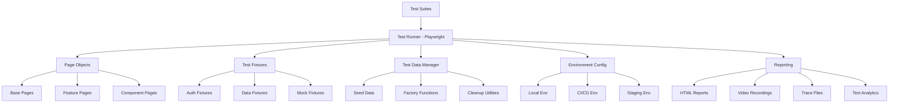
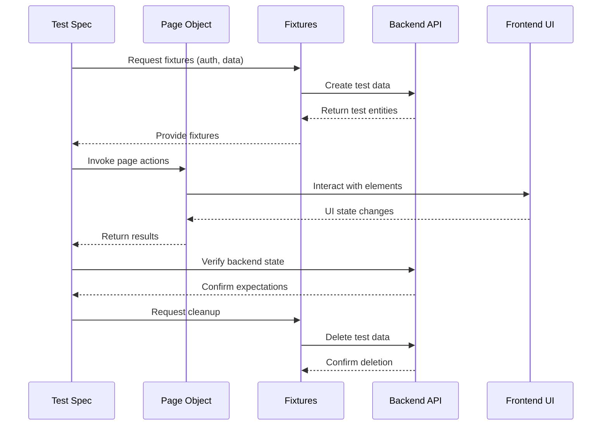
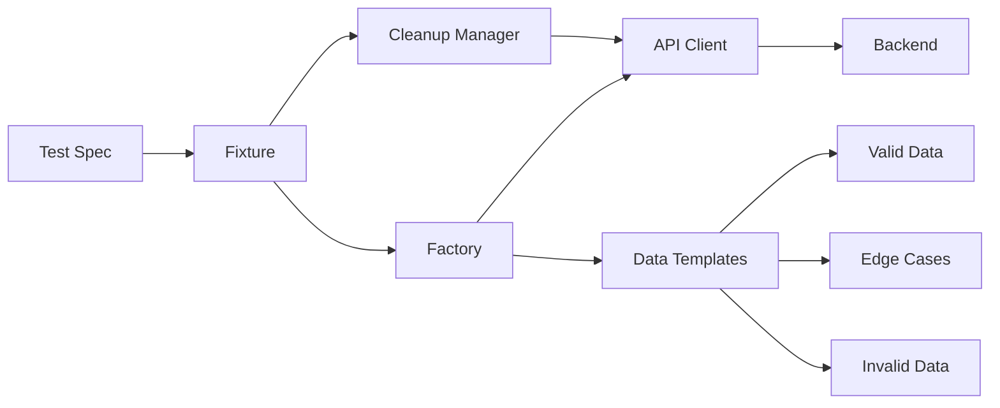

# NovaCron E2E Testing Architecture with Playwright

## Executive Summary

This document defines a comprehensive End-to-End (E2E) testing architecture for NovaCron using Playwright. The architecture is designed to test the distributed VM management platform across its critical workflows, including VM lifecycle management, DWCP v3 protocol operations, cluster federation, real-time monitoring, and multi-cloud integration.

**Key Architecture Decisions:**

1. **Migration from Puppeteer to Playwright** - Better reliability, cross-browser support, and superior developer experience
2. **Layered Page Object Model** - Maintainable, reusable page abstractions
3. **Test Data Isolation** - Each test owns its data lifecycle
4. **Parallel Execution** - Optimized for CI/CD with worker-based parallelism
5. **Hybrid Mocking Strategy** - API recording/replay with selective stubbing
6. **Multi-Environment Support** - Local, CI/CD, staging, and production testing

---

## Table of Contents

1. [Architecture Overview](#architecture-overview)
2. [Test Organization Strategy](#test-organization-strategy)
3. [Page Object Model Design](#page-object-model-design)
4. [Test Data Management](#test-data-management)
5. [API Mocking and Stubbing](#api-mocking-and-stubbing)
6. [Parallel Execution Strategy](#parallel-execution-strategy)
7. [Browser and Viewport Coverage](#browser-and-viewport-coverage)
8. [Test Infrastructure Components](#test-infrastructure-components)
9. [Test Execution Strategy](#test-execution-strategy)
10. [Integration with Existing Tests](#integration-with-existing-tests)
11. [CI/CD Integration](#cicd-integration)
12. [Best Practices and Guidelines](#best-practices-and-guidelines)

---

## Architecture Overview

### High-Level Architecture



### Component Interaction Flow



---

## Test Organization Strategy

### Directory Structure

```
tests/e2e/
├── docs/
│   ├── ARCHITECTURE.md           # This document
│   ├── BEST_PRACTICES.md         # Testing best practices
│   └── TROUBLESHOOTING.md        # Common issues and solutions
│
├── tests/
│   ├── auth/                     # Authentication flows
│   │   ├── login.spec.ts
│   │   ├── registration.spec.ts
│   │   ├── password-reset.spec.ts
│   │   └── 2fa.spec.ts
│   │
│   ├── vm-management/            # VM lifecycle operations
│   │   ├── vm-creation.spec.ts
│   │   ├── vm-lifecycle.spec.ts
│   │   ├── vm-migration.spec.ts
│   │   ├── vm-snapshots.spec.ts
│   │   └── vm-templates.spec.ts
│   │
│   ├── cluster/                  # Cluster management
│   │   ├── cluster-creation.spec.ts
│   │   ├── cluster-federation.spec.ts
│   │   ├── node-management.spec.ts
│   │   └── cluster-monitoring.spec.ts
│   │
│   ├── dwcp/                     # DWCP v3 protocol tests
│   │   ├── protocol-negotiation.spec.ts
│   │   ├── state-sync.spec.ts
│   │   ├── federation-mesh.spec.ts
│   │   └── consensus-operations.spec.ts
│   │
│   ├── monitoring/               # Real-time monitoring
│   │   ├── dashboard.spec.ts
│   │   ├── metrics.spec.ts
│   │   ├── alerts.spec.ts
│   │   └── logs.spec.ts
│   │
│   ├── edge/                     # Edge computing features
│   │   ├── edge-nodes.spec.ts
│   │   ├── edge-deployment.spec.ts
│   │   └── edge-sync.spec.ts
│   │
│   ├── multicloud/               # Multi-cloud integration
│   │   ├── cloud-providers.spec.ts
│   │   ├── cross-cloud-migration.spec.ts
│   │   └── disaster-recovery.spec.ts
│   │
│   ├── performance/              # Performance tests
│   │   ├── load-testing.spec.ts
│   │   ├── stress-testing.spec.ts
│   │   └── scalability.spec.ts
│   │
│   ├── accessibility/            # A11y tests
│   │   ├── wcag-compliance.spec.ts
│   │   └── keyboard-navigation.spec.ts
│   │
│   ├── integration/              # Cross-feature flows
│   │   ├── end-to-end-workflows.spec.ts
│   │   └── user-journeys.spec.ts
│   │
│   └── smoke/                    # Quick validation tests
│       ├── critical-paths.spec.ts
│       └── health-checks.spec.ts
│
├── page-objects/
│   ├── base/
│   │   ├── BasePage.ts           # Base page class
│   │   ├── BaseComponent.ts      # Reusable components
│   │   └── BaseModal.ts          # Modal dialogs
│   │
│   ├── auth/
│   │   ├── LoginPage.ts
│   │   ├── RegistrationPage.ts
│   │   └── PasswordResetPage.ts
│   │
│   ├── vm/
│   │   ├── VMListPage.ts
│   │   ├── VMDetailsPage.ts
│   │   ├── VMCreationPage.ts
│   │   └── VMMigrationPage.ts
│   │
│   ├── cluster/
│   │   ├── ClusterListPage.ts
│   │   ├── ClusterDetailsPage.ts
│   │   └── NodeManagementPage.ts
│   │
│   ├── monitoring/
│   │   ├── DashboardPage.ts
│   │   ├── MetricsPage.ts
│   │   └── AlertsPage.ts
│   │
│   └── components/
│       ├── NavigationComponent.ts
│       ├── NotificationComponent.ts
│       ├── TableComponent.ts
│       └── FormComponent.ts
│
├── fixtures/
│   ├── auth.fixture.ts           # Authentication fixtures
│   ├── vm.fixture.ts             # VM data fixtures
│   ├── cluster.fixture.ts        # Cluster fixtures
│   ├── mock.fixture.ts           # API mocking fixtures
│   └── index.ts                  # Fixture exports
│
├── helpers/
│   ├── test-data/
│   │   ├── VMFactory.ts          # VM test data factory
│   │   ├── UserFactory.ts        # User test data factory
│   │   └── ClusterFactory.ts     # Cluster test data factory
│   │
│   ├── api/
│   │   ├── APIClient.ts          # REST API client
│   │   ├── WebSocketClient.ts    # WebSocket client
│   │   └── GRPCClient.ts         # gRPC client (DWCP)
│   │
│   ├── assertions/
│   │   ├── CustomMatchers.ts     # Custom Jest matchers
│   │   └── VisualAssertions.ts   # Visual regression helpers
│   │
│   └── utilities/
│       ├── WaitHelpers.ts        # Smart wait utilities
│       ├── DataCleanup.ts        # Cleanup utilities
│       └── ScreenshotHelpers.ts  # Screenshot utilities
│
├── config/
│   ├── playwright.config.ts      # Main Playwright config
│   ├── environments/
│   │   ├── local.config.ts
│   │   ├── ci.config.ts
│   │   ├── staging.config.ts
│   │   └── production.config.ts
│   │
│   └── test-categories.ts        # Test categorization
│
├── mocks/
│   ├── api/
│   │   ├── vm-api.mock.ts
│   │   ├── cluster-api.mock.ts
│   │   └── auth-api.mock.ts
│   │
│   ├── recordings/               # HAR recordings
│   │   ├── vm-creation.har
│   │   └── cluster-federation.har
│   │
│   └── handlers/
│       ├── rest-handlers.ts      # MSW REST handlers
│       └── ws-handlers.ts        # WebSocket mock handlers
│
└── reports/
    ├── html/                     # HTML test reports
    ├── traces/                   # Playwright traces
    ├── videos/                   # Test execution videos
    └── screenshots/              # Test screenshots
```

### Test Organization Principles

1. **Feature-Based Organization**: Tests organized by product features, not technical layers
2. **User Journey Mapping**: Integration tests follow real user workflows
3. **Test Independence**: Each test can run in isolation
4. **Clear Naming**: Test files and descriptions clearly indicate what is being tested
5. **Modularity**: Shared logic extracted to page objects and helpers

---

## Page Object Model Design

### Three-Layer Page Object Architecture

```
┌─────────────────────────────────────────┐
│         Test Specifications             │
│  (Business logic and assertions)        │
└─────────────────────────────────────────┘
                  ↓
┌─────────────────────────────────────────┐
│          Page Objects                   │
│  (Page-level abstractions)              │
└─────────────────────────────────────────┘
                  ↓
┌─────────────────────────────────────────┐
│          Base Components                │
│  (Reusable UI components)               │
└─────────────────────────────────────────┘
                  ↓
┌─────────────────────────────────────────┐
│       Playwright Locators               │
│  (Actual DOM interaction)               │
└─────────────────────────────────────────┘
```

### Base Page Implementation

```typescript
// page-objects/base/BasePage.ts
import { Page, Locator } from '@playwright/test';

export abstract class BasePage {
  constructor(
    protected page: Page,
    protected baseURL: string = process.env.BASE_URL || 'http://localhost:8092'
  ) {}

  // Navigation
  abstract getPath(): string;

  async navigate(): Promise<void> {
    await this.page.goto(`${this.baseURL}${this.getPath()}`);
    await this.waitForPageLoad();
  }

  async waitForPageLoad(): Promise<void> {
    await this.page.waitForLoadState('networkidle');
  }

  // Common actions
  async clickElement(locator: Locator): Promise<void> {
    await locator.waitFor({ state: 'visible' });
    await locator.click();
  }

  async fillInput(locator: Locator, value: string): Promise<void> {
    await locator.waitFor({ state: 'visible' });
    await locator.clear();
    await locator.fill(value);
  }

  async selectOption(locator: Locator, value: string): Promise<void> {
    await locator.waitFor({ state: 'visible' });
    await locator.selectOption(value);
  }

  // Smart waits
  async waitForElement(locator: Locator, state: 'visible' | 'hidden' = 'visible'): Promise<void> {
    await locator.waitFor({ state });
  }

  async waitForAPIResponse(urlPattern: string | RegExp): Promise<void> {
    await this.page.waitForResponse(urlPattern);
  }

  // Assertions helpers
  async expectElementVisible(locator: Locator): Promise<void> {
    await expect(locator).toBeVisible();
  }

  async expectElementHidden(locator: Locator): Promise<void> {
    await expect(locator).toBeHidden();
  }

  async expectElementText(locator: Locator, text: string | RegExp): Promise<void> {
    await expect(locator).toHaveText(text);
  }

  // Error handling
  async captureScreenshotOnError(testName: string): Promise<void> {
    await this.page.screenshot({
      path: `reports/screenshots/${testName}-error.png`,
      fullPage: true
    });
  }

  // WebSocket support
  async waitForWebSocketConnection(): Promise<void> {
    await this.page.waitForFunction(() => {
      return window.wsConnection && window.wsConnection.readyState === 1;
    }, { timeout: 10000 });
  }
}
```

### Feature Page Example

```typescript
// page-objects/vm/VMCreationPage.ts
import { Page, Locator } from '@playwright/test';
import { BasePage } from '../base/BasePage';
import { FormComponent } from '../components/FormComponent';

export interface VMCreationData {
  name: string;
  cpu: number;
  memory: number;
  disk: number;
  image: string;
  network?: string;
  cloudInit?: string;
}

export class VMCreationPage extends BasePage {
  // Locators
  private readonly form: FormComponent;
  private readonly nameInput: Locator;
  private readonly cpuSelect: Locator;
  private readonly memoryInput: Locator;
  private readonly diskInput: Locator;
  private readonly imageSelect: Locator;
  private readonly advancedToggle: Locator;
  private readonly networkSelect: Locator;
  private readonly cloudInitTextarea: Locator;
  private readonly submitButton: Locator;
  private readonly cancelButton: Locator;
  private readonly successNotification: Locator;

  constructor(page: Page) {
    super(page);

    this.form = new FormComponent(page, '[data-testid="vm-create-form"]');
    this.nameInput = page.locator('[data-testid="vm-name-input"]');
    this.cpuSelect = page.locator('[data-testid="vm-cpu-select"]');
    this.memoryInput = page.locator('[data-testid="vm-memory-input"]');
    this.diskInput = page.locator('[data-testid="vm-disk-input"]');
    this.imageSelect = page.locator('[data-testid="vm-image-select"]');
    this.advancedToggle = page.locator('[data-testid="advanced-toggle"]');
    this.networkSelect = page.locator('[data-testid="network-select"]');
    this.cloudInitTextarea = page.locator('[data-testid="cloud-init-textarea"]');
    this.submitButton = page.locator('[data-testid="vm-create-submit"]');
    this.cancelButton = page.locator('[data-testid="vm-create-cancel"]');
    this.successNotification = page.locator('[data-testid="success-notification"]');
  }

  getPath(): string {
    return '/vms/create';
  }

  // High-level actions
  async createVM(data: VMCreationData): Promise<void> {
    await this.fillBasicInfo(data);

    if (data.network || data.cloudInit) {
      await this.fillAdvancedOptions(data);
    }

    await this.submit();
    await this.waitForSuccess();
  }

  async fillBasicInfo(data: VMCreationData): Promise<void> {
    await this.fillInput(this.nameInput, data.name);
    await this.selectOption(this.cpuSelect, data.cpu.toString());
    await this.fillInput(this.memoryInput, data.memory.toString());
    await this.fillInput(this.diskInput, data.disk.toString());
    await this.selectOption(this.imageSelect, data.image);
  }

  async fillAdvancedOptions(data: VMCreationData): Promise<void> {
    await this.clickElement(this.advancedToggle);

    if (data.network) {
      await this.selectOption(this.networkSelect, data.network);
    }

    if (data.cloudInit) {
      await this.fillInput(this.cloudInitTextarea, data.cloudInit);
    }
  }

  async submit(): Promise<void> {
    await this.clickElement(this.submitButton);
  }

  async cancel(): Promise<void> {
    await this.clickElement(this.cancelButton);
  }

  async waitForSuccess(): Promise<void> {
    await this.waitForElement(this.successNotification);
  }

  // Validation
  async getFormErrors(): Promise<string[]> {
    return this.form.getErrors();
  }

  async expectFormError(field: string, message: string): Promise<void> {
    await this.form.expectFieldError(field, message);
  }
}
```

### Component Page Example

```typescript
// page-objects/components/FormComponent.ts
import { Page, Locator } from '@playwright/test';

export class FormComponent {
  private readonly form: Locator;

  constructor(
    private page: Page,
    private formSelector: string
  ) {
    this.form = page.locator(formSelector);
  }

  async getErrors(): Promise<string[]> {
    const errorElements = await this.form.locator('[role="alert"], .error-message').all();
    return Promise.all(errorElements.map(el => el.textContent()));
  }

  async expectFieldError(fieldName: string, errorMessage: string): Promise<void> {
    const errorLocator = this.form.locator(`[data-testid="${fieldName}-error"]`);
    await expect(errorLocator).toHaveText(errorMessage);
  }

  async submit(): Promise<void> {
    await this.form.locator('button[type="submit"]').click();
  }

  async reset(): Promise<void> {
    await this.form.locator('button[type="reset"]').click();
  }

  async isValid(): Promise<boolean> {
    const errors = await this.getErrors();
    return errors.length === 0;
  }
}
```

---

## Test Data Management

### Test Data Strategy

**Principles:**
1. **Test Isolation**: Each test creates and destroys its own data
2. **Factory Pattern**: Use factories for consistent test data creation
3. **Automatic Cleanup**: Fixtures handle cleanup automatically
4. **Realistic Data**: Test data mirrors production scenarios
5. **Deterministic**: Same input produces same output

### Test Data Architecture



### VM Factory Implementation

```typescript
// helpers/test-data/VMFactory.ts
import { APIClient } from '../api/APIClient';
import { faker } from '@faker-js/faker';

export interface VMTemplate {
  name?: string;
  cpu?: number;
  memory?: number;
  disk?: number;
  image?: string;
  state?: 'running' | 'stopped' | 'pending';
  tags?: Record<string, string>;
}

export class VMFactory {
  private createdVMs: string[] = [];

  constructor(private apiClient: APIClient) {}

  async create(template: VMTemplate = {}): Promise<any> {
    const vmData = {
      name: template.name || `test-vm-${faker.string.uuid()}`,
      cpu: template.cpu || faker.number.int({ min: 1, max: 8 }),
      memory: template.memory || faker.number.int({ min: 1024, max: 16384 }),
      disk: template.disk || faker.number.int({ min: 10, max: 100 }),
      image: template.image || 'ubuntu-20.04',
      state: template.state || 'stopped',
      tags: template.tags || {
        environment: 'test',
        createdBy: 'e2e-tests'
      }
    };

    const response = await this.apiClient.post('/api/v1/vms', vmData);
    const vm = response.data;

    this.createdVMs.push(vm.id);
    return vm;
  }

  async createBatch(count: number, template: VMTemplate = {}): Promise<any[]> {
    const promises = Array.from({ length: count }, () => this.create(template));
    return Promise.all(promises);
  }

  async createRunningVM(template: VMTemplate = {}): Promise<any> {
    const vm = await this.create({ ...template, state: 'stopped' });
    await this.apiClient.post(`/api/v1/vms/${vm.id}/start`);

    // Wait for VM to reach running state
    await this.waitForVMState(vm.id, 'running');

    return vm;
  }

  async waitForVMState(vmId: string, state: string, timeout: number = 60000): Promise<void> {
    const startTime = Date.now();

    while (Date.now() - startTime < timeout) {
      const vm = await this.apiClient.get(`/api/v1/vms/${vmId}`);

      if (vm.data.state === state) {
        return;
      }

      await new Promise(resolve => setTimeout(resolve, 1000));
    }

    throw new Error(`VM ${vmId} did not reach state ${state} within ${timeout}ms`);
  }

  async cleanup(): Promise<void> {
    const deletePromises = this.createdVMs.map(id =>
      this.apiClient.delete(`/api/v1/vms/${id}`).catch(() => {
        // Ignore errors during cleanup
      })
    );

    await Promise.all(deletePromises);
    this.createdVMs = [];
  }

  // Preset templates
  static templates = {
    minimal: {
      cpu: 1,
      memory: 1024,
      disk: 10,
      image: 'alpine-latest'
    },

    standard: {
      cpu: 2,
      memory: 4096,
      disk: 20,
      image: 'ubuntu-20.04'
    },

    highPerformance: {
      cpu: 8,
      memory: 16384,
      disk: 100,
      image: 'ubuntu-22.04'
    }
  };
}
```

### Fixture Implementation

```typescript
// fixtures/vm.fixture.ts
import { test as base } from '@playwright/test';
import { VMFactory } from '../helpers/test-data/VMFactory';
import { APIClient } from '../helpers/api/APIClient';

type VMFixtures = {
  vmFactory: VMFactory;
  testVM: any;
  runningVM: any;
};

export const test = base.extend<VMFixtures>({
  vmFactory: async ({ }, use) => {
    const apiClient = new APIClient({
      baseURL: process.env.API_URL || 'http://localhost:8090'
    });

    const factory = new VMFactory(apiClient);
    await use(factory);
    await factory.cleanup();
  },

  testVM: async ({ vmFactory }, use) => {
    const vm = await vmFactory.create(VMFactory.templates.standard);
    await use(vm);
    // Cleanup handled by vmFactory fixture
  },

  runningVM: async ({ vmFactory }, use) => {
    const vm = await vmFactory.createRunningVM(VMFactory.templates.standard);
    await use(vm);
    // Cleanup handled by vmFactory fixture
  }
});

export { expect } from '@playwright/test';
```

---

## API Mocking and Stubbing

### Hybrid Mocking Strategy

**Approach:**
- **Development/Local**: Use MSW (Mock Service Worker) for fast, deterministic tests
- **CI/CD**: Mix of mocking and real API calls
- **Staging**: Primarily real API calls with selective mocking
- **Production**: Real API calls only (smoke tests)

### MSW Handler Implementation

```typescript
// mocks/handlers/rest-handlers.ts
import { rest } from 'msw';

export const vmHandlers = [
  // List VMs
  rest.get('/api/v1/vms', (req, res, ctx) => {
    return res(
      ctx.status(200),
      ctx.json({
        vms: [
          {
            id: 'vm-001',
            name: 'test-vm-1',
            cpu: 2,
            memory: 4096,
            disk: 20,
            state: 'running',
            createdAt: new Date().toISOString()
          },
          {
            id: 'vm-002',
            name: 'test-vm-2',
            cpu: 1,
            memory: 2048,
            disk: 10,
            state: 'stopped',
            createdAt: new Date().toISOString()
          }
        ],
        total: 2
      })
    );
  }),

  // Create VM
  rest.post('/api/v1/vms', async (req, res, ctx) => {
    const body = await req.json();

    return res(
      ctx.status(201),
      ctx.json({
        id: `vm-${Date.now()}`,
        ...body,
        state: 'pending',
        createdAt: new Date().toISOString()
      })
    );
  }),

  // Get VM details
  rest.get('/api/v1/vms/:vmId', (req, res, ctx) => {
    const { vmId } = req.params;

    return res(
      ctx.status(200),
      ctx.json({
        id: vmId,
        name: `vm-${vmId}`,
        cpu: 2,
        memory: 4096,
        disk: 20,
        state: 'running',
        createdAt: new Date().toISOString()
      })
    );
  }),

  // Start VM
  rest.post('/api/v1/vms/:vmId/start', (req, res, ctx) => {
    return res(
      ctx.status(200),
      ctx.json({
        success: true,
        message: 'VM start initiated'
      })
    );
  }),

  // Simulate error
  rest.post('/api/v1/vms/:vmId/error', (req, res, ctx) => {
    return res(
      ctx.status(500),
      ctx.json({
        error: 'Internal server error',
        message: 'Failed to perform operation'
      })
    );
  })
];

export const authHandlers = [
  rest.post('/api/v1/auth/login', async (req, res, ctx) => {
    const { email, password } = await req.json();

    if (email === 'test@example.com' && password === 'password123') {
      return res(
        ctx.status(200),
        ctx.json({
          token: 'mock-jwt-token',
          user: {
            id: 'user-001',
            email,
            name: 'Test User'
          }
        })
      );
    }

    return res(
      ctx.status(401),
      ctx.json({
        error: 'Invalid credentials'
      })
    );
  })
];

export const handlers = [...vmHandlers, ...authHandlers];
```

### HAR (HTTP Archive) Recording

```typescript
// helpers/utilities/HARRecorder.ts
import { Page, BrowserContext } from '@playwright/test';
import * as fs from 'fs/promises';

export class HARRecorder {
  private context: BrowserContext | null = null;

  async startRecording(context: BrowserContext, harPath: string): Promise<void> {
    this.context = context;

    await context.routeFromHAR(harPath, {
      update: true,
      updateContent: 'embed',
      updateMode: 'full'
    });
  }

  async stopRecording(): Promise<void> {
    if (this.context) {
      await this.context.unroute('**/*');
    }
  }

  async replayFromHAR(context: BrowserContext, harPath: string): Promise<void> {
    await context.routeFromHAR(harPath, {
      notFound: 'abort'
    });
  }
}
```

---

## Parallel Execution Strategy

### Worker Configuration

```typescript
// config/playwright.config.ts
import { defineConfig, devices } from '@playwright/test';

export default defineConfig({
  testDir: './tests',

  // Parallel execution
  fullyParallel: true,
  workers: process.env.CI ? 4 : undefined, // Auto-detect locally, 4 in CI

  // Retry strategy
  retries: process.env.CI ? 2 : 0,

  // Timeouts
  timeout: 60000,
  expect: {
    timeout: 10000
  },

  // Test execution
  use: {
    baseURL: process.env.BASE_URL || 'http://localhost:8092',
    trace: 'on-first-retry',
    video: 'retain-on-failure',
    screenshot: 'only-on-failure',

    // Browser context
    viewport: { width: 1920, height: 1080 },
    ignoreHTTPSErrors: true,

    // Network
    extraHTTPHeaders: {
      'Accept': 'application/json',
    },
  },

  // Projects for different browsers
  projects: [
    {
      name: 'chromium',
      use: { ...devices['Desktop Chrome'] },
    },
    {
      name: 'firefox',
      use: { ...devices['Desktop Firefox'] },
    },
    {
      name: 'webkit',
      use: { ...devices['Desktop Safari'] },
    },
    {
      name: 'mobile-chrome',
      use: { ...devices['Pixel 5'] },
    },
    {
      name: 'mobile-safari',
      use: { ...devices['iPhone 12'] },
    },
  ],

  // Reporters
  reporter: [
    ['html', { outputFolder: 'reports/html' }],
    ['json', { outputFile: 'reports/test-results.json' }],
    ['junit', { outputFile: 'reports/junit.xml' }],
    ['line'],
  ],

  // Web server
  webServer: process.env.CI ? undefined : {
    command: 'npm run dev',
    url: 'http://localhost:8092',
    reuseExistingServer: !process.env.CI,
    timeout: 120000,
  },
});
```

### Test Sharding

```typescript
// Run tests across multiple machines
// Machine 1:
// npx playwright test --shard=1/4

// Machine 2:
// npx playwright test --shard=2/4

// Machine 3:
// npx playwright test --shard=3/4

// Machine 4:
// npx playwright test --shard=4/4
```

---

## Browser and Viewport Coverage

### Browser Matrix

| Browser | Versions | Desktop | Mobile | Priority |
|---------|----------|---------|--------|----------|
| Chrome | Latest, Latest-1 | ✓ | ✓ | High |
| Firefox | Latest, Latest-1 | ✓ | ✗ | High |
| Safari | Latest, Latest-1 | ✓ | ✓ | Medium |
| Edge | Latest | ✓ | ✗ | Medium |

### Viewport Coverage

```typescript
// config/viewports.ts
export const viewports = {
  // Desktop
  desktop_1920: { width: 1920, height: 1080 },
  desktop_1366: { width: 1366, height: 768 },
  desktop_1280: { width: 1280, height: 720 },

  // Tablet
  tablet_landscape: { width: 1024, height: 768 },
  tablet_portrait: { width: 768, height: 1024 },

  // Mobile
  mobile_landscape: { width: 667, height: 375 },
  mobile_portrait: { width: 375, height: 667 },
  mobile_small: { width: 320, height: 568 },
};
```

---

## Test Infrastructure Components

### Authentication Helper

```typescript
// helpers/utilities/AuthHelper.ts
import { Page } from '@playwright/test';
import { LoginPage } from '../../page-objects/auth/LoginPage';

export class AuthHelper {
  private static tokenCache = new Map<string, string>();

  static async loginViaUI(
    page: Page,
    credentials: { email: string; password: string }
  ): Promise<void> {
    const loginPage = new LoginPage(page);
    await loginPage.navigate();
    await loginPage.login(credentials.email, credentials.password);
    await loginPage.waitForRedirect();
  }

  static async loginViaAPI(
    page: Page,
    credentials: { email: string; password: string }
  ): Promise<void> {
    const cacheKey = `${credentials.email}:${credentials.password}`;

    let token = this.tokenCache.get(cacheKey);

    if (!token) {
      const response = await fetch(`${process.env.API_URL}/api/v1/auth/login`, {
        method: 'POST',
        headers: { 'Content-Type': 'application/json' },
        body: JSON.stringify(credentials)
      });

      const data = await response.json();
      token = data.token;
      this.tokenCache.set(cacheKey, token);
    }

    await page.context().addCookies([
      {
        name: 'auth-token',
        value: token,
        domain: new URL(process.env.BASE_URL!).hostname,
        path: '/',
        httpOnly: true,
        secure: false,
        sameSite: 'Lax'
      }
    ]);

    await page.evaluate((token) => {
      localStorage.setItem('auth-token', token);
    }, token);
  }

  static async logout(page: Page): Promise<void> {
    await page.evaluate(() => {
      localStorage.removeItem('auth-token');
      sessionStorage.clear();
    });

    await page.context().clearCookies();
  }
}
```

### Custom Assertions

```typescript
// helpers/assertions/CustomMatchers.ts
import { expect } from '@playwright/test';
import type { Locator } from '@playwright/test';

expect.extend({
  async toBeInViewport(locator: Locator) {
    const boundingBox = await locator.boundingBox();
    const isInViewport = boundingBox !== null;

    return {
      message: () => `expected element to be in viewport`,
      pass: isInViewport
    };
  },

  async toHaveLoadedImage(locator: Locator) {
    const isLoaded = await locator.evaluate((img: HTMLImageElement) => {
      return img.complete && img.naturalHeight !== 0;
    });

    return {
      message: () => `expected image to be loaded`,
      pass: isLoaded
    };
  },

  async toHaveCSS(locator: Locator, property: string, value: string) {
    const cssValue = await locator.evaluate((el, prop) => {
      return window.getComputedStyle(el).getPropertyValue(prop);
    }, property);

    return {
      message: () => `expected element to have CSS ${property}: ${value}, but got ${cssValue}`,
      pass: cssValue === value
    };
  }
});
```

### Wait Helpers

```typescript
// helpers/utilities/WaitHelpers.ts
import { Page, Locator } from '@playwright/test';

export class WaitHelpers {
  static async waitForAPICall(
    page: Page,
    urlPattern: string | RegExp,
    method: string = 'GET'
  ): Promise<any> {
    const response = await page.waitForResponse(
      (response) => {
        const url = response.url();
        const matchesURL = typeof urlPattern === 'string'
          ? url.includes(urlPattern)
          : urlPattern.test(url);

        return matchesURL && response.request().method() === method;
      }
    );

    return response.json();
  }

  static async waitForWebSocketMessage(
    page: Page,
    eventType: string,
    timeout: number = 30000
  ): Promise<any> {
    return page.evaluate(
      ({ eventType, timeout }) => {
        return new Promise((resolve, reject) => {
          const timer = setTimeout(() => {
            reject(new Error(`Timeout waiting for WebSocket message: ${eventType}`));
          }, timeout);

          const handler = (event: MessageEvent) => {
            const data = JSON.parse(event.data);
            if (data.type === eventType) {
              clearTimeout(timer);
              window.removeEventListener('message', handler);
              resolve(data);
            }
          };

          window.addEventListener('message', handler);
        });
      },
      { eventType, timeout }
    );
  }

  static async waitForElementStable(locator: Locator): Promise<void> {
    await locator.waitFor({ state: 'visible' });

    let previousBox = await locator.boundingBox();
    let stableCount = 0;

    while (stableCount < 3) {
      await new Promise(resolve => setTimeout(resolve, 100));
      const currentBox = await locator.boundingBox();

      if (
        previousBox &&
        currentBox &&
        previousBox.x === currentBox.x &&
        previousBox.y === currentBox.y
      ) {
        stableCount++;
      } else {
        stableCount = 0;
      }

      previousBox = currentBox;
    }
  }

  static async waitForAnimationEnd(locator: Locator): Promise<void> {
    await locator.evaluate((element) => {
      return Promise.all(
        element.getAnimations().map((animation) => animation.finished)
      );
    });
  }
}
```

---

## Test Execution Strategy

### Test Categorization

```typescript
// config/test-categories.ts
export const testCategories = {
  smoke: {
    tag: '@smoke',
    timeout: 30000,
    retries: 2,
    description: 'Quick validation of critical paths'
  },

  regression: {
    tag: '@regression',
    timeout: 60000,
    retries: 1,
    description: 'Full feature validation'
  },

  integration: {
    tag: '@integration',
    timeout: 120000,
    retries: 1,
    description: 'Cross-feature workflows'
  },

  performance: {
    tag: '@performance',
    timeout: 300000,
    retries: 0,
    description: 'Performance benchmarks'
  },

  accessibility: {
    tag: '@a11y',
    timeout: 60000,
    retries: 1,
    description: 'Accessibility compliance'
  }
};
```

### Test Execution Commands

```bash
# Run all tests
npm run test:e2e

# Run smoke tests only
npm run test:e2e -- --grep @smoke

# Run specific feature
npm run test:e2e -- tests/vm-management/

# Run with specific browser
npm run test:e2e -- --project=chromium

# Run in headed mode
npm run test:e2e -- --headed

# Run with debugging
npm run test:e2e -- --debug

# Generate report
npm run test:e2e -- --reporter=html

# Run in CI mode
npm run test:e2e:ci
```

---

## Integration with Existing Tests

### Coexistence Strategy

```
tests/
├── unit/                 # Jest unit tests (existing)
├── integration/          # Jest integration tests (existing)
└── e2e/                  # Playwright E2E tests (new)
    └── playwright.config.ts
```

### Shared Utilities

```typescript
// tests/shared/test-environment.ts
export class TestEnvironment {
  static async setup(): Promise<void> {
    // Shared setup for both Jest and Playwright
  }

  static async teardown(): Promise<void> {
    // Shared teardown
  }
}
```

---

## CI/CD Integration

### GitHub Actions Workflow

```yaml
# .github/workflows/e2e-tests.yml
name: E2E Tests

on:
  push:
    branches: [main, develop]
  pull_request:
    branches: [main, develop]

jobs:
  e2e-tests:
    timeout-minutes: 60
    runs-on: ubuntu-latest

    strategy:
      fail-fast: false
      matrix:
        browser: [chromium, firefox, webkit]
        shard: [1, 2, 3, 4]

    steps:
      - uses: actions/checkout@v3

      - name: Setup Node.js
        uses: actions/setup-node@v3
        with:
          node-version: '18'
          cache: 'npm'

      - name: Install dependencies
        run: npm ci

      - name: Install Playwright
        run: npx playwright install --with-deps ${{ matrix.browser }}

      - name: Run E2E tests
        run: |
          npx playwright test \
            --project=${{ matrix.browser }} \
            --shard=${{ matrix.shard }}/4
        env:
          BASE_URL: ${{ secrets.E2E_BASE_URL }}
          API_URL: ${{ secrets.E2E_API_URL }}

      - name: Upload test results
        if: always()
        uses: actions/upload-artifact@v3
        with:
          name: playwright-report-${{ matrix.browser }}-${{ matrix.shard }}
          path: reports/
          retention-days: 30

      - name: Upload traces
        if: failure()
        uses: actions/upload-artifact@v3
        with:
          name: playwright-traces-${{ matrix.browser }}-${{ matrix.shard }}
          path: test-results/
          retention-days: 30
```

---

## Best Practices and Guidelines

### 1. Test Writing Guidelines

- **Independence**: Tests should not depend on each other
- **Determinism**: Tests should produce consistent results
- **Speed**: Optimize for fast execution
- **Clarity**: Test names should clearly describe what is being tested
- **Maintainability**: Use page objects and avoid duplication

### 2. Locator Best Practices

**Priority Order:**
1. `data-testid` attributes (most stable)
2. ARIA roles and labels
3. User-visible text
4. CSS selectors (least stable)

```typescript
// Good
page.locator('[data-testid="submit-button"]')
page.getByRole('button', { name: 'Submit' })
page.getByText('Submit')

// Avoid
page.locator('.btn.btn-primary.submit')
page.locator('div > div > button:nth-child(3)')
```

### 3. Error Handling

```typescript
test('should handle errors gracefully', async ({ page }) => {
  try {
    await somePage.performAction();
  } catch (error) {
    await page.screenshot({ path: 'error-screenshot.png' });
    throw error;
  }
});
```

### 4. Performance Optimization

- Use `page.route()` to mock slow endpoints
- Disable images/CSS for faster tests when visual validation isn't needed
- Use `waitForLoadState('domcontentloaded')` instead of `networkidle` when possible
- Reuse browser contexts across tests in the same file

### 5. Visual Regression Testing

```typescript
import { test, expect } from '@playwright/test';

test('visual regression', async ({ page }) => {
  await page.goto('/dashboard');
  await expect(page).toHaveScreenshot('dashboard.png', {
    maxDiffPixels: 100
  });
});
```

---

## Appendix

### Required Environment Variables

```bash
# .env.test
BASE_URL=http://localhost:8092
API_URL=http://localhost:8090
WS_URL=ws://localhost:8090/ws

# Authentication
TEST_USER_EMAIL=test@example.com
TEST_USER_PASSWORD=password123
TEST_ADMIN_EMAIL=admin@example.com
TEST_ADMIN_PASSWORD=admin123

# Feature flags
ENABLE_DWCP_V3=true
ENABLE_MULTICLOUD=true
ENABLE_EDGE_COMPUTING=true

# Test execution
CI=false
HEADLESS=true
PARALLEL_WORKERS=4
```

### Useful Resources

- [Playwright Documentation](https://playwright.dev)
- [Page Object Model Pattern](https://playwright.dev/docs/pom)
- [Test Fixtures](https://playwright.dev/docs/test-fixtures)
- [Visual Comparisons](https://playwright.dev/docs/test-snapshots)
- [MSW Documentation](https://mswjs.io)

---

## Document Revision History

| Version | Date | Author | Changes |
|---------|------|--------|---------|
| 1.0 | 2025-11-10 | System Architecture Designer | Initial architecture document |

