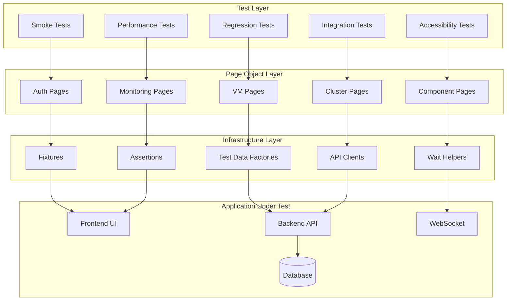
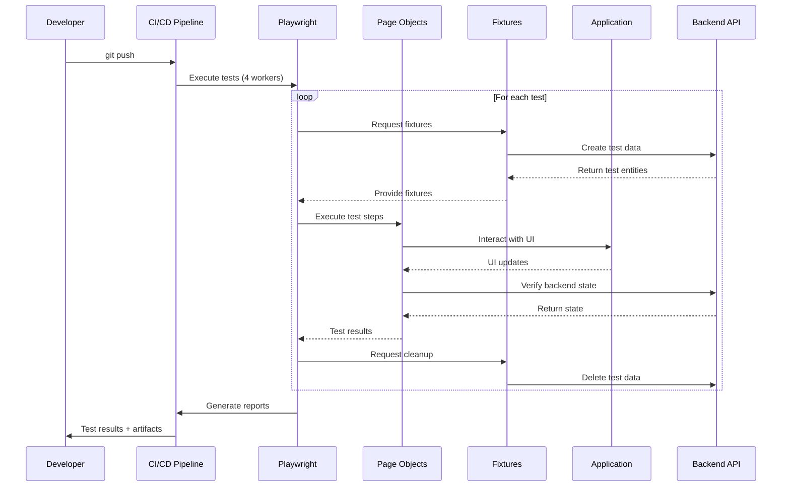
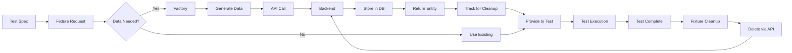
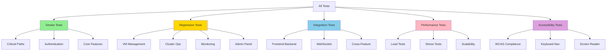
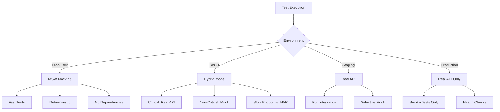
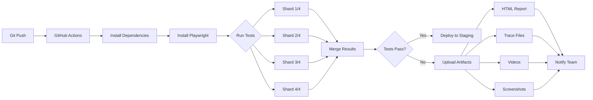
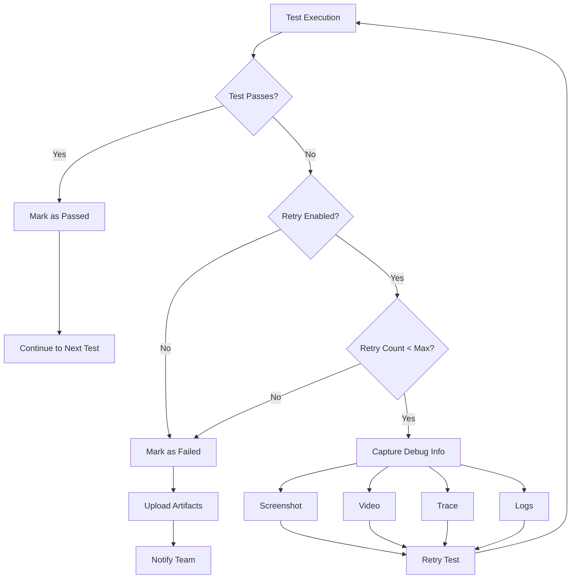

# E2E Testing Architecture - Visual Diagrams

This document contains all architectural diagrams for the NovaCron Playwright E2E testing framework in text/ASCII/mermaid format for easy viewing in any environment.

---

## System Architecture Overview



---

## Test Execution Flow



---

## Page Object Model Hierarchy

```
┌─────────────────────────────────────────┐
│         Test Specifications             │
│  (Business logic and assertions)        │
└─────────────────────────────────────────┘
                  ↓
┌─────────────────────────────────────────┐
│          Feature Pages                  │
│  (LoginPage, VMCreationPage, etc.)      │
└─────────────────────────────────────────┘
                  ↓
┌─────────────────────────────────────────┐
│          Base Page Class                │
│  (Common methods and utilities)         │
└─────────────────────────────────────────┘
                  ↓
┌─────────────────────────────────────────┐
│          Reusable Components            │
│  (Navigation, Forms, Modals, etc.)      │
└─────────────────────────────────────────┘
                  ↓
┌─────────────────────────────────────────┐
│       Playwright Locators               │
│  (DOM element selectors)                │
└─────────────────────────────────────────┘
```

---

## Test Data Management Flow



---

## Directory Structure Tree

```
tests/e2e/
├── docs/                           # Documentation
│   ├── ARCHITECTURE.md
│   ├── IMPLEMENTATION_GUIDE.md
│   ├── BEST_PRACTICES.md
│   ├── QUICK_REFERENCE.md
│   └── MIGRATION_PLAN.md
│
├── tests/                          # Test Specifications
│   ├── smoke/
│   │   └── critical-paths.spec.ts
│   ├── auth/
│   │   ├── login.spec.ts
│   │   ├── registration.spec.ts
│   │   └── 2fa.spec.ts
│   ├── vm-management/
│   │   ├── vm-creation.spec.ts
│   │   ├── vm-lifecycle.spec.ts
│   │   ├── vm-migration.spec.ts
│   │   └── vm-snapshots.spec.ts
│   ├── cluster/
│   ├── dwcp/
│   ├── monitoring/
│   ├── edge/
│   ├── multicloud/
│   ├── performance/
│   ├── accessibility/
│   └── integration/
│
├── page-objects/                   # Page Object Model
│   ├── base/
│   │   ├── BasePage.ts
│   │   ├── BaseComponent.ts
│   │   └── BaseModal.ts
│   ├── auth/
│   │   ├── LoginPage.ts
│   │   ├── RegistrationPage.ts
│   │   └── PasswordResetPage.ts
│   ├── vm/
│   │   ├── VMListPage.ts
│   │   ├── VMDetailsPage.ts
│   │   ├── VMCreationPage.ts
│   │   └── VMMigrationPage.ts
│   ├── cluster/
│   ├── monitoring/
│   └── components/
│       ├── NavigationComponent.ts
│       ├── NotificationComponent.ts
│       └── FormComponent.ts
│
├── fixtures/                       # Test Fixtures
│   ├── auth.fixture.ts
│   ├── vm.fixture.ts
│   ├── cluster.fixture.ts
│   └── index.ts
│
├── helpers/                        # Utilities
│   ├── test-data/
│   │   ├── VMFactory.ts
│   │   ├── UserFactory.ts
│   │   └── ClusterFactory.ts
│   ├── api/
│   │   ├── APIClient.ts
│   │   ├── WebSocketClient.ts
│   │   └── GRPCClient.ts
│   ├── assertions/
│   │   ├── CustomMatchers.ts
│   │   └── VisualAssertions.ts
│   └── utilities/
│       ├── WaitHelpers.ts
│       ├── DataCleanup.ts
│       └── ScreenshotHelpers.ts
│
├── config/                         # Configuration
│   ├── playwright.config.ts
│   ├── environments/
│   │   ├── local.config.ts
│   │   ├── ci.config.ts
│   │   ├── staging.config.ts
│   │   └── production.config.ts
│   └── test-categories.ts
│
├── mocks/                          # API Mocking
│   ├── api/
│   │   ├── vm-api.mock.ts
│   │   └── auth-api.mock.ts
│   ├── recordings/
│   │   └── *.har
│   └── handlers/
│       ├── rest-handlers.ts
│       └── ws-handlers.ts
│
└── reports/                        # Test Results
    ├── html/
    ├── traces/
    ├── videos/
    └── screenshots/
```

---

## Test Categorization



---

## Browser & Viewport Coverage

```
Desktop Browsers          Mobile Browsers
┌────────────────┐        ┌────────────────┐
│   Chrome       │        │  Mobile Chrome │
│   Latest, L-1  │        │   Pixel 5      │
├────────────────┤        ├────────────────┤
│   Firefox      │        │  Mobile Safari │
│   Latest, L-1  │        │   iPhone 12    │
├────────────────┤        └────────────────┘
│   Safari       │
│   Latest, L-1  │        Viewports
├────────────────┤        ┌────────────────┐
│   Edge         │        │ 1920x1080      │
│   Latest       │        │ 1366x768       │
└────────────────┘        │ 1280x720       │
                          │ 1024x768 (tab) │
Priority Matrix           │ 768x1024 (tab) │
High:   Chrome, Firefox   │ 375x667 (mob)  │
Medium: Safari, Edge      │ 320x568 (mob)  │
                          └────────────────┘
```

---

## Parallel Execution Architecture

```
┌─────────────────────────────────────────────────┐
│              Test Runner (Main Thread)          │
└─────────────────────────────────────────────────┘
                    │
        ┌───────────┼───────────┬───────────┐
        ▼           ▼           ▼           ▼
    ┌───────┐   ┌───────┐   ┌───────┐   ┌───────┐
    │Worker1│   │Worker2│   │Worker3│   │Worker4│
    └───────┘   └───────┘   └───────┘   └───────┘
        │           │           │           │
    ┌───┴───┐   ┌───┴───┐   ┌───┴───┐   ┌───┴───┐
    │Browser│   │Browser│   │Browser│   │Browser│
    │Context│   │Context│   │Context│   │Context│
    └───────┘   └───────┘   └───────┘   └───────┘
        │           │           │           │
    ┌───┴───┐   ┌───┴───┐   ┌───┴───┐   ┌───┴───┐
    │ Tests │   │ Tests │   │ Tests │   │ Tests │
    │ 1-25  │   │ 26-50 │   │ 51-75 │   │ 76-100│
    └───────┘   └───────┘   └───────┘   └───────┘

Each worker:
- Independent browser context
- Isolated test data
- Separate storage state
- Concurrent execution
```

---

## Test Sharding for CI/CD

```
┌────────────────────────────────────────────────┐
│           CI/CD Pipeline (4 Machines)          │
└────────────────────────────────────────────────┘
            │
    ┌───────┼───────┬───────┬───────┐
    ▼       ▼       ▼       ▼       ▼
┌────────┐ ┌────────┐ ┌────────┐ ┌────────┐
│Machine1│ │Machine2│ │Machine3│ │Machine4│
│Shard1/4│ │Shard2/4│ │Shard3/4│ │Shard4/4│
└────────┘ └────────┘ └────────┘ └────────┘
    │          │          │          │
┌───┴────┐ ┌───┴────┐ ┌───┴────┐ ┌───┴────┐
│Tests   │ │Tests   │ │Tests   │ │Tests   │
│1-50    │ │51-100  │ │101-150 │ │151-200 │
└────────┘ └────────┘ └────────┘ └────────┘
    │          │          │          │
    └──────────┴──────────┴──────────┘
                  │
        ┌─────────▼─────────┐
        │  Merge Results     │
        │  - HTML Report     │
        │  - Test Metrics    │
        │  - Trace Files     │
        │  - Screenshots     │
        └────────────────────┘
```

---

## API Mocking Strategy



---

## Fixture Lifecycle

```
Test Start
    │
    ├─► Fixture Setup
    │       ├─► Initialize API Client
    │       ├─► Create Test Data (VM Factory)
    │       ├─► Setup Authentication
    │       └─► Prepare Browser Context
    │
    ├─► Test Execution
    │       ├─► Page Object Actions
    │       ├─► UI Interactions
    │       └─► Assertions
    │
    ├─► Fixture Cleanup (always runs)
    │       ├─► Delete Test Data
    │       ├─► Clear Auth Tokens
    │       ├─► Close Browser Context
    │       └─► Generate Artifacts (if failed)
    │               ├─► Screenshot
    │               ├─► Video
    │               └─► Trace
    │
Test End
```

---

## Page Object Interaction Pattern

```
┌──────────────────────────────────────────────┐
│              Test Specification              │
│                                              │
│  test('create VM', async ({ page }) => {    │
│    const vmPage = new VMCreationPage(page); │
│    await vmPage.createVM(data);             │
│  });                                         │
└──────────────────────────────────────────────┘
                    │
                    ▼
┌──────────────────────────────────────────────┐
│           VMCreationPage (POM)               │
│                                              │
│  async createVM(data) {                      │
│    await this.fillForm(data);               │
│    await this.submit();                     │
│  }                                           │
└──────────────────────────────────────────────┘
                    │
                    ▼
┌──────────────────────────────────────────────┐
│            BasePage (Common)                 │
│                                              │
│  protected fillInput(locator, value) {...}  │
│  protected clickElement(locator) {...}      │
└──────────────────────────────────────────────┘
                    │
                    ▼
┌──────────────────────────────────────────────┐
│         Playwright Locators                  │
│                                              │
│  page.locator('[data-testid="vm-name"]')    │
│  page.getByRole('button', {name: 'Submit'}) │
└──────────────────────────────────────────────┘
```

---

## CI/CD Pipeline Flow



---

## Authentication Flow

```
┌─────────────────────────────────────────────┐
│          Authentication Strategy            │
└─────────────────────────────────────────────┘
                    │
        ┌───────────┴───────────┐
        ▼                       ▼
┌───────────────┐       ┌───────────────┐
│  UI Login     │       │  API Login    │
│  (Slow)       │       │  (Fast)       │
└───────────────┘       └───────────────┘
        │                       │
        ▼                       ▼
┌───────────────┐       ┌───────────────┐
│ Use for:      │       │ Use for:      │
│ - Auth tests  │       │ - Setup       │
│ - UI flows    │       │ - Fixtures    │
│ - E2E tests   │       │ - Data prep   │
└───────────────┘       └───────────────┘
        │                       │
        └───────────┬───────────┘
                    ▼
        ┌───────────────────────┐
        │  Storage State Cache  │
        │  (Reuse auth session) │
        └───────────────────────┘
```

---

## Test Report Structure

```
reports/
│
├── html/                      # HTML Report
│   ├── index.html             # Main report
│   ├── data/
│   │   ├── test-results.json
│   │   └── screenshots/
│   └── assets/
│       ├── styles.css
│       └── scripts.js
│
├── traces/                    # Debug Traces
│   ├── test-1-retry-1.zip
│   ├── test-2-retry-1.zip
│   └── ...
│
├── videos/                    # Test Videos
│   ├── test-1-chromium.webm
│   ├── test-2-firefox.webm
│   └── ...
│
├── screenshots/               # Screenshots
│   ├── test-1-error.png
│   ├── test-2-final.png
│   └── ...
│
├── test-results.json          # JSON Report
└── junit.xml                  # JUnit Report
```

---

## Error Handling Flow



---

## Visual Regression Testing

```
┌────────────────────────────────────────────┐
│         Visual Regression Testing          │
└────────────────────────────────────────────┘
                    │
            ┌───────┴───────┐
            ▼               ▼
    ┌──────────────┐ ┌──────────────┐
    │ Baseline     │ │  Current     │
    │ Screenshot   │ │ Screenshot   │
    └──────────────┘ └──────────────┘
            │               │
            └───────┬───────┘
                    ▼
        ┌───────────────────────┐
        │  Pixel Comparison     │
        │  (max diff: 100px)    │
        └───────────────────────┘
                    │
            ┌───────┴───────┐
            ▼               ▼
    ┌──────────────┐ ┌──────────────┐
    │   Match      │ │  Mismatch    │
    │   ✓ Pass     │ │   ✗ Fail     │
    └──────────────┘ └──────────────┘
                            │
                            ▼
                ┌───────────────────────┐
                │  Generate Diff Image  │
                │  Save to reports/     │
                └───────────────────────┘
```

---

## Migration Timeline

```
Week 1: Infrastructure
├── Install Playwright
├── Create base structure
├── Implement BasePage
└── First smoke test
    │
Week 2: Foundation
├── Create page objects
├── Implement factories
├── Setup fixtures
└── Test data management
    │
Week 3: Smoke Tests
├── Auth flows (5)
├── VM lifecycle (8)
├── Dashboard (3)
└── Validation
    │
Week 4: Regression Part 1
├── VM management (30)
├── Cluster ops (20)
└── Cross-browser tests
    │
Week 5: Regression Part 2
├── Monitoring (25)
├── Performance (15)
├── Admin panel (20)
└── Visual regression
    │
Week 6: Integration
├── Integration tests (30)
├── Mobile testing
└── Accessibility
    │
Week 7: Completion
├── Puppeteer deprecation
├── Final validation
├── Documentation
└── Team training

Total: 190+ tests migrated
```

---

All diagrams are designed to be viewed in markdown-compatible environments and provide clear visual representation of the E2E testing architecture.

